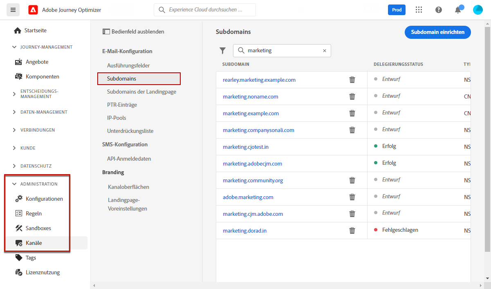
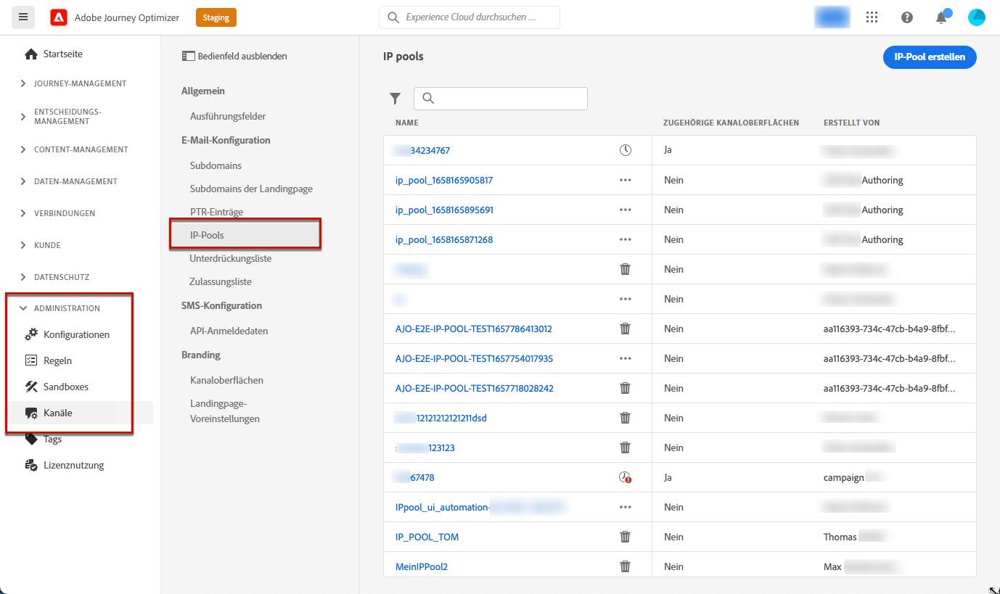

# Erste Schritte mit der Konfiguration von [!DNL Journey Optimizer] {#start-optimizer-configuration}

Beim erstmaligen Zugriff auf [!DNL Journey Optimizer] wird Ihnen eine Produktions-Sandbox bereitgestellt und je nach Vertrag eine bestimmte Anzahl von IPs zugewiesen.

Um Journeys erstellen und Nachrichten senden zu können, müssen Sie diese Konfigurationsschritte durchlaufen:

1. **Nachrichten und Kanäle konfigurieren**: Definieren Sie Kanaloberflächen und passen Sie die Nachrichten an.

   * Erstellen Sie Kanaloberflächen, um alle technischen Parameter zu konfigurieren, die zum Versand von Nachrichten erforderlich sind. [Weitere Informationen](channel-surfaces.md)

   * Bestimmen Sie, welche E-Mail-Adresse für Ihre Empfänger vorrangig verwendet werden soll, wenn in Adobe Experience Platform mehrere Adressen verfügbar sind. [Weitere Informationen](primary-email-addresses.md)

   * Verwalten Sie die Anzahl der Tage, in denen weitere Zustellversuche unternommen werden, bevor E-Mail-Adressen an die Unterdrückungsliste gesendet werden. [Weitere Informationen](manage-suppression-list.md)

   * Definieren Sie Push-Benachrichtigungseinstellungen sowohl in [!DNL Adobe Experience Platform] als auch in [!DNL Adobe Experience Platform Launch]. [Weitere Informationen](../configuration/push-gs.md)

   <!--* Understand the push notification flow. [Learn more](../configuration/push-gs.md)-->

   * Konfigurieren Sie Ihre Instanz für den Versand von SMS (derzeit nur für eine Reihe von Organisationen verfügbar – eingeschränkte Verfügbarkeit). [Weitere Informationen](sms-configuration.md)

1. **Subdomains zuweisen**: Für jede neue Subdomain, die in Journey Optimizer verwendet werden soll, besteht der erste Schritt darin, sie zuzuweisen. [Weitere Informationen](about-subdomain-delegation.md)

   

1. **Erstellen von IP-Pools**: Verbessern Sie die Zustellbarkeit Ihrer E-Mails und Ihre Reputation, indem Sie IP-Adressen gruppieren, die mit Ihrer Instanz bereitgestellt wurden. [Weitere Informationen](ip-pools.md)

   

1. **Journeys konfigurieren**: Um Journeys zu erstellen, müssen Sie **[!UICONTROL Datenquellen]**, **[!UICONTROL Ereignisse]** und **[!UICONTROL Aktionen]** konfigurieren. [Weitere Informationen](about-data-sources-events-actions.md)

   

   * Mit der Konfiguration von **Datenquellen** können Sie eine Verbindung zu einem System definieren, um zusätzliche Informationen zur Verwendung in Ihren Journeys abzurufen. [Weitere Informationen](../datasource/about-data-sources.md)

   * Mithilfe von **Ereignissen** können Sie Ihre Journeys einheitlich auslösen, um Nachrichten in Echtzeit an die Kontakte zu senden, die in die Journey eintreten. In der Konfiguration von Ereignissen konfigurieren Sie die in den Journeys erwarteten Ereignisse. Die eingehenden Ereignisdaten werden mit dem Experience-Datenmodell (XDM) von Adobe normalisiert. Die Ereignisse stammen von Streaming-Aufnahme-APIs für authentifizierte und nicht authentifizierte Ereignisse (z. B. Adobe Mobile SDK-Ereignisse). [Weitere Informationen](../event/about-events.md)

   * [!DNL Journey Optimizer] verfügt über integrierte Nachrichtenfunktionen, mit denen Sie Inhalte entwerfen und versenden können. Wenn Sie zum Senden Ihrer Nachrichten ein Drittanbietersystem verwenden, erstellen Sie eine **benutzerdefinierte Aktion**. [Weitere Informationen](../action/action.md)