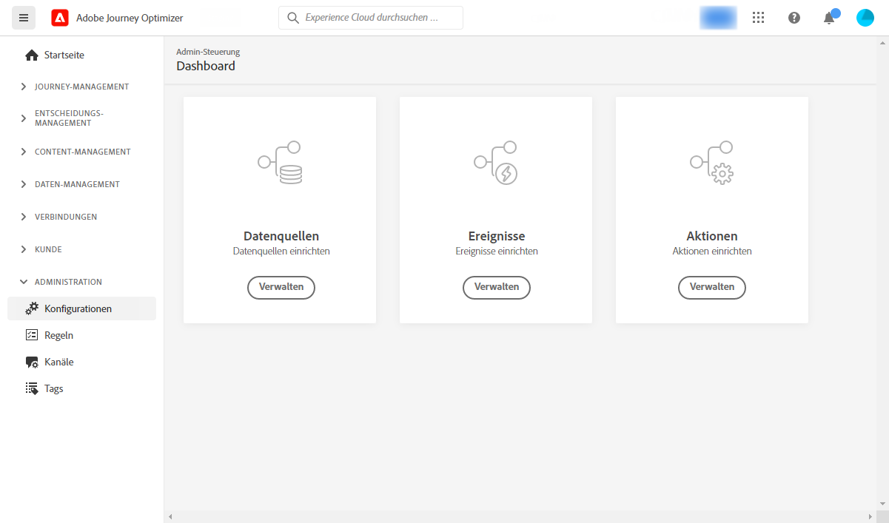

# Erste Schritte mit der Konfiguration von [!DNL Journey Optimizer] {#start-optimizer-configuration}

Beim erstmaligen Zugriff auf [!DNL Journey Optimizer] wird Ihnen eine Produktions-Sandbox bereitgestellt und je nach Vertrag eine bestimmte Anzahl von IPs zugewiesen.

Um Ihre Journey erstellen und Nachrichten senden zu können, müssen Sie die folgenden Konfigurationsschritte ausführen.

## Nachrichten und Kanäle konfigurieren

1. Um Nachrichten erstellen und senden zu können, müssen Sie je nach Kanal bestimmte Konfigurationen durchführen.

   * Für **Email** -Kanal verwenden, müssen Sie Subdomains an Adobe delegieren und IP-Pools erstellen, um IP-Adressen zu gruppieren. [Weitere Informationen](../email/get-started-email-config.md)

   * Für **Push** -Kanal, müssen Sie Push-Benachrichtigungseinstellungen in beiden [!DNL Adobe Experience Platform] und [!DNL Adobe Experience Platform Launch]. [Weitere Informationen](../push/push-configuration.md)

   * Für **SMS** -Kanal, müssen Sie Ihre Instanz so konfigurieren, dass SMS gesendet wird, einschließlich der Integration der Provider-Einstellungen in [!DNL Journey Optimizer]. [Weitere Informationen](../sms/sms-configuration.md)

1. Anschließend müssen Sie **Kanaloberflächen** um alle technischen Parameter zu konfigurieren, die für den Nachrichtenversand erforderlich sind. [Weitere Informationen](channel-surfaces.md)

1. Alternativ können Sie auch folgendermaßen vorgehen:

   * Verwalten Sie die Anzahl der Tage, in denen weitere Zustellversuche unternommen werden, bevor E-Mail-Adressen an die Unterdrückungsliste gesendet werden. [Weitere Informationen](manage-suppression-list.md)

   * Aktivieren Sie die **BBC-E-Mail-Option** , um eine Kopie der an Einzelpersonen gesendeten Nachrichten aufzubewahren. [Weitere Informationen](archiving-support.md#enable-bcc)

   * Konfigurieren **Frequenzregeln** um zu vermeiden, dass Ihre Empfänger überfordert werden. [Weitere Informationen](frequency-rules.md)

   * Bestimmen Sie, welche E-Mail-Adresse und/oder Telefonnummer für Ihre Empfänger vorrangig verwendet werden soll, wenn in Adobe Experience Platform mehrere Adressen/Nummern verfügbar sind. [Weitere Informationen](primary-email-addresses.md)

<!--* Understand the push notification flow. [Learn more](../push/push-gs.md)-->

>[!NOTE]
>
>Diese Schritte müssen von einem [Adobe Journey Optimizer-Systemadministrator](../start/path/administrator.md) durchgeführt werden.

## Konfigurieren von Journeys

Um Journey zu erstellen, müssen Sie **[!UICONTROL Data Sources]**, **[!UICONTROL Veranstaltungen]** und **[!UICONTROL Aktionen]**. [Weitere Informationen](about-data-sources-events-actions.md)

* Mit der Konfiguration von **Datenquellen** können Sie eine Verbindung zu einem System definieren, um zusätzliche Informationen zur Verwendung in Ihren Journeys abzurufen. [Weitere Informationen](../datasource/about-data-sources.md)

* Mithilfe von **Ereignissen** können Sie Ihre Journeys einheitlich auslösen, um Nachrichten in Echtzeit an die Kontakte zu senden, die in die Journey eintreten. In der Konfiguration von Ereignissen konfigurieren Sie die in den Journeys erwarteten Ereignisse. Die eingehenden Ereignisdaten werden mit dem Experience-Datenmodell (XDM) von Adobe normalisiert. Die Ereignisse stammen von Streaming-Aufnahme-APIs für authentifizierte und nicht authentifizierte Ereignisse (z. B. Adobe Mobile SDK-Ereignisse). [Weitere Informationen](../event/about-events.md)

* [!DNL Journey Optimizer] verfügt über integrierte Nachrichtenfunktionen, mit denen Sie Inhalte entwerfen und versenden können. Wenn Sie zum Senden Ihrer Nachrichten ein Drittanbietersystem verwenden, erstellen Sie eine **benutzerdefinierte Aktion**. [Weitere Informationen](../action/action.md)