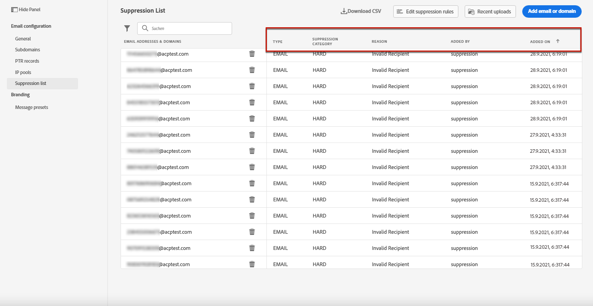

# Erste Schritte mit Listen zur Unterdrückung

Mit Journey Optimizer können Sie alle E-Mail-Adressen überwachen, die automatisch vom Senden einer Journey ausgeschlossen werden.

Die detaillierte Liste der ausgeschlossenen E-Mail-Adressen finden Sie im Menü Einstellungen / Allgemeine Einstellungen, indem Sie auf den Link Liste Unterdrücken der Ansicht klicken.

Es stehen Filter zur Verfügung, die Ihnen beim Durchsuchen der Liste helfen (Unterdrückungsdatum, Kategorie und Grund). Sie können die Liste auch als CSV-Datei für Analyse und Berichte herunterladen.

!! Bei der Staging-Phase nur Erstellungsdatumsfilter

