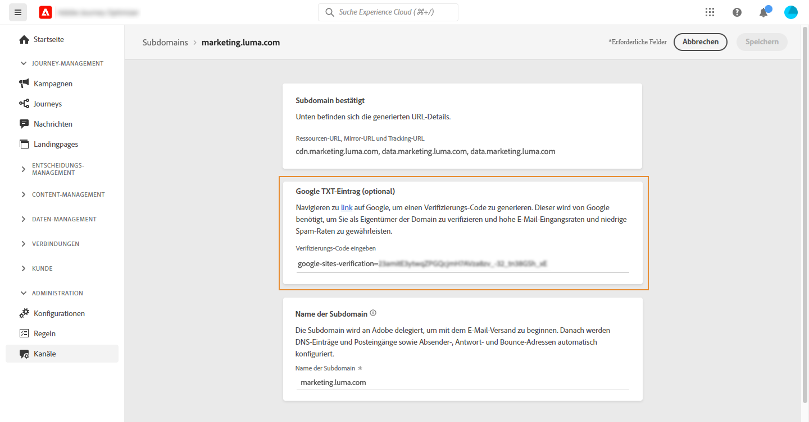

# Hinzufügen eines Google TXT-Eintrags zu einer Subdomain {#google-txt-record}

>[!CONTEXTUALHELP]
>id="ajo_admin_subdomain_google"
>title="TXT-Einträge von Google"
>abstract="Für einen erfolgreichen Versand von E-Mails an Gmail-Adressen können Subdomains spezielle TXT-Einträge der Website-Überprüfung von Google hinzugefügt werden, um ihre Verifizierung sicherzustellen."

TXT-Einträge sind eine Art von DNS-Einträgen, die der Bereitstellung von Textinformationen über eine Domain dienen und von externen Quellen gelesen werden können.

Für optimale Zustellbarkeit und einen erfolgreichen Versand von E-Mails an Gmail-Adressen ermöglicht es Ihnen [!DNL Journey Optimizer], Ihren Subdomains spezielle TXT-Einträge der Website-Überprüfung von Google hinzuzufügen, um ihre Verifizierung sicherzustellen.

>[!CAUTION]
>
> Dieser Vorgang kann nur ausgeführt werden, wenn eine Subdomain den Status **[!UICONTROL Erfolg]** aufweist. Weiterführende Informationen zum Status von Subdomains finden Sie in [diesem Abschnitt](delegate-subdomain.md#access-delegated-subdomains).

## Hinzufügen eines Google TXT-Eintrags {#add-google-txt-record}

Gehen Sie wie folgt vor, um Ihrer Subdomain einen Google TXT-Eintrag hinzuzufügen:

1. Öffnen Sie die Subdomain über das Menü **[!UICONTROL Kanäle]** > **[!UICONTROL E-Mail-Einstellungen]** > **[!UICONTROL Subdomains]**.

1. Geben Sie im Abschnitt **[!UICONTROL Google TXT-Eintrag]** den Verifizierungs-Code ein, der in [Google Workspace](https://support.google.com/a/answer/183895){target="_blank"}<!--G Suite Admin tools--> generiert wurde. Klicken Sie dann auf **[!UICONTROL Speichern]**.

   

1. Nachdem der TXT-Eintrag hinzugefügt wurde, muss er von Google verifiziert werden. Gehen Sie dazu zu [Google Workspace](https://support.google.com/a/answer/183895){target="_blank"}<!--G Suite Admin tools--> und starten Sie den Verifizierungsvorgang.

## Aktualisieren eines Google TXT-Eintrags {#update-google-txt-record}

Gehen Sie wie folgt vor, um einen vorhandenen Google TXT-Eintrag zu aktualisieren:

1. Öffnen Sie die Subdomain über das Menü **[!UICONTROL Subdomains]**.

1. Löschen Sie den vorhandenen Wert im Feld **[!UICONTROL Google TXT-Eintrag]** und klicken Sie auf **[!UICONTROL Speichern]**. Dieser Schritt ersetzt den vorherigen Wert des Google TXT-Eintrags durch eine leere Zeichenfolge.

1. Öffnen Sie nun dieselbe Subdomain erneut und geben Sie den neuen Verifizierungs-Code ein.

1. Klicken Sie erneut auf **[!UICONTROL Speichern]**.

1. Prüfen Sie den aktualisierten Eintrag über [Google Workspace](https://support.google.com/a/answer/183895){target="_blank"}.
