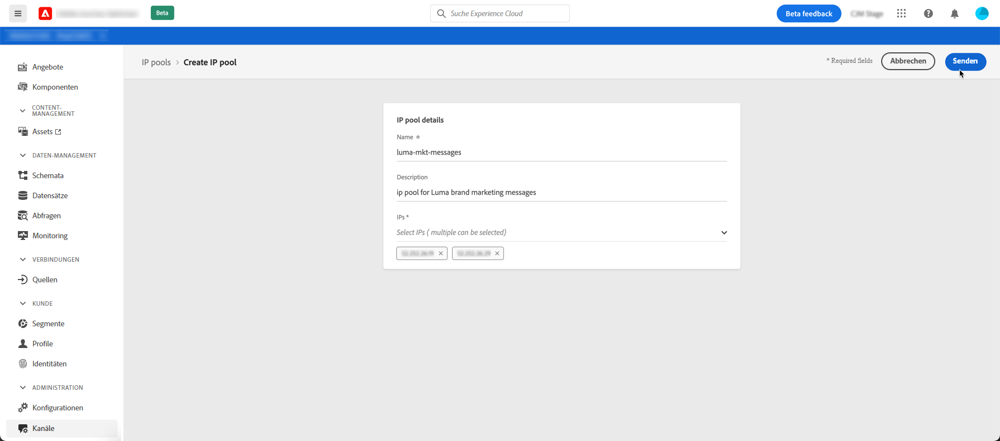
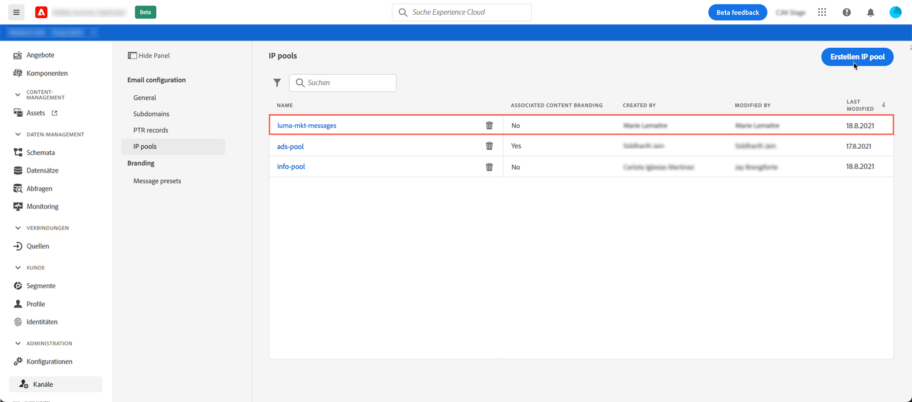

# Erstellen von IP-Pools

## Über IP-Pools

Mit Journey Optimizer können Sie IP-Pools erstellen, um die IP-Adressen Ihrer Subdomains zu gruppieren.

Für die Zustellbarkeit von E-Mails wird dringend empfohlen, IP-Pools zu erstellen. Auf diese Weise können Sie verhindern, dass die Reputation einer Subdomain Ihre anderen Subdomains beeinflusst.

Eine Best Practice ist beispielsweise, einen IP-Pool für Ihre Marketing-Nachrichten und einen weiteren für Ihre Transaktionsnachrichten zu nutzen. Auf diese Weise wirkt sich eine Ihrer Marketing-Nachrichten, die von einem Kunden als unzureichend und als Spam gekennzeichnet wird, nicht auf die an denselben Kunden gesendeten Transaktionsnachrichten aus, der weiterhin Transaktionsnachrichten erhält (Kaufbestätigungen, Nachrichten zur Passwortwiederherstellung usw.).

## Erstellen eines IP-Pools

Gehen Sie wie folgt vor, um einen IP-Pool zu erstellen:

1. Rufen Sie das Menü **[!UICONTROL Kanäle]** / **[!UICONTROL IP-Pools]** auf und klicken Sie dann auf **[!UICONTROL IP-Pool erstellen]**.

   

1. Geben Sie einen Namen und eine Beschreibung (optional) für den IP-Pool an.

   >[!NOTE]
   >
   >Der Name der Subdomain muss mit einem Buchstaben (A-Z) beginnen und nur alphanumerische Zeichen oder Sonderzeichen ( _, ., - ) enthalten.

1. Wählen Sie aus der Dropdownliste die IP-Adressen aus, die in den Pool aufgenommen werden sollen, und klicken Sie dann auf **[!UICONTROL Senden]**.

   

   >[!NOTE]
   >
   >Alle mit Ihrer Instanz bereitgestellten IP-Adressen sind in der Liste verfügbar.

Der IP-Pool wird jetzt erstellt und in der Liste angezeigt. Sie können es auswählen, um auf seine Eigenschaften zuzugreifen und die zugehörige Nachrichtenvorgabe anzuzeigen. Weiterführende Informationen zum Verknüpfen einer Nachrichtenvorgabe mit einem IP-Pool finden Sie in [diesem Abschnitt](message-presets.md)).

Um einen IP-Pool zu bearbeiten, öffnen Sie ihn und bearbeiten Sie dann seine Eigenschaften nach Bedarf.

>[!NOTE]
>
>Wenn eine Nachrichtenvorgabe mit dem IP-Pool verknüpft wurde, müssen Sie sie zunächst entfernen, bevor Sie den IP-Pool bearbeiten. Nachdem die Änderungen vorgenommen wurden, können Sie die Nachrichtenvorgabe erneut verknüpfen.
