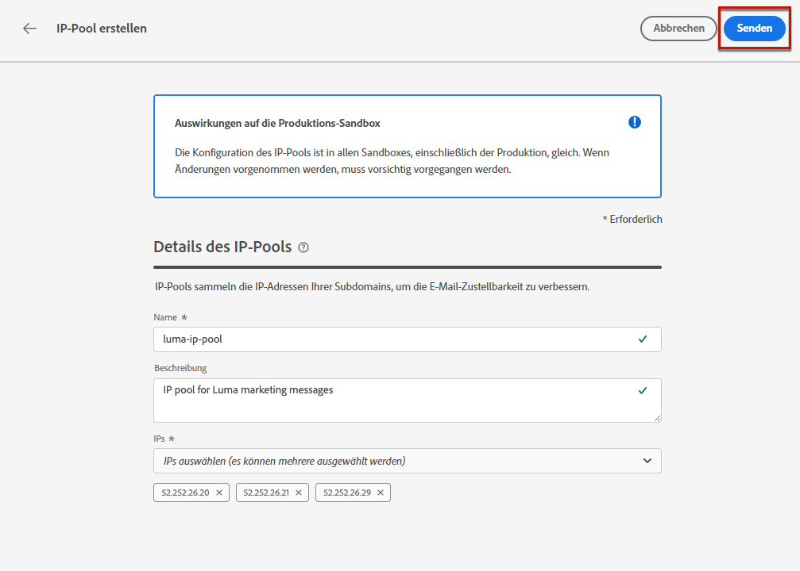
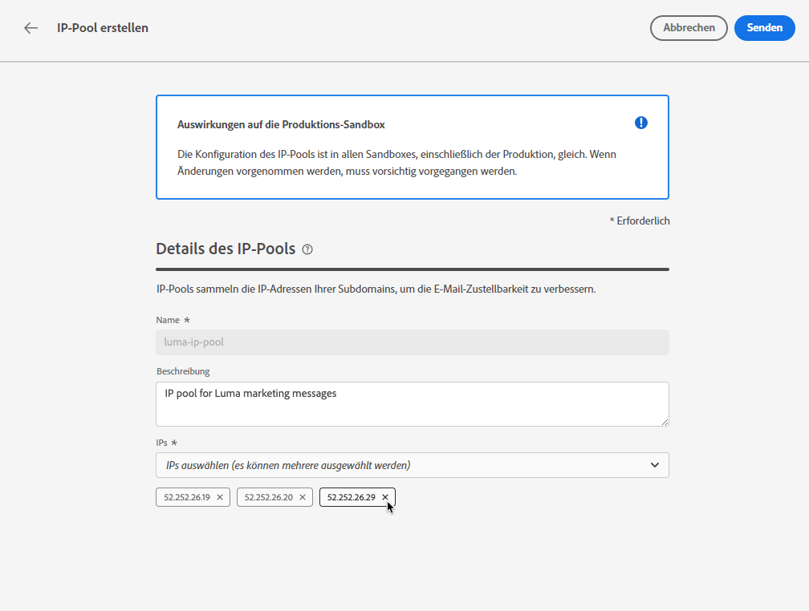

# Erstellen von IP-Pools {#create-ip-pools}

>[!CONTEXTUALHELP]
>id="ajo_admin_ip_pool_header"
>title="Einrichten eines IP-Pools"
>abstract="IP-Pools sammeln die IP-Adressen Ihrer Subdomains, um die E-Mail-Zustellbarkeit zu verbessern."

>[!CONTEXTUALHELP]
>id="ajo_admin_ip_pool"
>title="Einrichten eines IP-Pools"
>abstract="Mit Journey Optimizer können Sie IP-Pools erstellen, um die IP-Adressen Ihrer Subdomains zu Gruppen zusammenzufassen. Dies kann die Zustellbarkeit Ihrer E-Mails erheblich verbessern, da Sie dadurch verhindern können, dass sich die Reputation einer Subdomain auf Ihre anderen Subdomains auswirkt."

## Über IP-Pools {#about-ip-pools}

Mit [!DNL Journey Optimizer] können Sie IP-Pools erstellen, um die IP-Adressen Ihrer Subdomains zu Gruppen zusammenzufassen.

Zur verbesserten Zustellbarkeit von E-Mails wird dringend empfohlen, IP-Pools zu erstellen. Auf diese Weise können Sie verhindern, dass die Reputation einer Subdomain eine Auswirkung auf Ihre anderen Subdomains hat.

Eine Best Practice ist beispielsweise, einen IP-Pool für Ihre Marketing-Nachrichten und einen weiteren für Ihre Transaktionsnachrichten zu nutzen. Auf diese Weise wirkt sich eine Marketing-Nachricht, die vom Kunden abgelehnt und als Spam gekennzeichnet wird, nicht auf die an denselben Kunden gesendeten Transaktionsnachrichten aus, sodass dieser Kunde weiterhin Transaktionsnachrichten erhält (Kaufbestätigungen, Nachrichten zur Passwortwiederherstellung usw.).

>[!CAUTION]
>
>Die Konfiguration eines IP-Pools ist in allen Umgebungen gleich. Daher wirkt sich die Erstellung oder Bearbeitung von IP-Pools auch auf die Produktions-Sandboxes aus.

## Erstellen eines IP-Pools {#create-ip-pool}

Gehen Sie wie folgt vor, um einen IP-Pool zu erstellen:

1. Rufen Sie das Menü **[!UICONTROL Administration]** > **[!UICONTROL Kanäle]** > **[!UICONTROL IP-Pools]** auf und klicken Sie dann auf **[!UICONTROL IP-Pool erstellen]**.

   

1. Geben Sie einen Namen und eine Beschreibung (optional) für den IP-Pool an.

   >[!NOTE]
   >
   >Der Name muss mit einem Buchstaben (A–Z) beginnen und darf nur alphanumerische Zeichen oder Sonderzeichen ( _, ., - ) enthalten.

1. Wählen Sie aus der Dropdown-Liste die IP-Adressen aus, die in den Pool aufgenommen werden sollen, und klicken Sie dann auf **[!UICONTROL Senden]**.

   

   >[!NOTE]
   >
   >Alle mit Ihrer Instanz bereitgestellten IP-Adressen sind in der Liste verfügbar.

Der IP-Pool wird jetzt erstellt und in der Liste angezeigt. Sie können ihn auswählen, um auf seine Eigenschaften zuzugreifen und die zugehörige Kanaloberfläche anzuzeigen (d.h. Nachrichtenvoreinstellung). Weiterführende Informationen zum Verknüpfen einer Kanaloberfläche mit einem IP-Pool finden Sie in [diesem Abschnitt](channel-surfaces.md).

## Bearbeiten eines IP-Pools {#edit-ip-pool}

Gehen Sie wie folgt vor, um einen IP-Pool zu bearbeiten.

1. Klicken Sie in der Liste auf den Namen des IP-Pools, um ihn zu öffnen.

   

1. Bearbeiten Sie die Eigenschaften nach Bedarf. Sie können die Beschreibung ändern und IP-Adressen hinzufügen oder entfernen.

   >[!NOTE]
   >
   >Der Name des IP-Pools kann nicht bearbeitet werden. Wenn Sie ihn ändern möchten, müssen Sie den IP-Pool löschen und einen neuen mit dem Namen Ihrer Wahl erstellen.

   

   >[!CAUTION]
   >
   >Gehen Sie beim Löschen einer IP-Adresse mit besonderer Sorgfalt vor, da dies die anderen IPs zusätzlich belastet und möglicherweise erhebliche Auswirkungen auf Ihre Zustellbarkeit hat. Wenden Sie sich im Zweifel an einen Zustellbarkeitsexperten.

1. Speichern Sie Ihre Änderungen.

Die Aktualisierung ist sofort oder asynchron wirksam, je nachdem, ob der IP-Pool mit einer [Kanaloberfläche](channel-surfaces.md) verknüpft ist oder nicht:

* Wenn der IP-Pool **nicht** mit einer Kanaloberfläche verknüpft ist, erfolgt die Aktualisierung sofort (Status **[!UICONTROL Erfolgreich abgeschlossen]**).
* Wenn der IP-Pool **mit einer Kanaloberfläche verknüpft ist**, kann die Aktualisierung bis zu 3 Stunden dauern (Status **[!UICONTROL Verarbeitung läuft]**).

>[!NOTE]
>
>Wenn Sie beim [Erstellen einer Kanaloberfläche](channel-surfaces.md#create-channel-surface) einen IP-Pool auswählen, der sich in Bearbeitung befindet (Status **[!UICONTROL Verarbeitung läuft]**) und noch nie mit der für diese Oberfläche ausgewählten Subdomain verknüpft wurde, können Sie nicht mit der Erstellung der Oberfläche fortfahren. [Weitere Informationen](channel-surfaces.md#subdomains-and-ip-pools)

Um den Status der Aktualisierung des IP-Pools zu überprüfen, klicken Sie auf den Button **[!UICONTROL Mehr Aktionen]** und wählen Sie **[!UICONTROL Letzte Updates]** aus.

>[!NOTE]
>
>Nachdem ein IP-Pool erfolgreich aktualisiert wurde, müssen Sie möglicherweise warten:
>* einige Minuten, bevor er von den unitären Nachrichten genutzt wird,
>* bis der nächste Batch für den IP-Pool in Batch-Nachrichten wirksam ist.

Sie können auch den Button **[!UICONTROL Löschen]** verwenden, um einen IP-Pool zu löschen. Beachten Sie, dass Sie einen mit einer Kanaloberfläche verknüpften IP-Pool nicht löschen können.

