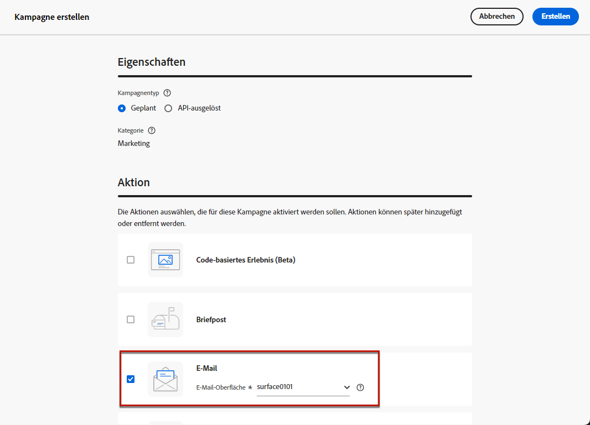
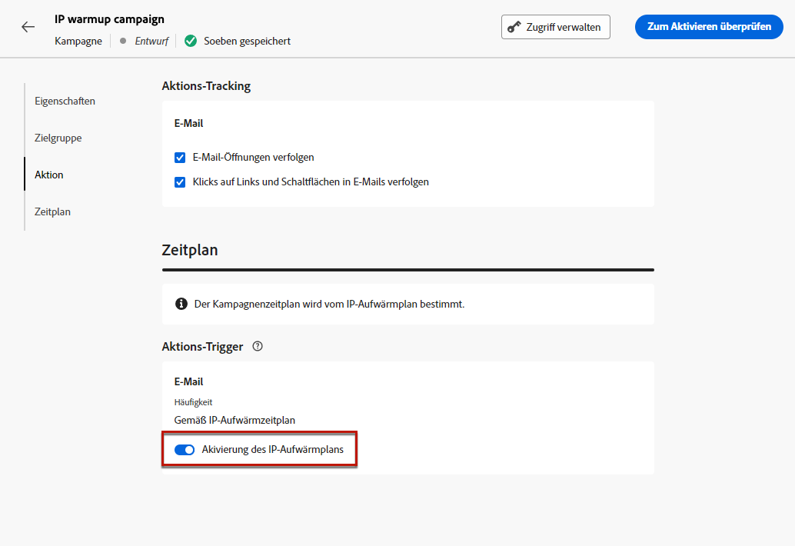
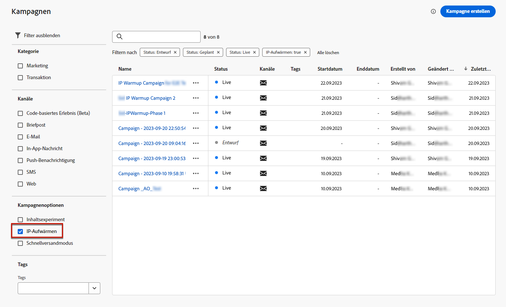

# Erstellen von IP-Aufwärmekampagnen {#create-ip-warmup-campaign}

>[!CONTEXTUALHELP]
>id="ajo_campaign_ip_warmup"
>title="Aktivieren Sie die Option IP-Warmup-Plan ."
>abstract="Wenn Sie diese Option auswählen, kann die Kampagne in einem IP-Warmup-Plan verwendet werden. Der Kampagnenkalender wird dann durch den IP-Warmup-Plan gesteuert, mit dem er verbunden ist."

>[!BEGINSHADEBOX]

Inhalt dieses Dokumentationshandbuchs:

* [Erste Schritte mit IP-Wärme](ip-warmup-gs.md)
* **[Erstellen von IP-Aufwärmekampagnen](ip-warmup-campaign.md)**
* [Erstellen eines IP-Warmup-Plans](ip-warmup-plan.md)
* [Ausführen des IP-Aufwärmungsplans](ip-warmup-execution.md)

>[!ENDSHADEBOX]

Vor der Erstellung des IP-Warmup-Plans in [!DNL Journey Optimizer]müssen Sie zunächst eine oder mehrere Kampagnen mit aktivierter dedizierter Option erstellen, damit sie in einem IP-Warmup-Plan verwendet werden können.

Gehen Sie wie folgt vor, um eine IP-Warmup-Kampagne zu erstellen.

1. Erstellen Sie eine [email](../email/email-settings.md) channel [Oberfläche](channel-surfaces.md) für die Domain und die IPs, die Sie für Ihren Warmup-Plan identifiziert haben.

   >[!NOTE]
   >
   >Erfahren Sie, wie Sie die Domäne und IPs auswählen, die auf einer E-Mail-Oberfläche verwendet werden sollen in [diesem Abschnitt](../email/email-settings.md#subdomains-and-ip-pools).
   >
   >Arbeiten Sie mit Ihrem Zustellbarkeitsberater zusammen, um die Domäne und IPs zu ermitteln, die für Ihren IP-Warmup-Plan verwendet werden sollen.<!--TBC-->

1. Erstellen Sie eine [Kampagne](../campaigns/create-campaign.md) und wählen Sie die [Email](../email/create-email.md#create-email-journey-campaign) Aktion.

1. Wählen Sie die Oberfläche aus, die Sie für die IP-Wärme-Kopplung erstellt haben.

   

   <!--You must use the same surface as the one that will be used for the asociated IP warmup plan. [Learn how to create an IP warmup plan](#create-ip-warmup-plan)-->

1. Klicken Sie auf **[!UICONTROL Erstellen]**.

1. Aus dem **[!UICONTROL Zeitplan]** Bereich, wählen Sie **[!UICONTROL Aktivierung des IP-Warmlaufplans]**.

   

   Die Kampagne [Zeitplan](../campaigns/create-campaign.md#schedule) wird vom IP-Warmup-Plan gesteuert, mit dem er verknüpft wird, was bedeutet, dass der Zeitplan nicht mehr in der Kampagne selbst definiert ist.

1. Führen Sie die Schritte zum Erstellen einer E-Mail-Kampagne aus, z. B. die Definition der Kampagneneigenschaften, [audience](../audience/about-audiences.md)<!--best practices for IP warmup in terms of audience?-->, und [content](../email/get-started-email-design.md#key-steps).

   >[!NOTE]
   >
   >Weitere Informationen zur Konfiguration Ihrer Kampagne finden Sie auf [dieser Seite](../campaigns/get-started-with-campaigns.md).

1. [Aktivieren](../campaigns/review-activate-campaign.md) die Kampagne.

   >[!NOTE]
   >
   >Bei einer Live-Kampagne mit aktiviertem IP-Warmup-Plan wird die Variable **[!UICONTROL Löschen]** -Schaltfläche verfügbar, bis sie mit einem IP-Warmup-Plan verknüpft ist. Sobald die Kampagne in einem Plan verwendet wurde, kann sie nicht mehr gelöscht werden.

1. Die Kampagne wird im **[!UICONTROL Kampagnen]** Liste. Um alle in der aktuellen Sandbox erstellten IP-Warmup-Kampagnen einfach abzurufen, können Sie nach **[!UICONTROL IP-Wärme]** Kampagnenoption.

   

Sobald die Kampagne live ist, kann sie in einem IP-Warmup-Plan verwendet werden. [Weitere Informationen](ip-warmup-plan.md)

<!--Any recommendations when defining an audience? i.e do you have to include all your database or a limited number or according to your Excel file?-->

