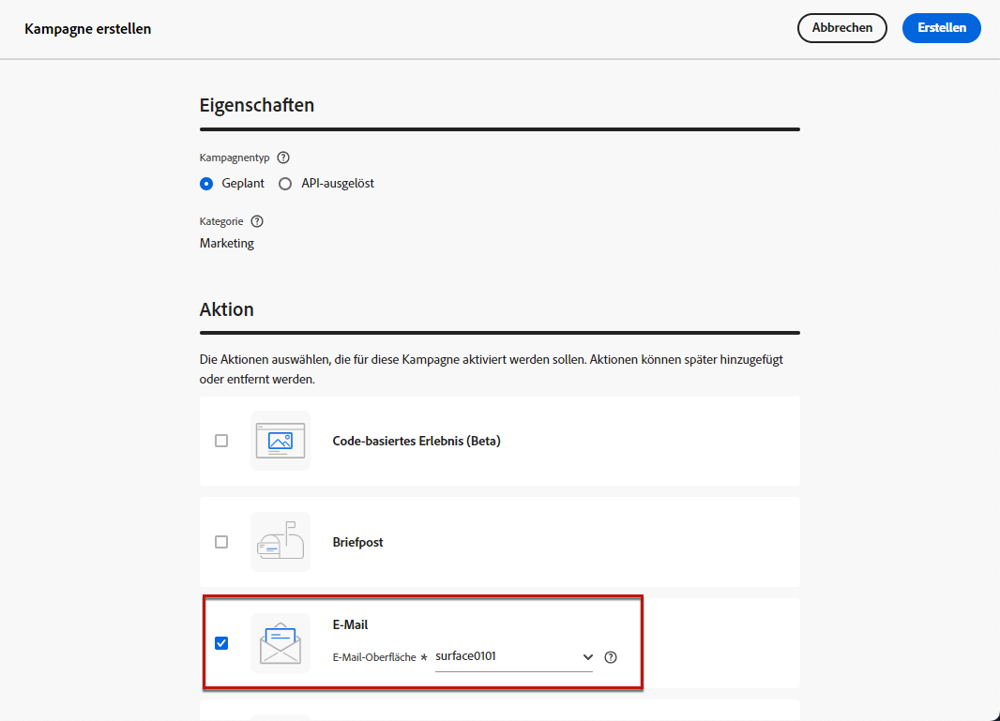
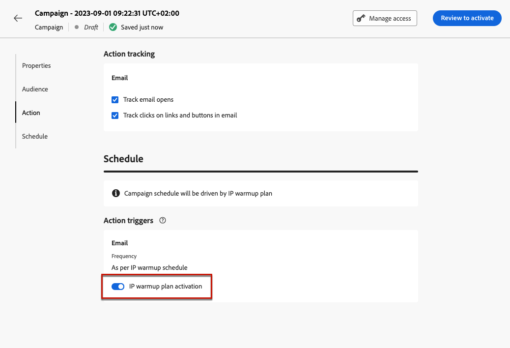
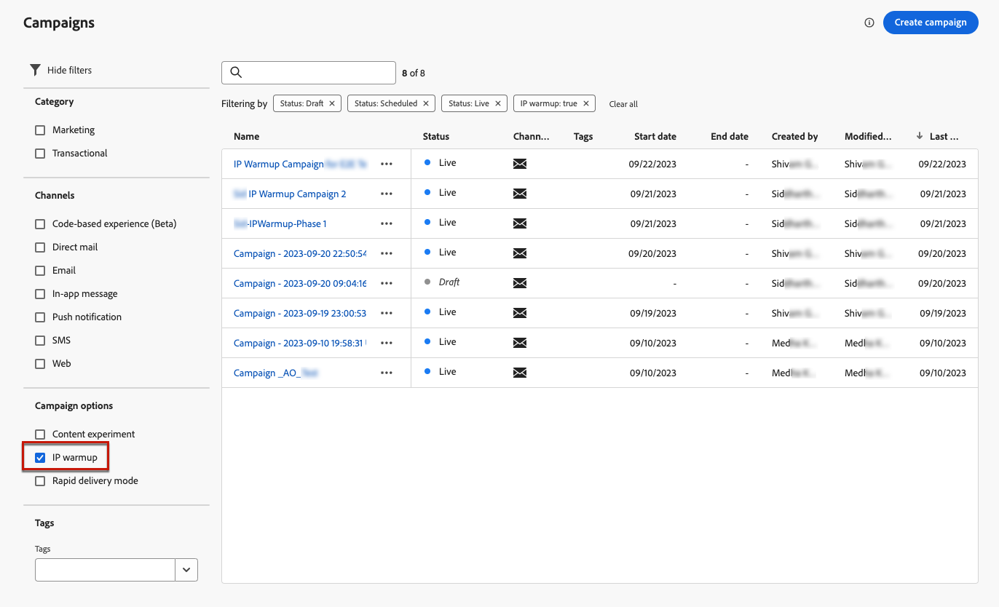

# Erstellen von IP-Aufwärmkampagnen {#create-ip-warmup-campaign}

>[!CONTEXTUALHELP]
>id="ajo_campaign_ip_warmup"
>title="Aktivieren der Option IP-Aufwärmplan"
>abstract="Wenn diese Option ausgewählt wurde, kann die Kampagne in einem IP-Aufwärmplan verwendet werden. Der Kampagnenzeitplan wird dann durch den IP-Aufwärmplan gesteuert, mit dem er verbunden ist."

Bevor Sie den eigentlichen IP-Warmup-Plan in [!DNL Journey Optimizer] erstellen, müssen Sie zunächst eine oder mehrere Kampagnen erstellen, die speziell für die Verwendung in einem IP-Warmup-Plan<!--through a dedicated option--> konzipiert sind.

Um eine IP-Aufwärmkampagne zu erstellen, führen Sie die folgenden Schritte aus.

1. Erstellen Sie eine E-Mail-Kanal-[Konfiguration](channel-surfaces.md) für die Domain und die IPs erstellen, die für den Aufwärmplan identifiziert wurden.

   Arbeiten Sie mit Ihren Fachleuten für Zustellbarkeit zusammen, um die Domain und die IPs zu identifizieren, die verwendet werden sollen. Informationen zu ihrer Auswahl in einer E-Mail-Konfiguration finden Sie in [diesem Abschnitt](../email/email-settings.md#ip-pools).

   >[!CAUTION]
   >
   >Bearbeiten Sie die Konfiguration des E-Mail-Kanals nicht, nachdem der IP-Aufwärmplan [gestartet](ip-warmup-execution.md) wurde.

1. Erstellen Sie eine geplante Marketing-[Kampagne](../campaigns/create-campaign.md) und wählen Sie die Aktion [E-Mail](../email/create-email.md#create-email).

   <!--Select the Marketing category. The IP warmup plan activation option is only available for  marketing-type campaigns.-->

1. Wählen Sie die Konfiguration aus, die Sie für das IP-Aufwärmen erstellt haben.

   

   <!--You must use the same configuration as the one that will be used for the asociated IP warmup plan. [Learn how to create an IP warmup plan](#create-ip-warmup-plan)-->

1. Klicken Sie auf **[!UICONTROL Erstellen]**.

1. Wählen Sie im Abschnitt **[!UICONTROL Zeitplan]** die Option **[!UICONTROL IP-Aufwärmplan aktivieren]** aus.

   

   Der [Zeitplan](../campaigns/campaign-schedule.md) der Kampagne wird vom IP-Aufwärmplan gesteuert, mit dem er verknüpft wird, was bedeutet, dass der Zeitplan nicht mehr in der Kampagne selbst definiert ist.

1. Führen Sie die Schritte zur Erstellung einer E-Mail-Kampagne aus, wie z. B. das Definieren der Kampagneneigenschaften, der [Zielgruppe](../audience/about-audiences.md)<!--best practices for IP warmup in terms of audience?--> und des [Inhalts](../email/get-started-email-design.md#key-steps).

   >[!IMPORTANT]
   >
   >In einer IP-Aufwärmkampagne zulässige Zielgruppen müssen [segmentbasiert](../audience/creating-a-segment-definition.md) sein und mithilfe der [standardmäßigen Zusammenführungsrichtlinie](https://experienceleague.adobe.com/de/docs/experience-platform/profile/merge-policies/overview#default-merge-policy){target="_blank"} erstellt werden.
   >
   >CSV-Upload-Zielgruppen werden für IP-Aufwärmkampagnen nicht unterstützt und führen bei der Aktivierung der Kampagne zu einem Fehler.

   Weitere Informationen zur Konfiguration Ihrer Kampagne finden Sie auf [dieser Seite](../campaigns/get-started-with-campaigns.md).

1. [Aktivieren](../campaigns/review-activate-campaign.md) Sie die Kampagne. Der Status ändert sich in **[!UICONTROL Live]**

   >[!NOTE]
   >
   >[Geschäftsregeln](../conflict-prioritization/rule-sets.md#rule-sets) sollten nicht für IP-Aufwärmpläne verwendet werden. Die Anwendung dieser Regeln kann dazu führen, dass die gewünschte Anzahl von Zielgruppenprofilen für Kampagnen nicht erreicht wird.

   Bei einer Live-Kampagne mit aktiviertem IP-Aufwärmplan ist die Schaltfläche **[!UICONTROL Löschen]** verfügbar, bis sie mit einem IP-Aufwärmplan verknüpft ist. Sobald die Kampagne in einem Plan verwendet wurde, kann sie nicht mehr gelöscht werden.

1. Die Kampagne wird in der Liste **[!UICONTROL Kampagnen]** angezeigt. Um alle in der aktuellen Sandbox erstellten IP-Aufwärmkampagnen einfach abzurufen, können Sie nach der Kampagnenoption **[!UICONTROL IP-Aufwärmen]** filtern.

   

Sobald die Kampagne live ist, kann sie in einem IP-Aufwärmplan verwendet werden. [Weitere Informationen](ip-warmup-plan.md)

Eine IP-Warmup-Kampagne kann in nur einem IP-Warmup-Plan verwendet werden. Dieselbe Kampagne kann jedoch in einer oder mehreren Phasen desselben IP-Aufwärmplans verwendet werden. [Weitere Informationen](ip-warmup-plan.md#ip-warmup-plan-tab)

>[!NOTE]
>
>Wenn eine Live-Kampagne in einem IP-Aufwärmplan verwendet wird, ändert sich der [Status](../campaigns/manage-campaigns.md#statuses) dieser Kampagne, nachdem der Plan [als abgeschlossen markiert wurde](ip-warmup-execution.md#mark-as-completed), in **[!UICONTROL Gestoppt]**.

