# Ausführen des IP-Aufwärmplans {#ip-warmup-running}

Nachdem Sie [einen IP-Aufwärmplan erstellt](ip-warmup-plan.md) und die mit Ihrem Zustellbarkeitsberater vorbereitete Datei hochgeladen haben, können Sie die Phasen und Ausführungen in Ihrem Plan definieren.

Jede Phase besteht aus mehreren Durchgängen, denen Sie eine einzelne Kampagne zuweisen.

## Definieren der Phasen {#define-phases}

>[!CONTEXTUALHELP]
>id="ajo_admin_ip_warmup_campaigns_excluded"
>title="Ausschließen von Kampagnen-Audiences"
>abstract="Wählen Sie Kampagnen aus, um ihre Zielgruppen aus der aktuellen Phase auszuschließen. Dadurch wird verhindert, dass zuvor kontaktierte Profile erneut angesprochen werden. Nur diejenigen, die eine Kommunikation über die Journey erhalten haben, werden ausgeschlossen."

>[!CONTEXTUALHELP]
>id="ajo_admin_ip_warmup_domains_excluded"
>title="Ausschließen von Domain-Gruppen"
>abstract="Wählen Sie die Domains aus, die Sie aus der aktuellen Phase ausschließen möchten. Der Domain-Ausschluss erfordert eine nicht ausgeführte Phase, sodass Sie möglicherweise eine laufende Phase aufteilen müssen, um Ausschlüsse hinzuzufügen."
>additional-url="https://experienceleague.adobe.com/docs/journey-optimizer/using/configuration/implement-ip-warmup-plan/ip-warmup-execution.html?lang=de#split-phase" text="Phase teilen"

>[!CONTEXTUALHELP]
>id="ajo_admin_ip_warmup_phases"
>title="Definieren der Phasen Ihres Plans"
>abstract="Jede Phase besteht aus mehreren Durchgängen, denen Sie eine einzelne Kampagne zuweisen."

<!--
You need to associate the campaign and audience at phase level and turns on some settings as needed for all runs associated with a single creative/campaign

At phase level, system ensures that previously targeted + new profiles are picked up AND at iteration level, system ensures that each run is having unique profiles and the count matches what is stated in plan
-->

<!--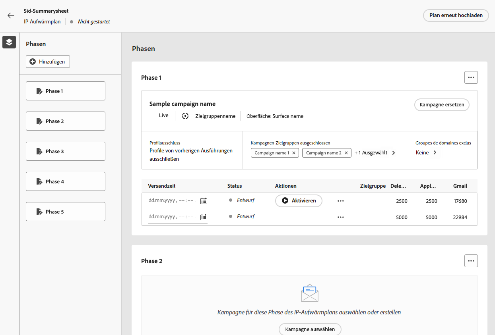-->

Um die Phasen Ihres IP-Aufwärmplans zu definieren, müssen Sie für jede Phase eine Kampagne auswählen, Ausschlüsse für Domains und Audiences konfigurieren und das Profil-Targeting verwalten. Jede Phase kann mehrere Ausführungen enthalten, die im nächsten Abschnitt konfiguriert werden. Führen Sie die folgenden Schritte aus:

1. Wählen Sie die Kampagne aus, die Sie mit der ersten Phase des IP-Aufwärmplans verknüpfen möchten.

   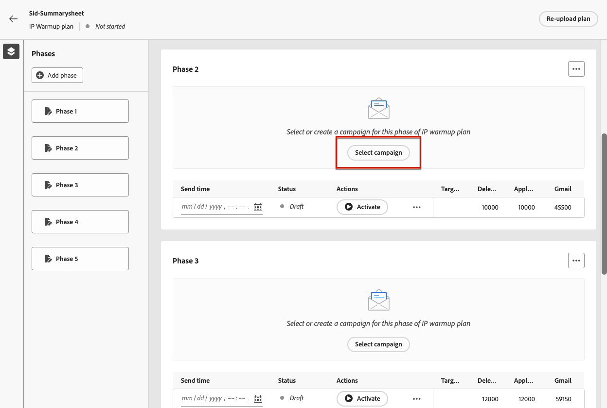

   >[!IMPORTANT]
   >
   >* Nur Kampagnen mit aktivierter Option **[!UICONTROL IP-Aufwärmplan]** können ausgewählt werden. [Weitere Informationen](#create-ip-warmup-campaign)
   >* Nur Kampagnen, die dieselbe Konfiguration wie der ausgewählte IP-Aufwärmplan verwenden, können ausgewählt werden.
   >* Eine Kampagne, die bereits in einem anderen IP-Aufwärmplan verwendet wird, kann nicht ausgewählt werden. Dieselbe Kampagne kann in mehreren Phasen desselben Plans verwendet werden.

1. Nachdem eine Kampagne für die aktuelle Phase ausgewählt wurde, werden die Abschnitte zum Ausschließen von Profilen, Kampagnen-Audiences und Domain-Gruppen angezeigt. Beachten Sie, dass Ausschlüsse nach der Aktivierung eines Durchgangs nur noch geändert werden können, wenn [&#x200B; den Durchgang in &#x200B;](#split-phase) neue Phase aufteilen.

   1. Wählen Sie im Abschnitt **[!UICONTROL Domain-Gruppen ausgeschlossen]** die Domains aus, die Sie aus dieser Phase ausschließen möchten.

      >[!NOTE]
      >
      >Der Domain-Ausschluss erfordert eine nicht ausgeführte Phase. Daher müssen Sie möglicherweise eine [laufende Phase aufteilen](#split-phase) um Ausschlüsse hinzuzufügen. Außerdem können Sie nur eine benutzerdefinierte Domain-Gruppe ausschließen, die zur [IP-Aufwärmplan-Vorlage](ip-warmup-plan.md#prepare-file) hinzugefügt wurde. Wenn nicht, aktualisieren Sie die Vorlage mit der benutzerdefinierten Domain-Gruppe und [laden Sie den Plan erneut hoch](#re-upload-plan).

      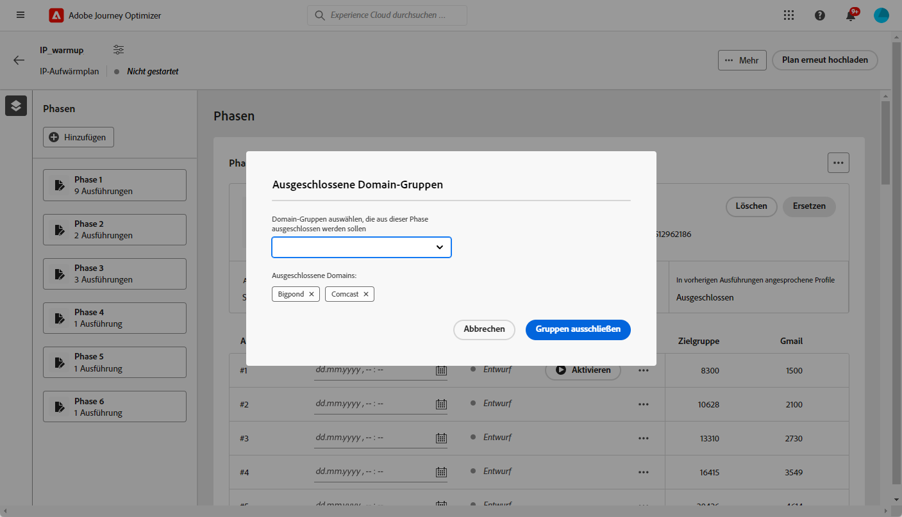

      Nachdem Sie beispielsweise einige Tage lang die IP-Aufwärmung ausgeführt haben, stellen Sie fest, dass Ihre Reputation des ISP bei einer Domain (z. B. Adobe) nicht gut ist, und Sie möchten sie auflösen, ohne Ihren IP-Aufwärmplan zu stoppen. In diesem Fall können Sie die Adobe-Domain-Gruppe ausschließen.

      >[!CAUTION]
      >
      >Wenn Sie nach Ausführung des IP-Aufwärmplans die [Ausführungsadresse](../email/email-settings.md#execution-address) im E-Mail-Kanal [Konfiguration](channel-surfaces.md) aktualisieren, der in der IP-Aufwärmkampagne verwendet wird, kann der Domain-Ausschluss fehlschlagen. Bearbeiten Sie nicht die Konfiguration des E-Mail-Kanals, nachdem der IP-Aufwärmplan gestartet wurde.

   1. Wählen Sie im **[!UICONTROL Kampagne zum Ausschluss von Profilen]** die Kampagnen aus, deren Audiences Sie aus der aktuellen Phase ausschließen möchten.

      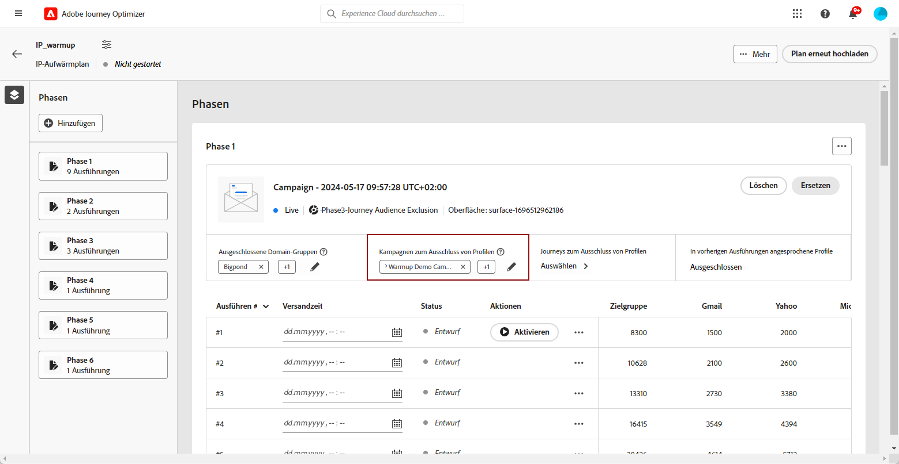

      Während der Ausführung von Phase 1 mussten Sie sie beispielsweise [aufteilen](#split-phase) aus irgendeinem Grund. Daher können Sie die in Phase 1 verwendete Kampagne ausschließen, sodass die zuvor kontaktierten Profile aus Phase 1 nicht in Phase 2 einbezogen werden. Sie können Kampagnen auch von anderen IP-Aufwärmplänen ausschließen.

   1. Wählen Sie im Abschnitt **[!UICONTROL Journey zum Ausschließen von Profilen]** die Journey mit den Zielgruppen aus, die Sie aus der aktuellen Phase ausschließen möchten.

      +++ Um die Option Journey zum Ausschließen von Profilen zu verwenden, müssen Sie eine Beziehung zwischen dem AJO-Nachrichten-Feedback-Ereignis und den AJO-Entitätsdatensatzschemata herstellen.

      1. Erstellen Sie einen benutzerdefinierten **Namespace** der als Identitätstyp für die folgenden Schritte dient.

      1. Greifen Sie auf Adobe Experience Platform zu **wählen Sie** Menü „Schemata“ das Schema **AJO-** und legen Sie das Feld **_id** als primäre Identität fest. Wählen Sie dann den zuvor erstellten Namespace als **Identity-Namespace**.

      1. Wählen Sie im Menü **Schemata** das **AJO Message Feedback Event Schema** und navigieren Sie zum Feld **_messageID**. Wählen Sie **Beziehung hinzufügen** und wählen Sie **AJO-**-Schema **als** und Ihren zuvor erstellten Namespace als **Referenz-Identity-Namespace**.
      +++

   1. Im Abschnitt **[!UICONTROL Profile, die in vorherigen Ausführungen angesprochen wurden]** können Sie sehen, dass die Profile aus den vorherigen Ausführungen dieser Phase immer ausgeschlossen sind (dieser Abschnitt ist schreibgeschützt). Wenn beispielsweise in Run #1 ein Profil von den ersten 4.800 Personen abgedeckt wurde, die angesprochen wurden, stellt das System automatisch sicher, dass dasselbe Profil die E-Mail nicht in Run #2 erhält.

1. Bei Bedarf können Sie die Kampagne mit der Schaltfläche **[!UICONTROL Ersetzen]** ersetzen. Sie können **[!UICONTROL ausgewählte Kampagne auch]** der Schaltfläche **[!UICONTROL Löschen]** löschen. Dadurch wird nicht nur die Kampagne gelöscht, sondern auch die anderen Eigenschaften auf Phasenebene (Domain-Gruppen schließen, Kampagne, Journey-Ausschluss und andere aus). Nach dem Löschen können Sie entweder sofort oder zu einem späteren Zeitpunkt eine neue Kampagne auswählen.

   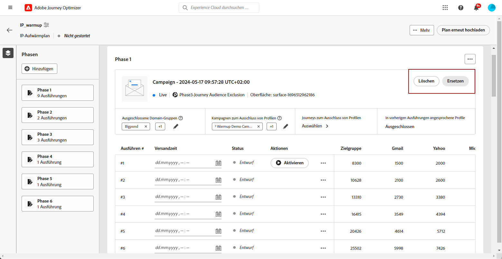

   >[!NOTE]
   >
   >Diese Aktion ist nur vor der Aktivierung des ersten Durchgangs der Phase möglich. Nachdem ein Durchgang aktiviert wurde, kann die Kampagne nicht mehr ersetzt werden, es sei denn, Sie [&#x200B; den Durchgang &#x200B;](#split-phase) einer neuen Phase aufgeteilt.

1. Sie können bei Bedarf eine Phase hinzufügen. Er wird nach der letzten Phase hinzugefügt.

   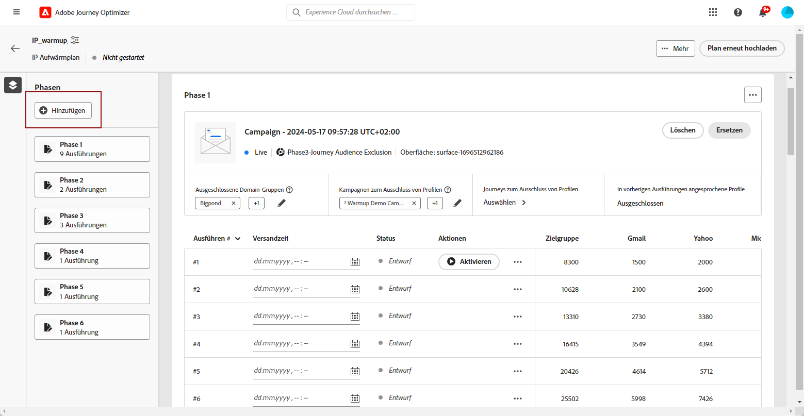

1. Mit der Schaltfläche **[!UICONTROL Phase löschen]** können Sie unerwünschte Phasen entfernen. Diese Aktion ist nur verfügbar, wenn in einer Phase keine Ausführung ausgeführt wird. <!--Once a run is executed, deletion is not allowed.-->

   >[!CAUTION]
   >
   >Sie können die Aktion **[!UICONTROL Löschphase]** nicht rückgängig machen. Wenn Sie alle Phasen löschen, wird empfohlen, den Plan erneut hochzuladen. [Weitere Informationen](#re-upload-plan)

   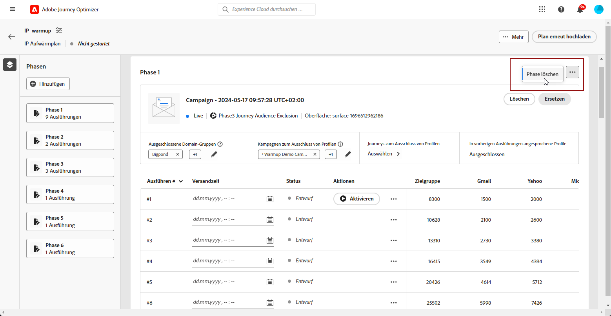

## Definieren der Durchgänge {#define-runs}

>[!CONTEXTUALHELP]
>id="ajo_admin_ip_warmup_run"
>title="Definieren der einzelnen Durchgänge"
>abstract="Definieren und aktivieren Sie jeden Durchlauf für alle Phasen."

>[!CONTEXTUALHELP]
>id="ajo_admin_ip_warmup_last_engagement"
>title="Nach Interaktion filtern"
>abstract="Diese Spalte ist ein Filter, der beispielsweise nur die Benutzenden anspricht, die in den letzten 20 Tagen mit Ihrer Marke interagiert haben. Sie können diese Einstellung auch über die Option **Ausführung bearbeiten** ändern."

>[!CONTEXTUALHELP]
>id="ajo_admin_ip_warmup_retry"
>title="Zeitfenster festlegen"
>abstract="Sie können ein Zeitfenster definieren, in dem die IP-Aufwärmkampagne ausgeführt werden kann, falls es zu Verzögerungen beim Segmentierungsauftrag kommt."

>[!CONTEXTUALHELP]
>id="ajo_admin_ip_warmup_pause"
>title="Abbrechen von Ausführungen mit Zielgruppenfehlern"
>abstract="Aktivieren Sie diese Option, um einen Durchlauf abzubrechen, wenn die qualifizierten Profile nach der Auswertung der Zielgruppe für diesen Durchgang kleiner als die Zielgruppenprofile sind."

>[!CONTEXTUALHELP]
>id="ajo_admin_ip_warmup_qualified"
>title="Anzeigen der qualifizierten Profile"
>abstract="In dieser Spalte wird die Anzahl der qualifizierten Profile angezeigt. Wenn nach der Auswertung der Zielgruppe für einen Durchgang mehr Zielgruppenprofile als qualifizierte Profile vorhanden sind, wird der Durchgang weiterhin ausgeführt, es sei denn, die Option **Aktivierte Ausführungen im Fehlerfall abbrechen** ist aktiviert. In diesem Fall wird der Durchlauf abgebrochen."

Nachdem Sie die Phasen Ihres IP-Aufwärmplans definiert haben, müssen Sie die einzelnen Ausführungen innerhalb jeder Phase konfigurieren. Jeder Durchgang erfordert einen Zeitplan, und Sie können optional Interaktionsfilter, Fehlerbehandlung und Wiederholungsfenster konfigurieren, um eine optimale Ausführung sicherzustellen. Führen Sie die folgenden Schritte aus:

1. Wählen Sie für jeden Durchgang einen Zeitplan aus, um sicherzustellen, dass er zum angegebenen Zeitpunkt ausgeführt wird.

   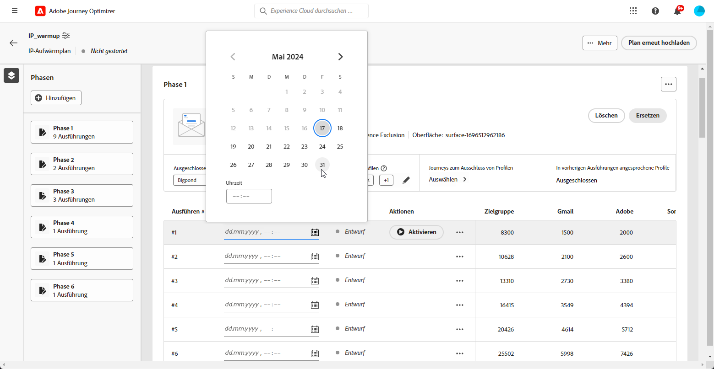

1. Optional können Sie ein Zeitfenster festlegen, in dem die IP-Aufwärmkampagne ausgeführt werden kann, falls es bei der (Zielgruppen[Auswertung zu Verzögerungen &#x200B;](https://experienceleague.adobe.com/docs/experience-platform/segmentation/home.html?lang=de#how-segmentation-works){target="_blank"}. Klicken Sie dazu auf das Symbol Eigenschaften oben links neben dem Namen des Plans und verwenden Sie die **[!UICONTROL Laufzeit wiederholen]** Dropdown-Liste, um eine Dauer von bis zu 240 Minuten (4 Stunden) auszuwählen.

   >[!NOTE]
   >
   >Weitere Zustellversuche erfolgen alle 30 Minuten bis zum Ende des definierten Zeitfensters. Wenn kein Zeitfenster angegeben ist, wird der Versuch zum Sendezeitpunkt unternommen. Wenn die Zielgruppenbewertung nicht abgeschlossen ist, schlägt der Versuch fehl.

   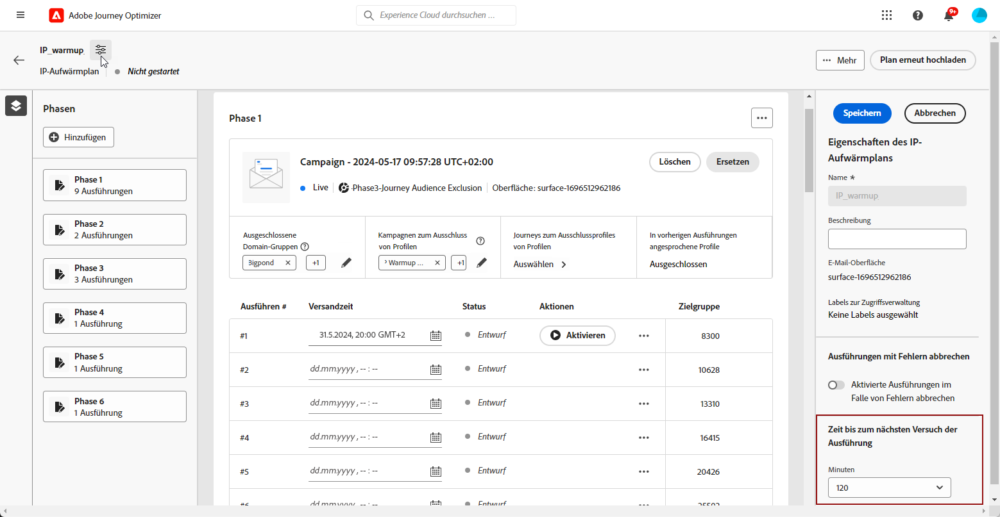

   Wenn Sie beispielsweise eine Sendezeit an einem bestimmten Tag um 9 Uhr festlegen und 120 Minuten als Laufzeit für weitere Zustellversuche auswählen, kann ein Zeitfenster von 2 Stunden (9 Uhr bis 11 Uhr) für den Durchlauf bei unerwarteten Verzögerungen bei der Zielgruppenbewertung durchgeführt werden.

1. Wählen Sie bei Bedarf **[!UICONTROL Ausführung bearbeiten]** über das Symbol Mehr Aktionen aus. Dort können Sie die Anzahl der Adressen in jeder Spalte aktualisieren. Sie können auch das Feld **[!UICONTROL Letzte Interaktion]** aktualisieren, um beispielsweise nur die Benutzer anzusprechen, die in den letzten 20 Tagen mit Ihrer Marke interagiert haben.

   >[!NOTE]
   >
   >Es wird empfohlen, diese Zahlen in Absprache mit Ihrem Zustellbarkeitsexperten zu ändern. Um den Interaktionszeitraum für einen Lauf zu deaktivieren, geben Sie 0 in das Feld **[!UICONTROL Zuletzt aktiviert]** ein.

   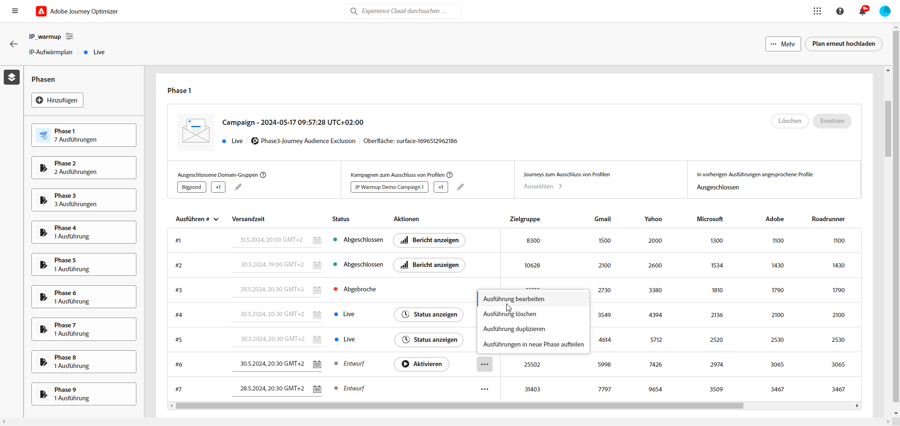

1. Wählen Sie die Option **[!UICONTROL Aktivierte Ausführungen im Fehlerfall abbrechen]**, um einen Durchlauf abzubrechen, wenn die qualifizierten Profile kleiner als die Zielgruppenprofile sind, nachdem die Zielgruppe für diesen Durchgang ausgewertet wurde.

   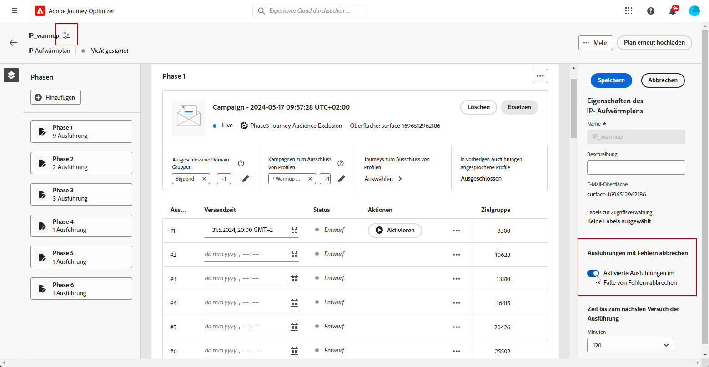

   Wenn die Anzahl der qualifizierten Profile nicht mit der Anzahl der Zielgruppenprofile übereinstimmt (z. B. werden 1.500 Gmail-Adressen in der Ausführung angesprochen, es gibt jedoch nur 700 für Gmail qualifizierte Profile):

   * Wenn die Option aktiviert ist, schlägt der Durchlauf fehl und der Durchlauf erhält den **[!UICONTROL Fehlgeschlagen]**. <!--You can then either choose to target less profiles in the next run, or to [split the run](#split-phase) to a new phase and select a new campaign for the new phase to target the same profiles again.-->

   * Wenn die Option nicht aktiviert ist, wird der Durchlauf ausgeführt, es wird jedoch nur die verfügbare Anzahl von Profilen ausgewählt.

1. **[!UICONTROL Aktivieren]** Sie die Ausführung. [Weitere Informationen](#activate-run)

1. Der Status dieser Ausführung ändert sich in **[!UICONTROL Live]**, was bedeutet, dass das System die Anforderung akzeptiert hat, die Ausführung zu planen.

   >[!NOTE]
   >
   >Die verschiedenen Ausführungsstatus werden in [diesem Abschnitt) &#x200B;](#monitor-plan).

1. Wenn die Kampagnenausführung noch nicht gestartet wurde, können Sie eine Live-Ausführung abbrechen. Mit dieser Aktion wird der Ausführungsplan abgebrochen und der Versand wird nicht angehalten.

   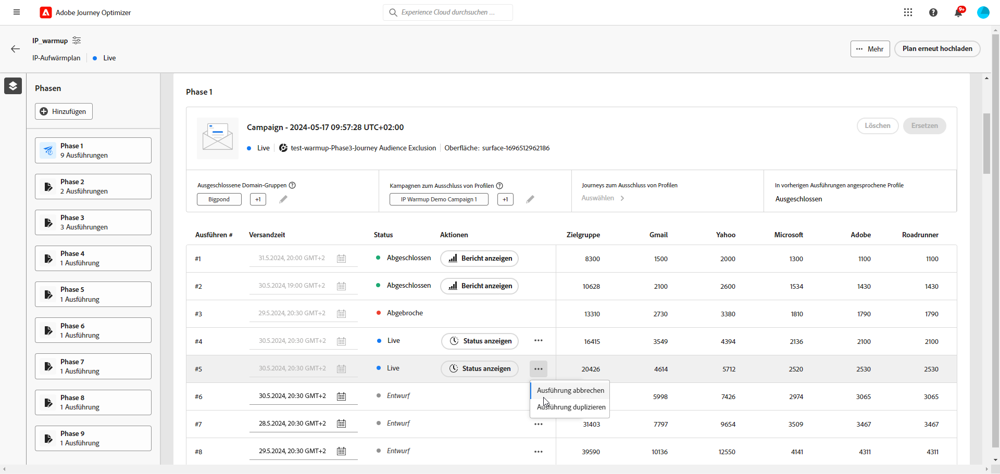

1. Um einen Entwurf, eine Live-Ausführung oder eine abgeschlossene Ausführung zu duplizieren, wählen Sie **[!UICONTROL Ausführung duplizieren]**. Nach der Duplizierung wird das Menü Ausführen bearbeiten angezeigt, über das die Benutzer die **[!UICONTROL Zielprofile insgesamt]** und die **[!UICONTROL Versandzeit]** nach Bedarf anpassen können.

   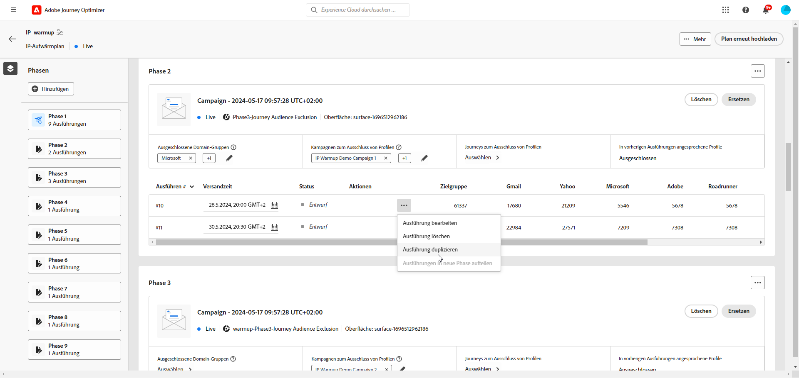

## Durchgänge aktivieren {#activate-run}

Um einen Durchlauf zu aktivieren, klicken Sie auf die Schaltfläche **[!UICONTROL Aktivieren]**. Dann können Sie die nächsten Ausführungen täglich aktivieren.

Wenn Sie mehrere IP-Aufwärmpläne gleichzeitig ausführen, die alle auf denselben IP-Pool und dieselben Domains abzielen, ist es wichtig, die möglichen Folgen zu antizipieren. Wenn beispielsweise ein ISP ein tägliches Limit von 100 E-Mails erzwingt, kann die Ausführung mehrerer Pläne, die auf dieselben Domains abzielen, diesen Schwellenwert überschreiten.

Vergewissern Sie sich, dass Sie genügend Zeit eingeplant haben, um die [Zielgruppenbewertung](https://experienceleague.adobe.com/docs/experience-platform/segmentation/home.html?lang=de#how-segmentation-works){target="_blank"} auszuführen.

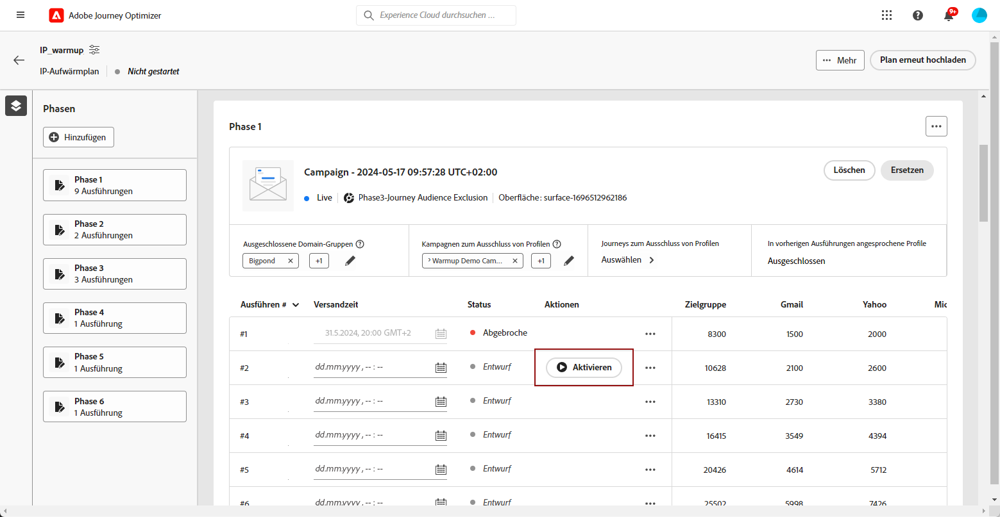

>[!CAUTION]
>
>Jeder Durchlauf muss mindestens 12 Stunden vor der tatsächlichen Versandzeit und vor dem täglichen Batch-Segmentierungsauftrag aktiviert werden. Andernfalls wird die Zielgruppenauswertung möglicherweise nicht abgeschlossen.

Beim Aktivieren eines Laufs werden automatisch mehrere Zielgruppen erstellt.

* Beim Aktivieren des ersten Durchgangs einer Phase:

   * Für [&#x200B; ausgeschlossenen Kampagnen](https://experienceleague.adobe.com/docs/experience-platform/segmentation/ui/segment-builder.html?lang=de){target="_blank"}Audiences (sofern vorhanden) wird eine „Audience“ mit der folgenden Namenskonvention erstellt: `<warmupName>-Phase<phaseNo>-Audience Exclusion`.

   * Für die ausgeschlossenen Domain-Gruppen (falls vorhanden) wird eine Zielgruppe mit der folgenden Namenskonvention erstellt: `<warmupName>-Phase<phaseNo>-Domain Exclusion`.

   * Für die ausgeschlossenen Journey-Zielgruppen (falls vorhanden) wird eine weitere Zielgruppe mit der folgenden Namenskonvention erstellt: `<warmupName>-Phase<phaseNo>-Journey Audience Exclusion`.

  >[!NOTE]
  >
  >Die Zielgruppen werden bereinigt, nachdem der Aufwärmplan als abgeschlossen markiert wurde.
  >
  >Das System erstellt keine neue Zielgruppe, wenn sich die ausgeschlossenen Kampagnengruppen, ausgeschlossenen Journey-Zielgruppen oder Domain-Gruppen für nachfolgende Phasen nicht ändern.

* Beim Aktivieren einer beliebigen Ausführung:

   * Für den letzten Interaktionsfilter wird eine weitere Zielgruppe mit der folgenden Namenskonvention erstellt: `<warmupName>-Phase<phaseNo>_Run<runNo>-Engagement Filter`.

     >[!NOTE]
     >
     >Die Zielgruppe wird bereinigt, nachdem der Aufwärmplan als abgeschlossen markiert wurde.
     >
     >Das System erstellt keine neue Zielgruppe, wenn sich der letzte Interaktionsfilter für nachfolgende Phasen nicht ändert.

   * Eine [Zielgruppenkomposition](https://experienceleague.adobe.com/docs/experience-platform/segmentation/ui/audience-composition.html?lang=de){target="_blank"} wird entsprechend der Zielgruppe erstellt, an die die Kampagne gesendet wird, und zwar mit der folgenden Namenskonvention: `<warmupName>-Phase<phaseNo>-Run<runNo>`.

     >[!NOTE]
     >
     >Für jede Ausführung wird eine neue Zielgruppenkomposition erstellt. Mit einem Limit von 10 müssen Benutzende, die mehrere Kampagnen, Journey- und IP-Aufwärmpläne gleichzeitig ausführen und veröffentlichte Zielgruppenkompositionen verwenden, im Voraus planen, für parallele Vorgänge innerhalb dieses Limits zu bleiben.
     >
     >Die Audience-Komposition (und damit die Ausgabe-Audience) wird bereinigt, wenn die nächste Iteration aktiviert wird.

   * Eine Output-Zielgruppe wird mit der folgenden Namenskonvention erstellt: `IP Warmup Audience-<warmupName>-Phase<phaseNo>-Run<runNo>`.

<!--How do you know when segmentation is complete? Is there a way to prevent user from scheduling less than 12 hours before the segmentation job?-->

<!--Sart to execute on every day basis by simply clicking the play button > for each run? do you have to come back every day to activate each run? or can you schedule them one after the other?)-->

<!--Upon activation, when the segment evaluation happens, more segments will be created by the IP warmup service and will be leveraged in an audience composition and a new audience will be created for each run splitted into the different selected domains.-->

## Plan überwachen {#monitor-plan}

Um Ihren IP-Aufwärmplan erfolgreich auszuführen, müssen Sie die Berichte überwachen, Ausführungen aktivieren und ihren Status täglich überprüfen.

### Verwenden des Abschnitts „Highlights“ {#highlights}

Sobald der erste Durchlauf für eine Phase aktiviert ist, wird der Abschnitt **[!UICONTROL Highlights]** angezeigt.

Er bietet einen schnellen Überblick über den aktuellen Durchgang und den bevorstehenden Durchgang. In diesem Abschnitt können Sie auch die nächste Ausführung bearbeiten und aktivieren.

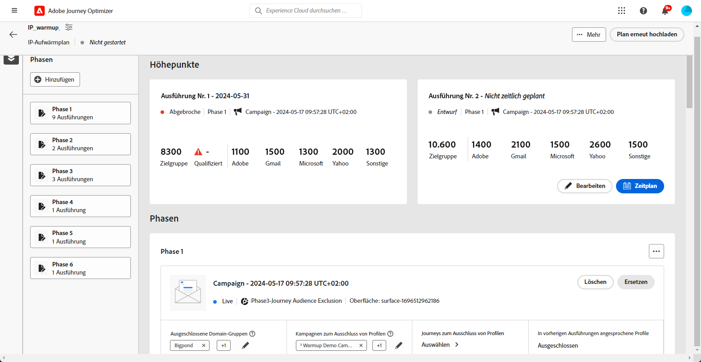

### Überprüfen der Ausführungsstatus {#run-statuses}

Der IP-Aufwärmplan selbst dient als konsolidierter Bericht an einem einzigen Ort. Sie können Elemente wie die Anzahl der Ausführungen **[!UICONTROL Live]** oder **[!UICONTROL Completed]** für jede Phase überprüfen und sehen, wie Ihr IP-Aufwärmplan voranschreitet.

>[!NOTE]
>
>Als Best Practice wird empfohlen, Ihren IP-Aufwärmplan täglich zu überwachen.

Eine Ausführung kann die folgenden Status aufweisen:

* **[!UICONTROL Entwurf]** : Jedes Mal, wenn ein Durchgang erstellt wird, sei [&#x200B; beim Erstellen eines neuen Plans &#x200B;](ip-warmup-plan.md) beim [Hinzufügen eines &#x200B;](#define-runs) über die Benutzeroberfläche, wird der Status **[!UICONTROL Entwurf]** angenommen.
* **[!UICONTROL Live]**: Jedes Mal, wenn Sie eine Ausführung aktivieren, wird der Status **[!UICONTROL Live]** angenommen. Das bedeutet, dass das System die Anforderung zum Planen des Durchgangs akzeptiert hat und nicht, dass der Versand gestartet wurde. In dieser Phase können Sie den Status des Live-Durchgangs sehen, indem Sie in der Tabelle auf **[!UICONTROL Status anzeigen]** klicken. Auf diese Weise können Sie verfolgen, wie viele Zielgruppenprofile sich tatsächlich qualifiziert haben.
* **[!UICONTROL Abgeschlossen]**: Die Kampagnenausführung für diesen Durchgang ist abgeschlossen. Sie können auf einen detaillierten Ausführungsbericht zugreifen, indem Sie auf die Schaltfläche **[!UICONTROL Bericht anzeigen]** in der Tabelle klicken. Mit dieser Option können Sie den E-Mail-Versandstatus der Ausführung verfolgen, einschließlich Aufschlüsselungen speziell für Domain-Gruppen, um die Überwachung zu verbessern. Beachten Sie, dass die damit verknüpfte Kampagne als Gestoppt festgelegt wird[Weitere Informationen](#reports)
* **[!UICONTROL Abgebrochen]**: Ein **[!UICONTROL Live]**-Durchlauf wurde mit der Schaltfläche **[!UICONTROL Abbrechen]** abgebrochen.[Weitere Informationen](#define-runs)
* **[!UICONTROL Fehlgeschlagen]**: Das System hat einen Fehler festgestellt, die für die aktuelle Phase verwendete Kampagne wurde gestoppt oder Sie haben die Option **[!UICONTROL Aktivierte Ausführungen im Fehlerfall abbrechen]** aktiviert und einen Fehler ausgegeben. Wenn ein Lauf fehlschlägt, können Sie einen weiteren Lauf für den nächsten Tag planen.

### Verwenden von Berichten {#reports}

Um die Wirkung Ihres Plans zu messen, können Sie ganz allgemein die Leistung Ihrer IP-Aufwärmkampagnen mithilfe der [!DNL Journey Optimizer] Kampagnenberichte überprüfen. Klicken Sie dazu für jeden abgeschlossenen Durchgang auf die Schaltfläche **[!UICONTROL Berichte anzeigen]**. Erfahren Sie mehr über den E-Mail[Live-](../reports/campaign-live-report.md#email-live) und den [Customer Journey Analytics-Bericht](../reports/campaign-global-report-cja-email.md).

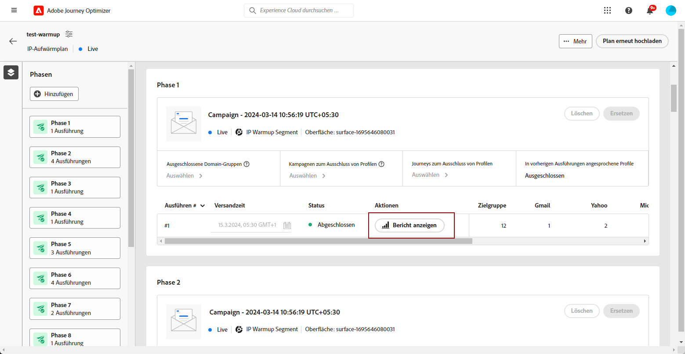

Sie können auf die Berichte auch über das Menü [Kampagnen](../campaigns/manage-campaigns.md#access) zugreifen, da Ihr Plan möglicherweise andere Kampagnen verwendet. [In → anzeigen](../campaigns/manage-campaigns.md#calendar)

## Plan verwalten {#manage-plan}

Wenn Ihr IP-Aufwärmplan nicht wie erwartet funktioniert, können Sie jederzeit die folgenden Aktionen durchführen.

### Phase teilen {#split-phase}

Wenn Sie eine neue Phase hinzufügen möchten, die von einer bestimmten Ausführung beginnt, wählen Sie die Option **[!UICONTROL Verläufe in eine neue Phase aufteilen]** über das Symbol Mehr Aktionen aus.

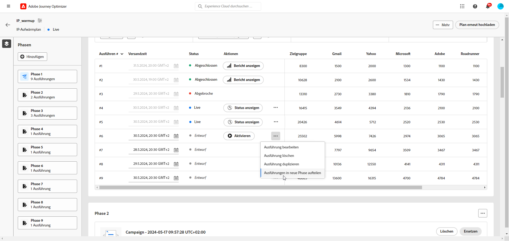

Für die verbleibenden Ausführungen der aktuellen Phase wird eine neue Phase erstellt.

Wenn Sie diese Option beispielsweise für #4 auswählen, werden #4 bis #8 Ausführungen direkt nach der aktuellen Phase in eine neue Phase verschoben.

Führen Sie die oben [&#x200B; Schritte aus](#define-phases) um die neue Phase zu definieren.

* Sie können die Optionen **[!UICONTROL Ersetzen]** oder **[!UICONTROL Löschen]** für diese neue Phase verwenden.

* Sie können auch die vorherige Kampagne oder eine Domain ausschließen, die nicht gut funktioniert. Weitere Informationen hierzu finden [&#x200B; in diesem Abschnitt](#define-phases).

<!--
You do not have to decide the campaign upfront. You can do a split later. It's a work in progress plan: you activate one run at a time with a campaign and you always have the flexibility to modify it while working on it.

But need to explain in which case you want to modify campaigns, provide examples
-->

### IP-Aufwärmplan erneut hochladen {#re-upload-plan}

Wenn Ihr IP-Aufwärmplan nicht die erwartete Leistung zeigt (z. B. wenn Sie feststellen, dass einige ISPs Ihre Nachrichten als Spam markieren), können Sie Ihren Zustellbarkeitsexperten bitten, eine andere IP-Aufwärmplandatei einzurichten und sie mit der entsprechenden Schaltfläche erneut hochzuladen.

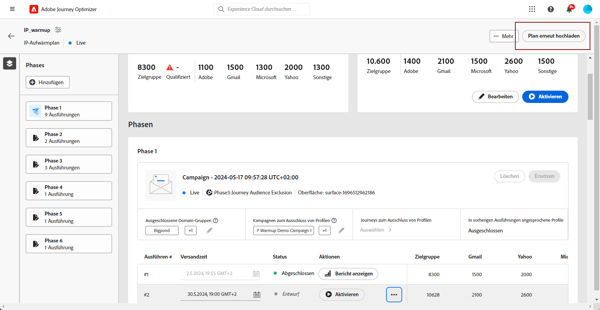

Alle zuvor ausgeführten Ausführungen sind schreibgeschützt. Der neue Plan wird unter dem ersten Plan angezeigt.

Gehen Sie wie [&#x200B; vor](#define-phases) um die Phasen des neuen Plans zu definieren.

>[!NOTE]
>
>Die Details des IP-Aufwärmplans ändern sich entsprechend der neu hochgeladenen Datei. Die zuvor ausgeführten Durchgänge (unabhängig von ihrem [Status](#monitor-plan) sind davon nicht betroffen.

Nehmen wir ein Beispiel:

* Mit dem ursprünglichen IP-Aufwärmplan hatte Phase 2 neun Durchläufe.

* 4 Durchgänge wurden ausgeführt (egal ob fehlgeschlagen, abgeschlossen oder abgebrochen<!--as long as a run has been attempted, it is an executed run-->).

* Wenn Sie einen neuen Plan erneut hochladen, wird Phase 2 mit den ersten 4 ausgeführten Ausführungen in den schreibgeschützten Modus wechseln.

* Die verbleibenden 5 Durchgänge (die sich im Entwurfsstatus befinden) werden in eine neue Phase (Phase 3) verschoben, die gemäß dem neu hochgeladenen Plan angezeigt wird.

### Plan als abgeschlossen markieren {#mark-as-completed}

Wenn Ihre IPs mit dem gewünschten Volumen aufgewärmt wurden oder Ihr Plan nicht gut genug funktioniert oder Sie ihn fallen lassen möchten, um ein weiteres zu erstellen, können Sie ihn als abgeschlossen markieren.

Klicken Sie dazu auf die Schaltfläche **[!UICONTROL Mehr]** oben rechts im IP-Aufwärmplan und wählen Sie **[!UICONTROL Als abgeschlossen markieren]**.

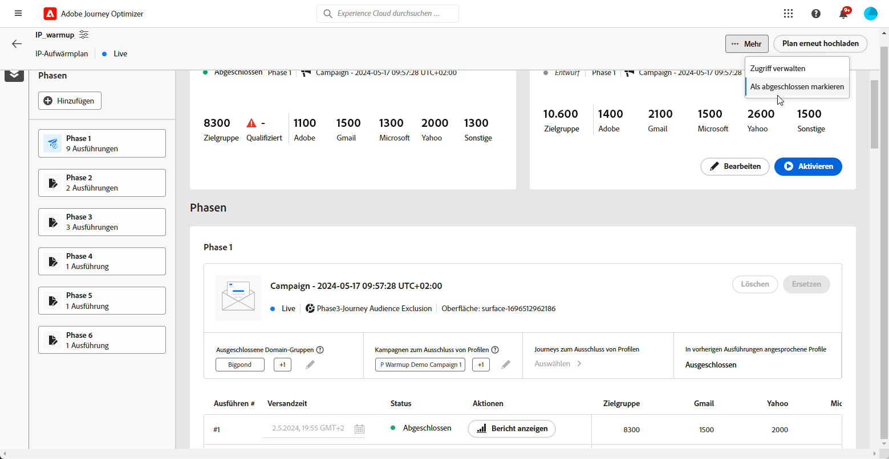

Diese Option ist nur verfügbar, wenn alle Ausführungen im Plan den Status **[!UICONTROL Abgeschlossen]** oder **[!UICONTROL Entwurf]** aufweisen. Wenn ein Durchlauf **[!UICONTROL Live]** ist, ist die Option ausgegraut.

Die verschiedenen Ausführungsstatus werden in [diesem Abschnitt) &#x200B;](#monitor-plan).

