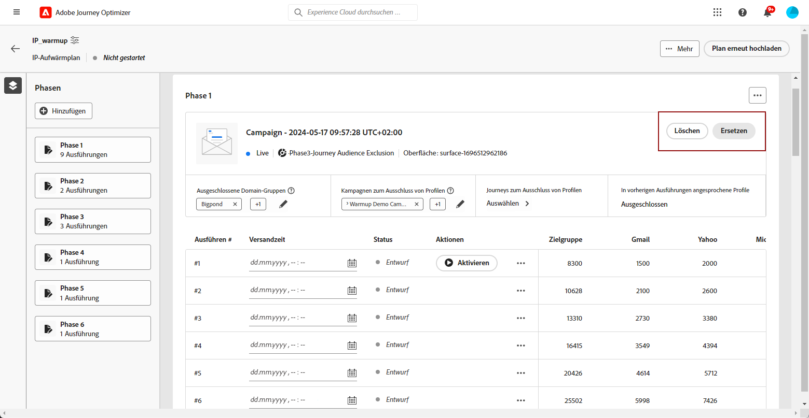

# Ausführen des IP-Aufwärmplans {#ip-warmup-running}

>[!BEGINSHADEBOX]

Inhalt dieses Dokumentationshandbuchs:

* [Erste Schritte mit IP-Aufwärmen](ip-warmup-gs.md)
* [Erstellen von IP-Aufwärmkampagnen](ip-warmup-campaign.md)
* [Erstellen eines IP-Aufwärmplans](ip-warmup-plan.md)
* **[Ausführen des IP-Aufwärmplans](ip-warmup-execution.md)**

>[!ENDSHADEBOX]

Wenn Sie [einen IP-Aufwärmplan erstellt haben](ip-warmup-plan.md) und die Datei hochgeladen haben, die Sie mit Ihren Fachleuten für Zustellbarkeit vorbereitet haben, können Sie die Phasen und Ausführungen Ihres Plans definieren.

Jede Phase besteht aus mehreren Ausführungen, denen Sie eine einzelne Kampagne zuweisen.

## Definieren der Phasen {#define-phases}

>[!CONTEXTUALHELP]
>id="ajo_admin_ip_warmup_campaigns_excluded"
>title="Ausschließen von Kampagnenzielgruppen"
>abstract="Wählen Sie Kampagnen aus, um ihre Zielgruppen aus der aktuellen Phase auszuschließen. Dadurch soll verhindert werden, dass zuvor kontaktierte Profile aus anderen Phasen oder anderen IP-Aufwärmplänen erneut angesprochen werden."

>[!CONTEXTUALHELP]
>id="ajo_admin_ip_warmup_domains_excluded"
>title="Ausschließen von Domain-Gruppen"
>abstract="Wählen Sie die Domains aus, die Sie aus der aktuellen Phase ausschließen möchten. Der Ausschluss von Domains erfordert eine nicht ausgeführte Phase, daher müssen Sie möglicherweise eine laufende Phase aufteilen, um Ausschlüsse hinzuzufügen."
>additional-url="https://experienceleague.adobe.com/docs/journey-optimizer/using/configuration/implement-ip-warmup-plan/ip-warmup-execution.html?lang=de#split-phase" text="Aufspalten einer Phase"

>[!CONTEXTUALHELP]
>id="ajo_admin_ip_warmup_phases"
>title="Definieren der Phasen Ihres Plans"
>abstract="Jede Phase besteht aus mehreren Ausführungen, denen Sie eine einzelne Kampagne zuweisen."

<!--You need to associate the campaign and audience at phase level and turns on some settings as needed for all runs associated with a single creative/campaign

At phase level, system ensures that previously targeted + new profiles are picked up AND at iteration level, system ensures that each run is having unique profiles and the count matches what is stated in plan-->

<!---->

1. Wählen Sie für jede Phase die Kampagne aus, die Sie mit dieser Phase des IP-Aufwärmplans verbinden möchten.

   >[!NOTE]
   >
   >Eine Kampagne, die bereits in einem anderen IP-Aufwärmplan verwendet wird, kann nicht ausgewählt werden. Dieselbe Kampagne kann jedoch in einer oder mehreren Phasen desselben IP-Aufwärmplans verwendet werden.

   

   >[!IMPORTANT]
   >
   >* Nur Kampagnen, für die die Option **[!UICONTROL Aktivierung des IP-Aufwärmplans]** aktiviert ist, stehen zur Auswahl zur Verfügung. [Weitere Informationen](#create-ip-warmup-campaign)
   >
   >* Sie müssen eine Kampagne auswählen, die dieselbe Oberfläche wie die für den aktuellen IP-Aufwärmplan ausgewählte Oberfläche verwendet.

1. Sobald eine Kampagne für die aktuelle Phase ausgewählt wurde, werden die Abschnitte zum Ausschließen von Profilen, Kampagnenzielgruppen und Domain-Gruppen angezeigt.

   >[!NOTE]
   >
   >Nachdem eine Ausführung aktiviert wurde, können Ausschlüsse nur geändert werden, wenn Sie [die Ausführung in eine neue Phase aufteilen](#split-phase).

   1. Im Abschnitt **[!UICONTROL Profilausschluss]** können Sie sehen, dass die Profile aus den vorherigen Ausführungen dieser Phase immer ausgeschlossen sind. Wenn beispielsweise in der Ausführung Nr. 1 ein Profil aus den ersten 4800 angesprochenen Personen behandelt wurde, stellt das System automatisch sicher, dass dasselbe Profil die E-Mail in Ausführung Nr. 2 nicht erhält.

      >[!NOTE]
      >
      >Dieser Abschnitt kann nicht bearbeitet werden.

   1. Wählen Sie im Abschnitt **[!UICONTROL Ausgeschlossene Kampagnenzielgruppen]** die Kampagnen, deren Zielgruppen Sie aus der aktuellen Phase ausschließen möchten.

      

      Zum Beispiel: Sie mussten bei der Ausführung von Phase 1 aus irgendeinem Grund die Phase [aufteilen](#split-phase). Daher können Sie die in Phase 1 verwendete Kampagne ausschließen, sodass die zuvor kontaktierten Profile aus Phase 1 nicht in Phase 2 eingeschlossen sind. Sie können auch Kampagnen aus anderen IP-Aufwärmplänen ausschließen.

   1. Wählen Sie im Abschnitt **[!UICONTROL Ausgeschlossene Domain-Gruppen]** die Domains aus, die Sie aus der Phase ausschließen möchten.

      >[!NOTE]
      >
      >Der Ausschluss von Domains erfordert eine nicht ausgeführte Phase, daher müssen Sie möglicherweise [eine laufende Phase aufteilen](#split-phase), um Ausschlüsse hinzuzufügen.

      

      Zum Beispiel: Sie haben einige Tage lang ein IP-Aufwärmen ausgeführt und Sie erkennen, dass Ihr ISP-Ruf bei einer Domain (z. B. Adobe) nicht gut ist. Sie möchten dies beheben, ohne Ihren IP-Aufwärmplan zu stoppen. In einem solchen Fall können Sie die Adobe-Domain-Gruppe ausschließen.

      >[!NOTE]
      >
      >Sie können nur eine (standardmäßige oder benutzerdefinierte) Domain-Gruppe ausschließen, die zur [Vorlage für IP-Aufwärmplan](ip-warmup-plan.md#prepare-file) hinzugefügt wurde. Andernfalls müssen Sie die Vorlage mit der Domain-Gruppe aktualisieren, die Sie ausschließen möchten, und [den Plan erneut hochladen](#re-upload-plan).

1. Bei Bedarf können Sie die Kampagne über die Option **[!UICONTROL Kampagne ersetzen]** austauschen.

   

   >[!NOTE]
   >
   >Dieser Vorgang kann nur vor der ersten Ausführung der Phase ausgeführt werden. Nach der Aktivierung einer Ausführung kann die Kampagne nur ersetzt werden, wenn Sie [die Ausführung in eine neue Phase aufteilen](#split-phase).

1. Sie können bei Bedarf eine Phase hinzufügen. Sie wird nach der letzten aktuellen Phase hinzugefügt.

   

1. Verwenden Sie die Schaltfläche **[!UICONTROL Phase löschen]**, um alle unerwünschten Phasen zu entfernen. Dieser Vorgang ist nur verfügbar, wenn in einer Phase keine Ausführung stattgefunden hat. <!--Once a run is executed, deletion is not allowed.-->

   >[!CAUTION]
   >
   >Sie können die Aktion **[!UICONTROL Löschen]** nicht rückgängig machen.

   

   >[!NOTE]
   >
   >Wenn Sie alle Phasen aus dem IP-Aufwärmplan löschen, wird empfohlen, einen Plan erneut hochzuladen. [Weitere Informationen](#re-upload-plan)

## Definieren der Ausführungen {#define-runs}

>[!CONTEXTUALHELP]
>id="ajo_admin_ip_warmup_run"
>title="Definieren jeder Ausführung"
>abstract="Definieren und aktivieren Sie jede Auführung für alle Phasen."

>[!CONTEXTUALHELP]
>id="ajo_admin_ip_warmup_last_engagement"
>title="Nach Interaktion filtern"
>abstract="Diese Spalte ist ein Filter, der nur auf die Benutzerinnen und Benutzer abzielt, die beispielsweise in den letzten 20 Tagen mit Ihrer Marke interagiert haben. Sie können diese Einstellung auch über die Option **Ausführen bearbeiten** ändern."

>[!CONTEXTUALHELP]
>id="ajo_admin_ip_warmup_retry"
>title="Festlegen eines Zeitfensters"
>abstract="Sie können ein Zeitfenster definieren, in dem die IP-Aufwärmkampagne ausgeführt werden kann, falls sich der Segmentierungsvorgang verzögert."

>[!CONTEXTUALHELP]
>id="ajo_admin_ip_warmup_pause"
>title="Ausführungen mit Zielgruppenfehlern abbrechen"
>abstract="Wählen Sie diese Option, um eine Ausführung abzubrechen, wenn die qualifizierten Profile weniger sind als die angesprochenen Zielgruppenprofile, sobald die Zielgruppe für diese Ausführung ausgewertet wurde."

>[!CONTEXTUALHELP]
>id="ajo_admin_ip_warmup_qualified"
>title="Anzeigen der qualifizierten Profile"
>abstract="In dieser Spalte wird die Anzahl der qualifizierten Profile angezeigt. Wenn die Zielgruppe für eine Ausführung ausgewertet wurde und mehr angesprochene als qualifizierte Profile vorhanden sind, wird die Ausführung weiterhin durchgeführt, es sei denn, die Option **Pausierung wegen Fehlern** ist aktiviert. In diesem Fall wird die Ausführung abgebrochen."

1. Wählen Sie für jede Ausführung einen Zeitplan aus, um sicherzustellen, dass sie zum angegebenen Zeitpunkt durchgeführt wird.

   

1. Optional können Sie ein Zeitfenster definieren, in dem die IP-Aufwärmkampagne ausgeführt werden kann, falls sich die [Zielgruppenbewertung](https://experienceleague.adobe.com/docs/experience-platform/segmentation/home.html?lang=de#how-segmentation-works){target="_blank"} verzögert. Klicken Sie dazu auf das Symbol „Eigenschaften“ oben links neben dem Namen des Plans und verwenden Sie die Dropdown-Liste **[!UICONTROL Zeit bis zu erneuter Ausführung]**, um eine Dauer auszuwählen – bis zu 240 Minuten (4 Stunden).

   

   Wenn Sie beispielsweise eine Sendezeit für einen bestimmten Tag auf 9:00 Uhr und als Wartezeit für einen erneuten Versuch 120 Minuten festlegen, können Sie bei unerwarteten Verzögerungen bei der Zielgruppenbewertung ein Zeitfenster von 2 Stunden (9:00 – 11:00 Uhr) für die Ausführung nutzen.

   >[!NOTE]
   >
   >Wenn kein Zeitfenster angegeben ist, wird die Ausführung zum Versandzeitpunkt gestartet und schlägt fehl, falls die Bewertung der Zielgruppe nicht abgeschlossen ist.

1. Wählen Sie bei Bedarf **[!UICONTROL Ausführen bearbeiten]** über das Symbol „Mehr Aktionen“ aus. Dort können Sie die Anzahl der Adressen in jeder Spalte aktualisieren. Sie können auch das Feld **[!UICONTROL Letzte Interaktion]** aktualisieren, um beispielsweise nur die Benutzerinnen und Benutzer anzusprechen, die in den letzten 20 Tagen mit Ihrer Marke interagiert haben.

   >[!NOTE]
   >
   >Es wird empfohlen, diese Zahlen in Absprache mit Ihren Zustellbarkeitsfachleuten zu ändern.

   

   >[!NOTE]
   >
   >Wenn Sie keinen Interaktionszeitraum auf eine Ausführung anwenden möchten, geben Sie 0 in das Feld **[!UICONTROL Letzte Interaktion]** ein.

1. Wählen Sie die Option **[!UICONTROL Für Fehler pausieren]** aus, um eine Ausführung abzubrechen, wenn die qualifizierten Profile weniger sind als die Zielgruppenprofile, nachdem die Zielgruppe für diese Ausführung ausgewertet wurde. In diesem Fall hat die Ausführung den Status **[!UICONTROL Fehlgeschlagen]** .

   

1. **[!UICONTROL Aktivieren]** Sie die Ausführung. [Weitere Informationen](#activate-run)

1. Der Status dieser Ausführung ändert sich in **[!UICONTROL Live]**, was bedeutet, dass das System die Anfrage zur Planung der Ausführung akzeptiert hat.

   >[!NOTE]
   >
   >Die verschiedenen Ausführungsstatus werden in [diesem Abschnitt](#monitor-plan) aufgeführt.

1. Wenn die Ausführung der Kampagne noch nicht gestartet wurde, können Sie eine Ausführung stoppen, die gerade aktiv ist. Mit dieser Aktion wird der Ausführungsplan abgebrochen, der Versand jedoch nicht gestoppt.

   

   >[!NOTE]
   >
   >Sobald die Kampagnenausführung gestartet wurde, ist die Schaltfläche **[!UICONTROL Stoppen]** nicht mehr verfügbar.

1. Um eine Ausführung hinzuzufügen, wählen Sie **[!UICONTROL Ausführung unten hinzufügen]** über das Symbol „Weitere Aktionen“.

   

## Aktivieren von Ausführungen {#activate-run}

Um eine Ausführung zu aktivieren, wählen Sie die Schaltfläche **[!UICONTROL Aktivieren]** aus. Dann können Sie die nächsten Ausführungen täglich aktivieren.

Achten Sie darauf, dass Sie ausreichend Zeit für die Ausführung der [Zielgruppenbewertung](https://experienceleague.adobe.com/docs/experience-platform/segmentation/home.html?lang=de#how-segmentation-works){target="_blank"} eingeplant haben.

>[!CAUTION]
>
>Jede Ausführung muss mindestens 12 Stunden vor der tatsächlichen Versandzeit aktiviert werden. Andernfalls kann die Zielgruppenbewertung möglicherweise nicht abgeschlossen werden.

Wenn Sie eine Ausführung aktivieren, werden automatisch mehrere Zielgruppen erstellt.

* Wenn Sie die erste Ausführung einer Phase aktivieren:

   * Es wird eine [Zielgruppe](https://experienceleague.adobe.com/docs/experience-platform/segmentation/ui/segment-builder.html?lang=de){target="_blank"} für die ausgeschlossenen Kampagnenzielgruppen (sofern vorhanden) mit folgender Namenskonvention erstellt: `<warmupName>_Phase<phaseNo>-Audience Exclusion`.

   * Es wird eine weitere Zielgruppe für die ausgeschlossenen Domain-Gruppen (sofern vorhanden) mit folgender Namenskonvention erstellt: `<warmupName>_Phase<phaseNo>-Domain Exclusion`.

  >[!NOTE]
  >
  >Die Zielgruppen werden bereinigt, nachdem der Aufwärmplan als abgeschlossen markiert wurde.
  >
  >Das System erstellt keine neue Zielgruppe, wenn sich die ausgeschlossenen Kampagnenzielgruppen oder Domain-Gruppen in den nachfolgenden Phasen nicht ändern.

* Beim Aktivieren einer Ausführung:

   * Für den letzten Interaktionsfilter wird eine weitere Zielgruppe mit folgender Namenskonvention erstellt: `<warmupName>_Phase<phaseNo>_Run<runNo>-Engagement Filter`.

     >[!NOTE]
     >
     >Die Zielgruppe wird bereinigt, nachdem der Aufwärmplan als abgeschlossen markiert wurde.
     >
     >Das System erstellt keine neue Zielgruppe, wenn sich der letzte Interaktionsfilter in den nachfolgenden Phasen nicht ändert.

   * Entsprechend der Zielgruppe, an die die Kampagne gesendet wird, wird eine [Zielgruppenkomposition](https://experienceleague.adobe.com/docs/experience-platform/segmentation/ui/audience-composition.html?lang=de){target="_blank"} mit folgender Namenskonvention erstellt: `<warmupName>-Phase<phaseNo>-Run<runNo>`.

     >[!NOTE]
     >
     >Für jede Ausführung wird eine neue Zielgruppenkomposition erstellt.
     >
     >Die Zielgruppenkomposition (und damit die Ausgabe-Zielgruppe) wird bei der Aktivierung der nächsten Iteration bereinigt.

<!--How do you know when segmentation is complete? Is there a way to prevent user from scheduling less than 12 hours before the segmentation job?-->

<!--Sart to execute on every day basis by simply clicking the play button > for each run? do you have to come back every day to activate each run? or can you schedule them one after the other?)-->

<!--Upon activation, when the segment evaluation happens, more segments will be created by the IP warmup service and will be leveraged in an audience composition and a new audience will be created for each run splitted into the different selected domains.-->

## Überwachen des Plans {#monitor-plan}

Um Ihren IP-Aufwärmplan erfolgreich ausführen zu können, müssen Sie die Berichte überwachen, die Ausführungen aktivieren und ihren Status täglich überprüfen.

### Arbeiten mit dem Abschnitt „Hervorhebungen“ {#highlights}

Sobald die erste Ausführung einer Phase aktiviert wurde, wird der Abschnitt **[!UICONTROL Hervorhebungen]** angezeigt.

Er bietet einen schnellen Überblick über die aktuelle und die bevorstehende Ausführung. In diesem Abschnitt können Sie auch die nächste Ausführung bearbeiten und aktivieren.

### Überprüfen des Ausführungsstatus {#run-statuses}

Der IP-Aufwärmplan selbst dient auch als zentraler konsolidierter Bericht. Sie können Elemente wie die Anzahl der **[!UICONTROL Live]**- oder **[!UICONTROL abgeschlossenen]** Ausführungen für jede Phase überprüfen und anzeigen, wie der IP-Aufwärmplan voranschreitet.

>[!NOTE]
>
>Als Best Practice wird empfohlen, Ihren IP-Aufwärmplan täglich zu überwachen.

Eine Ausführung kann folgende Status haben:

* **[!UICONTROL Entwurf]** : Sobald eine Ausführung erstellt wurde, entweder durch [Einen neuen Plan erstellen](ip-warmup-plan.md) oder durch [Einen Vorgang hinzufügen](#define-runs) von der Benutzeroberfläche aus, erhält sie den Status **[!UICONTROL Entwurf]**.
* **[!UICONTROL Live]**: Sobald eine Ausführung aktiviert wurde, erhält sie den Status **[!UICONTROL Live]**. Das bedeutet, dass das System die Anfrage zur Planung der Ausführung akzeptiert hat, aber nicht, dass der Versand gestartet wurde.
* **[!UICONTROL Abgeschlossen]**: Die Kampagnenausführung für diese Ausführung ist abgeschlossen. <!--i.e. campaign execution has started, no error happened and emails have reached users? to check with Sid-->
* **[!UICONTROL Abgebrochen]**: Eine **[!UICONTROL Live-Ausführung]** wurde mit der Schaltfläche **[!UICONTROL Stoppen]** angehalten oder Sie haben die Option **[!UICONTROL Wegen Fehlern pausieren]** aktiviert und es ist ein Fehler aufgetreten. [Weitere Informationen](#define-runs)
* **[!UICONTROL Fehlgeschlagen]**: Beim System ist ein Fehler aufgetreten oder die in der aktuellen Phase verwendete Kampagne wurde gestoppt. Wenn eine Ausführung fehlschlägt, können Sie eine weitere Ausführung für den nächsten Tag planen.

### Arbeiten mit Berichten {#reports}

Ganz allgemein können Sie die Auswirkung Ihres Plans messen, indem Sie die Leistung Ihrer IP-Aufwärmkampagnen mithilfe der [!DNL Journey Optimizer]-Kampagnenberichte überprüfen. Dazu können Sie für jede abgeschlossene Ausführung auf die Schaltfläche **[!UICONTROL Berichte anzeigen]** klicken. Weitere Informationen zu den [Live-Berichten](../reports/campaign-live-report.md#email-live) und den [globalen Berichten](../reports/campaign-global-report.md#email-global) von Kampagnen-E-Mails.

Sie können auf die Berichte auch über das [Kampagnen-Menü](../campaigns/modify-stop-campaign.md#access) zugreifen, da Ihr Plan möglicherweise unterschiedliche Kampagnen beinhaltet.

## Verwalten Ihres Plans {#manage-plan}

Wenn Ihr IP-Aufwärmplan nicht die erwartete Leistung erzielt, können Sie die folgenden Maßnahmen ergreifen.

### Aufspalten einer Phase {#split-phase}

Wenn Sie eine neue Phase hinzufügen möchten, die ab einer bestimmten Ausführung beginnt, wählen Sie die Option **[!UICONTROL In neue Phase aufteilen]** über das Symbol „Weitere Aktionen“ aus.

Für die verbleibenden Ausführungen der aktuellen Phase wird eine neue Phase erstellt.

Wenn Sie beispielsweise diese Option für die Ausführung Nr. 4 auswählen, werden die Ausführungen Nr. 4 bis 8 direkt nach der aktuellen Phase in eine neue Phase verschoben.

Führen Sie die [obigen](#define-phases) Schritte aus, um die neue Phase zu definieren.

* Sie können für diese neue Phase die Option **[!UICONTROL Kampagne ersetzen]** verwenden.

* Sie können auch die vorherige Kampagne oder eine Domain ausschließen, die nicht gut abschneidet. Mehr dazu erfahren Sie in [diesem Abschnitt](#define-phases).

<!--
You don't have to decide the campaign upfront. You can do a split later. It's a work in progress plan: you activate one run at a time with a campaign and you always have the flexibility to modify it while working on it.

But need to explain in which case you want to modify campaigns, provide examples
-->

### Erneutes Hochladen eines IP-Aufwärmplans {#re-upload-plan}

Wenn der IP-Aufwärmplan nicht wie erwartet funktioniert (z. B. wenn Sie feststellen, dass einige ISPs Ihre Nachrichten als Spam markieren), können Sie eine Fachkraft für Zustellbarkeit bitten, eine weitere IP-Aufwärmplan-Datei einzurichten und sie über die entsprechende Schaltfläche erneut hochzuladen.

Alle zuvor ausgeführten Ausführungen sind schreibgeschützt. Der neue Plan wird im ersten Plan dargestellt.

Führen Sie die Schritte [oben](#define-phases) aus, um die Phasen des neuen Plans zu definieren.

>[!NOTE]
>
>Die Details des IP-Aufwärmplans ändern sich entsprechend der neu hochgeladenen Datei. Die zuvor ausgeführten Ausführungen (unabhängig von deren [Status](#monitor-plan)) sind nicht betroffen.

Nehmen wir ein Beispiel:

* Im ursprünglichen IP-Aufwärmplan hatte Phase 2 neun Ausführungen.

* Es gab vier Ausführungen (unabhängig davon, ob fehlgeschlagen, abgeschlossen oder abgebrochen)<!--as long as a run has been attempted, it is an executed run-->).

* Wenn ein neuer Plan erneut hochgeladen wird, wird Phase 2 mit den ersten vier ausgeführten Läufen in den schreibgeschützten Modus versetzt.

* Die verbleibenden fünf Ausführungen (die sich im Entwurfsstatus befinden) werden in eine neue Phase (Phase 3) verschoben, die gemäß dem neu hochgeladenen Plan angezeigt wird.

### Markieren eines Plans als abgeschlossen {#mark-as-completed}

Wenn das Ergebnis Ihres Plans nicht gut genug ist oder wenn Sie einen anderen Plan erstellen möchten, können Sie ihn als abgeschlossen markieren.

Klicken Sie dazu auf die Schaltfläche **[!UICONTROL Mehr]** oben rechts im IP-Aufwärmplan und wählen Sie **[!UICONTROL Als abgeschlossen markieren]** aus.

Diese Option ist nur verfügbar, wenn sich alle im Plan ausgeführten Ausführungen im Status **[!UICONTROL Abgeschlossen]** oder **[!UICONTROL Entwurf]** befinden. Wenn eine Ausführung **[!UICONTROL Live]** ist, ist die Option ausgegraut.

Die verschiedenen Ausführungsstatus werden in [diesem Abschnitt](#monitor-plan) aufgeführt.

