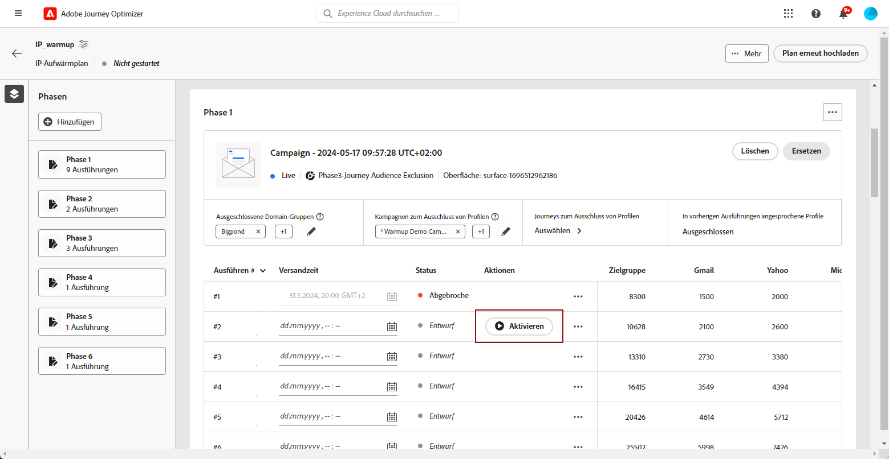

# Ausführen des IP-Aufwärmungsplans {#ip-warmup-running}

>[!BEGINSHADEBOX]

Inhalt dieses Dokumentationshandbuchs:

* [Erste Schritte mit IP-Wärme](ip-warmup-gs.md)
* [Erstellen von IP-Aufwärmekampagnen](ip-warmup-campaign.md)
* [Erstellen eines IP-Warmup-Plans](ip-warmup-plan.md)
* **[Ausführen des IP-Aufwärmungsplans](ip-warmup-execution.md)**

>[!ENDSHADEBOX]

Einmal [einen IP-Warmup-Plan erstellt hat](ip-warmup-plan.md) und die mit Ihrem Zustellbarkeitsberater vorbereitete Datei hochgeladen haben, können Sie die Phasen und Ausführungen Ihres Plans definieren.

Jede Phase besteht aus mehreren Ausführungen, denen Sie eine einzelne Kampagne zuweisen.

## Definieren der Phasen {#define-phases}

>[!CONTEXTUALHELP]
>id="ajo_admin_ip_warmup_campaigns_excluded"
>title="Ausschluss von Kampagnenzielgruppen"
>abstract="Wählen Sie die Zielgruppen aus anderen Kampagnen aus, die Sie aus der aktuellen Phase ausschließen möchten. Dadurch soll verhindert werden, dass zuvor kontaktierte Profile aus anderen Phasen oder anderen IP-Warmup-Plänen erneut angesprochen werden."

>[!CONTEXTUALHELP]
>id="ajo_admin_ip_warmup_domains_excluded"
>title="Ausschluss von Domain-Gruppen"
>abstract="Wählen Sie die Domänen aus, die Sie aus der aktuellen Phase ausschließen möchten. Der Domänenausschluss erfordert eine nicht ausgeführte Phase, daher müssen Sie möglicherweise eine laufende Phase aufteilen, um Ausschlüsse hinzuzufügen."
>additional-url="https://experienceleague.corp.adobe.com/docs/journey-optimizer/using/configuration/implement-ip-warmup-plan/ip-warmup-execution.html#split-phase" text="Aufspaltung einer Phase"

<!--You need to associate the campaign and audience at phase level and turns on some settings as needed for all runs associated with a single creative/campaign

At phase level, system ensures that previously targeted + new profiles are picked up AND at iteration level, system ensures that each run is having unique profiles and the count matches what is stated in plan-->

<!---->

1. Wählen Sie für jede Phase die Kampagne aus, die Sie mit dieser Phase des IP-Aufwärmungsplans verbinden möchten.

   

   Beachten Sie Folgendes:

   * Nur Kampagnen mit der **[!UICONTROL Aktivierung des IP-Warmlaufplans]** Option aktiviert <!--and live?--> stehen zur Auswahl zur Verfügung. [Weitere Informationen](#create-ip-warmup-campaign)

   * Sie müssen eine Kampagne auswählen, die dieselbe Oberfläche wie die für den aktuellen IP-Aufwärmplan ausgewählte verwendet.

   * Es ist nicht möglich, eine Kampagne auszuwählen, die bereits in einer anderen IP-Warmup-Kampagne verwendet wird.

1. Im **[!UICONTROL Profilausschluss]** -Abschnitt, können Sie sehen, dass die Profile aus den vorherigen Ausführungen dieser Phase immer ausgeschlossen sind. Wenn beispielsweise im Ausführen von #1 ein Profil in den ersten 4800 Zielgruppenempfängern behandelt wurde, stellt das System automatisch sicher, dass dasselbe Profil die E-Mail in Ausführung 2 nicht erhält.

1. Aus dem **[!UICONTROL Campaign-Zielgruppen ausgeschlossen]** die Zielgruppen aus anderen <!--executed/live?-->Kampagnen, die Sie aus der aktuellen Phase ausschließen möchten.

   

   Während der Ausführung von Phase 1 mussten Sie beispielsweise [teilen](#split-phase) aus irgendeinem Grund. Daher können Sie die in Phase 1 verwendete Kampagne ausschließen, sodass die zuvor kontaktierten Profile aus Phase 1 nicht in Phase 2 eingeschlossen sind. Sie können Kampagnen auch aus anderen IP-Aufwärmsplänen ausschließen.

1. Aus dem **[!UICONTROL Domänengruppen ausgeschlossen]** wählen Sie die Domänen aus, die Sie aus dieser Phase ausschließen möchten.

   >[!NOTE]
   >
   >Der Domänenausschluss erfordert eine nicht ausgeführte Phase, daher müssen Sie möglicherweise [Aufteilen einer Laufphase](#split-phase) um Ausschlüsse hinzuzufügen.

   

   Wenn Sie beispielsweise einige Tage lang IP-Warmup ausgeführt haben, erkennen Sie, dass Ihr ISP-Ruf bei einer Domain (z. B. Adobe) nicht gut ist und Sie dies beheben möchten, ohne Ihren IP-Warmup-Plan zu stoppen. In diesem Fall können Sie die Adobe-Domain-Gruppe ausschließen.

   >[!NOTE]
   >
   >Wenn es sich bei der Domäne nicht um eine native Domain-Gruppe handelt, müssen Sie sich an Ihren Zustellbarkeitsberater wenden, um diese Domäne zum [Datei mit IP-Warmup-Plan](ip-warmup-plan.md#prepare-file) und [erneut hochladen](#re-upload-plan) um diese Domäne ausschließen zu können.

1. Sie können bei Bedarf eine Phase hinzufügen. Sie wird nach der letzten aktuellen Phase hinzugefügt.

   

1. Verwenden Sie die **[!UICONTROL Löschphase]** -Schaltfläche, um alle unerwünschten Phasen zu entfernen.

   

   >[!CAUTION]
   >
   >Sie können die **[!UICONTROL Löschen]** Aktion.
   >
   >Wenn Sie alle Phasen aus dem IP-Warmup-Plan löschen, wird empfohlen, einen Plan erneut hochzuladen. [Weitere Informationen](#re-upload-plan)

## Definieren der Ausführungen {#define-runs}

1. Wählen Sie für jeden Lauf einen Zeitplan aus.

   

1. Optional können Sie ein Zeitfenster definieren, in dem die IP-Aufwärmekampagne ausgeführt werden kann, falls sich der Segmentierungsauftrag verzögert. Klicken Sie dazu auf das Symbol Eigenschaften oben links neben dem Namen des Plans und verwenden Sie die **[!UICONTROL Wiederkehrende Laufzeit]** aus der Dropdown-Liste eine Dauer bis zu 240 Minuten (4 Stunden) auswählen.

   

   Wenn Sie beispielsweise eine Sendezeit an einem bestimmten Tag um 21 Uhr festlegen und als Laufzeit für Wiederholungen 120 Minuten auswählen, können Sie so einen Zeitraum von 2 Stunden für die Ausführung des Segmentierungsauftrags festlegen.

   >[!NOTE]
   >
   >Wenn kein Zeitfenster angegeben ist, wird die Ausführung zum Versandzeitpunkt versucht und schlägt fehl, wenn der Segmentierungsauftrag nicht abgeschlossen ist.

1. Wählen Sie bei Bedarf **[!UICONTROL Ausführen bearbeiten]** über das Symbol Mehr Aktionen . Dort können Sie die Anzahl der Adressen in jeder Spalte aktualisieren. Sie können auch die **[!UICONTROL Letzte Interaktion]** -Feld, um beispielsweise nur die Benutzer anzusprechen, die in den letzten 20 Tagen mit Ihrer Marke interagiert haben.

   

1. Wählen Sie die **[!UICONTROL Pausierung für Fehler]** , wenn Sie die Ausführung anhalten möchten, falls ein Fehler auftritt.<!--can't see the Paused status for runs? Is it failed?-->

   

   Wenn beispielsweise nach Ausführung des Segmentierungsauftrags die gewünschte Anzahl Profile geringer als erwartet ist, wird die Ausführung abgebrochen.

1. **[!UICONTROL Aktivieren]** die Ausführung. Stellen Sie sicher, dass Sie ausreichend Zeit geplant haben, um die Ausführung des Segmentierungsauftrags zu ermöglichen.

   

   >[!CAUTION]
   >
   >Jede Ausführung muss mindestens 12 Stunden vor der tatsächlichen Versandzeit aktiviert werden. Andernfalls kann die Segmentierung nicht abgeschlossen sein. <!--How do you know when segmentation is complete? Is there a way to prevent user from scheduling less than 12 hours before the segmentation job?-->

   <!--Sart to execute on every day basis by simply clicking the play button > for each run? do you have to come back every day to activate each run? or can you schedule them one after the other?)-->

   <!--Upon activation, when the segment evaluation happens, more segments will be created by the IP warmup service and will be leveraged in an audience composition and a new audience will be created for each run splitted into the different selected domains.-->

1. Der Status dieser Ausführung ändert sich in **[!UICONTROL Live]**. Die verschiedenen Ausführungsstatus werden in [diesem Abschnitt](#monitor-plan). Wenn die Ausführung der Kampagne noch nicht gestartet wurde, können Sie einen Live-Run stoppen.<!--why?-->

   

   >[!NOTE]
   >
   >Sobald die Kampagnenausführung gestartet wurde, wird die **[!UICONTROL Anhalten]** -Schaltfläche nicht mehr verfügbar.

1. Um eine Ausführung hinzuzufügen, wählen Sie **[!UICONTROL Hinzufügen einer Ausführung unten]** über das Symbol mit den drei Punkten aus.

   

## Plan verwalten {#manage-plan}

Wenn Ihr IP-Warmup-Plan nicht die erwartete Leistung erzielt, können Sie die folgenden Maßnahmen ergreifen.

### Aufspaltung einer Phase {#split-phase}

Wenn Sie eine neue Phase hinzufügen möchten, die von einem bestimmten Ausführen aus beginnt, wählen Sie die **[!UICONTROL Option &quot;In neue Phase aufteilen&quot;]** über das Symbol mit den drei Punkten aus.

Für die verbleibenden Phasen der aktuellen Phase wird eine neue Phase erstellt.

Wenn Sie beispielsweise diese Option für Ausführen Nr. 4 auswählen, werden die Ausführungen Nr. 4 zu Nr. 8 in eine neue Phase verschoben.

Führen Sie die Schritte aus [above](#define-phases) , um die neue Phase zu definieren.

* Sie können die **[!UICONTROL Kampagne ersetzen]** Option für diese neue Phase.

* Sie können auch die vorherige Kampagne oder eine Domäne ausschließen, die nicht gut abschneidet. Mehr dazu erfahren Sie in [diesem Abschnitt](#define-phases).

<!--
You don't have to decide the campaign upfront. You can do a split later. It's a work in progress plan: you activate one run at a time with a campaign and you always have the flexibility to modify it while working on it.

But need to explain in which case you want to modify campaigns, provide examples
-->

### Plan als abgeschlossen markieren {#mark-as-completed}

Wenn Ihr Plan nicht gut genug läuft oder Sie ihn fallen lassen möchten, um einen weiteren zu erstellen, können Sie ihn als abgeschlossen markieren.

Klicken Sie dazu auf die Schaltfläche **[!UICONTROL Mehr]** Schaltfläche oben rechts im IP-Warmup-Plan und wählen Sie **[!UICONTROL Kennzeichnen als abgeschlossen]**.

Diese Option ist nur verfügbar, wenn alle im Plan ausgeführten Vorgänge in **[!UICONTROL Abgeschlossen]** oder **[!UICONTROL Entwurf]** -Status. Wenn ein Run **[!UICONTROL Live]**, ist die Option ausgegraut.

Die verschiedenen Ausführungsstatus werden in [diesem Abschnitt](#monitor-plan).

### Einen IP-Warmup-Plan erneut hochladen {#re-upload-plan}

Wenn Ihr IP-Warmup-Plan nicht den Erwartungen entspricht (z. B. wenn Sie feststellen, dass einige ISPs Ihre Nachrichten als Spam markieren), können Sie Ihren Zustellbarkeitsexperten bitten, eine weitere IP-Warmup-Programmdatei einzurichten und sie über die entsprechende Schaltfläche erneut hochzuladen.

Alle zuvor ausgeführten Ausführungen werden als abgeschlossen markiert. Der neue Plan wird im ersten Plan dargestellt.

Führen Sie die Schritte aus [above](#define-phases) Festlegung der Phasen des neuen Plans.

>[!NOTE]
>
>Die Details des IP-Warmup-Plans ändern sich entsprechend der neu hochgeladenen Datei. Die Live- und abgeschlossenen Läufe sind nicht betroffen.

## Plan überwachen {#monitor-plan}

Um die Wirkung Ihres Plans zu messen, können Sie die Leistung Ihrer IP-Aufwärmekampagnen mithilfe der [!DNL Journey Optimizer] Kampagnenberichte. Dazu können Sie für jeden abgeschlossenen Lauf auf die **[!UICONTROL Berichte anzeigen]** Schaltfläche. Weitere Informationen zur Kampagnen-E-Mail [Live-Bericht](../reports/campaign-live-report.md#email-live) und [globaler Bericht](../reports/campaign-global-report.md##email-global).

Der IP-Warmup-Plan selbst dient auch als konsolidierter Bericht an einem zentralen Ort. Sie können Elemente wie die Anzahl der **[!UICONTROL Live]** oder **[!UICONTROL Abgeschlossen]** wird für jede Phase ausgeführt und Sie können sehen, wie Ihr IP-Aufwärmplan voranschreitet.

Ein Lauf kann die folgenden Status haben:

* **[!UICONTROL Entwurf]** : jedes Mal, wenn eine Ausführung erstellt wird, entweder wenn [Erstellen eines neuen Plans](ip-warmup-plan.md) oder [Hinzufügen eines Vorgangs](#define-runs) von der Benutzeroberfläche aus, nimmt es die **[!UICONTROL Entwurf]** -Status.
* **[!UICONTROL Live]**: Wenn Sie einen Run aktivieren, dauert es die **[!UICONTROL Live]** -Status.
* **[!UICONTROL Abgeschlossen]**<!--TBC-->: Die Kampagnenausführung für diesen Lauf ist abgeschlossen. <!--i.e. campaign execution has started, no error happened and emails have reached users? to check with Sid-->
* **[!UICONTROL Abgebrochen]**: a **[!UICONTROL Live]** wurde mit der **[!UICONTROL Anhalten]** Schaltfläche. Diese Schaltfläche ist nur verfügbar, wenn die Ausführung der Kampagne noch nicht gestartet wurde. [Weitere Informationen](#define-runs)
* **[!UICONTROL Fehlgeschlagen]**: Beim System ist ein Fehler aufgetreten oder die für die aktuelle Phase verwendete Kampagne wurde angehalten.<!--what should the user do in that case?-->.
