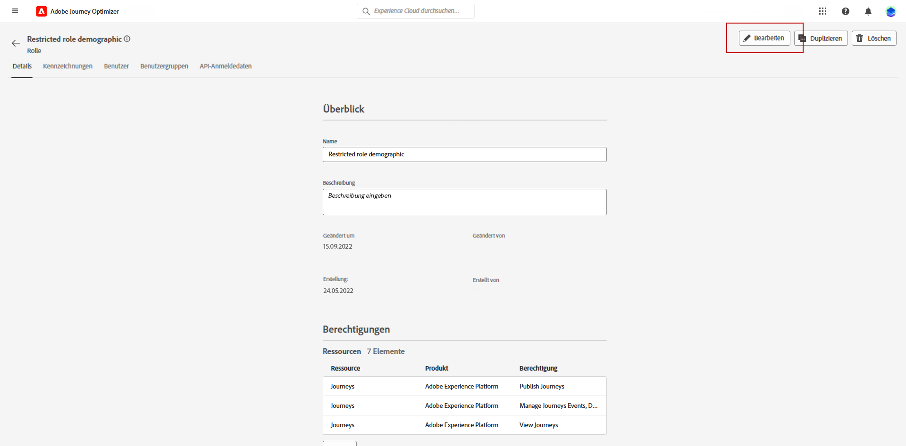
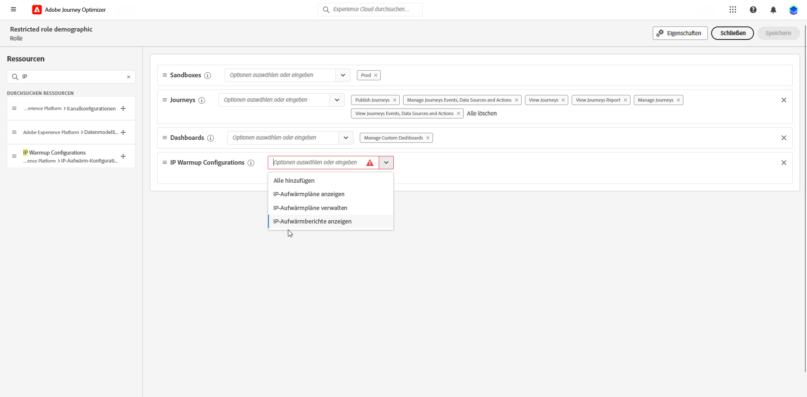
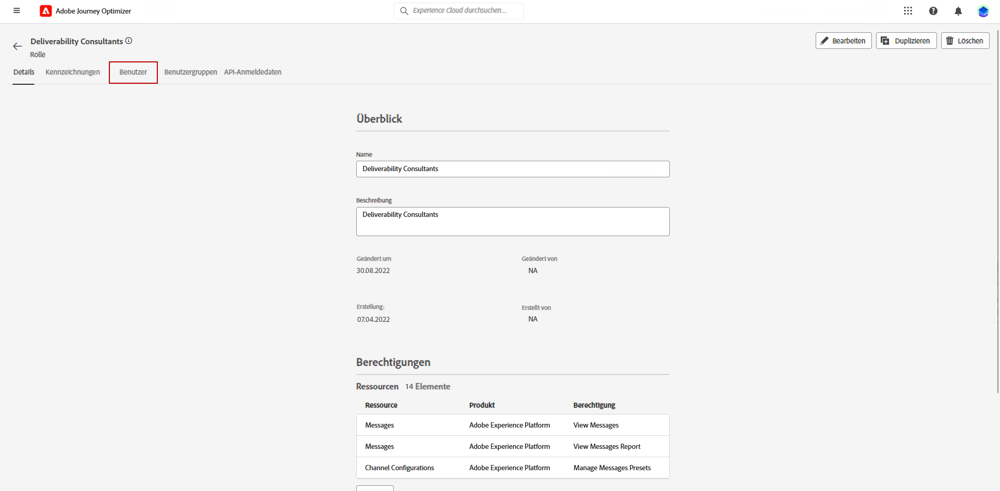
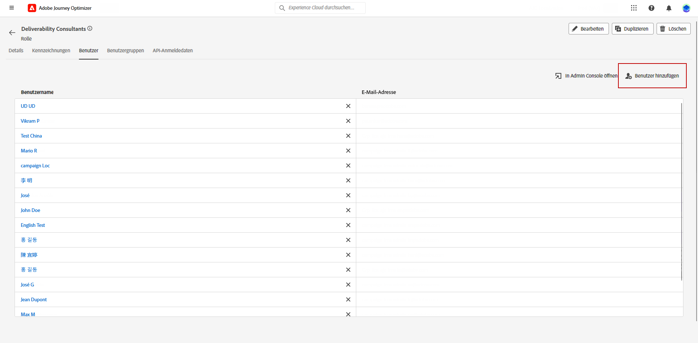
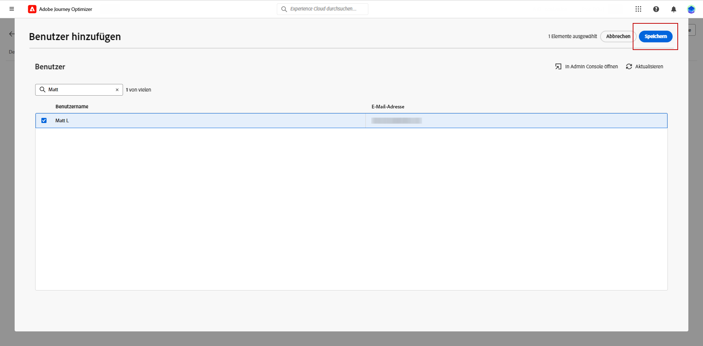

# Erstellen eines IP-Aufwärmplans {#ip-warmup}

>[!BEGINSHADEBOX]

Inhalt dieses Dokumentationshandbuchs:

* [Erste Schritte mit IP-Aufwärmen](ip-warmup-gs.md)
* [Erstellen von IP-Aufwärmkampagnen](ip-warmup-campaign.md)
* **[Erstellen eines IP-Aufwärmplans](ip-warmup-plan.md)**
* [Ausführen des IP-Aufwärmplans](ip-warmup-execution.md)

>[!ENDSHADEBOX]

Nachdem Sie eine oder mehrere [IP-Aufwärmkampagnen](ip-warmup-campaign.md) mit einer dedizierten Oberfläche und der entsprechenden Option erstellt haben, können Sie mit der Erstellung Ihres IP-Aufwärmplans beginnen.

Um auf die IP-Aufwärmspläne zugreifen, sie erstellen, bearbeiten und löschen zu können, benötigen Sie die Rolle **[!UICONTROL Zustellbarkeitsberater]** oder entsprechende Berechtigungen für IP-Aufwärmpläne.

+++ Erfahren Sie, wie Sie die Rolle des Zustellbarkeitsberaters oder entsprechende Berechtigungen für IP-Aufwärmspläne zuweisen.

So können Sie einer bestimmten **[!UICONTROL Rolle]** entsprechende Berechtigungen zuweisen:

1. Navigieren Sie vom [!DNL Permissions]-Produkt zum Menü **[!UICONTROL Rollen]** und wählen Sie die Rolle, die Sie mit den neuen Berechtigungen für **[!UICONTROL IP-Aufwärmkonfigurationen]** aktualisieren möchten.

1. Klicken Sie im Dashboard **[!UICONTROL Rolle]** auf **[!UICONTROL Bearbeiten]**.

   

1. Verschieben Sie die Ressource **[!UICONTROL IP-Aufwärmkonfigurationen]** per Drag-and-Drop, um Berechtigungen zuzuweisen.

1. Legen Sie über die Dropdown-Liste der Ressource **[!UICONTROL IP-Aufwärmkonfigurationen]** fest, welche Berechtigung(en) Ihre Benutzerin bzw. Ihr Benutzer benötigt.

   

1. Klicken Sie auf **[!UICONTROL Speichern]**.

So weisen Sie die entsprechende Rolle einer **[!UICONTROL Benutzerin bzw. einem Benutzer]** zu:

1. Navigieren Sie aus dem [!DNL Permissions]-Produkt zum Menü **[!UICONTROL Rollen]** und wählen Sie die integrierte Rolle **[!UICONTROL Zustellbarkeitsberater]**.

1. Öffnen Sie über das Dashboard **[!UICONTROL Rolle]** die Registerkarte **[!UICONTROL Benutzer]**.

   

1. Klicken Sie auf **[!UICONTROL Benutzer hinzufügen]**, um die integrierte Rolle **[!UICONTROL Zustellbarkeitsberater]** zuzuweisen.

   

1. Wählen Sie die **[!UICONTROL Benutzerin bzw. den Benutzer]** und klicken Sie auf **[!UICONTROL Speichern]**.

   

+++

## Vorbereiten der Datei mit dem IP-Aufwärmplan {#prepare-file}

IP-Aufwärmen ist eine Aktivität, die darin besteht, die Anzahl der E-Mails, die von Ihren IPs und Ihrer Domain an die wichtigsten Internet-Dienstanbieter (ISPs) gesendet werden, schrittweise zu erhöhen, um Ihre Reputation als legitimer Absender zu etablieren.

Diese Aktivität wird in der Regel mithilfe von Zustellbarkeitsfachleuten durchgeführt, die bei der Erstellung eines gut durchdachten Plans auf der Basis von Branchen-Domains, Anwendungsfällen, Regionen, ISPs und verschiedenen anderen Faktoren helfen.

<!--When working with the [!DNL Journey Optimizer] IP warmup feature, this plan takes the form of an Excel file that must contain a number of predefined columns.-->

Bevor Sie einen IP-Aufwärmplan in der Oberfläche von [!DNL Journey Optimizer] verwenden, müssen Sie eine Excel-Vorlage mit allen Daten ausfüllen, die in Ihren Plan gespeist werden.

* Hier können Sie die leere Excel-Datei herunterladen [Vorlage für IP-Warmup-Plan](assets/IPWarmupPlan-Template.zip) auszufüllen.

* Sie können auch eine [Beispiel-IP-Warmup-Plan](assets/IPWarmupPlan-Sample.zip) bereits mit einigen Daten gefüllt sind, die Sie als Beispiel verwenden können.

>[!CAUTION]
>
>Arbeiten Sie mit der Person, die Sie im Hinblick auf die Zustellbarkeit berät, zusammen, um sicherzustellen, dass die Datei Ihres IP-Aufwärmplans korrekt eingerichtet ist.
>
>Achten Sie darauf, das in der Vorlage angegebene Format zu verwenden.

Nachfolgend finden Sie ein Beispiel einer Datei mit einem IP-Aufwärmplan.

>[!NOTE]
>
>Vorläufig sollten Sie die Zellen **Eigenschaften** und **Wert** unangetastet lassen.

### Registerkarte „IP-Aufwärmplan“ {#ip-warmup-plan-tab}

* In diesem Beispiel wurde ein Plan (mit dem Titel „**Ausführungen**“) erstellt, der sich über einen Zeitraum von 17 Tagen erstreckt, um ein Zielvolumen von über einer Million Profilen zu erreichen.

* Dieser Plan wird in 6 **Phasen** ausgeführt, die jeweils mindestens eine Ausführung enthalten.

* Sie können für die Domains, an die Sie versenden möchten, beliebig viele Spalten haben. In diesem Beispiel ist der Plan in sechs Spalten unterteilt:

   * Vier davon entsprechen **vordefinierten Domain-Gruppen** zur Verwendung in Ihrem Plan (Gmail, Microsoft, Yahoo und Orange).
   * Eine entspricht einer benutzerspezifischen Domain-Gruppe (die Sie mithilfe der Registerkarte [Benutzerspezifische Domain-Gruppe](#custom-domain-group-tab) hinzufügen müssen).
   * Die sechste Spalte, **Sonstige**, enthält alle verbleibenden Adressen aus anderen Domains, die nicht explizit im Plan behandelt werden. Diese Spalte ist optional: Wenn sie weggelassen wird, werden E-Mails nur an die angegebenen Domains gesendet.
* Die Spalte **Interaktion – Tage** zeigt an, dass nur die Profile angesprochen werden, die im letzten eingegebenen Zeitraum mit Ihrer Marke interagiert haben.

Die Idee besteht darin, die Anzahl der Zieladressen in jeder Ausführung schrittweise zu erhöhen und gleichzeitig die Anzahl der Ausführungen in jeder Phase zu reduzieren.

Die nativen Haupt-Domain-Gruppen, die Sie Ihrem Plan hinzufügen können, sind hier aufgeführt:

<!--
* Gmail
* Adobe
* WP
* Comcast
* Yahoo
* Bigpond
* Orange
* Softbank
* Docomo
* United Internet
* Microsoft
* KDDI
* Italia Online
* La Poste
* Apple
-->

+++ Gmail
gmail.com;google.com;googlemail.com;googlemail.co.uk
+++

+++ Adobe
adobe.com
+++

+++WP
wp.pl;o2.pl
+++

+++Comcast
comcast.net
+++

+++Yahoo
aol.fi;games.com;cs.com;yahoo.com.in;y7mail.com;yahoo.co.uk;yahoo.hu;yahoo.co.hu;yahoo.cn;yahoogroups.com.sg;yahoogroups.com.au;aol.es;yahoo.com.au;yahoo.com.vn;yahoo.ca;aol.hk;aol.co.nz;yahoo.com.br;aolpoland.pl;aolnorge.no;yahoo.ne.jp;yahoo.fi;ymail.com;netscape.com;yahoo.com.pe;yahoo.hr;aol.cz;yahoo.ee;aol.be;aolcom.tr;yahoo.si;yahoo.co.id;aol.it;citlink.net;wmconnect.com;yahoo.es;yahoo.dk;yahoogroups.ca;yahoo.com.jp;yahoo.com.hk;aol.kr;yahoo.ie;aol.jp;aol.com.br;yahoo.lt;yahoo.co.kr;aol.nl;yahoo.com.ar;yahoo.bg;ygm.com;yahoo.co.nz;aol.se;aol.com;yahoo.de;goowy.com;rocketmail.com;frontiernet.net;aim.com;yahoo.nl;yahoogroups.co.in;aol.dk;netscape.net;aol.cl;luckymail.com;yahoo.no;yahoo.co.jp;yahoo.com.kr;yahoo.cz;yahoo.co.za;yahoo.sk;verizon.net;yahoogroups.de;yahoo.gr;aol.com.ve;aol.com.ar;yahoo.ro;aol.com.co;wild4music.com;yahoo.at;yahoogroups.com.cn;yahoo.com.co;wow.com;aol.fr;yahoo.in;aol.in;yahoo.com;yahoo.rs;aol.de;yahooxtra.co.nz;yahoo.com.mx;yahoo.com.ph;sky.com;aol.com.mx;aol.com.au;yahoo.se;myaol.jp;aolchina.com;yahoo.pt;yahoo.com.net;yahoo.com.tw;yahoogrupper.dk;yahoo.fr;talk21.com;compuserve.com;aol.pl;yahoo.com.sg;yahoogroups.com.tw;aol.ch;yahoo.it;frontier.com;yahoo.co.in;aolpolcka.pl;yahoo.co.il;verizon.net.in;yahoogruppi.it;yahoo.com.tr;yahoo.cl;yahoogroups.com.hk;yahoogroups.co.uk;yahoo.com.biz;yahoo.com.hr;yahoo.be;aol.co.uk;ybb.ne.jp;aol.tw;yahoogroups.co.kr;yahoo.com.my;rogers.com;gte.net;yahoogroups.com;yahoo.co.th;yahoo.com.cn;love.com;bellatlantic.net;aol.ru;yahoo.com.ve;yahoo.com.ua;yahoo.lv;aolpolska.pl;aol.at;yahoo.pl
+++

+++Bigpond
bigpond.com;bigpond.com.au;bigpond.net;telstra.com;bigpond.net.au
+++

+++Orange
voila.com;francetelecom.com;orange.com;orange.fr;wanadoo.fr;voila.fr
+++

+++Softbank
c.vodafone.ne.jp;jp-h.ne.jp;k.vodafone.ne.jp;jp-d.ne.jp;jp-c.ne.jp;t.vodafone.ne.jp;h.vodafone.ne.jp;r.vodafone.ne.jp;q.vodafone.ne.jp;jp-t.ne.jp;jp-q.ne.jp;s.vodafone.ne.jp;jp-s.ne.jp;jp-r.ne.jp;jp-k.ne.jp;n.vodafone.ne.jp;d.vodafone.ne.jp;softbank.ne.jp;jp-n.ne.jp
+++

+++Docomo
docomo.ne.jp
+++

+++United Internet
gmx.de;1and1.com;gmx.fr;mail.com;1und1.de;gmx.com;gmx.net;gmx.at;web.de;gmx.ch
+++

+++Microsoft
hotmail.com.tr;live.de;live.ru;live.nl;windowslive.com;live.jp;mts.net;xbox.com;hotmail.fr;hotmail.cl;hotmail.jp;live.cl;live.at;live.com.au;hotmail.co.th;live.hk;hotmail.com.au;hotmail.com;live.com.my;hotmail.co.kr;live.ie;outlook.com.br;hotmail.co.il;hotmail.dk;live.co.kr;live.co.uk;live.com.mx;outlook.ie;live.cn;hotmail.co.uk;live.com.sg;hotmail.es;live.fr;live.no;live.dk;hotmail.it;msn.com;live.se;hotmail.co.jp;live.be;live.co.za;live.in;hotmail.se;live.com.pt;hotmail.ch;outlook.com;live.com;hotmail.gr;live.it;live.com.ar;hotmail.ca;hotmail.com.br;hotmail.com.ar;live.ca;hotmail.de
+++

+++KDDI
au.com;ezweb.ne.jp;uqmobile.jp
+++

+++Italia Online
inwind.it;blu.it;virgilio.it;giallo.it;iol.it;libero.it
+++

+++La Poste
laposte.net
+++

+++Apple
mac.com;icloud.com;apple.com;me.com
+++

### Registerkarte „Benutzerdefinierte Domain-Gruppen“ {#custom-domain-group-tab}

Sie können Ihrem Plan auch weitere Spalten hinzufügen, indem Sie benutzerdefinierte Domain-Gruppen hinzufügen.

Verwenden Sie die Registerkarte **[!UICONTROL Benutzerdefinierte Domain-Gruppen]**, um eine neue Domain-Gruppe zu definieren. Für jede Domain können Sie alle von ihr abgedeckten Subdomains hinzufügen.<!--TBC-->

Zum Beispiel: Wenn Sie die benutzerdefinierte Domain „Luma“ hinzufügen, sollen die folgenden Subdomains eingeschlossen sein: luma.com, luma.co.uk, luma.it, luma.fr, luma.de usw.

### Beispiel {#example}

Angenommen, Sie möchten zwei benutzerdefinierte Domain-Gruppen haben:

* Eine nur für Hotmail-Domains.
* Und eine für alle anderen Domains aus der Domain-Gruppe Microsoft (also ohne alle Hotmail-Domains).

Beachten Sie, dass alle anderen Domains in der Spalte **[!UICONTROL Sonstige]** erfasst werden.

1. Erstellen Sie in der Registerkarte **[!UICONTROL Benutzerdefinierte Domain-Gruppen]**, eine **Hotmail**-Domain-Gruppe.

1. Fügen Sie alle Hotmail-Domains in derselben Zeile hinzu.

   Sie können alle Hotmail-Domains [kopieren und einfügen](#copy-paste), die im Abschnitt [Registerkarte „IP-Aufwärmplan“](#ip-warmup-plan-tab) aufgeführt sind.

1. Fügen Sie eine weitere Zeile hinzu.

1. Erstellen Sie eine Domain-Gruppe namens **Microsoft_X**.

1. Fügen Sie alle Microsoft-Domains, die nicht Hotmail sind, in derselben Zeile hinzu. Auf ähnliche Weise können Sie sie aus der obigen Liste kopieren und einfügen. [Weitere Informationen](#copy-paste)

1. Gehen Sie zurück zur Registerkarte **[!UICONTROL IP-Aufwärmplan]**.

1. Erstellen Sie drei Spalten: eine für **Hotmail**, eine für **Microsoft_X** und eine für **Sonstige**.

1. Füllen Sie die Spalten entsprechend Ihren Anforderungen aus.

>[!NOTE]
>
>Sobald der IP-Aufwärmplan in [!DNL Journey Optimizer] hochgeladen wurde, müssen Sie die Microsoft Domain-Gruppen nicht ausschließen.

<!--Only the domain groups listed in the **[!UICONTROL IP Warmup Plan]** tab will be taken into account.-->

### Kopieren und Einfügen der Standard-Domains {#copy-paste}

Wenn Sie beispielsweise eine benutzerdefinierte Domain-Gruppe erstellen möchten, die alle Hotmail-Domains enthält, können Sie die Domains aus der [oben](#ip-warmup-plan-tab) angegebenen Standardliste kopieren und einfügen.

Verwenden Sie dann das Excel-Konvertierungswerkzeug, um Text in Spalten zu konvertieren:

1. Wählen Sie **[!UICONTROL Daten]** > **[!UICONTROL Text in Spalten…]** und dann **[!UICONTROL Getrennt]** aus und klicken Sie abschließend auf **[!UICONTROL Weiter]**.

1. Wählen Sie **[!UICONTROL Semikolon]** aus und klicken Sie dann auf **[!UICONTROL Weiter]** und **[!UICONTROL Beenden]**.

Jede Domain wird nun in einer anderen Spalte in derselben Zeile angezeigt.

## Aufrufen und Verwalten von IP-Aufwärmplänen {#manage-ip-warmup-plans}

1. Rufen Sie das Menü **[!UICONTROL Administration]** > **[!UICONTROL Kanäle]** > **[!UICONTROL IP-Aufwärmpläne]** auf. Es werden alle bisher erstellten IP-Aufwärmpläne angezeigt.

   

1. Sie können nach dem Status filtern. Die verschiedenen Status sind:

   * **Nicht gestartet**: Es wurde noch keine Ausführung aktiviert. [Weitere Informationen](ip-warmup-execution.md#define-runs)
   * **Live**: Der Plan erhält diesen Status, sobald die erste Ausführung in der ersten Phase erfolgreich aktiviert wurde. [Weitere Informationen](ip-warmup-execution.md#define-runs)
   * **Abgeschlossen**: Der Plan wurde als abgeschlossen gekennzeichnet. <!--This option is only available if all the runs in the plan are in **[!UICONTROL Completed]** or **[!UICONTROL Draft]** status (no run can be **[!UICONTROL Live]**).--> [Weitere Informationen](ip-warmup-execution.md#mark-as-completed)
     <!--* **Paused**: to check (user action)-->

1. Um einen IP-Aufwärmplan zu löschen, klicken Sie auf das Symbol **[!UICONTROL Löschen]** neben dem Namen eines Plans und bestätigen Sie den Löschvorgang.

   >[!NOTE]
   >
   >Nur Pläne mit dem Status **Nicht gestartet** können gelöscht werden.

   

   >[!CAUTION]
   >
   >Der ausgewählte IP-Aufwärmplan wird endgültig gelöscht.

## Erstellen eines IP-Aufwärmplans {#create-ip-warmup-plan}

>[!CONTEXTUALHELP]
>id="ajo_admin_ip_warmup_upload"
>title="IP-Aufwärmplan angeben"
>abstract="Die CSV-Vorlage herunterladen und sie mit Daten für IP-Aufwärmphasen und die Zielanzahl der Profile ausfüllen."

>[!CONTEXTUALHELP]
>id="ajo_admin_ip_warmup_surface"
>title="Auswählen einer Marketing-Oberfläche"
>abstract="Es muss dieselbe Oberfläche ausgewählt werden wie die in der Kampagne, die mit Ihrem IP-Aufwärmplan verbunden werden soll. "
>additional-url="https://experienceleague.adobe.com/docs/journey-optimizer/using/configuration/channel-surfaces.html?lang=de" text="Einrichten von Kanaloberflächen"
>additional-url="https://experienceleague.adobe.com/docs/journey-optimizer/using/configuration/channel-surfaces.html?lang=de" text="Erstellen von IP-Aufwärmkampagnen"

Um einen IP-Aufwärmplan zu erstellen, führen Sie die folgenden Schritte aus.

1. Rufen Sie das Menü **[!UICONTROL Administration]** > **[!UICONTROL Kanäle]** > **[!UICONTROL IP-Aufwärmpläne]** auf und klicken Sie dann auf **[!UICONTROL IP-Aufwärmplan erstellen]**.

   

1. Füllen Sie die Details des IP-Aufwärmplans aus: Geben Sie ihm einen Namen und eine Beschreibung.

   

1. Wählen Sie die [Oberfläche](channel-surfaces.md) aus, die Sie aufwärmen möchten. Es stehen nur Marketing-Oberflächen zur Auswahl. [Weitere Informationen zum E-Mail-Typ](../email/email-settings.md#email-type)

   >[!NOTE]
   >
   >Die Kampagnen, die Sie mit Ihrem IP-Aufwärmplan verbinden möchten, müssen dieselbe Oberfläche verwenden. [Informationen zum Erstellen einer IP-Aufwärmkampagne](ip-warmup-campaign.md)

1. Laden Sie die Excel-Datei hoch, die Ihren IP-Aufwärmplan enthält. [Weitere Informationen](#prepare-file)

   <!--
    You can also download the Excel template from the [!DNL Journey Optimizer] user interface and upload it after filling it with the IP warmup details.-->

   

   >[!NOTE]
   >
   >Wenn der Upload fehlschlägt, stellen Sie sicher, dass Sie die richtige Formatierung und das richtige Dateiformat (XLS oder XLSX) verwenden. Verwenden Sie die [template](assets/IPWarmupPlan-Template.zip) bereitgestellt durch Adobe.

1. Klicken Sie auf **[!UICONTROL Erstellen]**. Alle Phasen, Ausführungen, Spalten und deren Inhalte, die in der von Ihnen hochgeladenen Datei definiert sind, werden automatisch in der Oberfläche von [!DNL Journey Optimizer] angezeigt.

   

   >[!NOTE]
   >
   >Die Spalte **[!UICONTROL Zielgruppe]** zeigt die Summe aller Profile an, die bei jeder Ausführung angesprochen werden, d. h. alle Profile aus den von Ihnen definierten Domain-Gruppen, einschließlich der Spalte **Sonstige**, falls vorhanden.

Jetzt können Sie Ihren IP-Aufwärmplan ausführen. [Weitere Informationen](ip-warmup-execution.md)
