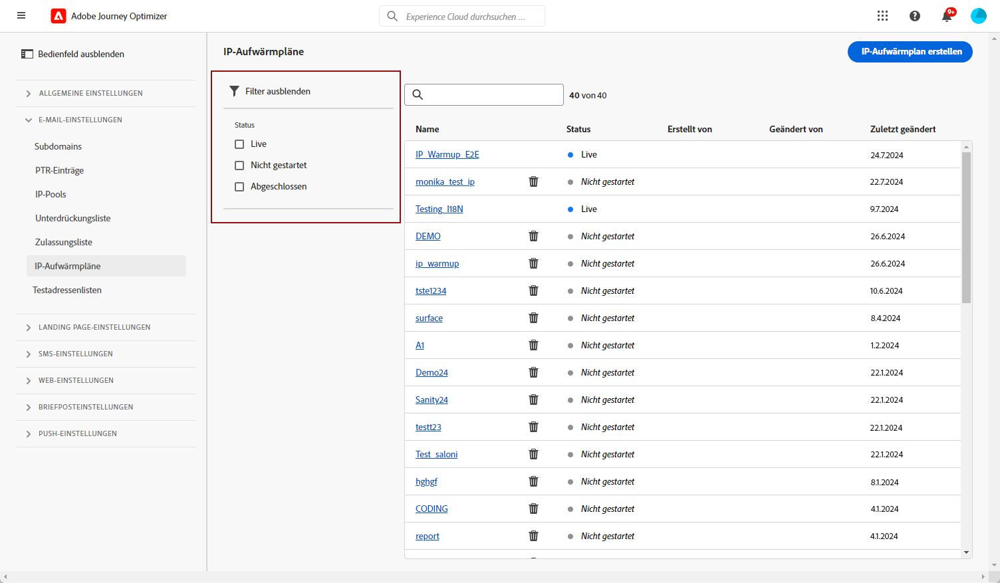
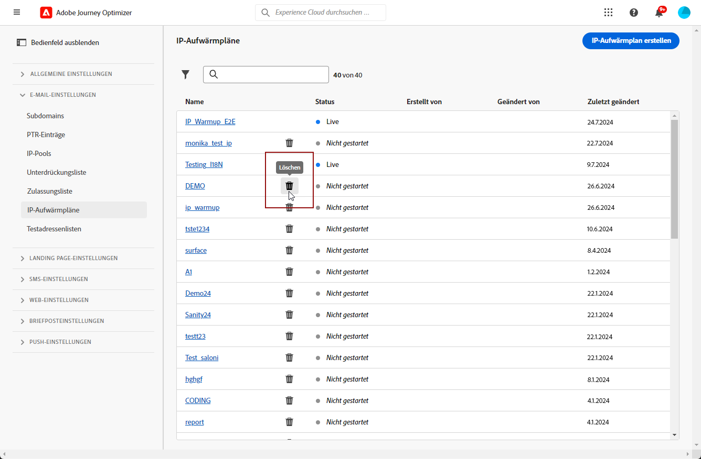
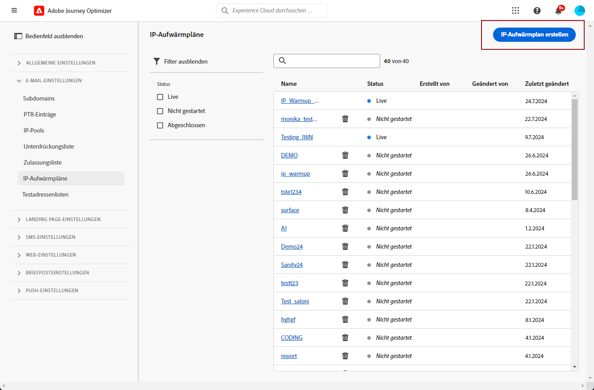
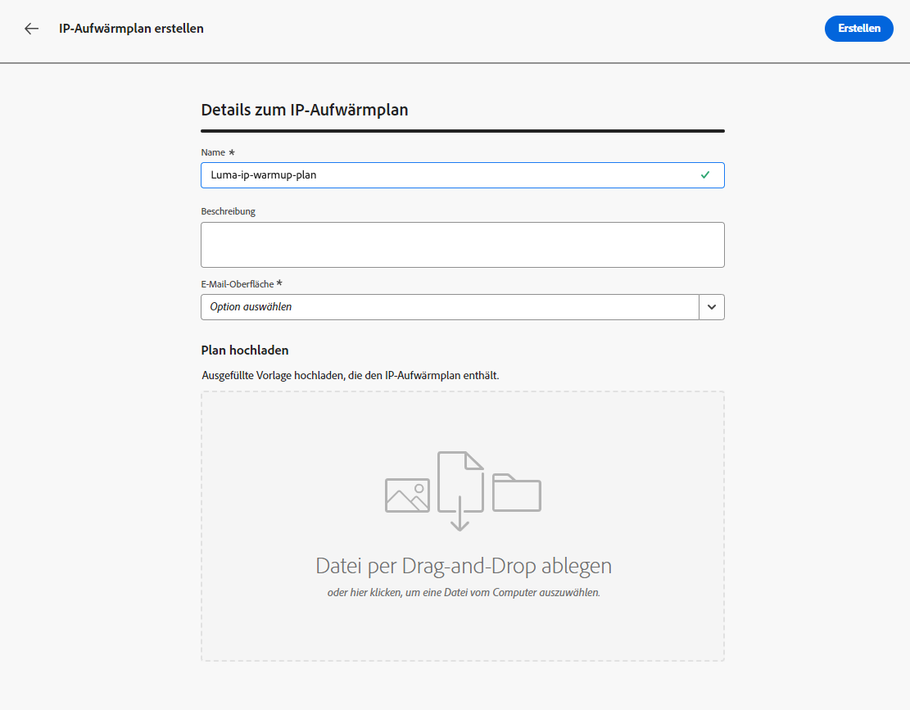
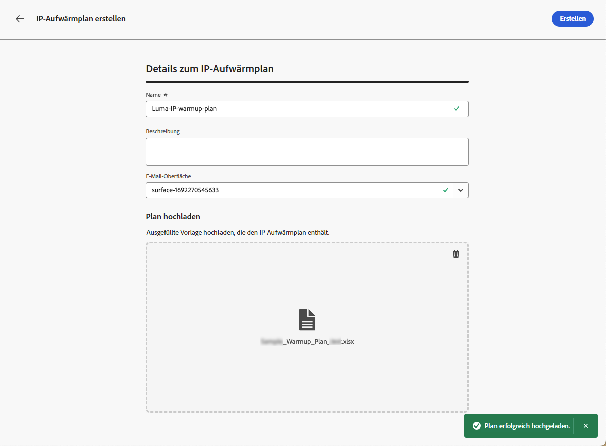
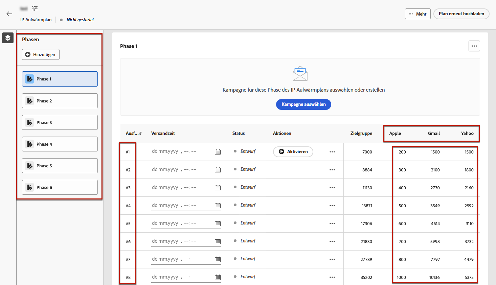

# Erstellen eines IP-Warmup-Plans {#ip-warmup}

>[!BEGINSHADEBOX]

Inhalt dieses Dokumentationshandbuchs:

* [Erste Schritte mit IP-Wärme](ip-warmup-gs.md)
* [Erstellen von IP-Aufwärmekampagnen](ip-warmup-campaign.md)
* **[Erstellen eines IP-Warmup-Plans](ip-warmup-plan.md)**
* [Ausführen des IP-Aufwärmungsplans](ip-warmup-execution.md)

>[!ENDSHADEBOX]

Nachdem Sie eine oder mehrere [IP-Warmup-Kampagnen](ip-warmup-campaign.md) mit einer dedizierten Oberfläche und der entsprechenden Option, können Sie mit der Erstellung Ihres IP-Warmup-Plans beginnen.

## Vorbereiten der Datei mit dem IP-Warmup-Plan {#prepare-file}

IP-Aufwärmphase ist eine Aktivität, die darin besteht, die Anzahl der E-Mails, die von Ihren IPs und Ihrer Domain an die wichtigsten Internet-Dienstanbieter (ISPs) gesendet werden, schrittweise zu erhöhen, um Ihre Reputation als legitimer Absender zu etablieren.

Diese Aktivität wird in der Regel mithilfe eines Zustellbarkeitsexperten durchgeführt, der bei der Erstellung eines gut durchdachten Plans auf der Basis von Branchendomänen, Anwendungsfällen, Regionen, ISPs und verschiedenen anderen Faktoren hilft.

Beim Arbeiten mit [!DNL Journey Optimizer] IP-Warmup-Funktion verwenden, besteht dieser Plan aus einer Excel-Datei, die eine Reihe vordefinierter Spalten enthalten muss. Bevor Sie einen IP-Warmup-Plan im [!DNL Journey Optimizer] -Schnittstelle verwenden, müssen Sie diese Vorlage mit allen Daten ausfüllen, die Ihren Plan begünstigen.

>[!CAUTION]
>
>Wenden Sie sich an Ihren Zustellbarkeitsberater, um sicherzustellen, dass Ihre IP-Warmup-Plandatei korrekt eingerichtet ist.

Nachfolgend finden Sie ein Beispiel einer Datei mit einem IP-Warmup-Plan.

### Registerkarte &quot;IP-Warmup-Plan&quot;

* In diesem Beispiel wurde ein Plan über einen Zeitraum von 17 Tagen erstellt (mit der Bezeichnung **läutet**&quot;) , um ein Zielvolumen von über 1 Million Profilen zu erreichen.

* Dies ist bis zum 6. **Phasen**, die jeweils mindestens eine Ausführung enthalten.

* Sie können für die Domänen, an die Sie eine Bereitstellung durchführen möchten, so viele Spalten wie gewünscht haben. In diesem Beispiel ist der Plan in 6 Spalten unterteilt: 5 davon entsprechen dem **Hauptdomänengruppen** zur Verwendung in Ihrem Plan (Gmail, Microsoft, Yahoo, Orange und Apple) und in der sechsten Spalte, **sonstige** enthält alle verbleibenden Adressen aus anderen Domänen.
* Die **Interaktionstage** zeigt an, dass nur die Profile angesprochen werden, die in den letzten 30 Tagen mit Ihrer Marke interagiert haben.

Die Idee besteht darin, die Anzahl der Zieladressen in jeder Ausführung schrittweise zu erhöhen und gleichzeitig die Anzahl der Ausführungen in jeder Phase zu reduzieren.

Die nativen Hauptdomänengruppen, die Sie Ihrem Plan hinzufügen können, sind unten aufgeführt:

* Gmail
* Adobe
* WP
* Comcast
* Yahoo
* Bigpond
* Orange
* Softbank
* Docomo
* Vereinigtes Internet
* Microsoft
* KDDI
* Italia Online
* La Poste
* Apple

### Registerkarte &quot;Benutzerspezifische Domänengruppe&quot;

Sie können Ihrem Plan auch weitere Spalten hinzufügen, indem Sie benutzerdefinierte Domänengruppen hinzufügen.

Verwenden Sie die **[!UICONTROL Benutzerspezifische Domänengruppe]** um eine neue Domain-Gruppe zu definieren. Für jede Domäne können Sie alle darin abgedeckten Subdomains hinzufügen.<!--TBC-->

Wenn Sie beispielsweise die benutzerdefinierte Domäne &quot;Luma&quot;hinzufügen, sollen die folgenden Subdomains eingeschlossen sein: luma.com, luma.co.uk, luma.it, luma.fr, luma.de usw.

## IP-Warmlaufpläne aufrufen und verwalten {#manage-ip-warmup-plans}

1. Zugriff auf **[!UICONTROL Administration]** > **[!UICONTROL Kanäle]** > **[!UICONTROL IP-Aufwärmspläne]** Menü. Alle bisher erstellten IP-Warmup-Pläne werden angezeigt.

   

1. Sie können nach Status filtern. Die verschiedenen Status sind:

   * **Nicht gestartet**: Es wurde noch keine Ausführung aktiviert. [Weitere Informationen](ip-warmup-execution.md#define-runs)
   * **Live**: Der Plan erhält diesen Status, sobald die erste Ausführung in der ersten Phase erfolgreich aktiviert wurde. [Weitere Informationen](ip-warmup-execution.md#define-runs)
   * **Abgeschlossen**: Der Plan wurde als abgeschlossen gekennzeichnet. Diese Option ist nur verfügbar, wenn alle im Plan ausgeführten Vorgänge in **[!UICONTROL Erfolgreich]** oder **[!UICONTROL Entwurf]** status (kein Run kann ausgeführt werden) **[!UICONTROL Live]**). [Weitere Informationen](ip-warmup-execution.md#define-runs#mark-as-completed)
     <!--* **Paused**: to check (user action)-->

1. Um einen IP-Aufwärmplan zu löschen, wählen Sie die **[!UICONTROL Löschen]** neben dem Namen eines Plans klicken und den Löschvorgang bestätigen.

   

   >[!CAUTION]
   >
   >Der ausgewählte IP-Warmup-Plan wird endgültig gelöscht.

## Erstellen eines IP-Warmup-Plans {#create-ip-warmup-plan}

>[!CONTEXTUALHELP]
>id="ajo_admin_ip_warmup_upload"
>title="Geben Sie Ihren IP-Warmup-Plan an"
>abstract="Laden Sie die CSV-Vorlage herunter und füllen Sie sie mit Daten für IP-Warmup-Phasen und die Zielanzahl der Profile aus."

>[!CONTEXTUALHELP]
>id="ajo_admin_ip_warmup_surface"
>title="Marketing-Oberfläche auswählen"
>abstract="Sie müssen dieselbe Oberfläche auswählen wie die in der Kampagne, die Sie mit Ihrem IP-Aufwärmplan verbinden möchten."
>additional-url="https://experienceleague.adobe.com/docs/journey-optimizer/using/configuration/channel-surfaces.html?lang=de" text="Einrichten von Kanaloberflächen"
>additional-url="https://experienceleague.adobe.com/docs/journey-optimizer/using/configuration/channel-surfaces.html?lang=de" text="Erstellen von IP-Aufwärmekampagnen"

Wenn eine oder mehrere Live-Kampagnen mit **[!UICONTROL Aktivierung des IP-Warmlaufplans]** aktiviert sind, können Sie sie mit einem IP-Warmup-Plan verknüpfen.

>[!CAUTION]
>
>Um die IP-Aufwärmspläne zu erstellen, zu bearbeiten und zu löschen, benötigen Sie die **[!UICONTROL Zustellbarkeitsberater]** -Berechtigung. <!--Learn more on managing [!DNL Journey Optimizer] users' access rights in [this section](../administration/permissions-overview.md).-->

1. Zugriff auf **[!UICONTROL Administration]** > **[!UICONTROL Kanäle]** > **[!UICONTROL IP-Aufwärmspläne]** Menü und klicken Sie auf **[!UICONTROL IP-Warmup-Plan erstellen]**.

   

1. Füllen Sie die Details des IP-Warmup-Plans aus: Geben Sie ihm einen Namen und eine Beschreibung.

   

1. Wählen Sie eine [Oberfläche](channel-surfaces.md). Es stehen nur Marketingflächen zur Auswahl. [Weitere Informationen zum E-Mail-Typ](../email/email-settings.md#email-type)

   >[!CAUTION]
   >
   >Sie müssen dieselbe Oberfläche auswählen wie die in der Kampagne, die Sie mit Ihrem IP-Aufwärmplan verbinden möchten. [Erfahren Sie, wie Sie eine IP-Warmup-Kampagne erstellen.](ip-warmup-campaign.md)

1. Laden Sie die Excel-Datei hoch, die Ihren IP-Warmup-Plan enthält. [Weitere Informationen](#prepare-file)

   <!--
    You can also download the Excel template from the [!DNL Journey Optimizer] user interface and upload it after filling it with the IP warmup details.-->

   

1. Klicken Sie auf **[!UICONTROL Erstellen]**. Alle Phasen, Ausführungen, Spalten und deren Inhalt, die in der von Ihnen hochgeladenen Datei definiert sind, werden automatisch im [!DNL Journey Optimizer] -Schnittstelle. [Weitere Informationen](ip-warmup-execution.md)

   
