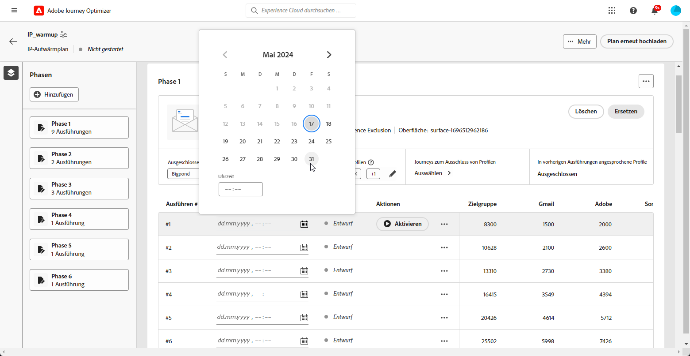

# IP-Warmup-Plan ausführen {#ip-warmup-running}

>[!BEGINSHADEBOX]

Inhalt dieses Dokumentationshandbuchs:

* [Erste Schritte mit IP-Wärme](ip-warmup-gs.md)
* [Erstellen von IP-Aufwärmekampagnen](ip-warmup-campaign.md)
* [Erstellen eines IP-Warmup-Plans](ip-warmup-plan.md)
* **[IP-Warmup-Plan ausführen](ip-warmup-running.md)**

>[!ENDSHADEBOX]

Einmal [einen IP-Warmup-Plan erstellt hat](ip-warmup-plan.md) und die mit Ihrem Zustellbarkeitsberater vorbereitete Datei hochgeladen haben, können Sie die Phasen und Ausführungen Ihres Plans definieren.

Jede Phase entspricht einem Zeitraum, der aus mehreren Ausführungen besteht und dem Sie eine Kampagne zuweisen.

Sie haben für jede Ausführung eine bestimmte Anzahl von Empfängern und planen die Ausführung dieser Ausführung.

## Definieren der Phasen {#define-phases}

>[!CONTEXTUALHELP]
>id="ajo_admin_ip_warmup_campaigns_excluded"
>title="Auswahl der auszuschließenden Kampagnenzielgruppen"
>abstract="Wählen Sie die Zielgruppen aus anderen Kampagnen aus, die Sie aus der aktuellen Phase ausschließen möchten."

>[!CONTEXTUALHELP]
>id="ajo_admin_ip_warmup_domains_excluded"
>title="Auswählen von Domänengruppen zum Ausschließen"
>abstract="Wählen Sie die Domänen aus, die Sie aus der aktuellen Phase ausschließen möchten."

Sie müssen die Kampagne und die Zielgruppe auf Phasenebene verknüpfen und aktivieren einige Einstellungen, die für alle mit einer einzelnen Kreativ-/Kampagne verbundenen Ausführungen erforderlich sind

Auf Phasenebene stellt das System sicher, dass zuvor angesprochene + neue Profile abgerufen werden UND auf Iterationsebene, das System stellt sicher, dass jeder Lauf eindeutige Profile hat und die Anzahl mit der im Plan angegebenen übereinstimmt

1. Wählen Sie für jede Phase die Kampagne aus, die Sie mit dieser Phase des IP-Aufwärmungsplans verbinden möchten.

   

   Beachten Sie Folgendes:

   * Nur Kampagnen mit der **[!UICONTROL Aktivierung des IP-Warmlaufplans]** Option aktiviert <!--and live?--> stehen zur Auswahl zur Verfügung. [Weitere Informationen](#create-ip-warmup-campaign)

   * Sie müssen eine Kampagne auswählen, die dieselbe Oberfläche wie die für den aktuellen IP-Aufwärmplan ausgewählte verwendet.

   * Es ist nicht möglich, eine Kampagne auszuwählen, die bereits in einer anderen IP-Warmup-Kampagne verwendet wird.

1. Im **[!UICONTROL Profilausschluss]** -Abschnitt, können Sie sehen, dass die Profile aus den vorherigen Ausführungen dieser Phase immer ausgeschlossen sind. Wenn beispielsweise im Ausführen von #1 ein Profil in den ersten 4800 Zielgruppenempfängern behandelt wurde, stellt das System automatisch sicher, dass dasselbe Profil die E-Mail in Ausführung 2 nicht erhält.

1. Aus dem **[!UICONTROL Campaign-Zielgruppen ausgeschlossen]** die Zielgruppen aus anderen <!--executed/live?-->Kampagnen, die Sie aus der aktuellen Phase ausschließen möchten.

   

   Während der Ausführung von Phase 1 mussten Sie beispielsweise [teilen](#split-phase) aus irgendeinem Grund. Daher können Sie die in Phase 1 verwendete Kampagne ausschließen, sodass zuvor kontaktierte Profile aus Phase 1 nicht in Phase 2 eingeschlossen sind. Sie können Kampagnen auch aus anderen IP-Aufwärmsplänen ausschließen.

1. Aus dem **[!UICONTROL Domänengruppen ausgeschlossen]** wählen Sie die Domänen aus, die Sie aus dieser Phase ausschließen möchten.

   

   Wenn Sie beispielsweise einige Tage lang IP-Warmup ausgeführt haben, erkennen Sie, dass der ISP-Ruf bei einer Domain (d. h. Adobe) nicht gut ist, und möchten ihn beheben, ohne Ihren IP-Warmup-Plan zu stoppen. In diesem Fall können Sie die Adobe-Domain-Gruppe ausschließen.

   >[!NOTE]
   >
   >Der Domänenausschluss erfordert eine nicht ausgeführte Phase, daher müssen Sie möglicherweise eine laufende Phase aufteilen, um Ausschlüsse hinzuzufügen. Wenn die Domain-Gruppe keine OOTB-Domain-Gruppe ist, müssen Sie diese Domain-Gruppe zur Excel-Datei hinzufügen, sie hochladen und dann die Domäne ausschließen.

   

1. Sie können bei Bedarf eine Phase hinzufügen. Sie wird nach der letzten aktuellen Phase hinzugefügt.

1. Verwenden Sie die **[!UICONTROL Löschphase]** -Schaltfläche, um alle unerwünschten Phasen zu entfernen.

   

   >[!CAUTION]
   >
   >Sie können die **[!UICONTROL Löschen]** Aktion.
   >
   >Wenn Sie alle Phasen aus dem IP-Warmup-Plan löschen, empfehlen wir, einen Plan erneut hochzuladen.

## Definieren der Ausführungen {#define-runs}

1. Wählen Sie für jeden Lauf einen Zeitplan aus. <!--which is actually a window of opportunity. meaning? how many hours? shall we specify that to clarify?-->

   

1. Wählen Sie optional das Fenster aus, in dem die IP-Warmup-Kampagne ausgeführt werden kann, falls es zu Verzögerungen bei der Ausführung des Zielgruppensegmentierungsauftrags kommt. Wenn keine Endzeit angegeben ist, wird die Ausführung zum Startzeitpunkt versucht und schlägt fehl, wenn die Segmentierung nicht abgeschlossen wurde.

1. Aktivieren Sie jeden Lauf. Stellen Sie sicher, dass Sie eine Zeit so früh planen, dass der Segmentierungsauftrag ausgeführt werden kann. <!--explain how you can evaluate a proper time-->

   >[!CAUTION]
   >
   >Jede Ausführung muss mindestens 12 Stunden vor der tatsächlichen Versandzeit aktiviert werden. Andernfalls kann die Segmentierung nicht abgeschlossen sein. <!--How do you know when segmentation is complete? Is there a way to prevent user from scheduling less than 12 hours before the segmentation job?-->

   <!--Sart to execute on every day basis by simply clicking the play button > for each run? do you have to come back every day to activate each run? or can you schedule them one after the other?)-->

1. Wenn die Kampagnenausführung noch nicht gestartet wurde, können Sie den Start stoppen.<!--why?-->

   >[!NOTE]
   >
   >Sobald die Kampagnenausführung gestartet wurde, wird die **[!UICONTROL Anhalten]** -Schaltfläche nicht mehr verfügbar. <!--TBC in UI-->

   

1. Um eine Ausführung hinzuzufügen, wählen Sie **[!UICONTROL Hinzufügen einer Ausführung unten]** über das Symbol mit den drei Punkten aus.

   

## Aufspaltung einer Phase {#split-phase}

Wenn Sie jederzeit eine andere Kampagne verwenden möchten, die von einem bestimmten Lauf ausgehend beginnt, wählen Sie die **[!UICONTROL Option &quot;In neue Phase aufteilen&quot;]** über das Symbol mit den drei Punkten aus.

Für die verbleibenden Phasen der aktuellen Phase wird eine neue Phase erstellt. Führen Sie die Schritte aus [above](#define-phases) , um die neue Phase zu definieren.

Wenn Sie beispielsweise diese Option für Ausführen Nr. 4 auswählen, werden die Ausführungen Nr. 4 zu Nr. 8 in eine neue Phase verschoben.

<!--
You don't have to decide the campaign upfront. You can do a split later. It's a work in progress plan: you activate one run at a time with a campaign and you always have the flexibility to modify it while working on it.

But need to explain in which case you want to modify campaigns, provide examples
-->

## Plan als abgeschlossen markieren {#mark-as-completed}

Wenn Ihr Plan nicht gut genug läuft oder Sie ihn fallen lassen möchten, um einen weiteren zu erstellen, können Sie ihn als abgeschlossen markieren.

Klicken Sie dazu auf die Schaltfläche **[!UICONTROL Mehr]** Schaltfläche oben rechts im IP-Warmup-Plan und wählen Sie **[!UICONTROL Kennzeichnen als abgeschlossen]**.

Diese Option ist nur verfügbar, wenn alle im Plan ausgeführten Vorgänge in **[!UICONTROL Erfolgreich]** oder **[!UICONTROL Entwurf]** -Status. Es kann kein Run ausgeführt werden **[!UICONTROL Live]**.

Die verschiedenen Ausführungsstatus werden in [diesem Abschnitt](#monitor-plan).

## Plan überwachen {#monitor-plan}

Um die Wirkung Ihres Plans zu messen, können Sie die Leistung Ihrer IP-Aufwärmekampagnen mithilfe von Berichten überprüfen. Weitere Informationen zur Kampagnen-E-Mail [Live-Bericht](../reports/campaign-live-report.md#email-live) und [globaler Bericht](../reports/campaign-global-report.md##email-global).

Der IP-Warmup-Plan selbst dient auch als konsolidierter Bericht an einem zentralen Ort. Sie können Elemente wie die Anzahl der **[!UICONTROL Live]** oder **[!UICONTROL Erfolgreich]** wird für jede Phase ausgeführt und Sie können sehen, wie Ihr IP-Aufwärmplan voranschreitet.

Ein Lauf kann die folgenden Status haben:

* **[!UICONTROL Entwurf]** : jedes Mal, wenn eine Ausführung erstellt wird, entweder wenn [Hochladen eines neuen Plans](ip-warmup-plan.md) oder [Hinzufügen eines Vorgangs](#define-runs) von der Benutzeroberfläche aus, nimmt es die **[!UICONTROL Entwurf]** -Status.
* **[!UICONTROL Live]**: Wenn Sie einen Run aktivieren, dauert es die **[!UICONTROL Live]** -Status.
* **[!UICONTROL Erfolgreich]**<!--TBC-->: Die Kampagnenausführung für diesen Lauf ist abgeschlossen. <!--i.e. campaign execution has started, no error happened and emails have reached users? to check with Sid-->
* **[!UICONTROL Abgebrochen]**: a **[!UICONTROL Live]** wurde mit der **[!UICONTROL Anhalten]** Schaltfläche. Diese Schaltfläche ist nur verfügbar, wenn die Ausführung der Kampagne noch nicht gestartet wurde. [Weitere Informationen](#define-runs)
* **[!UICONTROL Fehlgeschlagen]**: Beim System ist ein Fehler aufgetreten oder die für die aktuelle Phase verwendete Kampagne wurde angehalten.<!--what should the user do in that case?-->.
