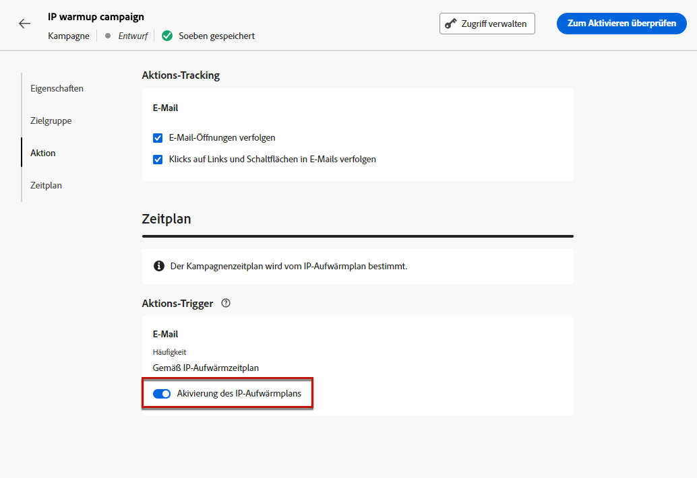
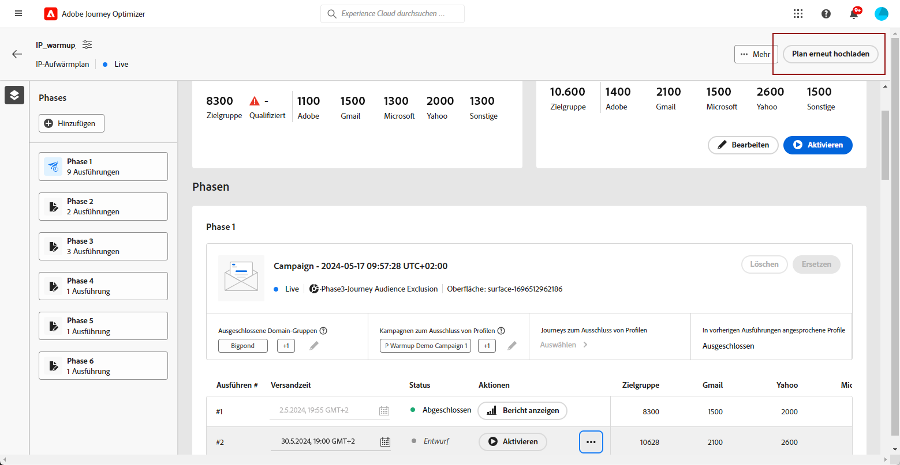
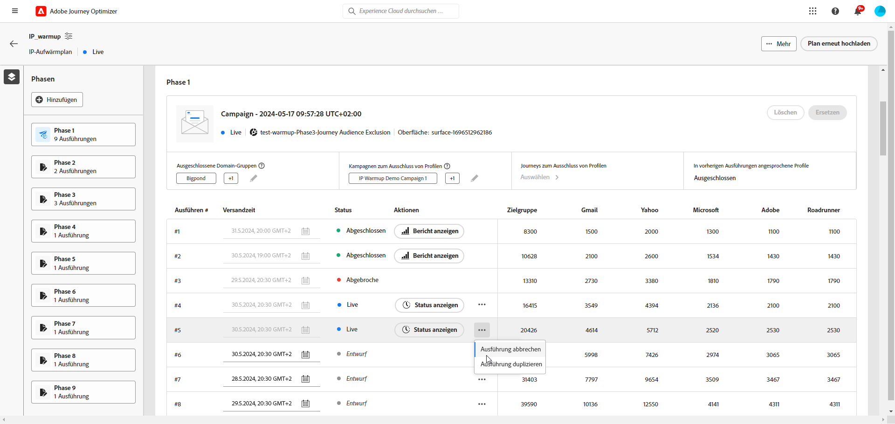

# Implementieren eines IP-Warmup-Plans {#ip-warmup}

<!--
>[!CONTEXTUALHELP]
>id="ajo_admin_ip_warmup_plan"
>title="Define your IP warmup plan"
>abstract="You can perform IP warmup workflows directly from the Journey Optimizer interface in a standardized and efficient way that follows the best practices for optimal deliverability."
-->

>[!AVAILABILITY]
>
>Die IP-Warmup-Funktion ist derzeit nur als Beta-Version für ausgewählte Benutzer verfügbar. Wenden Sie sich an die Kundenunterstützung von Adobe, um am Beta-Programm teilzunehmen.

Mit [!DNL Journey Optimizer]können Sie IP-Warmup-Workflows einfach direkt über die Benutzeroberfläche auf standardisierte und effiziente Weise durchführen, die den Best Practices für eine optimale Zustellbarkeit entspricht.

>[!CAUTION]
>
>Diese Funktion ist nur für den E-Mail-Kanal verfügbar.

Wenn E-Mails über eine neue Plattform versendet werden, sind ISPs normalerweise misstrauisch gegenüber den neuen IP-Adressen. Das plötzliche Versenden großer Mengen an E-Mails veranlasst ISPs oft dazu, sie als Spam zu qualifizieren.

Um zu vermeiden, als Spam gekennzeichnet zu werden, können Sie das gesendete Volumen mithilfe der Funktion IP-Warmup Plan schrittweise erhöhen. Eine neue Option im Menü &quot;Administration&quot;ermöglicht es Ihnen, die Arbeit reibungsloser zu gestalten, anstatt komplexe Journey zu erstellen. Dies gewährleistet eine reibungslose Anlaufphase, da die Gesamtrate ungültiger Adressen verringert wird.

>[!NOTE]
>
>Erfahren Sie mehr über die Verbesserung der Reputation Ihrer E-Mail mit IP-Warming im [Best Practices für die Zustellbarkeit](https://experienceleague.adobe.com/docs/deliverability-learn/deliverability-best-practice-guide/additional-resources/generic-resources/increase-reputation-with-ip-warming.html?lang=de).

<!--
Here are the main steps:

1. You get a deliverability plan from the deliverability consulting team.

1. Create a campaign - marketer [Learn more](#create-ip-warmup-campaign)

1. Your associated practitioner (customer's practitioner/ACS consultant/partner consultant) creates a IP warmup object in project and uploads a plan.

    The CSV manifests itself like below with numbers showing up with/without domain bifurcation. Below screen shows one phase (creative) with associated runs (The plan obviously has more such phases)

1. Practitioner associates the campaign and audience at phase level and turns on some settings as needed for all runs associated with a single creative/campaign

1. Then start to execute on every day basis by simply clicking the play button

1. Reports will continue to show up at campaign level with similar capabilities as today. NO enhancements in BETA. But the IP warmup plan also serves as a consolidated report at one single place of how many executions were done and so on

Benefits are as follows:

* No more creation of daily journeys and associated testing

* Standardization on Campaign which will be easy for practitioners too

* No more pain of creating queries, audiences and testing those as system will create the audiences. At phase level, system ensures that previously targeted + new profiles are picked up AND at iteration level, system ensures that each run is having unique profiles and the count matches what is stated in plan

* Ease of excluding domains and changing the plan with help of simple toggles to exclude OR by editing numbers inline or create new phases or reupload plan if drastic change. No more pain of editing audience definitions, journey conditions

* Single place to manage and view how IP warm is progressing.

* Consolidated report at creative/campaign level as all runs for a phase 

* There is an expectation that with this, it will ease around 30% of effort and will be much better experience for consultant/partner/practitioner - right from planning to execution to reporting
-->

Die wichtigsten Schritte zur Implementierung eines IP-Warmup-Plans sind:

* [Erstellen von IP-Aufwärmekampagnen](#create-ip-warmup-campaign)
* [Definieren eines IP-Warmup-Plans](#define-ip-warmup-plan)

## Erstellen von IP-Aufwärmekampagnen {#create-ip-warmup-campaign}

>[!CONTEXTUALHELP]
>id="ajo_campaign_ip_warmup"
>title="Aktivieren Sie die Option IP-Warmup-Plan ."
>abstract="Wählen Sie die Option zur Aktivierung des IP-Aufwärmungsplans aus. Sobald die Kampagne aktiv ist, kann sie mit einem IP-Warmup-Plan verknüpft werden."

Sie müssen eine oder mehrere Kampagnen mit aktivierter Option erstellen, damit sie in einem IP-Aufwärmplan verwendet werden können. Führen Sie dazu folgende Schritte durch.

1. Erstellen Sie eine [Oberfläche](channel-surfaces.md) für die Domain und die IPs, die Sie für Ihren Warmup-Plan identifiziert haben.

1. Erstellen Sie eine [Kampagne](../campaigns/create-campaign.md) und wählen Sie die [Email](../email/create-email.md#create-email-journey-campaign) Aktion.

1. Wählen Sie die Oberfläche aus, die Sie für die IP-Wärme-Kopplung erstellt haben.

   <!--You must use the same surface as the one that will be used for the asociated IP warmup plan. [Learn how to create an IP warmup plan](#create-ip-warmup-plan)-->

1. Klicken Sie auf **[!UICONTROL Erstellen]**.

1. Aus dem **[!UICONTROL Zeitplan]** Bereich, wählen Sie **[!UICONTROL Aktivierung des IP-Warmlaufplans]**.

   

   Die Kampagne [Zeitplan](../campaigns/create-campaign.md#schedule) wird von dem IP-Warmup-Plan gesteuert, mit dem er verknüpft wird, was bedeutet, dass der Zeitplan in der Kampagne selbst nicht mehr definiert ist.

1. [Aktivieren](../campaigns/review-activate-campaign.md) die Kampagne. Sobald es live ist, kann es in einem IP-Warmup-Plan verwendet werden.

>[!NOTE]
>
>Bei einer Live-Kampagne mit aktiviertem IP-Warmup-Plan wird die Variable **[!UICONTROL Löschen]** -Schaltfläche verfügbar, bis sie mit einem IP-Warmup-Plan verknüpft ist.

Weitere Informationen zur Konfiguration Ihrer Kampagne finden Sie auf [dieser Seite](../campaigns/get-started-with-campaigns.md).

## Definieren eines IP-Warmup-Plans {#define-ip-warmup-plan}

### IP-Aufwärmspläne verwalten {#manage-ip-warmup-plans}

1. Zugriff auf **[!UICONTROL Administration]** > **[!UICONTROL Kanäle]** > **[!UICONTROL IP-Aufwärmspläne]** Menü. Alle bisher erstellten IP-Warmup-Pläne werden angezeigt.

   

1. Sie können nach Status filtern. Die verschiedenen Status sind:

   * **Nicht gestartet**: Es wurde kein Lauf ausgeführt.
   * **Gestartet**: sobald ein Lauf gestartet wurde <!--or is done?-->
   * **Ausgesetzt**
   * **Abgeschlossen**: alle Abläufe im Plan durchgeführt werden.

1. Um einen IP-Aufwärmplan zu löschen, wählen Sie die **[!UICONTROL Löschen]** neben einem Listenelement klicken und den Löschvorgang bestätigen.

   

   >[!CAUTION]
   >
   >Der ausgewählte IP-Warmup-Plan wird endgültig gelöscht.

### Erstellen eines IP-Warmup-Plans {#create-ip-warmup-plan}

>[!CONTEXTUALHELP]
>id="ajo_admin_ip_warmup_upload"
>title="Geben Sie Ihren IP-Warmup-Plan an"
>abstract="Laden Sie die CSV-Vorlage herunter und füllen Sie sie mit Daten für IP-Warmup-Phasen und die Zielanzahl der Profile aus."

>[!CONTEXTUALHELP]
>id="ajo_admin_ip_warmup_surface"
>title="Marketing-Oberfläche auswählen"
>abstract="Sie müssen dieselbe Oberfläche auswählen wie die in der Kampagne, die Sie mit Ihrem IP-Aufwärmplan verbinden möchten."
>additional-url="https://experienceleague.adobe.com/docs/journey-optimizer/using/configuration/channel-surfaces.html?lang=de" text="Einrichten von Kanaloberflächen"
>additional-url="https://experienceleague.adobe.com/docs/journey-optimizer/using/configuration/channel-surfaces.html?lang=de" text="Erstellen von IP-Aufwärmekampagnen"

>[!CAUTION]
>
>Um die IP-Aufwärmspläne zu erstellen, zu bearbeiten und zu löschen, benötigen Sie die **[!UICONTROL Zustellbarkeitsberater]** -Berechtigung.
<!--Learn more on managing [!DNL Journey Optimizer] users' access rights in [this section](../administration/permissions-overview.md).-->

Wenn eine oder mehrere Live-Kampagnen mit **[!UICONTROL Aktivierung des IP-Warmlaufplans]** aktiviert sind, können Sie sie mit einem IP-Warmup-Plan verknüpfen.

>[!CAUTION]
>
>Wenden Sie sich an Ihren Zustellbarkeitsberater, um sicherzustellen, dass Ihre Vorlage für den IP-Warmup-Plan korrekt eingerichtet ist. <!--TBC-->

1. Zugriff auf **[!UICONTROL Administration]** > **[!UICONTROL Kanäle]** > **[!UICONTROL IP-Aufwärmspläne]** Menü und klicken Sie auf **[!UICONTROL IP-Warmup-Plan erstellen]**.

   

1. Füllen Sie die Details des IP-Warmup-Plans aus: Geben Sie ihm einen Namen und eine Beschreibung.

   

1. Wählen Sie eine [Oberfläche](channel-surfaces.md). Es stehen nur Marketingflächen zur Auswahl. [Weitere Informationen zum E-Mail-Typ](../email/email-settings.md#email-type)

   >[!CAUTION]
   >
   >Sie müssen dieselbe Oberfläche auswählen wie die in der Kampagne, die Sie mit Ihrem IP-Aufwärmplan verbinden möchten. [Erfahren Sie, wie Sie eine IP-Warmup-Kampagne erstellen.](#create-ip-warmup-campaign)

1. Laden Sie die Excel-Datei hoch, die Ihren IP-Aufwärmplan enthält.<!--which formats are allowed?-->. Sie können die vom Zustellbarkeitsteam bereitgestellte Vorlage verwenden.<!--TBC?--> [Weitere Informationen](#upload-plan)
   <!--
    You can also download the Excel template from the [!DNL Journey Optimizer] user interface and upload it after filling it with the IP warmup details.-->

   

1. Klicken Sie auf **[!UICONTROL Erstellen]**. Die Anzahl der Phasen, die in der hochgeladenen Datei definiert sind, wird automatisch angezeigt. [Weitere Informationen](#upload-plan)

   

### Einen IP-Warmup-Plan erneut hochladen {#re-upload-plan}

Sie können einen anderen IP-Warmup-Plan über die entsprechende Schaltfläche erneut hochladen.

>[!NOTE]
>
>Die Details des IP-Warmup-Plans ändern sich entsprechend der neu hochgeladenen Datei. Die vollständigen Ausführungen und die aktivierten Ausführungen sind nicht betroffen.

### Hochladen der Datei mit dem Plan {#upload-plan}

Nachfolgend finden Sie ein Beispiel einer Datei mit einem IP-Warmup-Plan.

Jede Phase entspricht einem Zeitraum, der aus mehreren Ausführungen besteht und dem Sie eine Kampagne zuweisen.

Sie haben für jede Ausführung eine bestimmte Anzahl von Empfängern und legen fest, ab welchem Datum diese Ausführung ausgeführt werden soll.

Sie können für die Domänen, an die Sie eine Bereitstellung durchführen möchten, so viele Spalten wie gewünscht haben. In diesem Beispiel haben Sie drei Spalten: Gmail, Adobe und andere, was bedeutet, dass

Die Idee besteht darin, in den ersten Phasen mehr Abläufe zu haben, die Anzahl der Zieladressen schrittweise zu erhöhen und gleichzeitig die Anzahl der Ausführungen zu reduzieren.

### Definieren der Phasen {#define-phases}

>[!CONTEXTUALHELP]
>id="ajo_admin_ip_warmup_campaigns_excluded"
>title="Auswahl der auszuschließenden Kampagnenzielgruppen"
>abstract="Wählen Sie die Zielgruppen aus anderen Kampagnen aus, die Sie aus der aktuellen Phase ausschließen möchten."

>[!CONTEXTUALHELP]
>id="ajo_admin_ip_warmup_domains_excluded"
>title="Auswählen von Domänengruppen zum Ausschließen"
>abstract="Wählen Sie die Domänen aus, die Sie aus der aktuellen Phase ausschließen möchten."

1. Wählen Sie für jede Phase die Kampagne aus, die Sie mit dieser Phase des IP-Aufwärmungsplans verbinden möchten.

   

   Beachten Sie Folgendes:

   * Nur Kampagnen mit der **[!UICONTROL Aktivierung des IP-Warmlaufplans]** Option aktiviert <!--and live?--> stehen zur Auswahl zur Verfügung. [Weitere Informationen](#create-ip-warmup-campaign)

   * Sie müssen eine Kampagne auswählen, die dieselbe Oberfläche wie die für den aktuellen IP-Aufwärmplan ausgewählte verwendet.

   * Es ist nicht möglich, eine Kampagne auszuwählen, die bereits in einer anderen IP-Warmup-Kampagne verwendet wird.

1. Für jede Phase gilt Folgendes:

   * **[!UICONTROL Profilausschluss]** - Die Profile aus den vorherigen Ausführungen dieser Phase werden immer ausgeschlossen. Wenn beispielsweise Leo beim Ausführen von #1 in den ersten 6300 Personen, die angesprochen werden, behandelt wurde, stellt das System automatisch sicher, dass Leo die E-Mail nicht in Ausführung Nr. 2 erhält.

   * **[!UICONTROL Campaign-Zielgruppen ausgeschlossen]** - Wählen Sie die Zielgruppen aus anderen <!--executed/live?-->Kampagnen, die Sie aus der aktuellen Phase ausschließen möchten.

     Beispielsweise können Sie eine Phase ausführen, die aus jedem Grund geteilt werden musste. In diesem Fall möchten Sie in Phase 2 die in Phase 1 verwendete Kampagne in diesen Abschnitt aufnehmen, damit zuvor kontaktierte Personen aus Phase 1 in Phase 2 nicht einbezogen werden. Dies kann nicht nur mit Kampagnen erfolgen, die im selben IP-Warmup-Plan verwendet werden, sondern auch mit einem anderen IP-Warmup-Plan.

   * **[!UICONTROL Domänengruppen ausgeschlossen]** - Wählen Sie die Domänen aus, die Sie von dieser Phase ausschließen möchten, z. B. Gmail. <!--??-->

     Nachdem Sie einige Tage lang IP-Warmup ausgeführt haben, erkennen Sie, dass der ISP-Ruf bei einer Domain sagt, dass Hotmail nicht gut ist und Sie es mit ISP lösen möchten, aber nicht den IP-Warmup-Plan stoppen möchten. In einem solchen Fall können Sie die Domain-Gruppe Hotmail in die ausgeschlossene Kategorie setzen.

     >[!NOTE]
     >
     >Der Domänenausschluss erfordert eine nicht ausgeführte Phase, daher müssen Sie möglicherweise eine laufende Phase aufteilen, um Ausnahmen hinzuzufügen. Gleichermaßen müssen Sie, wenn die Domain-Gruppe keine OOTB-Domänengruppe ist, in Excel eine Domänengruppe erstellen und diese dann hochladen und ausschließen.

   

1. Sie können bei Bedarf eine Phase hinzufügen. Diese wird nach der letzten aktuellen Phase hinzugefügt. Verwenden Sie die **[!UICONTROL Löschphase]** -Schaltfläche, um alle unerwünschten Phasen zu entfernen.

   

   >[!CAUTION]
   >
   >Sie können die **[!UICONTROL Löschen]** Aktion.
   >
   >Wenn Sie alle Phasen aus dem IP-Warmup-Plan löschen, empfehlen wir, einen Plan erneut hochzuladen.

### Definieren der Ausführungen {#define-runs}

1. Wählen Sie für jeden Lauf einen Zeitplan aus. <!--which is actually a window of opportunity. meaning? how many hours? shall we specify that to clarify?-->

   

1. Wählen Sie eine Endzeit aus, d. h. im Grunde das Fenster, in dem wir eine Warmup-Kampagne ausführen können, falls es zu Verzögerungen bei der Ausführung des Audience-Auftrags kommt. Wenn nichts angegeben wird, versuchen wir es zur Startzeit und schlagen fehl. Wenn die Endzeit angegeben ist, wird die Ausführung zwischen diesem Fenster ausgeführt.

1. Aktivieren Sie jeden Lauf. Stellen Sie sicher, dass Sie eine Zeit so früh planen, dass der Segmentierungsauftrag ausgeführt werden kann. <!--explain how you can evaluate a proper time-->

   >[!CAUTION]
   >
   >Jede Ausführung muss mindestens 12 Stunden vor der tatsächlichen Versandzeit aktiviert werden. Andernfalls kann die Segmentierung nicht abgeschlossen sein. <!--How do you know when segmentation is complete? Is there a way to prevent user from scheduling less than 12 hours before the segmentation job?-->

1. Wenn die Kampagnenausführung noch nicht gestartet wurde, können Sie den Start stoppen.

   Sobald die Kampagnenausführung gestartet wurde, wird die **[!UICONTROL Anhalten]** -Schaltfläche nicht mehr verfügbar. <!--TBC in UI-->

   

1. Um eine Ausführung hinzuzufügen, wählen Sie **[!UICONTROL Hinzufügen einer Ausführung unten]** über das Symbol mit den drei Punkten aus.

   

1. Wenn Sie jederzeit eine andere Kampagne verwenden möchten, die von einem bestimmten Lauf ausgehend beginnt, wählen Sie die **[!UICONTROL Option &quot;In neue Phase aufteilen&quot;]** über das Symbol mit den drei Punkten aus. Für die verbleibenden Phasen der aktuellen Phase wird eine neue Phase erstellt. Führen Sie die Schritte aus [above](#define-phases) , um die neue Phase zu definieren.

   Wenn Sie beispielsweise diese Option für die Ausführung Nr. 4 auswählen, werden die Ausführungen Nr. 4 bis Nr. 8 in eine neue Phase verschoben.

<!--
You don't have to decide the campaign upfront. You can do a split later. It's a work in progress plan: you activate one run at a time with a campaign and you always have the flexibility to modify it while working on it.

But need to explain in which case you want to modify campaigns, provide examples
-->

Eine Ausführung kann die folgenden Status haben:<!--TBC with Medha-->:

* **[!UICONTROL Abgeschlossen]**:
* **[!UICONTROL Fehlgeschlagen]**:
* **[!UICONTROL Abgebrochen]**: Sie haben die Ausführung angehalten, bevor die Kampagnenausführung gestartet wurde.

