# Konfigurieren von Landingpages {#lp-configuration}

## Konfigurieren von Landingpage-Subdomains {#lp-subdomains}

>[!CONTEXTUALHELP]
>id="ajo_admin_config_lp_subdomain"
>title="Erstellen einer Landingpage-Voreinstellung"
>abstract="Um eine Landingpage-Voreinstellung erstellen zu können, müssen Sie zuvor mindestens eine Landingpage-Subdomain konfiguriert haben, die aus der Liste „Name der Subdomain“ ausgewählt werden kann."
>additional-url="https://experienceleague.adobe.com/docs/journey-optimizer/using/configuration/lp-configuration.html?lang=de#lp-create-preset" text="Erstellen von Landingpage-Voreinstellungen"

>[!CONTEXTUALHELP]
>id="ajo_admin_subdomain_lp"
>title="Zuweisen einer Subdomain der Landingpage"
>abstract="Sie müssen eine Subdomain für Ihre Landingpages konfigurieren, da Sie diese Subdomain zum Erstellen einer Landingpage-Voreinstellung benötigen. Sie können eine Subdomain verwenden, die bereits an Adobe delegiert wurde, oder eine neue Subdomain konfigurieren."
>additional-url="https://experienceleague.adobe.com/docs/journey-optimizer/using/configuration/lp-configuration.html#lp-create-preset" text="Erstellen von Landingpage-Voreinstellungen"

Um [Landingpage-Voreinstellungen](#lp-create-preset) erstellen zu können, müssen Sie die Subdomains einrichten, die Sie für Ihre Landingpages verwenden werden.

Sie können eine Subdomain verwenden, die bereits an Adobe delegiert wurde, oder eine andere Subdomain konfigurieren. Weitere Informationen zum Delegieren von Subdomains an Adobe finden Sie in [diesem Abschnitt](delegate-subdomain.md).

### Verwenden einer vorhandenen Subdomain {#lp-use-existing-subdomain}

Gehen Sie wie folgt vor, um eine Subdomain zu verwenden, die bereits an Adobe delegiert wurde.

1. Rufen Sie das Menü **[!UICONTROL Administration]** > **[!UICONTROL Kanäle]** auf und wählen Sie **[!UICONTROL E-Mail-Konfiguration]** > **[!UICONTROL Landingpage-Subdomains]**.

   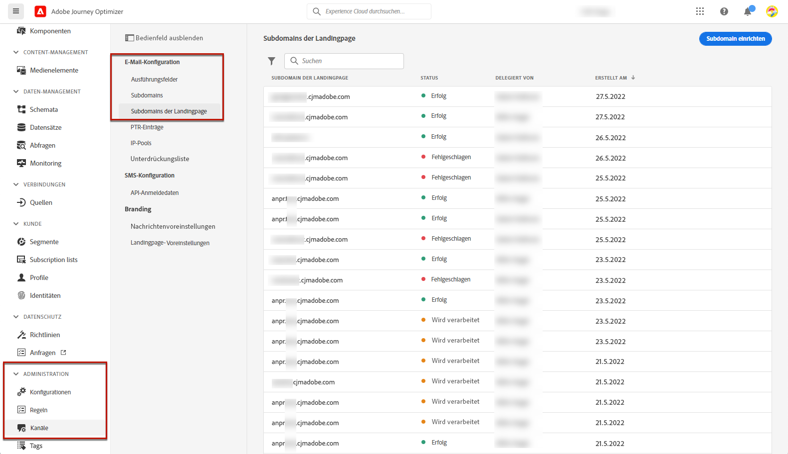

1. Klicken Sie auf **[!UICONTROL Subdomain einrichten]**.

   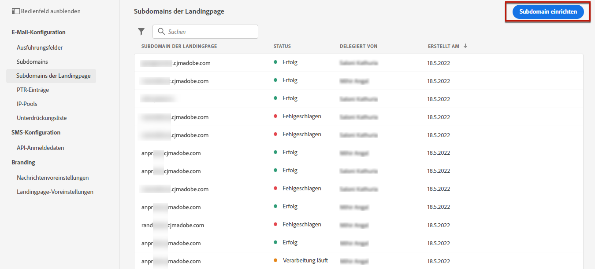

1. Wählen Sie **[!UICONTROL Delegierte Domain verwenden]** im Abschnitt **[!UICONTROL Konfigurationstyp]**.

   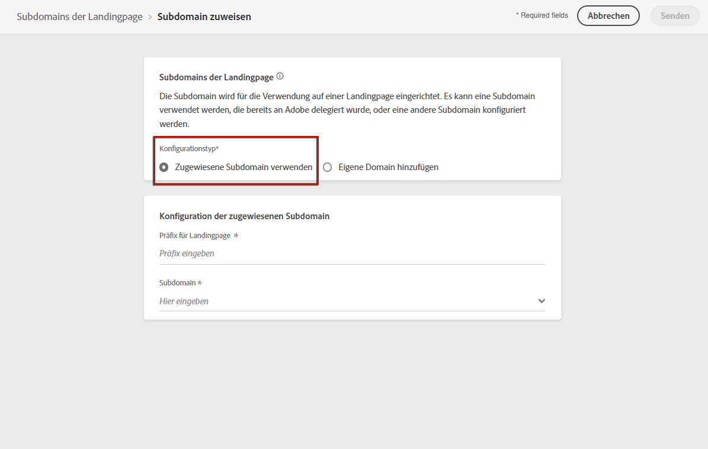

1. Geben Sie das Präfix ein, das in Ihrer Landingpage-URL angezeigt werden soll.

   >[!NOTE]
   >
   >Nur alphanumerische Zeichen und Bindestriche sind zulässig.

1. Wählen Sie aus der Liste eine delegierte Subdomain aus.

   >[!NOTE]
   >
   >Sie können keine Subdomain auswählen, die bereits als Landingpage-Subdomain verwendet wird.

   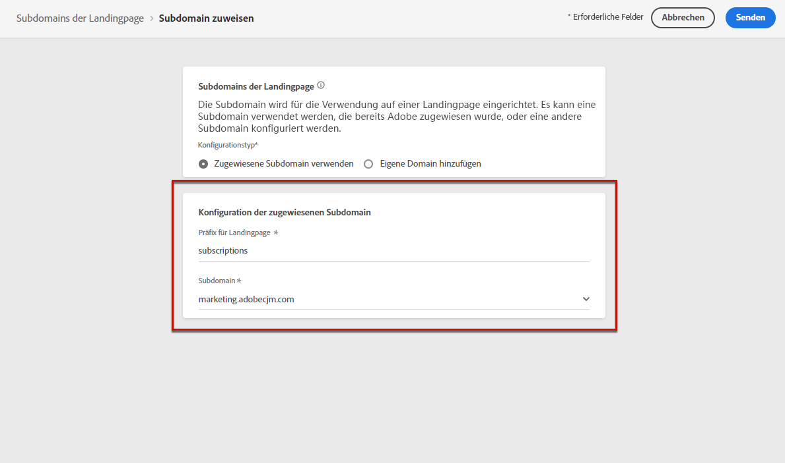

   >[!CAUTION]
   >
   >Wenn Sie eine Domain auswählen, die mit der [CNAME-Methode](delegate-subdomain.md#cname-subdomain-delegation) an Adobe delegiert wurde, müssen Sie den DNS-Eintrag auf Ihrer Hosting-Plattform erstellen. Um den DNS-Eintrag zu generieren, gehen Sie genauso vor wie bei der Konfiguration einer neuen Landingpage-Subdomain. Weitere Informationen dazu finden Sie in [diesem Abschnitt](#lp-configure-new-subdomain).

1. Klicken Sie auf **[!UICONTROL Senden]**.

1. Nach der Übermittlung wird die Subdomain in der Liste mit dem Status **[!UICONTROL Wird verarbeitet]** angezeigt. Weiterführende Informationen zum Status von Subdomains finden Sie in [diesem Abschnitt](access-subdomains.md).<!--Same statuses?-->

   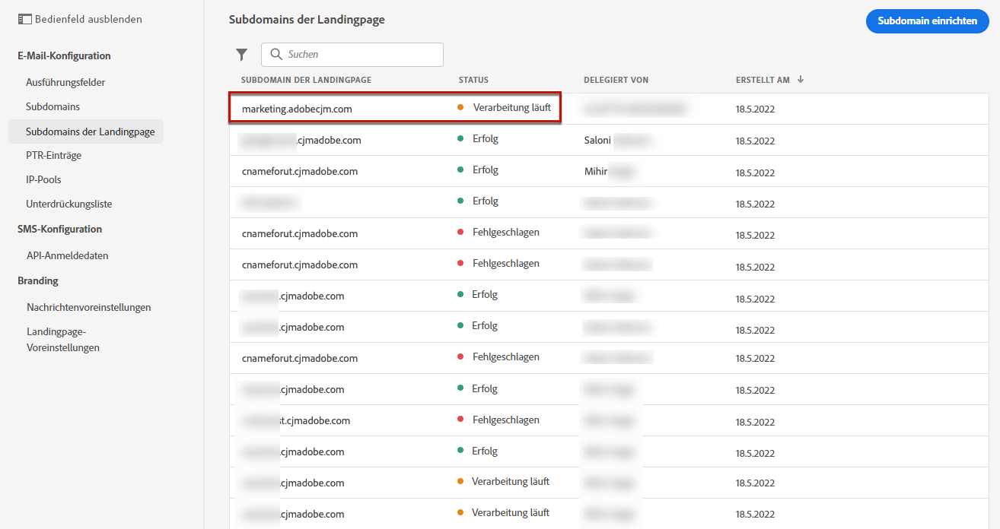

   >[!NOTE]
   >
   >Bevor Sie diese Subdomain zum Senden von Nachrichten verwenden können, müssen Sie warten, bis Adobe die erforderlichen Prüfungen durchgeführt hat, was bis zu 4 Stunden dauern kann.<!--Learn more in [this section](delegate-subdomain.md#subdomain-validation).-->

1. Sobald die Prüfungen erfolgreich abgeschlossen sind, erhält die Subdomain den Status **[!UICONTROL Erfolg]**. Sie können jetzt damit Landingpage-Voreinstellungen erstellen.

### Konfigurieren einer neuen Subdomain {#lp-configure-new-subdomain}

>[!CONTEXTUALHELP]
>id="ajo_admin_lp_subdomain_dns"
>title="Erstellen des passenden DNS-Eintrags"
>abstract="Um eine neue Landingpage-Subdomain zu konfigurieren, müssen Sie die auf der Journey Optimizer-Benutzeroberfläche angezeigten Adobe-Nameserver-Informationen kopieren und in Ihre Domain-Hosting-Lösung einfügen, um den passenden DNS-Eintrag zu generieren. Nachdem die Prüfungen erfolgreich waren, kann die Subdomain zur Erstellung von Landingpage-Voreinstellungen verwendet werden."

Gehen Sie wie folgt vor, um eine neue Subdomain zu konfigurieren.

1. Rufen Sie das Menü **[!UICONTROL Administration]** > **[!UICONTROL Kanäle]** auf und wählen Sie **[!UICONTROL E-Mail-Konfiguration]** > **[!UICONTROL Landingpage-Subdomains]**.

1. Klicken Sie auf **[!UICONTROL Subdomain einrichten]**.

1. Wählen Sie **[!UICONTROL Eigene Domain hinzufügen]** im Abschnitt **[!UICONTROL Konfigurationstyp]**.

   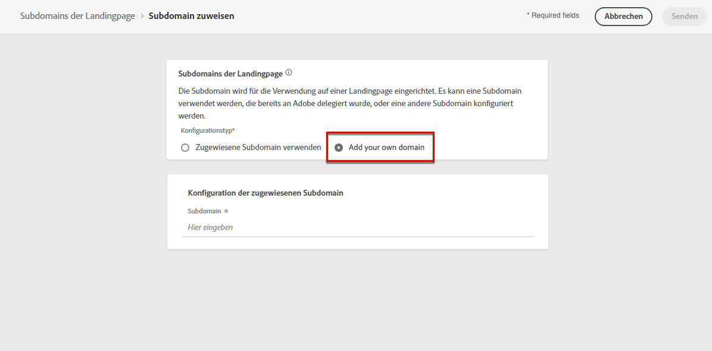

1. Geben Sie die zu delegierende Subdomain an.

   >[!CAUTION]
   >
   >Sie können keine schon vorhandene Landingpage-Subdomain verwenden.

   Es ist nicht zulässig, Adobe eine ungültige Subdomain zuzuweisen. Vergewissern Sie sich, dass Sie eine gültige Subdomain eingeben, die Ihrem Unternehmen gehört, z. B. marketing.ihrunternehmen.com.

   Beachten Sie, dass Subdomains mit mehreren Ebenen, wie etwa „email.marketing.meinefirma.com“, derzeit nicht unterstützt werden.

1. Die Liste der Einträge, die auf Ihren DNS-Servern gespeichert werden sollen, wird angezeigt. Kopieren Sie diesen Datensatz oder laden Sie eine CSV-Datei herunter und navigieren Sie dann zu Ihrer Domain-Hosting-Lösung, um den entsprechenden DNS-Eintrag zu generieren.

1. Stellen Sie sicher, dass in Ihrer Domain-Hosting-Lösung ein DNS-Eintrag generiert wurde. Wenn alles ordnungsgemäß konfiguriert ist, aktivieren Sie die Checkbox „Ich bestätige...“ und klicken Sie dann auf **[!UICONTROL Senden]**.

   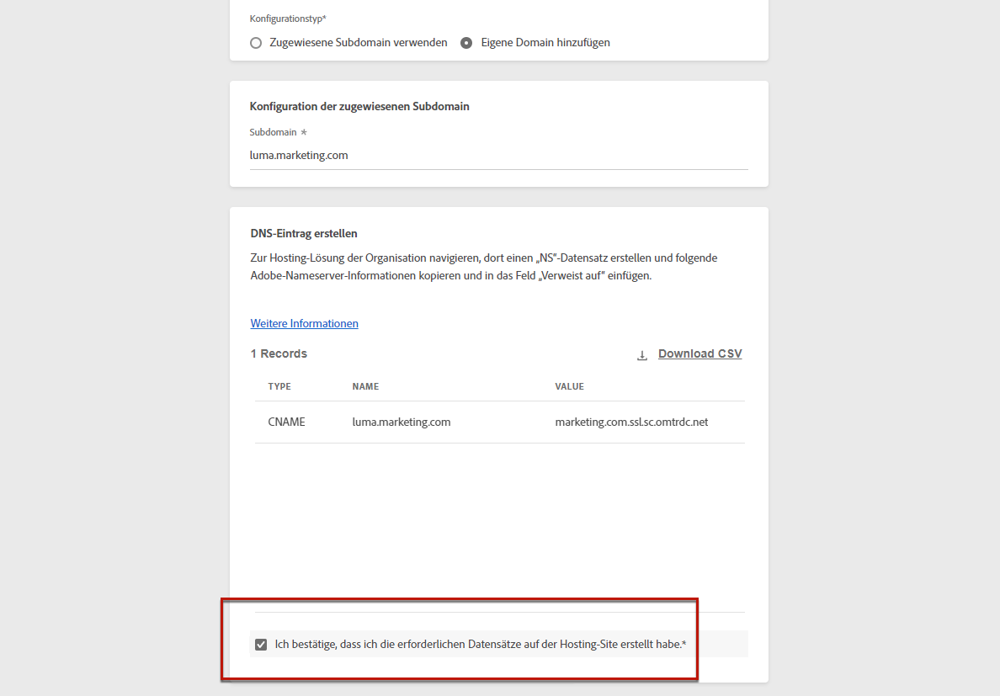

   >[!NOTE]
   >
   >Wenn Sie eine neue Landingpage-Subdomain konfigurieren, verweist sie immer auf einen CNAME-Eintrag.

1. Nachdem die Subdomain-Zuweisung übermittelt wurde, wird die Subdomain in der Liste mit dem Status **[!UICONTROL In Verarbeitung]** angezeigt. Weiterführende Informationen zum Status von Subdomains finden Sie in [diesem Abschnitt](access-subdomains.md).<!--Same statuses?-->

   >[!NOTE]
   >
   >Bevor Sie diese Subdomain zum Senden von Nachrichten verwenden können, müssen Sie warten, bis Adobe die erforderlichen Prüfungen durchgeführt hat, was bis zu 4 Stunden dauern kann.<!--Learn more in [this section](#subdomain-validation).-->

1. Sobald die Prüfungen erfolgreich abgeschlossen sind, erhält die Subdomain den Status **[!UICONTROL Erfolg]**. Sie können jetzt damit Landingpage-Voreinstellungen erstellen.

   Beachten Sie, dass die Subdomain als **[!UICONTROL Fehlgeschlagen]** markiert wird, wenn Sie den Validierungsdatensatz in Ihrer Hosting-Lösung nicht erstellen können.

## Definieren der Landingpage-Voreinstellungen {#lp-define-preset}

Beim [Erstellen einer Landingpage](../landing-pages/create-lp.md#create-a-lp) müssen Sie eine Landingpage-Voreinstellung auswählen, damit Sie die Landingpage erstellen und über **[!DNL Journey Optimizer]** nutzen können.

### Zugriff auf Landingpage-Voreinstellungen {#lp-presets}

Gehen Sie wie folgt vor, um auf Landingpage-Voreinstellungen zuzugreifen.

1. Rufen Sie das Menü **[!UICONTROL Administration]** > **[!UICONTROL Kanäle]** auf.

1. Wählen Sie **[!UICONTROL Branding]** > **[!UICONTROL Landingpage-Voreinstellungen]** aus.

   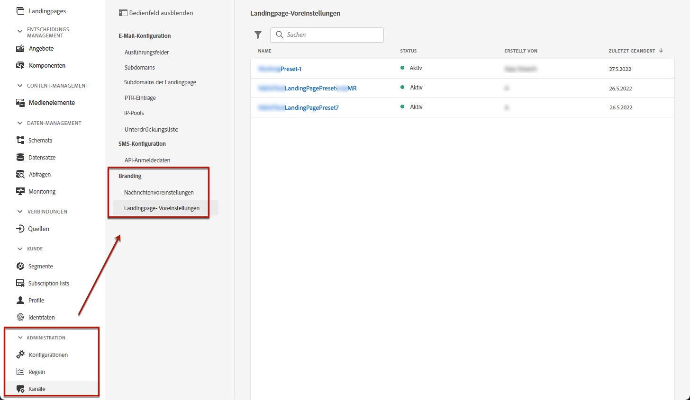

1. Klicken Sie auf eine beliebige Voreinstellungsbeschriftung, um auf die Voreinstellungsdetails der Landingpage zuzugreifen.

   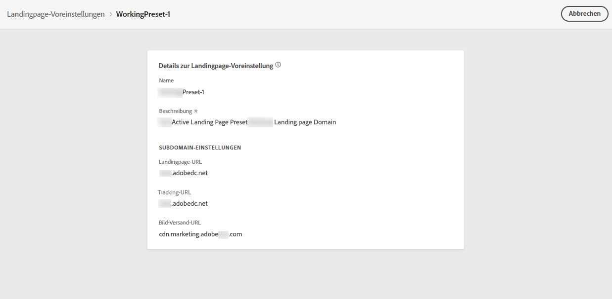

### Erstellen einer Landingpage-Voreinstellung {#lp-create-preset}

Gehen Sie wie folgt vor, um eine Landingpage-Voreinstellung zu erstellen.

>[!NOTE]
>
>Um eine Voreinstellung erstellen zu können, müssen Sie zuvor mindestens eine Landingpage-Subdomain konfiguriert haben. [Weitere Informationen dazu](#lp-subdomains)

1. Rufen Sie das Menü **[!UICONTROL Administration]** > **[!UICONTROL Kanäle]** auf und wählen Sie dann **[!UICONTROL Branding]** > **[!UICONTROL Landingpage-Voreinstellungen]**.

1. Wählen Sie **[!UICONTROL Landingpage-Voreinstellung erstellen]** aus.

   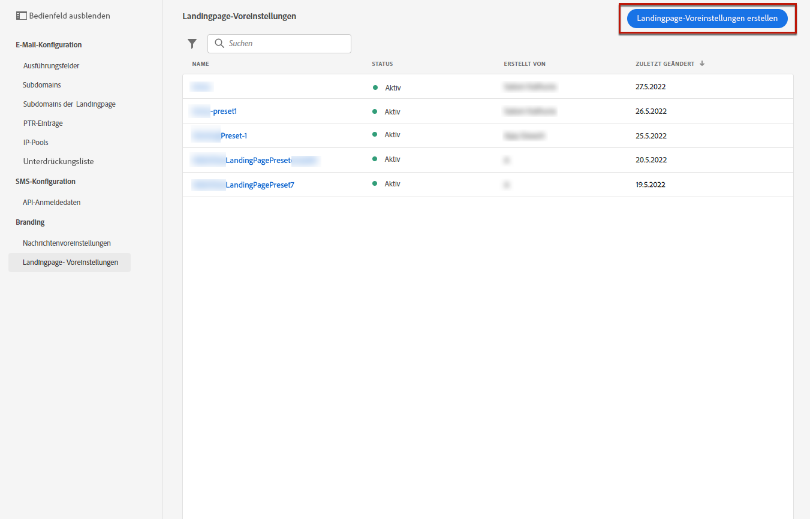

1. Geben Sie einen Namen und eine Beschreibung für die Voreinstellung ein.

   >[!NOTE]
   >
   > Namen müssen mit einem Buchstaben (A–Z) beginnen. Ein Name darf nur alphanumerische Zeichen enthalten. Sie können auch die Zeichen Unterstrich `_`, Punkt `.` und Bindestrich `-` verwenden.

1. Wählen Sie aus der Dropdown-Liste eine Landingpage-Subdomain aus.

   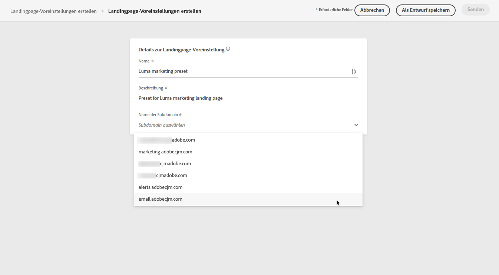

   >[!NOTE]
   >
   >Um eine Subdomain auswählen zu können, müssen Sie zuvor mindestens eine Landingpage-Subdomain konfiguriert haben. [Weitere Informationen dazu](#lp-subdomains)

   Die der ausgewählten Subdomain entsprechenden Einstellungen werden angezeigt.

1. Wenn Sie die Landingpage-Subdomain als Tracking-URL auswählen möchten, aktivieren Sie die Option **[!UICONTROL Wie Subdomain der Landingpage]**. [Weitere Informationen zum Tracking](../design/message-tracking.md)

   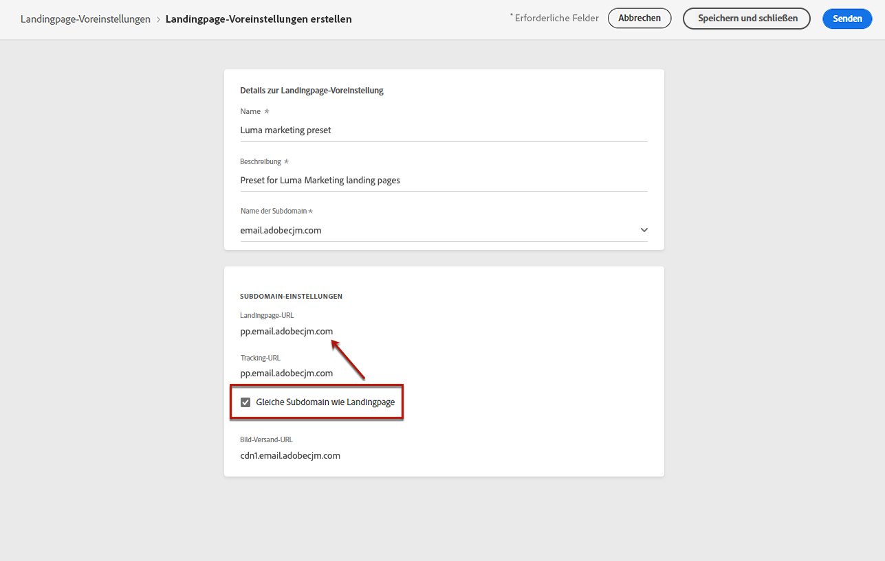

   Wenn zum Beispiel die URL der Landingpage „pages.mail.luma.com“ und die Tracking-URL „data.mail.luma.com“ lautet, können Sie „pages.mail.luma.com“ als Tracking-Subdomain wählen.

1. Klicken Sie auf **[!UICONTROL Senden]**, um die Erstellung der Landingpage-Voreinstellung zu bestätigen. Sie können die Voreinstellung auch als Entwurf speichern und ihre Konfiguration später fortsetzen.

   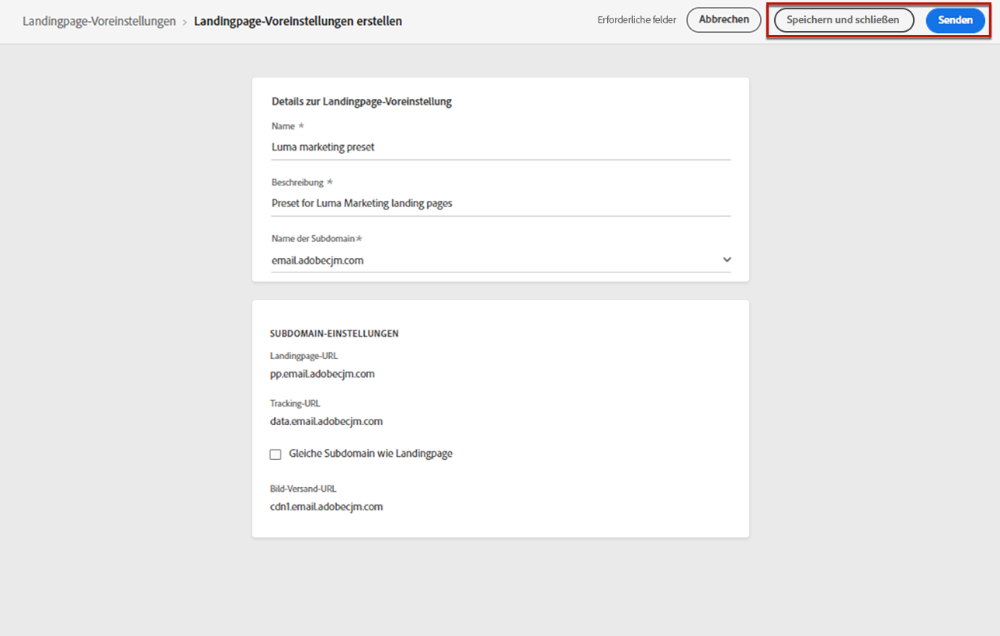

1. Nachdem die Landingpage-Voreinstellung erstellt wurde, wird sie in der Liste mit dem Status **[!UICONTROL Aktiv]** angezeigt. Sie kann nun für Ihre Landingpages verwendet werden.

   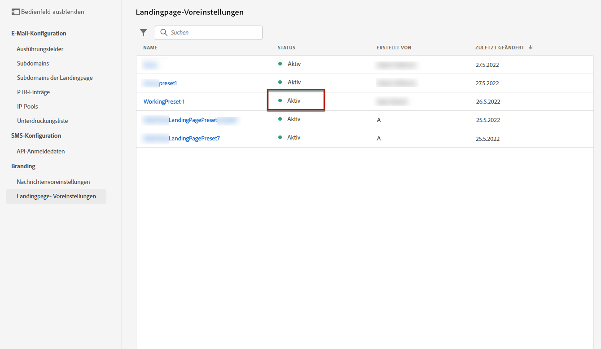

Sie sind nun bereit, in [!DNL Journey Optimizer] [Landingpages zu erstellen](../landing-pages/create-lp.md).

>[!NOTE]
>
>Informationen zum Erstellen von Voreinstellungen für Push-Benachrichtigungen und E-Mails finden Sie in [diesem Abschnitt](message-presets.md).

**Verwandte Themen**:

* [Erste Schritte mit Landingpages](../landing-pages/get-started-lp.md)
* [Erstellen einer Landingpage](../landing-pages/create-lp.md#create-a-lp)
