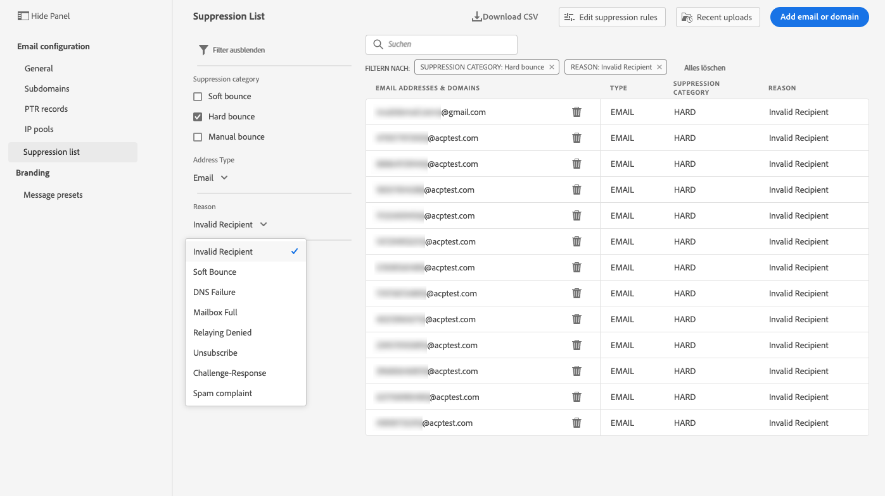
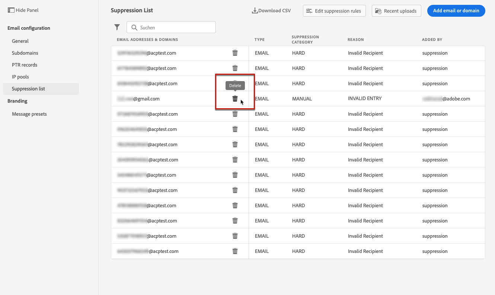
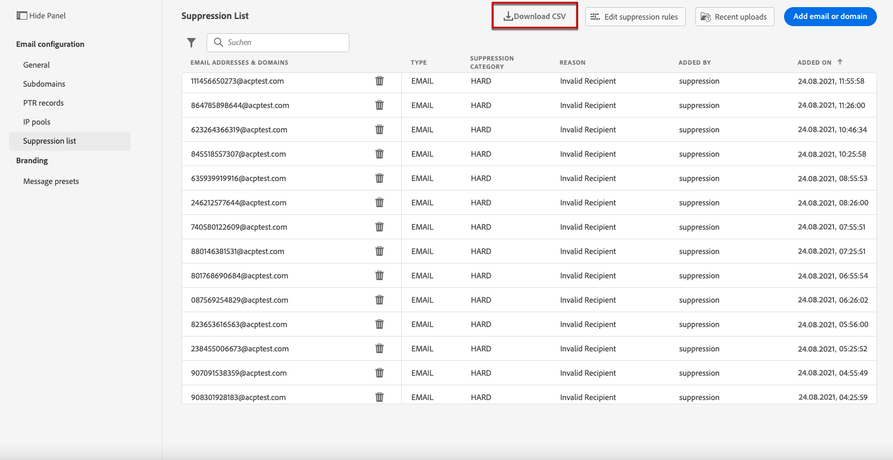
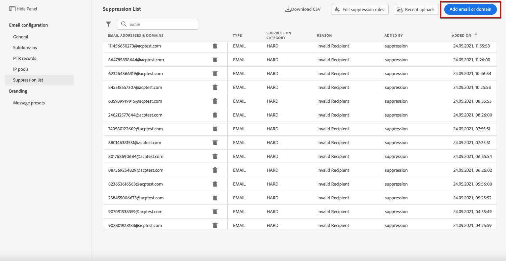
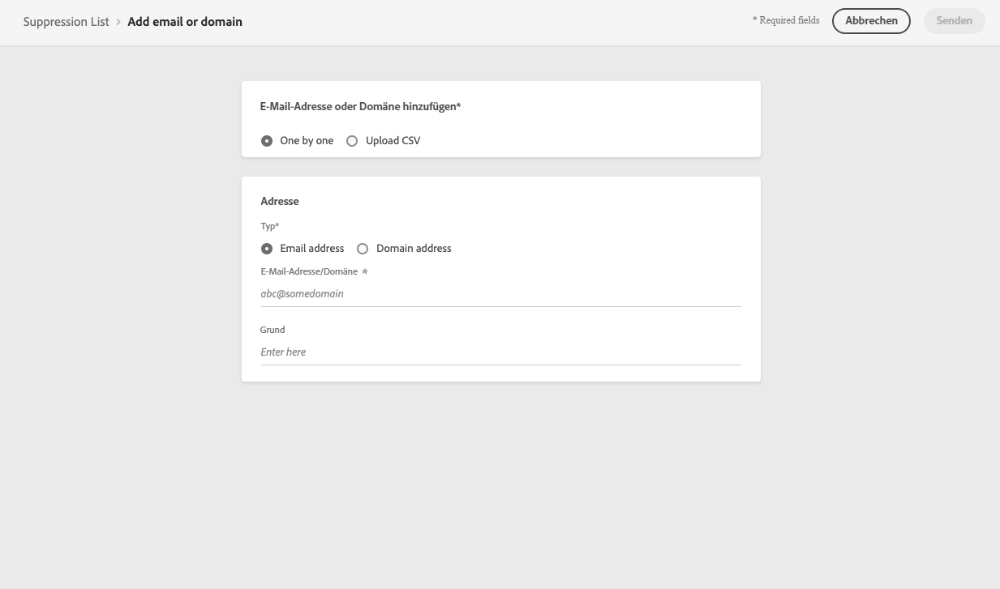
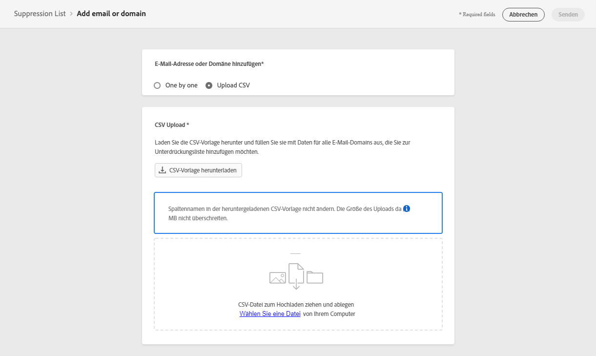
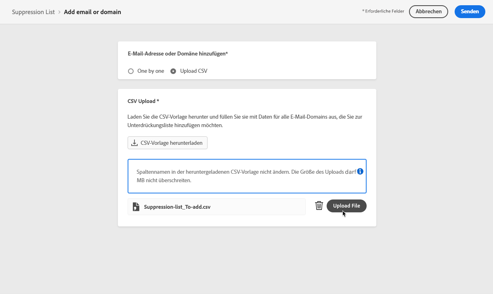
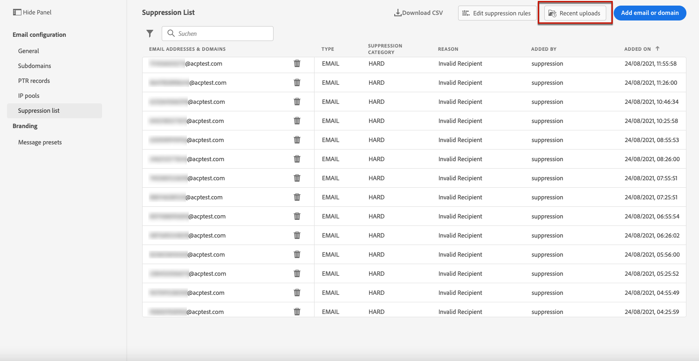
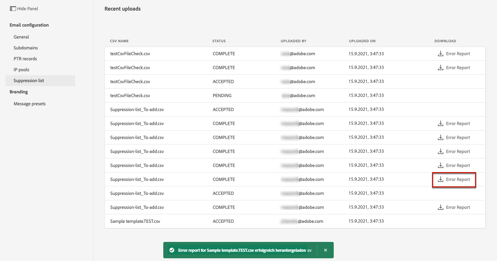

# Verwalten der Unterdrückungsliste {#manage-suppression-list}

Mit [!DNL Journey Optimizer] können Sie alle E-Mail-Adressen überwachen, die automatisch vom Versand einer Journey ausgeschlossen sind, z. B.:

* Ungültige Adressen (Hardbounces).
* Adressen, die konsistent Softbounce verwenden und sich negativ auf Ihre E-Mail-Reputation auswirken könnten, wenn Sie sie weiterhin in Ihre Sendungen einbeziehen.
* Empfänger, die eine Spam-Beschwerde gegen eine Ihrer E-Mails einreichen.

Diese E-Mail-Adressen werden automatisch in der **Unterdrückungsliste** von Journey Optimizer erfasst. Weitere Informationen zum Konzept und zur Verwendung der Unterdrückungsliste finden Sie in [diesem Abschnitt](../suppression-list.md).

## Zugriff auf die Unterdrückungsliste {#access-suppression-list}

Um auf die detaillierte Liste der ausgeschlossenen E-Mail-Adressen zuzugreifen, gehen Sie zu **[!UICONTROL Administration]** > **[!UICONTROL Kanäle]** > **[!UICONTROL E-Mail-Konfiguration]** und wählen Sie **[!UICONTROL Unterdrückungsliste]** aus.

>[!CAUTION]
>
>Die Berechtigungen zum Anzeigen, Exportieren und Verwalten der Unterdrückungsliste sind auf [Journey-Administratoren](../administration/ootb-product-profiles.md#journey-administrator) beschränkt. Weitere Informationen zur Verwaltung der Zugriffsberechtigungen für [!DNL Journey Optimizer] Benutzer finden Sie in [diesem Abschnitt](../administration/permissions-overview.md).

<!--

You can also display the suppression list content using the **[!UICONTROL View suppression list]** link through the **[!UICONTROL Channels]** > **[!UICONTROL Email configuration]** > **[!UICONTROL General]** menu, but this view does not allow you to edit the list.-->


Es stehen Filter zur Verfügung, mit denen Sie die Liste durchsuchen können.

<!---->


Sie können nach der Kategorie **[!UICONTROL Unterdrückung]**, **[!UICONTROL Adresstyp]** oder **[!UICONTROL Grund]** filtern. Wählen Sie für jede Bedingung die von Ihnen gewünschten Optionen aus. Nach der Auswahl können Sie jeden Filter oder alle Filter löschen, die über der Liste angezeigt werden.



Wenn Sie versehentlich manuell eine E-Mail-Adresse oder eine Domain hinzufügen, können Sie mit der Schaltfläche **[!UICONTROL Löschen]** diesen Eintrag entfernen.

>[!CAUTION]
>
>Verwenden Sie niemals die Schaltfläche **[!UICONTROL Löschen]** , um unterdrückte E-Mail-Adressen oder Domänen zu entfernen.



Wenn Sie eine E-Mail-Adresse oder Domain aus der Unterdrückungsliste löschen, wird der Versand an diese Adresse oder Domain fortgesetzt. Dies kann sich daher erheblich auf Ihre Zustellbarkeit und IP-Reputation auswirken und letztendlich dazu führen, dass Ihre IP-Adresse oder Versanddomäne blockiert wird. Erfahren Sie mehr über die Wichtigkeit der Pflege einer Unterdrückungsliste in [diesem Abschnitt](../suppression-list.md).

>[!NOTE]
>
>Gehen Sie beim Löschen von E-Mail-Adressen oder Domains mit besonderer Sorgfalt vor. Im Zweifelsfall kontaktieren Sie einen Zustellbarkeitsexperten.

In der Ansicht **[!UICONTROL Unterdrückungsliste]** können Sie auch Unterdrückungsregeln bearbeiten. [Weitere Informationen](retries.md)

Um die Unterdrückungsliste als CSV-Datei zu exportieren, wählen Sie die Schaltfläche **[!UICONTROL CSV]** herunterladen .



## Unterdrückungskategorien und -gründe {#suppression-categories-and-reasons}

Wenn eine Nachricht an eine E-Mail-Adresse nicht zugestellt werden kann, bestimmt [!DNL Journey Optimizer], warum der Versand fehlgeschlagen ist, und ordnet sie der Kategorie **[!UICONTROL Unterdrückung]** zu.

Die Unterdrückungskategorien lauten wie folgt:

* **Hard**: Die E-Mail-Adresse wird sofort an die Unterdrückungsliste gesendet.

   >[!NOTE]
   >
   >Wenn der Fehler das Ergebnis einer Spam-Beschwerde ist, fällt er auch in die Kategorie **Hard**. Die E-Mail-Adresse des Empfängers, der die Beschwerde eingereicht hat, wird sofort an die Unterdrückungsliste gesendet.

* **Soft**: Bei Softbounces wird eine Adresse an die Unterdrückungsliste gesendet, sobald der Fehlerzähler den Schwellenwert erreicht hat. [Erfahren Sie mehr über weitere Zustellversuche](retries.md)

   <!--
    **Ignored**:
    * When the error occurred for a valid email address but is known to be temporary, such as a failed connection attempt or a temporary technical issue, the email address is added to the suppression list once the error counter reaches the limit threshold. [Learn more on retries](retries.md).
    * When the error is the result of a spam complaint, the email address of the recipient who issued the complaint is immediately sent to the suppression list.
    -->

* **Manuell**: Sie können der Unterdrückungsliste auch manuell eine E-Mail-Adresse oder eine Domäne hinzufügen. [Weitere Informationen](#add-addresses-and-domains)

>[!NOTE]
>
>Weitere Informationen zu Softbounces und Hardbounces finden Sie im Abschnitt [Typen für fehlgeschlagene Sendungen](../suppression-list.md#delivery-failures).

Für jede aufgelistete E-Mail-Adresse können Sie auch den **[!UICONTROL Typ]** (E-Mail oder Domain), **[!UICONTROL Grund]** prüfen, um sie auszuschließen, wer sie hinzugefügt hat und Datum/Uhrzeit, zu der sie der Unterdrückungsliste hinzugefügt wurde.


Mögliche Ursachen für fehlgeschlagene Sendungen sind:

| Grund | Beschreibung | Unterdrückungskategorie |
| --- | --- | --- |
| **[!UICONTROL Ungültiger Empfänger]** | Der Empfänger ist ungültig oder existiert nicht. | Hard |
| **[!UICONTROL Soft-Bounce]** | Die Nachricht führte aus einem anderen Grund als den in dieser Tabelle aufgeführten Soft-Fehlern zu einem Softbounce, z. B. beim Senden über der von einem ISP empfohlenen zulässigen Rate. | Soft |
| **[!UICONTROL DNS-Fehler]** | Die Nachricht führte aufgrund eines DNS-Fehlers zu einem Bounce. | Soft |
| **[!UICONTROL Postfach voll]** | Die Nachricht führte zu einem Bounce, weil das Postfach des Empfängers voll ist und keine weiteren Nachrichten akzeptieren kann. | Soft |
| **[!UICONTROL Weiterleitung verweigert]** | Die Nachricht wurde vom Empfänger blockiert, da eine Weiterleitung nicht zulässig ist. | Soft |
| **[!UICONTROL Challenge-Response]**  | Die Nachricht ist ein Challenge-Response-Test. | Soft |
| **[!UICONTROL Spam-Beschwerde]** | Die Nachricht wurde blockiert, da sie vom Empfänger als Spam gekennzeichnet wurde. | Hard |

>[!NOTE]
>
>Abgemeldete Benutzer erhalten keine E-Mails von [!DNL Journey Optimizer], daher können ihre E-Mail-Adressen nicht an die Unterdrückungsliste gesendet werden. Ihre Entscheidung wird auf der Ebene von Experience Platform gehandhabt. [Weitere Informationen zum Opt-out](../consent.md)

<!--
Removed from the table provided by SparkPost/Momentum:
| **[!UICONTROL Undetermined]** | The bounce reason received from the recipient domain Message Transfer Agent (MTA) could not be identified. | Ignored |
| **[!UICONTROL Too Large]** | The message bounced because it was too large for the recipient. [Retries](retries.md) will be performed: you can edit the message size and re-inject it for delivery. | Ignored |
| **[!UICONTROL Timeout]** | The message timed out, meaning it soft bounced and reached the message retry limit (3.5 days). | Ignored |
| **[!UICONTROL Admin Failure]** | The message was failed according to the policies configured by the sending system administrator. ///For example, if emails are blackholed at the global, domain or binding level using the "blackhole" directive, this bounce code is used. | Ignored |
| **[!UICONTROL Generic Bounce: No RCPT]** | No recipient could be determined for the message. | Ignored |
| **[!UICONTROL Generic Bounce]** | The message failed for unspecified reasons. | Ignored |
| **[!UICONTROL Mail Block]** | The message was blocked by the receiver (i.e. recipient MTA). | Ignored |
| **[!UICONTROL Spam Block]** | The message was blocked by the receiver as coming from a known spam source. It could be a sending IP block for example. | Ignored |
| **[!UICONTROL Spam Content]** | The message content was blocked by the receiver (recipient MTA) as spam. | Ignored |
| **[!UICONTROL Prohibited Attachment]** | The message was blocked by the receiver because it contained an attachment. | Ignored |
| **[!UICONTROL Auto-Reply]** | The message is an auto-reply/vacation mail. | Ignored |
| **[!UICONTROL Transient Failure]** | Message transmission has been temporarily delayed. | Ignored |
| **[!UICONTROL Subscribe]** | The message is a subscribe request. | Ignored |
| **[!UICONTROL Unsubscribe]** | The message is an unsubscribe request. | Hard |
-->

<!--Note to add eventually: If a user is subscribed and [!DNL Journey Optimizer] fails to send emails to their subscribed email address, they will get added to the suppression list.-->

## Manuelles Hinzufügen von Adressen und Domänen {#add-addresses-and-domains}

Wenn eine Nachricht nicht an eine E-Mail-Adresse gesendet werden kann, wird diese Adresse basierend auf der definierten Unterdrückungsregel oder der Anzahl der Bounces automatisch auf die Unterdrückungsliste gesetzt.

Sie können jedoch auch manuell die Unterdrückungsliste [!DNL Journey Optimizer] füllen, um bestimmte E-Mail-Adressen und/oder Domänen von Ihrem Versand auszuschließen.

Sie können E-Mail-Adressen oder Domänen [einzeln ](#add-one-address-or-domain) oder [im Bulk-Modus](#upload-csv-file) über einen CSV-Datei-Upload hinzufügen.

Wählen Sie dazu die Schaltfläche **[!UICONTROL E-Mail oder Domain hinzufügen]** und folgen Sie dann einer der folgenden Methoden.



### Eine Adresse oder Domäne hinzufügen {#add-one-address-or-domain}

1. Wählen Sie die Option **[!UICONTROL Einmal nach dem anderen]** aus.

   

1. Wählen Sie den Adresstyp aus: **[!UICONTROL E-Mail-Adresse]** oder **[!UICONTROL Domain-Adresse]**.

1. Geben Sie die E-Mail-Adresse oder Domain ein, die Sie vom Versand ausschließen möchten.

   >[!NOTE]
   >
   >Vergewissern Sie sich, dass Sie eine gültige E-Mail-Adresse (z. B. abc@company) oder Domain (z. B. abc.company.com) eingeben.

1. Geben Sie bei Bedarf einen Grund an.

1. Klicken Sie auf **[!UICONTROL Senden]**.

### CSV-Datei hochladen {#upload-csv-file}

1. Wählen Sie die Option **[!UICONTROL CSV]** hochladen aus.

   

1. Laden Sie die zu verwendende CSV-Vorlage herunter, die die Spalten und das folgende Format enthält:

   ```
   TYPE,VALUE,COMMENT
   EMAIL,abc@somedomain.com,Comment
   DOMAIN,somedomain.com,Comment
   ```
   Sie können diese Vorlage auch von der Hauptansicht **[!UICONTROL Unterdrückungsliste]** herunterladen.

   >[!CAUTION]
   >
   >Ändern Sie nicht die Namen der Spalten in der CSV-Vorlage.
   >
   >Die Dateigröße darf 1 MB nicht überschreiten.

1. Füllen Sie die CSV-Vorlage mit den E-Mail-Adressen und/oder Domänen aus, die Sie der Unterdrückungsliste hinzufügen möchten.

1. Platzieren Sie nach Abschluss die CSV-Datei per Drag-and-Drop und klicken Sie auf **[!UICONTROL Datei hochladen]**.

   

1. Klicken Sie auf **[!UICONTROL Senden]**.

### Status der letzten Uploads überprüfen {#recent-uploads}

Sie können die Liste der zuletzt hochgeladenen CSV-Dateien überprüfen.

Klicken Sie dazu in der Ansicht **[!UICONTROL Unterdrückungsliste]** auf die Schaltfläche **[!UICONTROL Letzte Uploads]** .



Es werden die neuesten von Ihnen gesendeten Uploads und deren Status angezeigt.

Wenn ein Fehlerbericht mit einer Datei verknüpft ist, können Sie ihn herunterladen, um die aufgetretenen Fehler zu überprüfen.



Nachstehend finden Sie ein Beispiel für die Art der Einträge, die Sie im Fehlerbericht finden:

```
type,value,comments,failureReason
Email,examplemail.com,MANUAL,Invalid format for value: examplemail.com
Email,examplemail,MANUAL,Invalid format for value: examplemail
Email,example@mail,MANUAL,Invalid format for value: example@mail
Domain,example,MANUAL,Invalid format for value: example
Domain,example.!com,MANUAL,Invalid format for value: example.!com
Domain,!examplecom,MANUAL,Invalid format for value: !examplecom
```


