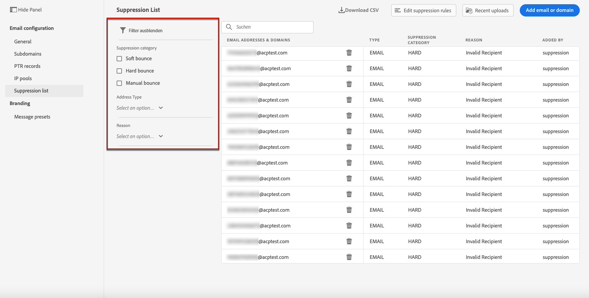

# Verwalten der Unterdrückungsliste {#manage-suppression-list}

Mit [!DNL Journey Optimizer] können Sie alle E-Mail-Adressen überwachen, die automatisch vom Versand einer Journey ausgeschlossen sind, z. B.:

* Adressen, die ungültig sind (Hardbounces) oder diese konsistent Softbounce sind und sich negativ auf Ihre E-Mail-Reputation auswirken könnten, wenn Sie sie weiterhin in Ihre Sendungen einbeziehen.
* Empfänger, die eine Spam-Beschwerde gegen eine Ihrer E-Mails einreichen.

<!--Profiles who unsubscribe from your sendings. Learn more on [opting-out](../consent.md). NOT TRUE as confirmed by eng.: "Subscribe and Unsubscribe are handled by the Consent/Subscription service. A user that opts out will not make it to the suppression list – we won’t send them emails."-->

Diese E-Mail-Adressen werden automatisch in der Journey Optimizer **Unterdrückungsliste** erfasst. Weiterführende Informationen finden Sie in diesem [Abschnitt](../suppression-list.md).

## Zugriff auf die Unterdrückungsliste {#access-suppression-list}

Um auf die detaillierte Liste der ausgeschlossenen E-Mail-Adressen zuzugreifen, öffnen Sie das Menü **[!UICONTROL Kanäle]** > **[!UICONTROL E-Mail-Konfiguration]** > **[!UICONTROL Allgemein]** und klicken Sie dann auf den Link **[!UICONTROL Unterdrückungslisten anzeigen]**.

Es stehen Filter zur Verfügung, mit denen Sie die Liste durchsuchen können.

<!--suppression date,  category and reason, but on staging, only creation date filter is available-->

<!--You can also download the list as a CSV file for analysis and reporting purpose. Won't be available.-->

## Unterdrückungskategorien und -gründe {#suppression-categories-and-reasons}

Wenn eine Nachricht nicht an eine E-Mail-Adresse gesendet werden kann, bestimmt Journey Optimizer, warum der Versand fehlgeschlagen ist, und ordnet sie einer Unterdrückungskategorie zu.

Die Unterdrückungskategorien lauten wie folgt:

* **Hard**: Die E-Mail-Adresse wird sofort an die Unterdrückungsliste gesendet.

* **Soft**: Bei Softbounces wird eine Adresse an die Unterdrückungsliste gesendet, sobald der Fehlerzähler den Grenzwert erreicht hat. [Weitere Informationen zu Wiederholungen](retries.md)

* **Ignoriert**:
   * Wenn der Fehler für eine gültige E-Mail-Adresse aufgetreten ist, aber als temporär bekannt ist, z. B. ein fehlgeschlagener Verbindungsversuch oder ein temporäres technisches Problem, wird die E-Mail-Adresse der Unterdrückungsliste hinzugefügt, sobald der Fehlerzähler den Grenzwert erreicht. [Erfahren Sie mehr über weitere Zustellversuche](retries.md).
   * Wenn der Fehler auf eine Spam-Beschwerde zurückzuführen ist, wird die E-Mail-Adresse des Empfängers, der die Beschwerde ausgegeben hat, sofort an die Unterdrückungsliste gesendet.

<!--**Manual**: You can also manually add an email address to the suppression list. => Manual category will be available when manually adding an address to the suppression list (via API)-->

>[!NOTE]
>
>Weitere Informationen zu Softbounces und Hardbounces finden Sie im Abschnitt [Typen für fehlgeschlagene Sendungen](../suppression-list.md#delivery-failures) .

Für jede aufgelistete E-Mail-Adresse können Sie auch den **[!UICONTROL Grund]** überprüfen, um sie auszuschließen und das Datum/die Uhrzeit, zu dem/der sie der Unterdrückungsliste hinzugefügt wurde.

<!--to replace with suppression-list.png when Manual category is available (through API)-->

Mögliche Ursachen für fehlgeschlagene Sendungen sind:

| Grund | Beschreibung | Unterdrückungskategorie |
---------|----------|--------- |
| **[!UICONTROL Unbestimmt]** | Der Bounce-Grund, der vom Empfänger-Domain Message Transfer Agent (MTA) empfangen wurde, konnte nicht identifiziert werden. | Ignoriert |
| **[!UICONTROL Ungültiger Empfänger]** | Der Empfänger ist ungültig oder existiert nicht. | Hard |
| **[!UICONTROL Soft-Bounce]** | Der Softbounce der Nachricht ist aus einem anderen Grund als den in dieser Tabelle aufgeführten Softbounces abgestürzt, z. B. wenn die von einem ISP empfohlene zulässige Rate übergeben wird. | Soft |
| **[!UICONTROL DNS-Fehler]** | Die Nachricht ist aufgrund eines DNS-Fehlers abgestürzt. | Soft |
| **[!UICONTROL Postfach voll]** | Die Nachricht ist abgestürzt, weil das Postfach des Empfängers voll ist und keine weiteren Nachrichten akzeptieren kann. | Soft |
| **[!UICONTROL Zu groß]** | Die Nachricht bounce, weil sie für den Empfänger zu groß war.  Wiederholungen werden durchgeführt: Sie können die Nachrichtengröße ändern und die Nachricht für den Versand erneut injizieren. | Ignoriert |
| **[!UICONTROL Zeitüberschreitung]** | Die Nachricht ist abgestürzt, was bedeutet, dass sie nicht mehr reagiert und das Wiederholungslimit für Nachrichten (3,5 Tage) erreicht hat. | Ignoriert |
| **[!UICONTROL Administratorfehler]** | Die Nachricht war gemäß den vom Versandsystemadministrator konfigurierten Richtlinien fehlgeschlagen. <!--For example, if emails are blackholed at the global, domain or binding level using the "blackhole" directive, this bounce code is used.--> | Ignoriert |
| **[!UICONTROL Generischer Bounce: Kein RCPT]** | Für die Nachricht konnte kein Empfänger bestimmt werden. | Ignoriert |
| **[!UICONTROL Generischer Bounce]** | Die Nachricht schlug aus unbestimmten Gründen fehl. | Ignoriert |
| **[!UICONTROL E-Mail-Block]** | Die Nachricht wurde vom Empfänger (d. h. Empfänger-MTA) blockiert. | Ignoriert |
| **[!UICONTROL Spam-Block]** | Die Nachricht wurde vom Empfänger als von einer bekannten Spam-Quelle kommend blockiert. Es kann sich beispielsweise um einen Versand-IP-Block handeln. | Ignoriert |
| **[!UICONTROL Spam-Inhalt]** | Der Nachrichteninhalt wurde vom Empfänger (Empfänger-MTA) als Spam blockiert. | Ignoriert |
| **[!UICONTROL Verbotene Anlage]** | Die Nachricht wurde vom Empfänger blockiert, da sie einen Anhang enthielt. | Ignoriert |
| **[!UICONTROL Verweigern]** | Die Nachricht wurde vom Empfänger blockiert, da eine Umlagerung nicht zulässig ist. | Soft |
| **[!UICONTROL Automatische Antwort]** | Die Nachricht ist eine automatische Antwort-/Urlaubsmail. | Ignoriert |
| **[!UICONTROL Übergangsfehler]** | Die Nachrichtenübertragung wurde zeitweilig verzögert. | Ignoriert |
| **[!UICONTROL Challenge-Response]** | Die Nachricht ist eine Challenge-Response-Sonde. | Soft |

>[!NOTE]
>
>Abgemeldete Benutzer erhalten keine E-Mails von [!DNL Journey Optimizer], daher können ihre E-Mail-Adressen nicht an die Unterdrückungsliste gesendet werden. Ihre Wahl wird auf der Ebene der Experience Platform getroffen. Weitere Informationen finden Sie unter [Opt-out](../consent.md).

<!--
Removed from the table provided by SparkPost/Momentum:
| **[!UICONTROL Subscribe]** | The message is a subscribe request. | Ignored |
| **[!UICONTROL Unsubscribe]** | The message is an unsubscribe request. | Hard |
-->

<!--Note to add eventually: If a user is subscribed and [!DNL Journey Optimizer] fails to send emails to their subscribed email address, they will get added to the suppression list. (not sure it's possible to subscribe through AJO or need to find reference to Experience Platform doc?)-->

