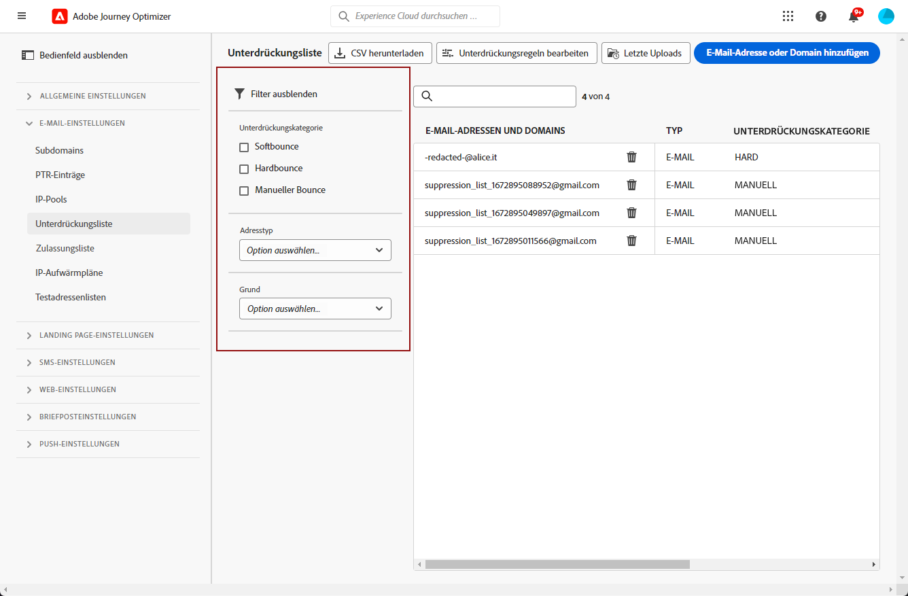
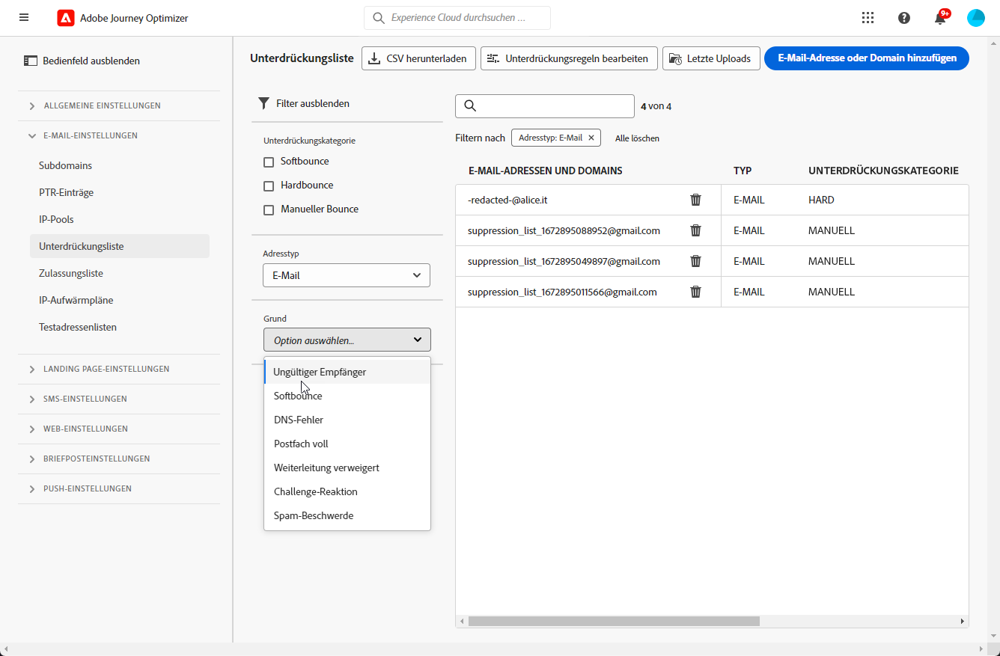
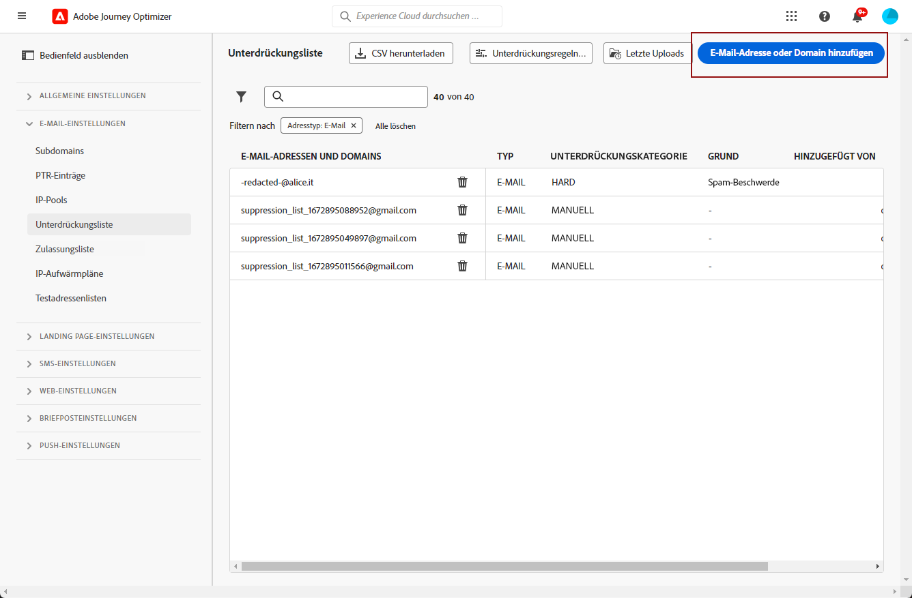
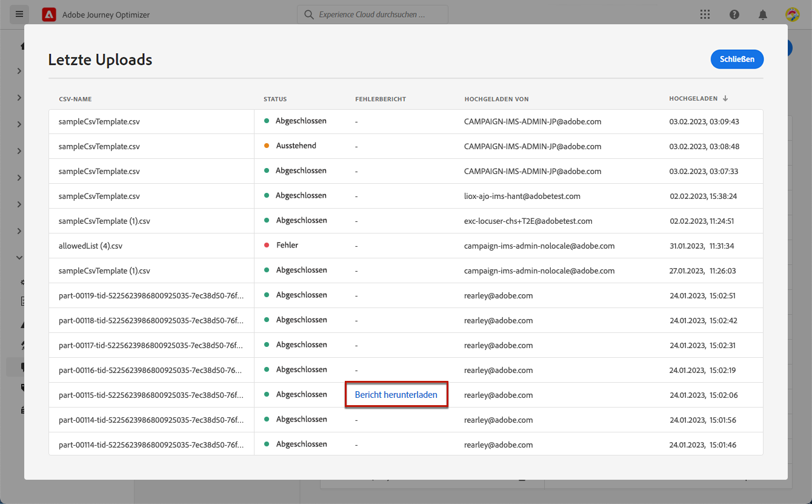

# Verwalten der Unterdrückungsliste {#manage-suppression-list}

Mit [!DNL Journey Optimizer] können Sie alle E-Mail-Adressen überwachen, die in einer Journey oder einer Kampagne automatisch vom Versand ausgeschlossen werden, z. B. Hard Bounces, Soft Bounces und Spam-Beschwerden.

Diese E-Mail-Adressen werden automatisch in der **Unterdrückungsliste** von Journey Optimizer erfasst. Eine Unterdrückungsliste besteht aus Adressen und Domains, die Sie von Ihren Zielgruppen ausschließen möchten. Sie sammelt E-Mail-Adressen und Domains, die für alle Mailings in einer Einzel-Client-Umgebung unterdrückt werden, d. h. spezifisch für eine Organisations-ID, die mit einer Sandbox-ID verbunden ist.

Weitere Informationen zum Konzept und zur Verwendung der Unterdrückungsliste finden Sie in [diesem Abschnitt](../reports/suppression-list.md).

>[!NOTE]
>
>Adobe führt eine aktualisierte Liste bekannter schlechter Adressen, die nachweislich die Interaktion und die Sender-Reputation beeinträchtigen, und stellt sicher, dass E-Mails an diese Adressen nicht zugestellt werden. Diese Liste wird in einer globalen Unterdrückungsliste verwaltet, die für alle Adobe-Kunden gleich ist. Die Adressen und Domain-Namen in der globalen Unterdrückungsliste sind verborgen. In den Versandberichten wird nur die Anzahl der ausgeschlossen Empfänger angegeben.

Darüber hinaus können Sie über die **Unterdrückungs-REST-API** von Journey Optimizer Ihre ausgehenden Nachrichten mithilfe von Unterdrückungs- und Zulassungslisten steuern. [Erfahren Sie, wie man mit der Unterdrückungs-REST-API arbeitet](https://developer.adobe.com/journey-optimizer-apis/references/suppression/){target="_blank"}

## Zugriff auf die Unterdrückungsliste {#access-suppression-list}

Um auf die detaillierte Liste der ausgeschlossenen E-Mail-Adressen und Domains zuzugreifen, wechseln Sie zu **[!UICONTROL Administration]** > **[!UICONTROL Kanäle]** > **[!UICONTROL E-Mail-Konfiguration]**, und wählen Sie **[!UICONTROL Unterdrückungsliste]**.


>[!CAUTION]
>
>Die Berechtigungen zum Anzeigen, Exportieren und Verwalten der Unterdrückungsliste sind auf [Journey-Administratoren](../administration/ootb-product-profiles.md#journey-administrator) beschränkt. Weitere Informationen zur Verwaltung der Zugriffsberechtigungen für [!DNL Journey Optimizer]-Benutzer finden Sie in [diesem Abschnitt](../administration/permissions-overview.md).


Es stehen Filter zur Verfügung, mit denen Sie die Liste durchsuchen können.



Sie können nach **[!UICONTROL Unterdrückungskategorie]**, **[!UICONTROL Adresstyp]** oder **[!UICONTROL Grund]** filtern. Wählen Sie für jedes Kriterium eine oder mehrere Optionen aus. Nach der Auswahl können Sie einzelne oder alle Filter löschen, die oben auf der Liste angezeigt werden.




## Fehlerursachen verstehen {#suppression-categories-and-reasons}

Wenn eine Nachricht nicht an eine E-Mail-Adresse gesendet werden kann, bestimmt [!DNL Journey Optimizer], warum der Versand fehlgeschlagen ist, und ordnet ihr eine **[!UICONTROL Unterdrückungskategorie]** zu.

Die Unterdrückungskategorien lauten wie folgt:

* **Hard**: Ein Hardbounce weist auf eine ungültige E-Mail-Adresse hin (d. h. eine E-Mail-Adresse, die nicht existiert). Dies beinhaltet eine Bounce-Nachricht des empfangenden E-Mail-Servers, in der explizit angegeben wird, dass die Adresse ungültig ist. Die E-Mail-Adresse wird sofort an die Unterdrückungsliste gesendet.

  Wenn der Fehler das Ergebnis einer Spam-Beschwerde ist, fällt er auch in die Kategorie **Hard**. Die E-Mail-Adresse des Empfängers, der die Beschwerde eingereicht hat, wird sofort an die Unterdrückungsliste gesendet.

* **Soft**: Ein Softbounce ist ein temporärer E-Mail-Bounce, der für eine gültige E-Mail-Adresse aufgetreten ist. Die E-Mail-Adresse wird nach mehreren Wiederholungsversuchen zur Unterdrückungsliste hinzugefügt. Soft-Fehler senden eine Adresse an die Unterdrückungsliste, sobald der Fehlerzähler den Grenzwert erreicht. [Erfahren Sie mehr über Wiederholungen](retries.md)

* **Manuell**: Manuelle Fehler wurden manuell zur Unterdrückungsliste hinzugefügt. [Weitere Informationen](#add-addresses-and-domains)

Für jede aufgelistete E-Mail-Adresse können Sie auch den **[!UICONTROL Typ]** (E-Mail oder Domain), den **[!UICONTROL Grund]**, der zum Ausschluss führte, die Person, die die E-Mail-Adresse zur Unterdrückungsliste hinzufügte, und das Datum mit Uhrzeit, zu dem die Adresse der Unterdrückungsliste hinzugefügt wurde, überprüfen.


Mögliche Ursachen für einen fehlgeschlagenen Versand sind:

| Grund | Beschreibung | Kategorie |
| --- | --- | --- |
| **[!UICONTROL Ungültiger Empfänger]** | Der Empfänger ist ungültig oder existiert nicht. | Hard |
| **[!UICONTROL Soft-Bounce]** | Die Nachricht führte aus einem anderen Grund als den in dieser Tabelle aufgeführten Soft-Fehlern zu einem Softbounce, z. B. beim Senden über der von einem ISP empfohlenen zulässigen Rate. | Soft |
| **[!UICONTROL DNS-Fehler]** | Die Nachricht führte aufgrund eines DNS-Fehlers zu einem Bounce. | Soft |
| **[!UICONTROL Postfach voll]** | Die Nachricht führte zu einem Bounce, weil das Postfach des Empfängers voll ist und keine weiteren Nachrichten akzeptieren kann. | Soft |
| **[!UICONTROL Weiterleitung verweigert]** | Die Nachricht wurde vom Empfänger blockiert, da eine Weiterleitung nicht zulässig ist. | Soft |
| **[!UICONTROL Challenge-Response]** | Die Nachricht ist ein Challenge-Response-Test. | Soft |
| **[!UICONTROL Spam-Beschwerde]** | Die Nachricht wurde blockiert, da sie vom Empfänger als Spam gekennzeichnet wurde. | Hard |

>[!NOTE]
>
>Abgemeldete Benutzer erhalten keine E-Mails von [!DNL Journey Optimizer], daher können ihre E-Mail-Adressen nicht an die Unterdrückungsliste gesendet werden. Ihre Entscheidung wird auf der Ebene von Experience Platform gehandhabt. [Weitere Informationen zum Opt-out](../privacy/opt-out.md)


### Unterdrückungsregeln  {#suppression-rules}

In der Ansicht **[!UICONTROL Unterdrückungsliste]** können Sie über die Schaltfläche **[!UICONTROL Unterdrückungsregeln bearbeiten]** auch die mit den Unterdrückungsregeln verbundenen Wiederholungsparameter bearbeiten. Verwenden Sie diese Option, um den Schwellenwert für Wiederholungsversuche für die aktuelle Sandbox zu aktualisieren. [Erfahren Sie mehr über weitere Zustellversuche](retries.md).


## Adressen und Domains zur Unterdrückungsliste hinzufügen{#add-addresses-and-domains}

>[!CONTEXTUALHELP]
>id="ajo_admin_suppression_list_header"
>title="Hinzufügen von E-Mails/Domains zur Unterdrückungsliste"
>abstract="Sie können die Unterdrückungsliste von Journey Optimizer manuell ausfüllen, um bestimmte E-Mail-Adressen und/oder Domains vom Versand auszuschließen."

>[!CONTEXTUALHELP]
>id="ajo_admin_suppression_list"
>title="Hinzufügen von E-Mails/Domains zur Unterdrückungsliste"
>abstract="Um die Unterdrückungsliste zu füllen, können Sie E-Mail-Adressen oder Domains manuell hinzufügen – einzeln oder im Bulk-Modus über das Hochladen einer CSV-Datei. Diese spezifischen E-Mail-Adressen und/oder Domains sind vom Versand ausgeschlossen."

Wenn eine Nachricht nicht an eine E-Mail-Adresse gesendet werden kann, wird diese Adresse basierend auf der definierten Unterdrückungsregel oder der Anzahl der Bounces automatisch auf die Unterdrückungsliste gesetzt.

Sie können die [!DNL Journey Optimizer]-Unterdrückungsliste jedoch auch manuell füllen, um bestimmte E-Mail-Adressen und/oder Domains von Ihrem Versand auszuschließen.

>[!NOTE]
>
>Es kann bis zu 60 Minuten dauern, bis [!DNL Journey Optimizer] die unterdrückten Adressen in ausgehenden E-Mails berücksichtigt.

Sie können E-Mail-Adressen oder Domains [einzeln](#add-one-address-or-domain) oder [im Bulk-Modus](#upload-csv-file) über einen CSV-Datei-Upload hinzufügen.

### Eine einzelne Adresse oder Domain hinzufügen {#add-one-address-or-domain}

>[!CONTEXTUALHELP]
>id="ajo_admin_suppression_list_address"
>title="Hinzufügen eines Elements zur Unterdrückungsliste"
>abstract="Sie können E-Mail-Adressen und/oder Domains einzeln zur Unterdrückungsliste hinzufügen."

Um eine E-Mail-Adresse oder eine Domain zur Unterdrückungsliste hinzuzufügen, führen Sie die folgenden Schritte aus:

1. Klicken Sie auf die Schaltfläche **[!UICONTROL E-Mail-Adresse oder Domain hinzufügen]**.

   

1. Wählen Sie die Option **[!UICONTROL Nacheinander]**.

   

1. Wählen Sie den Adresstyp: **[!UICONTROL E-Mail]** oder **[!UICONTROL Domain]**.

1. Geben Sie die E-Mail-Adresse oder Domain ein, die Sie vom Versand ausschließen möchten.

   >[!NOTE]
   >
   >Vergewissern Sie sich, dass Sie eine gültige E-Mail-Adresse (z. B. abc@firma.com) oder Domain (z. B. abc.firma.com) eingeben.

1. (optional) Geben Sie einen Grund ein. Alle druckbaren ASCII-Zeichen zwischen 32 und 126 sind in diesem Feld zulässig.

1. Verwenden Sie die Schaltfläche **[!UICONTROL Senden]** zur Bestätigung.

### CSV-Datei hochladen {#upload-csv-file}

>[!CONTEXTUALHELP]
>id="ajo_admin_suppression_list_csv"
>title="Hochladen von CSV-Dateien, um Elemente zur Unterdrückungsliste hinzuzufügen"
>abstract="Sie können eine CSV-Datei mit den E-Mail-Adressen/Domains, die Sie ausschließen möchten, in die Unterdrückungsliste hochladen."

Um eine Gruppe von E-Mail-Adressen oder eine Domain zur Unterdrückungsliste hinzuzufügen, führen Sie die folgenden Schritte aus:

1. Klicken Sie auf die Schaltfläche **[!UICONTROL E-Mail-Adresse oder Domain hinzufügen]**.
1. Wählen Sie die Option **[!UICONTROL CSV hochladen]**.

   

1. Laden Sie die zu verwendende CSV-Vorlage herunter, die die folgenden Spalten und das folgende Format enthält:

   ```
   TYPE,VALUE,COMMENT
   EMAIL,abc@somedomain.com,Comment
   DOMAIN,somedomain.com,Comment
   ```

1. Füllen Sie die CSV-Vorlage mit den E-Mail-Adressen und/oder Domains aus, die der Unterdrückungsliste hinzugefügt werden sollen. Alle druckbaren ASCII-Zeichen zwischen 32 und 126 sind in der Spalte **KOMMENTAR** zulässig.

   >[!CAUTION]
   >
   >Ändern Sie den Namen der Spalten in der CSV-Vorlage nicht.
   >
   >Die Dateigröße darf 1 MB nicht überschreiten.
   >

1. Wenn Sie fertig sind, ziehen Sie Ihre CSV-Datei per Drag-and-Drop und bestätigen Sie mithilfe der Schaltfläche **[!UICONTROL Senden]**.

   

Sobald der Upload abgeschlossen ist, können Sie den Status des Uploads über die Schaltfläche [Aktuelle Uploads](#recent-uploads) überprüfen, wie unten beschrieben.

### Status der Uploads prüfen {#recent-uploads}

Verwenden Sie die Schaltfläche **[!UICONTROL Letzte Uploads]**, um den Status der zuletzt hochgeladenen CSV-Dateien zu überprüfen.


Mögliche Status sind:

* **[!UICONTROL Ausstehend]**: Der Datei-Upload wird ausgeführt.
* **[!UICONTROL Fehler]**: Der Datei-Upload-Vorgang ist aufgrund eines technischen Problems oder eines Dateiformatfehlers fehlgeschlagen.
* **[!UICONTROL Fertig]**: Der Datei-Upload-Vorgang wurde erfolgreich abgeschlossen.

Wenn beim Hochladen einige Adressen nicht das richtige Format aufweisen, werden sie nicht zur [!DNL Journey Optimizer]-Unterdrückungsliste hinzugefügt.

Wenn der Upload abgeschlossen ist, wird er in diesem Fall mit einem Bericht verknüpft. Sie können ihn herunterladen, um die aufgetretenen Fehler zu überprüfen<!-- and understand why they were not added to the suppression list-->.



Nachstehend finden Sie ein Beispiel für die Art der Einträge, die Sie im Fehlerbericht finden:

```
type,value,comments,failureReason
Email,examplemail.com,MANUAL,Invalid format for value: examplemail.com
Email,examplemail,MANUAL,Invalid format for value: examplemail
Email,example@mail,MANUAL,Invalid format for value: example@mail
Domain,example,MANUAL,Invalid format for value: example
Domain,example.!com,MANUAL,Invalid format for value: example.!com
Domain,!examplecom,MANUAL,Invalid format for value: !examplecom
```

## Eine Adresse aus der Unterdrückungsliste entfernen{#remove-from-suppression-list}

Sie können die Unterdrückungsliste manuell aktualisieren. Das Entfernen einer E-Mail-Adresse aus der Quarantäne ist ein sensibler Vorgang und kann sich auf die IP-Zustellbarkeit und Zustellbarkeitsraten auswirken. Handeln Sie mit Bedacht.

Wenn Sie eine E-Mail-Adresse oder eine Domain aus der Unterdrückungsliste löschen, kann Adobe Journey Optimizer die Zustellung an diese Adresse oder Domain wieder aufnehmen.  Weitere Informationen zur Zustellbarkeit finden Sie in [diesem Abschnitt](../reports/deliverability.md).

Um eine Adresse aus der Unterdrückungsliste zu entfernen, verwenden Sie die Schaltfläche **[!UICONTROL Löschen]**.


>[!NOTE]
>
>Gehen Sie beim Löschen von E-Mail-Adressen oder Domains mit besonderer Sorgfalt vor. Wenden Sie sich im Zweifel an einen Zustellbarkeitsexperten.

Im Falle eines Ausfalls des Internet Service Providers (ISP) werden E-Mails z. B. fälschlicherweise als Hardbounces markiert, da sie nicht an die Empfangenden zugestellt werden können. Diese E-Mail-Adressen müssen von der Unterdrückungsliste entfernt werden.

Um diese Adressen abzurufen, führen Sie eine spezielle Abfrage mit benutzerdefinierten Parametern aus, die auf dem Kontext des Ausfalls basiert. [Weitere Informationen finden Sie in diesem Beispiel](../data/datasets-query-examples.md#isp-outage-query).

Sobald die betroffenen E-Mail-Adressen identifiziert sind, filtern Sie die Unterdrückungsliste, um sie anzuzeigen. Wenn zum Beispiel ein ISP-Ausfall vom 11. November 2022 bis zum 13. November 2022 auf der Domain **test.com** stattgefunden hat, filtern Sie die Adressen, die in diesem Zeitraum zur Unterdrückungsliste hinzugefügt wurden, wie unten dargestellt:


Sie können dann die unter Quarantäne gestellten E-Mail-Adressen über die Schaltfläche **[!UICONTROL Löschen]** aus der Unterdrückungsliste entfernen.

## Herunterladen der Unterdrückungsliste {#download-suppression-list}

<!--
>[!CONTEXTUALHELP]
>id="ajo_admin_suppression_list_download"
>title="Export the list as a CSV file"
>abstract="To download the suppression list, Qou can either export the current list by generating a new file, or download the file that was previously generated."
-->

Gehen Sie wie folgt vor, um die Unterdrückungsliste als CSV-Datei zu exportieren:

1. Klicken Sie auf die Schaltfläche **[!UICONTROL CSV herunterladen]**.

   

1. Warten Sie, bis die Datei generiert wurde.

   

   >[!NOTE]
   >
   >Die Download-Zeit hängt von der Dateigröße ab, d. h. der Anzahl der Adressen, die sich auf der Unterdrückungsliste befinden.
   >
   >Es kann jeweils nur eine Download-Anfrage für eine Sandbox gleichzeitig verarbeitet werden.

1. Sobald die Datei erstellt wurde, erhalten Sie eine Benachrichtigung. Klicken Sie auf das Glockensymbol oben rechts im Bildschirm, um sie anzuzeigen.

1. Klicken Sie auf die Benachrichtigung selbst, um die Datei herunterzuladen.

   

   >[!NOTE]
   >
   >Der Link ist 24 Stunden lang gültig.

<!--When downloading the CSV file, you can choose to either:

* Download the file that was previously generated by another user or yourself.

* Generate a new file in order to export the current suppression list.-->