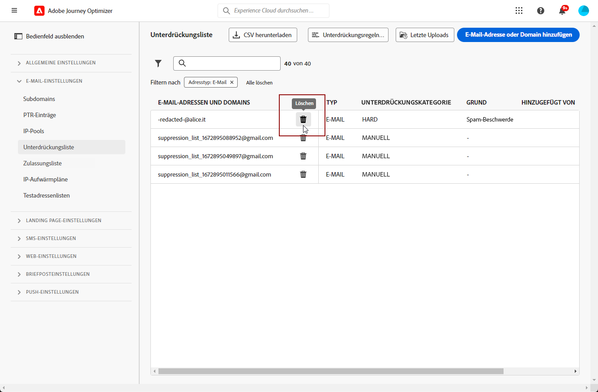
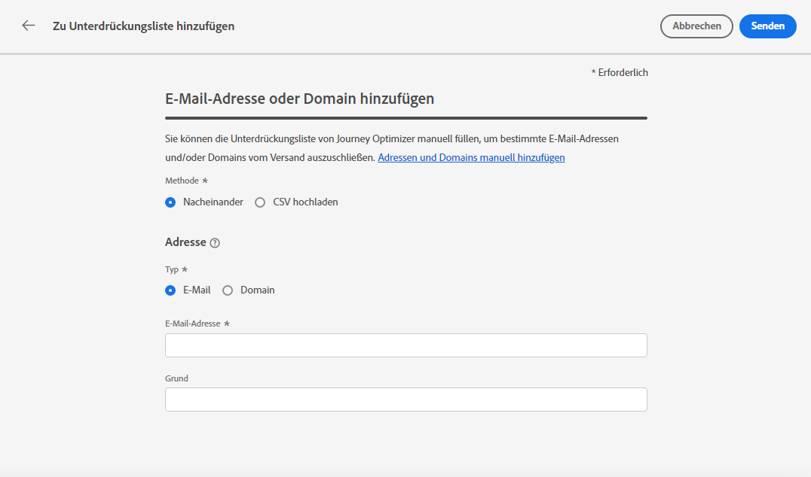

# Verwalten der Unterdrückungsliste {#manage-suppression-list}

Mit [!DNL Journey Optimizer] können Sie alle E-Mail-Adressen überwachen, die automatisch vom Versand einer Journey ausgeschlossen sind, z. B.:

* ungültige Adressen (Hardbounces).
* Adressen, die durchgängig zu Softbounces führen und sich negativ auf Ihre E-Mail-Reputation auswirken können, wenn Sie sie weiterhin in Ihre Sendungen aufnehmen.
* Empfänger, die eine Spam-Beschwerde gegen eine Ihrer E-Mails einreichen.

>[!NOTE]
>
>Die Unterdrückungsliste wird auf Sandbox-Ebene verwaltet.

Diese E-Mail-Adressen werden automatisch in der **Unterdrückungsliste** von Journey Optimizer erfasst. Weitere Informationen zum Konzept und zur Verwendung der Unterdrückungsliste finden Sie in [diesem Abschnitt](../reports/suppression-list.md).

Sie können auch [**manuell** eine Adresse oder eine Domain](#add-addresses-and-domains) zur Unterdrückungsliste hinzufügen.

>[!NOTE]
>
>Es dauert zwischen 0 und 60 Minuten, bis [!DNL Journey Optimizer] die unterdrückten Adressen in ausgehenden E-Mails berücksichtigt.

## Zugriff auf die Unterdrückungsliste {#access-suppression-list}

Um auf die detaillierte Liste der ausgeschlossenen E-Mail-Adressen zuzugreifen, gehen Sie zu **[!UICONTROL Administration]** > **[!UICONTROL Kanäle]** > **[!UICONTROL E-Mail-Konfiguration]** und klicken Sie auf **[!UICONTROL Unterdrückungsliste]**.

>[!CAUTION]
>
>Die Berechtigungen zum Anzeigen, Exportieren und Verwalten der Unterdrückungsliste sind auf [Journey-Administratoren](../administration/ootb-product-profiles.md#journey-administrator) beschränkt. Weitere Informationen zur Verwaltung der Zugriffsberechtigungen für [!DNL Journey Optimizer]-Benutzer finden Sie in [diesem Abschnitt](../administration/permissions-overview.md).


Es stehen Filter zur Verfügung, mit denen Sie die Liste durchsuchen können.


Sie können nach **[!UICONTROL Unterdrückungskategorie]**, **[!UICONTROL Adresstyp]** oder **[!UICONTROL Grund]** filtern. Wählen Sie für jedes Kriterium die von Ihnen gewünschten Optionen aus. Nach der Auswahl können Sie einzelne oder alle Filter löschen, die über der Liste angezeigt werden.


Wenn Sie versehentlich manuell eine E-Mail-Adresse oder eine Domain hinzugefügt haben, können Sie mit dem Button **[!UICONTROL Löschen]** diesen Eintrag entfernen.

>[!CAUTION]
>
>Verwenden Sie den Button **[!UICONTROL Löschen]** niemals, um unterdrückte E-Mail-Adressen oder Domains zu entfernen.



Wenn Sie eine E-Mail-Adresse oder Domain aus der Unterdrückungsliste löschen, wird der Versand an diese Adresse oder Domain wieder aufgenommen. Dies kann sich erheblich auf Ihre Zustellbarkeit und IP-Reputation auswirken und letztendlich dazu führen, dass Ihre IP-Adresse oder Versand-Domain blockiert wird. In [diesem Abschnitt](../reports/suppression-list.md) erfahren Sie mehr darüber, wie wichtig es ist, eine Unterdrückungsliste korrekt zu verwalten.

>[!NOTE]
>
>Gehen Sie beim Löschen von E-Mail-Adressen oder Domains mit besonderer Sorgfalt vor. Wenden Sie sich im Zweifel an einen Zustellbarkeitsexperten.

In der Ansicht **[!UICONTROL Unterdrückungsliste]** können Sie auch Unterdrückungsregeln bearbeiten. [Weitere Informationen](retries.md)

## Herunterladen der Unterdrückungsliste {#download-suppression-list}

<!--
>[!CONTEXTUALHELP]
>id="ajo_admin_suppression_list_download"
>title="Export the list as a CSV file"
>abstract="To download the suppression list, you can either export the current list by generating a new file, or download the file that was previously generated."
-->

Gehen Sie wie folgt vor, um die Unterdrückungsliste als CSV-Datei zu exportieren.

1. Klicken Sie auf die Schaltfläche **[!UICONTROL CSV herunterladen]**.

   

1. Warten Sie, bis die Datei generiert wurde.

   

   >[!NOTE]
   >
   >Die Download-Zeit hängt von der Dateigröße ab, d. h. der Anzahl der Adressen, die sich auf der Unterdrückungsliste befinden.
   >
   >Es kann jeweils nur eine Download-Anfrage für eine Sandbox gleichzeitig verarbeitet werden.

1. Sobald die Datei erstellt wurde, erhalten Sie eine Benachrichtigung. Klicken Sie auf das Glockensymbol oben rechts im Bildschirm, um sie anzuzeigen.

1. Klicken Sie auf die Benachrichtigung selbst, um die Datei herunterzuladen.

   

   >[!NOTE]
   >
   >Der Link ist 24 Stunden lang gültig.

<!--When downloading the CSV file, you can choose to either:

* Download the file that was previously generated by another user or yourself.

* Generate a new file in order to export the current suppression list.-->

## Unterdrückungskategorien und -gründe {#suppression-categories-and-reasons}

Wenn eine Nachricht nicht an eine E-Mail-Adresse gesendet werden kann, bestimmt [!DNL Journey Optimizer], warum der Versand fehlgeschlagen ist, und ordnet ihr eine **[!UICONTROL Unterdrückungskategorie]** zu.

Die Unterdrückungskategorien lauten wie folgt:

* **Hard**: Die E-Mail-Adresse wird sofort an die Unterdrückungsliste gesendet.

   >[!NOTE]
   >
   >Wenn der Fehler das Ergebnis einer Spam-Beschwerde ist, fällt er auch in die Kategorie **Hard**. Die E-Mail-Adresse des Empfängers, der die Beschwerde eingereicht hat, wird sofort an die Unterdrückungsliste gesendet.

* **Soft**: Bei Softbounces wird eine Adresse an die Unterdrückungsliste gesendet, sobald der Fehlerzähler den Schwellenwert erreicht hat. [Erfahren Sie mehr über weitere Zustellversuche](retries.md)

* **Manuell**: Sie können der Unterdrückungsliste auch manuell eine E-Mail-Adresse oder eine Domain hinzufügen. [Weitere Informationen](#add-addresses-and-domains)

>[!NOTE]
>
>Weitere Informationen zu Softbounces und Hardbounces finden Sie im Abschnitt [Typen von fehlgeschlagenen Sendungen](../reports/suppression-list.md#delivery-failures).

Für jede aufgelistete E-Mail-Adresse können Sie auch den **[!UICONTROL Typ]** (E-Mail oder Domain), den **[!UICONTROL Grund]**, der zum Ausschluss führte, die Person, die die E-Mail-Adresse zur Unterdrückungsliste hinzufügte, und das Datum mit Uhrzeit, zu dem die Adresse der Unterdrückungsliste hinzugefügt wurde, überprüfen.


Mögliche Ursachen für fehlgeschlagene Sendungen sind:

| Grund | Beschreibung | Unterdrückungskategorie |
| --- | --- | --- |
| **[!UICONTROL Ungültiger Empfänger]** | Der Empfänger ist ungültig oder existiert nicht. | Hard |
| **[!UICONTROL Soft-Bounce]** | Die Nachricht führte aus einem anderen Grund als den in dieser Tabelle aufgeführten Soft-Fehlern zu einem Softbounce, z. B. beim Senden über der von einem ISP empfohlenen zulässigen Rate. | Soft |
| **[!UICONTROL DNS-Fehler]** | Die Nachricht führte aufgrund eines DNS-Fehlers zu einem Bounce. | Soft |
| **[!UICONTROL Postfach voll]** | Die Nachricht führte zu einem Bounce, weil das Postfach des Empfängers voll ist und keine weiteren Nachrichten akzeptieren kann. | Soft |
| **[!UICONTROL Weiterleitung verweigert]** | Die Nachricht wurde vom Empfänger blockiert, da eine Weiterleitung nicht zulässig ist. | Soft |
| **[!UICONTROL Challenge-Response]** | Die Nachricht ist ein Challenge-Response-Test. | Soft |
| **[!UICONTROL Spam-Beschwerde]** | Die Nachricht wurde blockiert, da sie vom Empfänger als Spam gekennzeichnet wurde. | Hard |

>[!NOTE]
>
>Abgemeldete Benutzer erhalten keine E-Mails von [!DNL Journey Optimizer], daher können ihre E-Mail-Adressen nicht an die Unterdrückungsliste gesendet werden. Ihre Entscheidung wird auf der Ebene von Experience Platform gehandhabt. [Weitere Informationen zum Opt-out](../privacy/opt-out.md)

## Adressen und Domains manuell hinzufügen {#add-addresses-and-domains}

>[!CONTEXTUALHELP]
>id="ajo_admin_suppression_list_header"
>title="Hinzufügen von E-Mails/Domains zur Unterdrückungsliste"
>abstract="Sie können die Unterdrückungsliste von Journey Optimizer manuell ausfüllen, um bestimmte E-Mail-Adressen und/oder Domains vom Versand auszuschließen."

>[!CONTEXTUALHELP]
>id="ajo_admin_suppression_list"
>title="Hinzufügen von E-Mails/Domains zur Unterdrückungsliste"
>abstract="Um die Unterdrückungsliste zu füllen, können Sie E-Mail-Adressen oder Domains manuell hinzufügen – einzeln oder im Bulk-Modus über das Hochladen einer CSV-Datei. Diese spezifischen E-Mail-Adressen und/oder Domains sind vom Versand ausgeschlossen."

Wenn eine Nachricht nicht an eine E-Mail-Adresse gesendet werden kann, wird diese Adresse basierend auf der definierten Unterdrückungsregel oder der Anzahl der Bounces automatisch auf die Unterdrückungsliste gesetzt.

Sie können die [!DNL Journey Optimizer]-Unterdrückungsliste jedoch auch manuell füllen, um bestimmte E-Mail-Adressen und/oder Domains von Ihrem Versand auszuschließen.

Sie können E-Mail-Adressen oder Domains [einzeln](#add-one-address-or-domain) oder [im Bulk-Modus](#upload-csv-file) über einen CSV-Datei-Upload hinzufügen.

Klicken Sie dazu auf den Button **[!UICONTROL E-Mail oder Domain hinzufügen]** und folgen Sie dann einer der folgenden Methoden.


### Eine einzelne Adresse oder Domain hinzufügen {#add-one-address-or-domain}

>[!CONTEXTUALHELP]
>id="ajo_admin_suppression_list_address"
>title="Hinzufügen eines Elements zur Unterdrückungsliste"
>abstract="Sie können E-Mail-Adressen und/oder Domains einzeln zur Unterdrückungsliste hinzufügen."

1. Wählen Sie die Option **[!UICONTROL Einzeln]** aus.

   

1. Wählen Sie den Adresstyp aus: **[!UICONTROL E-Mail-Adresse]** oder **[!UICONTROL Domain-Adresse]**.

1. Geben Sie die E-Mail-Adresse oder Domain ein, die Sie vom Versand ausschließen möchten.

   >[!NOTE]
   >
   >Vergewissern Sie sich, dass Sie eine gültige E-Mail-Adresse (z. B. abc@firma.com) oder Domain (z. B. abc.firma.com) eingeben.

1. Geben Sie bei Bedarf einen Grund an.

   >[!NOTE]
   >
   >Alle ASCII-Zeichen zwischen 32 und 126 sind im Feld **[!UICONTROL Grund]** zulässig. Die vollständige Liste finden Sie zum Beispiel auf [dieser Seite](https://en.wikipedia.org/wiki/Wikipedia:ASCII#ASCII_printable_characters){target="_blank"}.

1. Klicken Sie auf **[!UICONTROL Senden]**.

### CSV-Datei hochladen {#upload-csv-file}

>[!CONTEXTUALHELP]
>id="ajo_admin_suppression_list_csv"
>title="Hochladen von CSV-Dateien, um Elemente zur Unterdrückungsliste hinzuzufügen"
>abstract="Sie können eine CSV-Datei mit den E-Mail-Adressen/Domains, die Sie ausschließen möchten, in die Unterdrückungsliste hochladen."

1. Wählen Sie die Option **[!UICONTROL CSV hochladen]** aus.

   

1. Laden Sie die zu verwendende CSV-Vorlage herunter, die die folgenden Spalten und das folgende Format enthält:

   ```
   TYPE,VALUE,COMMENT
   EMAIL,abc@somedomain.com,Comment
   DOMAIN,somedomain.com,Comment
   ```

   >[!CAUTION]
   >
   >Ändern Sie nicht die Namen der Spalten in der CSV-Vorlage.
   >
   >Die Dateigröße darf 1 MB nicht überschreiten.

1. Füllen Sie die CSV-Vorlage mit den E-Mail-Adressen und/oder Domains aus, die Sie der Unterdrückungsliste hinzufügen möchten.

   >[!NOTE]
   >
   >Alle ASCII-Zeichen zwischen 32 und 126 sind in der Spalte **Kommentar** zulässig. Die vollständige Liste finden Sie zum Beispiel auf [dieser Seite](https://en.wikipedia.org/wiki/Wikipedia:ASCII#ASCII_printable_characters){target="_blank"}.

1. Ziehen Sie danach die CSV-Datei per Drag-and-Drop in den entsprechenden Bereich und klicken Sie auf **[!UICONTROL Absenden]**.

   

>[!NOTE]
>
>Vergewissern Sie sich nach dem Hochladen, dass der Upload erfolgreich war, indem Sie seinen Status in der Benutzeroberfläche überprüfen. [Weitere Informationen dazu](#recent-uploads)

### Status der letzten Uploads überprüfen {#recent-uploads}

Sie können die Liste der zuletzt hochgeladenen CSV-Dateien überprüfen.

Klicken Sie dazu in der Ansicht **[!UICONTROL Unterdrückungsliste]** auf den Button **[!UICONTROL Letzte Uploads]**.


Es werden die neuesten von Ihnen übermittelten Uploads und deren Status angezeigt:

* **[!UICONTROL Ausstehend]**: Der Datei-Upload wird durchgeführt.
* **[!UICONTROL Fehler]**: Der Datei-Upload-Prozess ist aufgrund eines technischen Problems oder eines Dateiformatfehlers fehlgeschlagen.
* **[!UICONTROL Fertig]**: Der Datei-Upload-Vorgang wurde erfolgreich abgeschlossen.

Wenn beim Hochladen einige Adressen nicht das richtige Format aufweisen, werden sie nicht zum [!DNL Journey Optimizer] Unterdrückungsliste.

Wenn der Upload abgeschlossen ist, wird er in diesem Fall mit einem Bericht verknüpft. Sie können es herunterladen, um die aufgetretenen Fehler zu überprüfen<!-- and understand why they were not added to the suppression list-->.


Nachstehend finden Sie ein Beispiel für die Art der Einträge, die Sie im Fehlerbericht finden:

```
type,value,comments,failureReason
Email,examplemail.com,MANUAL,Invalid format for value: examplemail.com
Email,examplemail,MANUAL,Invalid format for value: examplemail
Email,example@mail,MANUAL,Invalid format for value: example@mail
Domain,example,MANUAL,Invalid format for value: example
Domain,example.!com,MANUAL,Invalid format for value: example.!com
Domain,!examplecom,MANUAL,Invalid format for value: !examplecom
```
