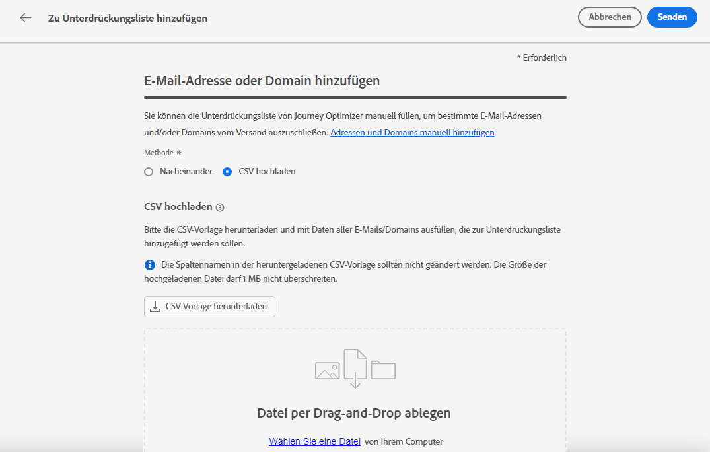
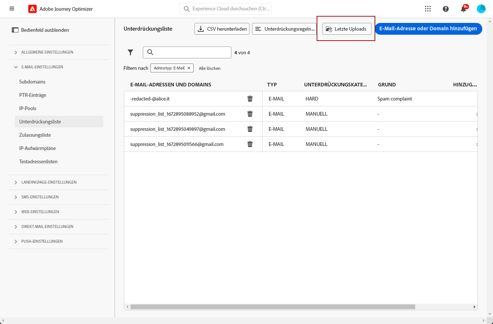

# Verwalten der Unterdrückungsliste {#manage-suppression-list}

Mit [!DNL Journey Optimizer]können Sie alle E-Mail-Adressen überwachen, die automatisch vom Versand in einer Journey oder einer Kampagne ausgeschlossen sind, z. B.:

* Ungültige Adressen (Hardbounces).
* Adressen, die konsistent Softbounce verwenden und sich negativ auf Ihre E-Mail-Reputation auswirken könnten, wenn Sie sie weiterhin in Ihre Sendungen einbeziehen.
* Empfänger, die eine Spam-Beschwerde einer Art gegen eine Ihrer E-Mail-Nachrichten richten.

>[!NOTE]
>
>Die Unterdrückungsliste wird auf Sandbox-Ebene verwaltet.

Diese E-Mail-Adressen werden automatisch in Journey Optimizer erfasst. **Unterdrückungsliste**. Erfahren Sie mehr über das Konzept und die Verwendung der Unterdrückungsliste in [diesem Abschnitt](../reports/suppression-list.md).

Sie können auch [**manuell** Adresse oder Domain hinzufügen](#add-addresses-and-domains) in die Unterdrückungsliste ein.

>[!NOTE]
>
>Es dauert zwischen 0 und 60 Minuten für [!DNL Journey Optimizer] um die unterdrückten Adressen in ausgehenden E-Mails zu berücksichtigen.

## Zugriff auf die Unterdrückungsliste {#access-suppression-list}

Um auf die detaillierte Liste der ausgeschlossenen E-Mail-Adressen zuzugreifen, gehen Sie zu **[!UICONTROL Administration]** > **[!UICONTROL Channels]** > **[!UICONTROL Email configuration]** und wählen Sie **[!UICONTROL Suppression list]**.

>[!CAUTION]
>
>Die Berechtigungen zum Anzeigen, Exportieren und Verwalten der Unterdrückungsliste sind auf [Journey-Administratoren](../administration/ootb-product-profiles.md#journey-administrator). Weitere Informationen zur Verwaltung [!DNL Journey Optimizer] Benutzerzugriffsrechte in [diesem Abschnitt](../administration/permissions-overview.md).


Es stehen Filter zur Verfügung, mit denen Sie die Liste durchsuchen können.


Sie können nach **[!UICONTROL Suppression category]**, **[!UICONTROL Address type]** oder **[!UICONTROL Reason]**. Wählen Sie für jede Bedingung die von Ihnen gewünschten Optionen aus. Nach der Auswahl können Sie jeden Filter oder alle Filter löschen, die über der Liste angezeigt werden.


Wenn Sie versehentlich manuell eine E-Mail-Adresse oder eine Domain hinzufügen, wird die **[!UICONTROL Delete]** -Schaltfläche können Sie diesen Eintrag entfernen.

>[!CAUTION]
>
>Verwenden Sie niemals die **[!UICONTROL Delete]** Schaltfläche zum Entfernen unterdrückter E-Mail-Adressen oder Domänen.


Wenn Sie eine E-Mail-Adresse oder Domain aus der Unterdrückungsliste löschen, wird der Versand an diese Adresse oder Domain fortgesetzt. Dies kann sich daher erheblich auf Ihre Zustellbarkeit und IP-Reputation auswirken und letztendlich dazu führen, dass Ihre IP-Adresse oder Versanddomäne blockiert wird. Erfahren Sie mehr über die Bedeutung der Beibehaltung einer Unterdrückungsliste in [diesem Abschnitt](../reports/suppression-list.md).

>[!NOTE]
>
>Gehen Sie beim Löschen von E-Mail-Adressen oder Domains mit besonderer Sorgfalt vor. Im Zweifelsfall kontaktieren Sie einen Zustellbarkeitsexperten.

Aus dem **[!UICONTROL Suppression list]** -Ansicht können Sie auch Unterdrückungsregeln bearbeiten. [Weitere Infos](retries.md)

## Herunterladen der Unterdrückungsliste {#download-suppression-list}

<!--
>[!CONTEXTUALHELP]
>id="ajo_admin_suppression_list_download"
>title="Export the list as a CSV file"
>abstract="To download the suppression list, you can either export the current list by generating a new file, or download the file that was previously generated."
-->

Gehen Sie wie folgt vor, um die Unterdrückungsliste als CSV-Datei zu exportieren.

1. Wählen Sie die **[!UICONTROL Download CSV]** Schaltfläche.

   

1. Warten Sie, bis die Datei generiert wurde.

   

   >[!NOTE]
   >
   >Die Downloadzeit hängt von der Dateigröße ab, d. h. der Anzahl der Adressen, die sich auf der Unterdrückungsliste befinden.
   >
   >Eine Download-Anfrage kann für eine bestimmte Sandbox gleichzeitig verarbeitet werden.

1. Nach der Erstellung der Datei erhalten Sie eine Benachrichtigung. Klicken Sie auf das Glockensymbol oben rechts im Bildschirm, um es anzuzeigen.

1. Klicken Sie auf die Benachrichtigung selbst, um die Datei herunterzuladen.

   

   >[!NOTE]
   >
   >Der Link ist 24 Stunden lang gültig.

<!--When downloading the CSV file, you can choose to either:

* Download the file that was previously generated by another user or yourself.

* Generate a new file in order to export the current suppression list.-->

## Unterdrückungskategorien und -gründe {#suppression-categories-and-reasons}

Wenn eine Nachricht nicht an eine E-Mail-Adresse gesendet werden kann, [!DNL Journey Optimizer] bestimmt, warum der Versand fehlgeschlagen ist, und ordnet ihn einem **[!UICONTROL Suppression category]**.

Die Unterdrückungskategorien lauten wie folgt:

* **Hard**: Die E-Mail-Adresse wird sofort an die Unterdrückungsliste gesendet.

   >[!NOTE]
   >
   >Wenn der Fehler auf eine Spam-Beschwerde zurückzuführen ist, fällt er auch in die **Hard** Kategorie. Die E-Mail-Adresse des Empfängers, der die Beschwerde eingereicht hat, wird sofort an die Unterdrückungsliste gesendet.

* **Soft**: Bei Softbounces wird eine Adresse an die Unterdrückungsliste gesendet, sobald der Fehlerzähler den Grenzwert erreicht hat. [Weitere Informationen zu Wiederholungen](retries.md)

* **Manuell**: Sie können der Unterdrückungsliste auch manuell eine E-Mail-Adresse oder eine Domäne hinzufügen. [Weitere Infos](#add-addresses-and-domains)

>[!NOTE]
>
>Weitere Informationen zu Softbounces und Hardbounces finden Sie im Abschnitt [Typen von fehlgeschlagenen Sendungen](../reports/suppression-list.md#delivery-failures) Abschnitt.

Für jede aufgelistete E-Mail-Adresse können Sie auch die **[!UICONTROL Type]** (E-Mail oder Domain), **[!UICONTROL Reason]** zum Ausschließen der Unterdrückungsliste, wer sie hinzugefügt hat, und Datum/Uhrzeit, zu der sie der Unterdrückungsliste hinzugefügt wurde.


Mögliche Ursachen für fehlgeschlagene Sendungen sind:

| Grund | Beschreibung | Unterdrückungskategorie |
| --- | --- | --- |
| **[!UICONTROL Invalid Recipient]** | Der Empfänger ist ungültig oder existiert nicht. | Hard |
| **[!UICONTROL Soft Bounce]** | Der Softbounce der Nachricht ist aus einem anderen Grund als den in dieser Tabelle aufgeführten Softbounces abgestürzt, z. B. wenn die von einem ISP empfohlene zulässige Rate übergeben wird. | Soft |
| **[!UICONTROL DNS Failure]** | Die Nachricht ist aufgrund eines DNS-Fehlers abgestürzt. | Soft |
| **[!UICONTROL Mailbox Full]** | Die Nachricht ist abgestürzt, weil das Postfach des Empfängers voll ist und keine weiteren Nachrichten akzeptieren kann. | Soft |
| **[!UICONTROL Relaying Denied]** | Die Nachricht wurde vom Empfänger blockiert, da eine Umlagerung nicht zulässig ist. | Soft |
| **[!UICONTROL Challenge-Response]** | Die Nachricht ist eine Challenge-Response-Sonde. | Soft |
| **[!UICONTROL Spam Complaint]** | Die Nachricht wurde blockiert, da sie vom Empfänger als Spam gekennzeichnet wurde. | Hard |

>[!NOTE]
>
>Abgemeldete Benutzer erhalten keine E-Mails von [!DNL Journey Optimizer]enthalten, können daher ihre E-Mail-Adressen nicht an die Unterdrückungsliste gesendet werden. Ihre Auswahl erfolgt auf Experience Platform-Ebene. [Weitere Informationen zum Opt-out](../privacy/opt-out.md)

## Manuelles Hinzufügen von Adressen und Domänen {#add-addresses-and-domains}

>[!CONTEXTUALHELP]
>id="ajo_admin_suppression_list_header"
>title="E-Mails oder Domänen zur Unterdrückungsliste hinzufügen"
>abstract="Sie können die Unterdrückungsliste von Journey Optimizer manuell ausfüllen, um bestimmte E-Mail-Adressen und/oder Domänen von Ihrem Versand auszuschließen."

>[!CONTEXTUALHELP]
>id="ajo_admin_suppression_list"
>title="E-Mails oder Domänen zur Unterdrückungsliste hinzufügen"
>abstract="Um die Unterdrückungsliste aufzufüllen, können Sie E-Mail-Adressen oder Domänen manuell hinzufügen: einzeln oder im Bulk-Modus über einen CSV-Datei-Upload. Diese spezifischen E-Mail-Adressen und/oder Domains sind vom Versand ausgeschlossen."

Wenn eine Nachricht nicht an eine E-Mail-Adresse gesendet werden kann, wird diese Adresse basierend auf der definierten Unterdrückungsregel oder der Anzahl der Bounces automatisch auf die Unterdrückungsliste gesetzt.

Sie können jedoch auch manuell die [!DNL Journey Optimizer] Unterdrückungsliste , um bestimmte E-Mail-Adressen und/oder Domänen aus Ihrem Versand auszuschließen.

Sie können E-Mail-Adressen oder Domänen hinzufügen [einzeln](#add-one-address-or-domain)oder [im Bulk-Modus](#upload-csv-file) durch einen CSV-Datei-Upload.

Wählen Sie dazu die **[!UICONTROL Add email or domain]** und folgen Sie dann einer der folgenden Methoden.


### Eine Adresse oder Domäne hinzufügen {#add-one-address-or-domain}

>[!CONTEXTUALHELP]
>id="ajo_admin_suppression_list_address"
>title="Ein Element zur Unterdrückungsliste hinzufügen"
>abstract="Sie können die Unterdrückungsliste ausfüllen, indem Sie E-Mail-Adressen und/oder Domänen einzeln hinzufügen."

1. Wählen Sie die **[!UICONTROL One by one]** -Option.

   

1. Wählen Sie den Adresstyp aus: **[!UICONTROL Email address]** oder **[!UICONTROL Domain address]**.

1. Geben Sie die E-Mail-Adresse oder Domain ein, die Sie vom Versand ausschließen möchten.

   >[!NOTE]
   >
   >Vergewissern Sie sich, dass Sie eine gültige E-Mail-Adresse (z. B. abc@company.com) oder Domain (z. B. abc.company.com) eingeben.

1. Geben Sie bei Bedarf einen Grund an.

   >[!NOTE]
   >
   >Alle ASCII-Zeichen zwischen 32 und 126 sind in der Variablen **[!UICONTROL Reason]** -Feld. Die vollständige Liste finden Sie unter [diese Seite](https://en.wikipedia.org/wiki/Wikipedia:ASCII#ASCII_printable_characters){target=&quot;_blank&quot;} zum Beispiel.

1. Klicken **[!UICONTROL Submit]**.

### CSV-Datei hochladen {#upload-csv-file}

>[!CONTEXTUALHELP]
>id="ajo_admin_suppression_list_csv"
>title="Hochladen von CSV-Dateien zum Hinzufügen von Elementen zur Unterdrückungsliste"
>abstract="Sie können die Unterdrückungsliste ausfüllen, indem Sie eine CSV-Datei hochladen, die mit den E-Mail-Adressen/Domänen gefüllt ist, die Sie ausschließen möchten."

1. Wählen Sie die **[!UICONTROL Upload CSV]** -Option.

   

1. Laden Sie die zu verwendende CSV-Vorlage herunter, die die Spalten und das folgende Format enthält:

   ```
   TYPE,VALUE,COMMENT
   EMAIL,abc@somedomain.com,Comment
   DOMAIN,somedomain.com,Comment
   ```

   >[!CAUTION]
   >
   >Ändern Sie nicht die Namen der Spalten in der CSV-Vorlage.
   >
   >Die Dateigröße darf 1 MB nicht überschreiten.

1. Füllen Sie die CSV-Vorlage mit den E-Mail-Adressen und/oder Domänen aus, die Sie der Unterdrückungsliste hinzufügen möchten.

   >[!NOTE]
   >
   >Alle ASCII-Zeichen zwischen 32 und 126 sind in der Variablen **Kommentar** Spalte. Die vollständige Liste finden Sie unter [diese Seite](https://en.wikipedia.org/wiki/Wikipedia:ASCII#ASCII_printable_characters){target=&quot;_blank&quot;} zum Beispiel.

1. Platzieren Sie nach Abschluss die CSV-Datei per Drag-and-Drop und klicken Sie auf **[!UICONTROL Submit]**.

   

>[!NOTE]
>
>Vergewissern Sie sich nach dem Hochladen, dass der Upload erfolgreich war, indem Sie seinen Status in der -Benutzeroberfläche überprüfen. [Erfahren Sie mehr](#recent-uploads)

### Status der letzten Uploads überprüfen {#recent-uploads}

Sie können die Liste der zuletzt hochgeladenen CSV-Dateien überprüfen.

Gehen Sie dazu im **[!UICONTROL Suppression list]** Ansicht, klicken Sie auf die **[!UICONTROL Recent uploads]** Schaltfläche.



Es werden die neuesten von Ihnen gesendeten Uploads und deren Status angezeigt.

Wenn ein Fehlerbericht mit einer Datei verknüpft ist, können Sie ihn herunterladen, um die aufgetretenen Fehler zu überprüfen.


Nachstehend finden Sie ein Beispiel für die Art der Einträge, die Sie im Fehlerbericht finden:

```
type,value,comments,failureReason
Email,examplemail.com,MANUAL,Invalid format for value: examplemail.com
Email,examplemail,MANUAL,Invalid format for value: examplemail
Email,example@mail,MANUAL,Invalid format for value: example@mail
Domain,example,MANUAL,Invalid format for value: example
Domain,example.!com,MANUAL,Invalid format for value: example.!com
Domain,!examplecom,MANUAL,Invalid format for value: !examplecom
```
