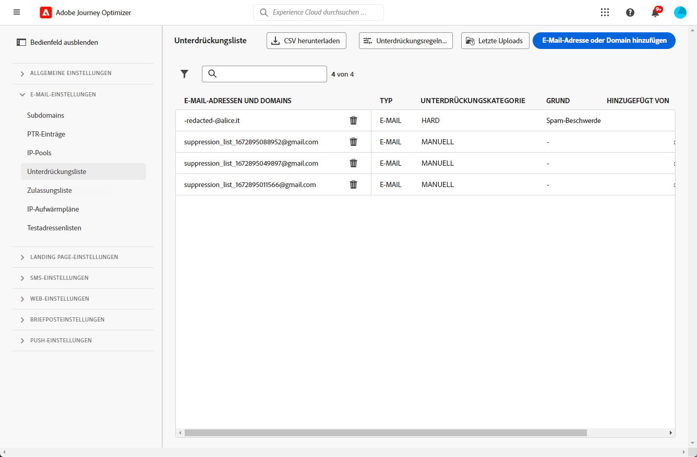
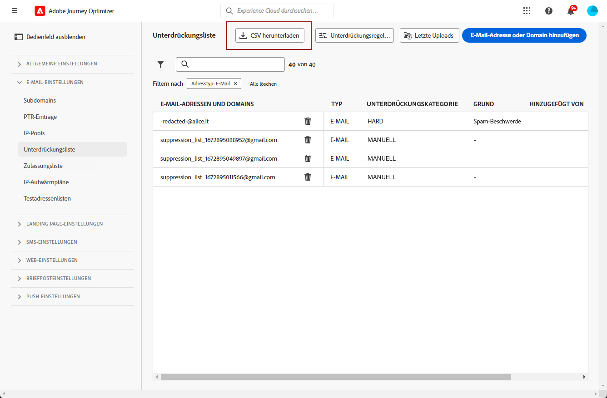

# Verwalten der Unterdrückungsliste {#manage-suppression-list}

Mit [!DNL Journey Optimizer]können Sie alle E-Mail-Adressen überwachen, die automatisch vom Versand an eine Journey oder Kampagne ausgeschlossen sind, z. B. Hardbounces, Softbounces und Spam-Beschwerden.

Diese E-Mail-Adressen werden automatisch in der **Unterdrückungsliste** von Journey Optimizer erfasst. Eine Unterdrückungsliste besteht aus Adressen und Domänen, die von Ihren Zielgruppen ausgeschlossen werden sollen. Sie sammelt E-Mail-Adressen und Domains, die für alle Mailings in einer Einzel-Client-Umgebung unterdrückt werden, d. h. spezifisch für eine Organisations-ID, die mit einer Sandbox-ID verbunden ist.

Weitere Informationen zum Konzept und zur Verwendung der Unterdrückungsliste finden Sie in [diesem Abschnitt](../reports/suppression-list.md).


## Zugriff auf die Unterdrückungsliste {#access-suppression-list}

Um auf die detaillierte Liste der ausgeschlossenen E-Mail-Adressen und Domains zuzugreifen, navigieren Sie zu **[!UICONTROL Administration]** > **[!UICONTROL Kanäle]** > **[!UICONTROL E-Mail-Konfiguration]** und wählen Sie **[!UICONTROL Unterdrückungsliste]**.




>[!CAUTION]
>
>Die Berechtigungen zum Anzeigen, Exportieren und Verwalten der Unterdrückungsliste sind auf [Journey-Administratoren](../administration/ootb-product-profiles.md#journey-administrator) beschränkt. Weitere Informationen zur Verwaltung der Zugriffsberechtigungen für [!DNL Journey Optimizer]-Benutzer finden Sie in [diesem Abschnitt](../administration/permissions-overview.md).


Es stehen Filter zur Verfügung, mit denen Sie die Liste durchsuchen können.


Sie können nach **[!UICONTROL Unterdrückungskategorie]**, **[!UICONTROL Adresstyp]** oder **[!UICONTROL Grund]** filtern. Wählen Sie für jede Bedingung eine oder mehrere Optionen aus. Nach der Auswahl können Sie einzelne oder alle Filter löschen, die über der Liste angezeigt werden.


## Fehlerursachen {#suppression-categories-and-reasons}

Wenn eine Nachricht nicht an eine E-Mail-Adresse gesendet werden kann, bestimmt [!DNL Journey Optimizer], warum der Versand fehlgeschlagen ist, und ordnet ihr eine **[!UICONTROL Unterdrückungskategorie]** zu.

Die Unterdrückungskategorien lauten wie folgt:

* **Hard**: Ein Hardbounce zeigt eine ungültige E-Mail-Adresse an (d. h. eine nicht vorhandene E-Mail-Adresse). Dies beinhaltet eine Bounce-Nachricht des empfangenden E-Mail-Servers, in der explizit angegeben wird, dass die Adresse ungültig ist. Die E-Mail-Adresse wird sofort an die Unterdrückungsliste gesendet.

   Wenn der Fehler das Ergebnis einer Spam-Beschwerde ist, fällt er auch in die Kategorie **Hard**. Die E-Mail-Adresse des Empfängers, der die Beschwerde eingereicht hat, wird sofort an die Unterdrückungsliste gesendet.

* **Soft**: Ein Softbounce ist ein temporärer E-Mail-Bounce, der für eine gültige E-Mail-Adresse aufgetreten ist. Die E-Mail-Adresse wird nach mehreren weiteren Versuchen zur Unterdrückungsliste hinzugefügt. Bei Softbounces wird eine Adresse an die Unterdrückungsliste gesendet, sobald der Fehlerzähler den Grenzwert erreicht hat. [Weitere Informationen zu Wiederholungen](retries.md)

* **Manuell**: Manuelle Fehler wurden der Unterdrückungsliste manuell hinzugefügt. [Weitere Informationen](#add-addresses-and-domains)

Für jede aufgelistete E-Mail-Adresse können Sie auch den **[!UICONTROL Typ]** (E-Mail oder Domain), den **[!UICONTROL Grund]**, der zum Ausschluss führte, die Person, die die E-Mail-Adresse zur Unterdrückungsliste hinzufügte, und das Datum mit Uhrzeit, zu dem die Adresse der Unterdrückungsliste hinzugefügt wurde, überprüfen.


Mögliche Ursachen für fehlgeschlagene Sendungen sind:

| Grund | Beschreibung | Kategorie |
| --- | --- | --- |
| **[!UICONTROL Ungültiger Empfänger]** | Der Empfänger ist ungültig oder existiert nicht. | Hard |
| **[!UICONTROL Soft-Bounce]** | Die Nachricht führte aus einem anderen Grund als den in dieser Tabelle aufgeführten Soft-Fehlern zu einem Softbounce, z. B. beim Senden über der von einem ISP empfohlenen zulässigen Rate. | Soft |
| **[!UICONTROL DNS-Fehler]** | Die Nachricht führte aufgrund eines DNS-Fehlers zu einem Bounce. | Soft |
| **[!UICONTROL Postfach voll]** | Die Nachricht führte zu einem Bounce, weil das Postfach des Empfängers voll ist und keine weiteren Nachrichten akzeptieren kann. | Soft |
| **[!UICONTROL Weiterleitung verweigert]** | Die Nachricht wurde vom Empfänger blockiert, da eine Weiterleitung nicht zulässig ist. | Soft |
| **[!UICONTROL Challenge-Response]** | Die Nachricht ist ein Challenge-Response-Test. | Soft |
| **[!UICONTROL Spam-Beschwerde]** | Die Nachricht wurde blockiert, da sie vom Empfänger als Spam gekennzeichnet wurde. | Hard |

>[!NOTE]
>
>Abgemeldete Benutzer erhalten keine E-Mails von [!DNL Journey Optimizer], daher können ihre E-Mail-Adressen nicht an die Unterdrückungsliste gesendet werden. Ihre Entscheidung wird auf der Ebene von Experience Platform gehandhabt. [Weitere Informationen zum Opt-out](../privacy/opt-out.md)


### Unterdrückungsregeln  {#suppression-rules}

Aus dem **[!UICONTROL Unterdrückungsliste]** -Ansicht können Sie auch den Wiederholungsparameter bearbeiten, der mit den Unterdrückungsregeln verknüpft ist, über die **[!UICONTROL Unterdrückungsregeln bearbeiten]** Schaltfläche. Verwenden Sie diese Option, um die Wiederholungsschwelle für die aktuelle Sandbox zu aktualisieren. [Weitere Informationen zu Wiederholungen](retries.md).


## Adressen und Domänen zur Unterdrückungsliste hinzufügen{#add-addresses-and-domains}

>[!CONTEXTUALHELP]
>id="ajo_admin_suppression_list_header"
>title="Hinzufügen von E-Mails/Domains zur Unterdrückungsliste"
>abstract="Sie können die Unterdrückungsliste von Journey Optimizer manuell ausfüllen, um bestimmte E-Mail-Adressen und/oder Domains vom Versand auszuschließen."

>[!CONTEXTUALHELP]
>id="ajo_admin_suppression_list"
>title="Hinzufügen von E-Mails/Domains zur Unterdrückungsliste"
>abstract="Um die Unterdrückungsliste zu füllen, können Sie E-Mail-Adressen oder Domains manuell hinzufügen – einzeln oder im Bulk-Modus über das Hochladen einer CSV-Datei. Diese spezifischen E-Mail-Adressen und/oder Domains sind vom Versand ausgeschlossen."

Wenn eine Nachricht nicht an eine E-Mail-Adresse gesendet werden kann, wird diese Adresse basierend auf der definierten Unterdrückungsregel oder der Anzahl der Bounces automatisch auf die Unterdrückungsliste gesetzt.

Sie können die [!DNL Journey Optimizer]-Unterdrückungsliste jedoch auch manuell füllen, um bestimmte E-Mail-Adressen und/oder Domains von Ihrem Versand auszuschließen.

>[!NOTE]
>
>Es kann bis zu 60 Minuten dauern für [!DNL Journey Optimizer] um die unterdrückten Adressen in ausgehenden E-Mails zu berücksichtigen.

Sie können E-Mail-Adressen oder Domains [einzeln](#add-one-address-or-domain) oder [im Bulk-Modus](#upload-csv-file) über einen CSV-Datei-Upload hinzufügen.

### Eine einzelne Adresse oder Domain hinzufügen {#add-one-address-or-domain}

>[!CONTEXTUALHELP]
>id="ajo_admin_suppression_list_address"
>title="Hinzufügen eines Elements zur Unterdrückungsliste"
>abstract="Sie können E-Mail-Adressen und/oder Domains einzeln zur Unterdrückungsliste hinzufügen."

Gehen Sie wie folgt vor, um der Unterdrückungsliste eine E-Mail-Adresse oder eine Domäne hinzuzufügen:

1. Klicken Sie auf die Schaltfläche **[!UICONTROL E-Mail-Adresse oder Domain hinzufügen]**.

   

1. Wählen Sie die **[!UICONTROL Eins nach eins]** -Option.

   

1. Wählen Sie den Adresstyp aus: **[!UICONTROL Email]** oder **[!UICONTROL Domäne]**.

1. Geben Sie die E-Mail-Adresse oder Domain ein, die Sie vom Versand ausschließen möchten.

   >[!NOTE]
   >
   >Vergewissern Sie sich, dass Sie eine gültige E-Mail-Adresse (z. B. abc@firma.com) oder Domain (z. B. abc.firma.com) eingeben.

1. (optional) Geben Sie einen Grund ein. Alle druckbaren ASCII-Zeichen zwischen 32 und 126 sind in diesem Feld zulässig.

1. Verwenden Sie die **[!UICONTROL Einsenden]** zur Bestätigung.

### CSV-Datei hochladen {#upload-csv-file}

>[!CONTEXTUALHELP]
>id="ajo_admin_suppression_list_csv"
>title="Hochladen von CSV-Dateien, um Elemente zur Unterdrückungsliste hinzuzufügen"
>abstract="Sie können eine CSV-Datei mit den E-Mail-Adressen/Domains, die Sie ausschließen möchten, in die Unterdrückungsliste hochladen."

Gehen Sie wie folgt vor, um der Unterdrückungsliste eine Gruppe von E-Mail-Adressen oder Domänen hinzuzufügen:

1. Klicken Sie auf die Schaltfläche **[!UICONTROL E-Mail-Adresse oder Domain hinzufügen]**.
1. Wählen Sie die **[!UICONTROL CSV hochladen]** -Option.

   

1. Laden Sie die zu verwendende CSV-Vorlage herunter, die die folgenden Spalten und das folgende Format enthält:

   ```
   TYPE,VALUE,COMMENT
   EMAIL,abc@somedomain.com,Comment
   DOMAIN,somedomain.com,Comment
   ```

1. Füllen Sie die CSV-Vorlage mit den E-Mail-Adressen und/oder Domänen aus, die zur Unterdrückungsliste hinzugefügt werden sollen. Alle druckbaren ASCII-Zeichen zwischen 32 und 126 sind in der Variablen **KOMMENTAR** Spalte.

   >[!CAUTION]
   >
   >Ändern Sie nicht den Namen der Spalten in der CSV-Vorlage.
   >
   >Die Dateigröße darf 1 MB nicht überschreiten.

1. Ziehen Sie nach Abschluss die CSV-Datei per Drag-and-Drop in den Arbeitsbereich und verwenden Sie die **[!UICONTROL Einsenden]** zur Bestätigung.

   

Sobald der Upload abgeschlossen ist, können Sie seinen Status über die [Letzte Uploads](#recent-uploads) wie unten beschrieben.

### Upload-Status überprüfen {#recent-uploads}

Verwenden Sie die **[!UICONTROL Letzte Uploads]** -Schaltfläche, um den Status der zuletzt hochgeladenen CSV-Dateien zu überprüfen.


Mögliche Status sind:

* **[!UICONTROL Ausstehend]**: Der Datei-Upload wird durchgeführt.
* **[!UICONTROL Fehler]**: Der Datei-Upload-Prozess ist aufgrund eines technischen Problems oder eines Dateiformatfehlers fehlgeschlagen.
* **[!UICONTROL Fertig]**: Der Datei-Upload-Vorgang wurde erfolgreich abgeschlossen.

Wenn beim Hochladen einige Adressen nicht das richtige Format aufweisen, werden sie nicht zum [!DNL Journey Optimizer] Unterdrückungsliste.

Wenn der Upload abgeschlossen ist, wird er in diesem Fall mit einem Bericht verknüpft. Sie können es herunterladen, um die aufgetretenen Fehler zu überprüfen<!-- and understand why they were not added to the suppression list-->.


Nachstehend finden Sie ein Beispiel für die Art der Einträge, die Sie im Fehlerbericht finden:

```
type,value,comments,failureReason
Email,examplemail.com,MANUAL,Invalid format for value: examplemail.com
Email,examplemail,MANUAL,Invalid format for value: examplemail
Email,example@mail,MANUAL,Invalid format for value: example@mail
Domain,example,MANUAL,Invalid format for value: example
Domain,example.!com,MANUAL,Invalid format for value: example.!com
Domain,!examplecom,MANUAL,Invalid format for value: !examplecom
```

## Adresse aus der Unterdrückungsliste entfernen{#remove-from-suppression-list}

Sie können die Unterdrückungsliste manuell aktualisieren. Das Entfernen einer E-Mail-Adresse aus der Quarantäne ist ein sensibler Vorgang und kann sich auf Ihre IP-Reputation und Zustellrate auswirken. Gehen Sie mit Vorsicht vor.

Beim Löschen einer E-Mail-Adresse oder einer Domain aus der Unterdrückungsliste kann Adobe Journey Optimizer den Versand an diese Adresse oder Domäne erneut starten.  Erfahren Sie mehr über die Zustellbarkeit in [diesem Abschnitt](../reports/deliverability.md).

Um eine Adresse aus der Unterdrückungsliste zu entfernen, verwenden Sie die **[!UICONTROL Löschen]** Schaltfläche.


>[!NOTE]
>
>Gehen Sie beim Löschen von E-Mail-Adressen oder Domains mit besonderer Sorgfalt vor. Wenden Sie sich im Zweifel an einen Zustellbarkeitsexperten.


Im Falle eines Ausfalls des Internet Service Providers (ISP) können E-Mails fälschlicherweise als Hardbounces gekennzeichnet werden, da sie ihrem Empfänger nicht erfolgreich zugestellt werden können. Diese E-Mail-Adressen müssen aus der Unterdrückungsliste entfernt werden.

Filtern Sie dazu die Unterdrückungsliste, um die betroffenen E-Mail-Adressen oder Domänen anzuzeigen. Wenn beispielsweise vom 11. November 2022 bis zum 13. November 2022 ein ISP-Ausfall auf der **test.com** -Domäne die zur Unterdrückungsliste hinzugefügten Adressen in diesem Zeitraum wie folgt filtern:


Je nach Details des Ausfalls müssen Sie außerdem einen Filter für den Bounce-Typ hinzufügen. Diese Details werden vom ISP bereitgestellt, z. B. der genaue Fehlercode, der an den Absender zurückgegeben wird. Beispiel: `550 <email address> recipient rejected` oder `550 5.1.1 ‘email address’: user lookup success but no user record found`.

Nach der Identifizierung können diese Adressen mithilfe der **[!UICONTROL Löschen]** Schaltfläche. Diese Adressen können dann in zukünftige E-Mail-Kampagnen aufgenommen werden.

## Herunterladen der Unterdrückungsliste {#download-suppression-list}

<!--
>[!CONTEXTUALHELP]
>id="ajo_admin_suppression_list_download"
>title="Export the list as a CSV file"
>abstract="To download the suppression list, you can either export the current list by generating a new file, or download the file that was previously generated."
-->

Gehen Sie wie folgt vor, um die Unterdrückungsliste als CSV-Datei zu exportieren:

1. Klicken Sie auf die Schaltfläche **[!UICONTROL CSV herunterladen]**.

   

1. Warten Sie, bis die Datei generiert wurde.

   

   >[!NOTE]
   >
   >Die Download-Zeit hängt von der Dateigröße ab, d. h. der Anzahl der Adressen, die sich auf der Unterdrückungsliste befinden.
   >
   >Es kann jeweils nur eine Download-Anfrage für eine Sandbox gleichzeitig verarbeitet werden.

1. Sobald die Datei erstellt wurde, erhalten Sie eine Benachrichtigung. Klicken Sie auf das Glockensymbol oben rechts im Bildschirm, um sie anzuzeigen.

1. Klicken Sie auf die Benachrichtigung selbst, um die Datei herunterzuladen.

   

   >[!NOTE]
   >
   >Der Link ist 24 Stunden lang gültig.

<!--When downloading the CSV file, you can choose to either:

* Download the file that was previously generated by another user or yourself.

* Generate a new file in order to export the current suppression list.-->