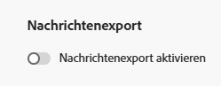
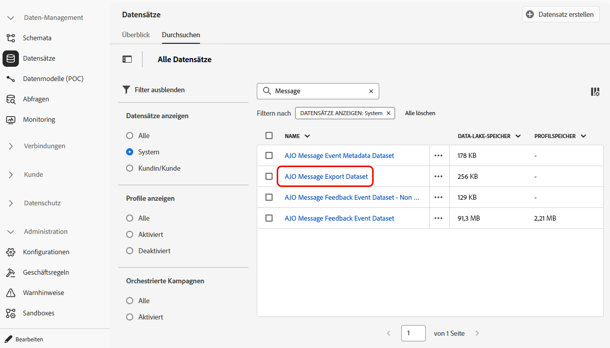
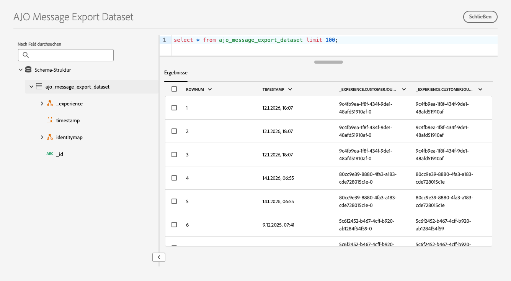

# Exportieren von Nachrichteninhalten {#message-export}

>[!CONTEXTUALHELP]
>id="ajo_admin_msg_export"
>title="Aufbewahren und Exportieren von gesendeten Inhalten"
>abstract="Wenn Sie diese Option auswählen, können Sie die Inhalte der gesendeten E-Mails oder SMS-Nachrichten mit dieser Konfiguration in einen [!DNL Experience Platform]-Datensatz schreiben. Einträge werden ab der Aufnahme für sieben Kalendertage aufbewahrt. Während dieses Zeitraums können Sie sie in Ihren eigenen Speicher exportieren."

>[!AVAILABILITY]
>
>Diese Funktion ist nur für den E-Mail- und SMS-Kanal verfügbar und steht Unternehmen zur Verfügung, die das Add-on für den Nachrichtenexport erworben haben. Weitere Informationen erhalten Sie beim Adobe-Support.

**Nachrichtenexport** ermöglicht Ihnen die Übertragung gesendeter E-Mail- und SMS-Nachrichteninhalte von [!DNL Journey Optimizer] an Ihren eigenen Speicher über [[!DNL Adobe Experience Platform] Ziele](https://experienceleague.adobe.com/de/docs/experience-platform/destinations/home){target="_blank"}, mit denen Sie Daten aus [!DNL Experience Platform] an externe Endpunkte senden können.

Mit dieser Funktion wird der Inhalt von E-Mail- und SMS-Nachrichten, die über [!DNL Journey Optimizer] gesendet werden und für den Export markiert wurden, in den [!DNL Experience Platform] [AJO-Nachrichtenexportdatensatz &#x200B;](message-export-schema.md).

Datensätze werden dann sieben Kalendertage nach der Aufnahme im Datensatz aufbewahrt, während derer Sie sie in das externe System Ihrer Wahl exportieren können.

➡️ Häufige Fragen und Antworten finden Sie unter [Häufig gestellte Fragen zum Nachrichtenexport](#message-export-faq).

## Leitlinien

* Diese Funktion unterstützt nur die Kanäle **E-Mail** und **SMS**.
* Datensätze im AJO-Nachrichtenexport-Datensatz werden (**sieben Kalendertage)** der Aufnahme aufbewahrt.
* Die Aufstockung wird nicht für Nachrichten unterstützt, die vor dem Aktivieren des Nachrichtenexports gesendet wurden (wie unten beschrieben).

## Nachrichtenexport aktivieren {#enable-message-export}

Der Onboarding-Prozess für die Funktion „Nachrichtenexport“ besteht aus zwei Schritten:

1. [Einrichten des Datenflusses für den Export](#set-up-export-dataflow) in [!DNL Experience Platform];
1. [Aktivieren des Nachrichtenexports](#config-message-export) in der Kanalkonfiguration in [!DNL Journey Optimizer].

>[!WARNING]
>
>Nach der Aktivierung von Exporten und dem Nachrichtenversand werden nur neue Einträge angezeigt. Aufstockungen für Inhalte werden vor dem Einrichten des Exportvorgangs und der Aktivierung der Option „Nachricht exportieren“ nicht unterstützt.

### Einrichten des Datenflusses für den Export {#set-up-export-dataflow}

Bevor Sie Ihre Daten exportieren können, richten Sie den Exportprozess ein, indem Sie das [!DNL Experience Platform]-Ziel und den Datensatz-Exportfluss definieren.

Detaillierte Anweisungen, unterstützte Cloud-Ziele, erforderliche Berechtigungen und weitere Informationen finden Sie [diesem Abschnitt](../data/export-datasets.md#export-datasets).

>[!NOTE]
>
>Dieses Setup muss für jede Sandbox konfiguriert werden.

1. Wählen Sie einen Experience Platform-[Zieltyp](https://experienceleague.adobe.com/de/docs/experience-platform/destinations/destination-types){target="_blank"}. Eine Liste der verfügbaren Zielplattformen, die für den Empfang von Daten bereit sind, finden Sie auf [dieser Seite](https://experienceleague.adobe.com/de/docs/experience-platform/destinations/catalog/overview){target="_blank"}.

1. Konfigurieren Sie in [!DNL Experience Platform] Ihr Ziel, indem Sie Anmeldedaten, einen Bucket/Container, ein Pfadpräfix und Sicherheitsoptionen definieren. [Weitere Informationen](https://experienceleague.adobe.com/de/docs/experience-platform/destinations/ui/activate/export-datasets){target="_blank"}

1. Erstellen Sie einen Datensatz-Exportfluss mit den folgenden Daten:

   * Quelldatensatz: Wählen Sie **AJO-Nachrichtenexport-Datensatz**.
   * Dateiformat: Wählen Sie JSON oder Parquet (wählen Sie eine Option, die auf nachgelagerten Tools basiert).
   * Zeitplan: Stellen Sie sicher, dass die Ausführung innerhalb des 7-tägigen Aufbewahrungsfensters erfolgt.

### Aktivieren des Nachrichtenexports in der Kanalkonfiguration {#config-message-export}

Um den Nachrichtenexport auf Ihre Kampagnen und Journeys anzuwenden, müssen Sie die entsprechende Option auf der Kanalkonfigurationsebene aktivieren. Gehen Sie wie folgt vor.

1. Bearbeiten oder erstellen Sie in [!DNL Journey Optimizer] die gewünschte E-Mail- oder SMS-[Kanalkonfiguration](channel-surfaces.md#create-channel-surface).

1. Wählen Sie die Option **[!UICONTROL Nachrichtenexport aktivieren]** aus.

   

1. Speichern Sie Ihre Änderungen und übermitteln Sie Ihre Kanalkonfiguration.

Nachdem Sie Nachrichten über Kampagnen oder Journey mit dieser Kanalkonfiguration gesendet haben, werden E-Mail- und SMS-Nachrichten in den **AJO-Nachrichtenexportdatensatz geschrieben**. Sie können dann [auf die Datensätze](#access-exported-data) im Datensatz zugreifen und sie basierend auf dem von Ihnen definierten Exportdatenfluss an Ihr ausgewähltes Speicherziel exportieren.

>[!NOTE]
>
>Wenn Sie den Umschalter **[!UICONTROL Nachrichtenexport aktivieren]** deaktivieren, werden keine neuen Einträge für diese Kanalkonfiguration mehr in den Datensatz aufgenommen. Vorhandene Einträge bleiben bis zum Ablauf der Aufbewahrungsfrist erhalten.

## Zugreifen auf exportierte Nachrichtendaten {#access-exported-data}

Nachdem Nachrichten mithilfe einer Kanalkonfiguration gesendet wurden, bei der der Nachrichtenexport aktiviert ist, können Sie auf die exportierten Daten im **AJO-Nachrichtenexportdatensatz zugreifen und sie**.

So zeigen Sie die exportierten Nachrichtendaten an:

1. Navigieren Sie in [!DNL Journey Optimizer] im linken Navigationsbereich zu **[!UICONTROL Daten]** > **[!UICONTROL Datensätze]**. [Weitere Informationen zu Datensätzen](../data/get-started-datasets.md)

1. Stellen Sie sicher, dass Sie systemgenerierte Datensätze anzeigen.

1. Wählen Sie den **AJO-Nachrichtenexportdatensatz** aus der Liste aus.

   

1. Klicken Sie auf der Seite mit den Datensatzdetails auf **[!UICONTROL Datensatz in der Vorschau anzeigen]**, um die neuesten Datensätze anzuzeigen.

   

Der Datensatz enthält umfassende Informationen für jede Nachricht, die über die Kanalkonfiguration mit aktiviertem Nachrichtenexport gesendet wird, einschließlich: Betreffzeile, Nachrichtentext, Empfänger-E-Mail-Adresse oder Telefonnummer, Absenderadresse oder Telefonnummer, Datum und Uhrzeit des Versands, Personalisierungsdaten und mehr.

➡️ Eine vollständige Ansicht der Datensatzstruktur und aller verfügbaren Felder finden Sie im [AJO-Nachrichtenexportschema](message-export-schema.md).

Alle Datensätze im Datensatz werden ab **Aufnahme (sieben**) aufbewahrt. Während dieser Aufbewahrungsfrist können Sie auf die Daten für Compliance-Audits und rechtliche Anfragen zugreifen oder sie über das konfigurierte Experience Platform-Ziel in Ihr eigenes Speichersystem exportieren.

## Beispiel für exportiertes JSON {#sample-exported-json}

Die folgenden Beispiele zeigen die Gesamtform der Datensätze, die für SMS und E-Mail in den AJO-Nachrichtenexport-Datensatz geschrieben wurden. Werte wie Kennungen, Schemaverweise, Zeitstempel und Inhalte sind illustrativ. Ihre Exporte spiegeln Ihre Sandbox, Ihr Schema und die gesendeten Nachrichten wider.

Erweitern Sie jeden Abschnitt, um die vollständige JSON-Beispieldatei anzuzeigen.

+++ Beispiel für SMS-Export

```json
{
  "header": {
    "msgId": "f06d2a6d-65c3-472b-9ca7-cc4224af2df4",
    "xactionId": "9ccd6e76-9ee5-4a12-bff3-fea240228121",
    "msgType": "xdmEntityCreate",
    "imsOrgId": "906E3A095DC834230A495FD6@AdobeOrg",
    "sandboxId": "db3adc95-dcf6-49c3-badc-95dcf639c345",
    "sandboxName": "ajo-e2e",
    "createdAt": 1773591102107,
    "datasetId": "689653509dd3432b92f6323f",
    "schemaRef": {
      "id": "https://ns.adobe.com/aemonacpprodcampaign/schemas/64cb5d9d26c2aae6b08bdc9b7882deb90202439ec53836e7",
      "contentType": "application/vnd.adobe.xed-full+json;version=1"
    },
    "source": {
      "name": "message-execution-service"
    },
    "originalTimestamp": 1773591102107,
    "tags": [
      "ups:segmentation=false"
    ]
  },
  "body": {
    "xdmEntity": {
      "_experience": {
        "customerJourneyManagement": {
          "messageExecution": {
            "messageExecutionID": "CSM-09561055",
            "messageID": "15fe77c8-ab73-49e4-abbb-c25b859162ff-0",
            "messageType": "marketing",
            "campaignID": "5638ce57-5264-4a96-995f-5ae34eddafd7",
            "campaignVersionID": "f9019155-3d6a-44a1-9b6f-5f9cd49e7cf5",
            "campaignActionID": "dfa7f59f-477c-42ec-9db2-831d294b5779",
            "batchInstanceID": "5e23a286fb72411f1cdf1443a81ad2eb",
            "messagePublicationID": "15fe77c8-ab73-49e4-abbb-c25b859162ff",
            "audience": {
              "id": "4c339f63-b66e-4e72-8d56-db624b5277f2",
              "type": "targeted"
            }
          },
          "messageProfile": {
            "channel": {
              "_id": "https://ns.adobe.com/xdm/channels/sms",
              "_type": "https://ns.adobe.com/xdm/channel-types/sms"
            },
            "messageProfileID": "7ff5aefb-7583-38c4-8c32-b63cced94aa7",
            "variant": "5c1092da-5ba2-4bcc-b591-713ee7999f7d"
          },
          "messageRenderedContent": {
            "smsContent": {
              "message": "AJO Campaigns - Prod - E2E Test Text VA7"
            }
          },
          "messageDeliveryMetadata": {
            "smsMetadata": {
              "recipient": {
                "number": "+19256260201"
              },
              "sender": {
                "numbers": [
                  "12345678"
                ]
              }
            }
          }
        }
      },
      "identityMap": {
        "email": [
          {
            "id": "rlyajoqa+messageExport1@adobe.com",
            "primary": true
          }
        ]
      },
      "_id": "b0001846-cafa-379a-be96-1d8ee973e047",
      "timestamp": "2026-03-15T16:11:42.184Z"
    }
  }
}
```

+++

+++ Beispiel für einen E-Mail-Export

```json
{
  "header": {
    "msgId": "1e64d2c4-7887-4f80-8b28-5c20d3da8baf",
    "xactionId": "5yfSV2Gs7VJM5TKo1uEkbiDd4iuakgzQ",
    "msgType": "xdmEntityCreate",
    "imsOrgId": "745F37C35E4B776E0A49421B@AdobeOrg",
    "sandboxId": "068abf40-575e-11ea-8512-9b1bfdb82603",
    "sandboxName": "prod",
    "createdAt": 1754489661211,
    "datasetId": "68912b8881572a2b267380c1",
    "schemaRef": {
      "id": "https://ns.adobe.com/cjmstage/schemas/1684477c0160376b8bb6975a80b5e5bd384696329faa1c42",
      "contentType": "application/vnd.adobe.xed-full+json;version=1"
    },
    "source": {
      "name": "message-execution-service"
    },
    "originalTimestamp": 1754489659000,
    "tags": [
      "ups:segmentation=false"
    ]
  },
  "body": {
    "xdmEntity": {
      "_experience": {
        "customerJourneyManagement": {
          "messageExecution": {
            "messageExecutionID": "HUMA-62208933",
            "messageID": "d0d02f68-afea-42fc-b898-6819cee643e6-0",
            "messageType": "transactional",
            "campaignID": "ce2331c2-c259-47ff-a1dd-f6d1eae08801",
            "campaignVersionID": "4272bb9f-e154-44e9-89f1-6548c77d1455",
            "batchInstanceID": "03587190-72cf-11f0-938b-31e7c9f96d89",
            "messagePublicationID": "d0d02f68-afea-42fc-b898-6819cee643e6",
            "audience": {
              "type": "all"
            }
          },
          "messageProfile": {
            "channel": {
              "_id": "https://ns.adobe.com/xdm/channels/email",
              "_type": "https://ns.adobe.com/xdm/channel-types/email"
            },
            "messageProfileID": "5yfSV2Gs7VJM5TKo1uEkbiDd4iuakgzQ",
            "variant": "11cc5796-8017-4738-aa66-ca5db967dfcc"
          },
          "messageRenderedContent": {
            "emailContent": {
              "subject": "test",
              "html": "xxx"
            }
          },
          "messageDeliveryMetadata": {
            "emailMetadata": {
              "recipient": {
                "email": "himanshig@adobe.com"
              },
              "sender": {
                "email": "cjm-team@e2e-personalisation.test.cjmadobe.com",
                "name": "CJM team",
                "replyToEmail": "replyto@marketing.adobecjm.com",
                "replyToName": "replyto",
                "errorEmail": "replyto@e2e-personalisation.test.cjmadobe.com"
              }
            }
          }
        }
      },
      "identityMap": {
        "email": [
          {
            "id": "chijain@adobe.com",
            "primary": true
          }
        ]
      },
      "_id": "ea48ce1b-80c9-3c6a-b05f-d1c998989e02",
      "timestamp": "2025-08-06T14:14:22.814Z"
    }
  }
}
```

+++

## Häufig gestellte Fragen zum Nachrichtenexport {#message-export-faq}

+++ Was ist ein Nachrichtenexport?

Der Nachrichtenexport ermöglicht es Kunden, vollständig gerenderte Nachrichten (E-Mail und SMS) zu exportieren, die an Endbenutzer gesendet wurden. Die exportierten Daten können mithilfe der standardmäßigen [!DNL Adobe Experience Platform] (AEP)-Exportfunktionen an externe Ziele bereitgestellt und für Zwecke wie Archivierung, Compliance-Prüfung, Analyse oder nachgelagerte Integrationen verwendet werden.

+++

+++ Welche Kanäle werden unterstützt?

Der Nachrichtenexport unterstützt:

* E-Mail
* SMS

+++

+++ Welche Daten generiert Message Export?

Der Nachrichtenexport erstellt einen systemgenerierten Datensatz in [!DNL Adobe Experience Platform], der einen Schnappschuss der Nachricht zum Versandzeitpunkt enthält. Dieser Datensatz kann dann an unterstützte Ziele exportiert werden (z. B. Cloud-Speicher oder Drittanbietersysteme).

Der Nachrichtenexport dient als Mechanismus, mit dem Kunden Nachrichtendaten aus Adobe-Systemen verschieben können. Kunden sind dafür verantwortlich, die Daten in ihren eigenen Archivierungs- oder Compliance-Lösungen zu transformieren, zu speichern und zu verwalten.

+++

+++ Erfasst der Nachrichtenexport vollständig personalisierte Nachrichten?

Ja. Nachrichtenexport erfasst die vollständig gerenderte Nachricht, die an jeden Empfänger gesendet wurde, einschließlich Personalisierung und dynamischer Inhalte, wie zum Sendezeitpunkt gerendert.

+++

+++ Kann der Nachrichtenexport zur Reproduktion der ursprünglichen Nachricht verwendet werden?

Ja. Die exportierte HTML kann verwendet werden, um die ursprünglich gesendete Nachricht in einem Browser zu reproduzieren.

Die Reproduktion hängt jedoch von der Verfügbarkeit extern gehosteter Assets (z. B. Bildern) ab. Der Nachrichtenexport bettet Mediendateien nicht direkt in den Export ein.

+++

+++ Sind Bilder und Medien im Export enthalten?

Der Nachrichtenexport umfasst HTML-Inhalte mit Verweisen (URLs) auf Bilder und andere Medien. Medien-Assets sind nicht im Export eingebettet.

Wenn eine Bild- oder Asset-URL nach dem Sendezeitpunkt ungültig wird, eingeschränkt wird oder die Veröffentlichung rückgängig gemacht wird, kann der Nachrichtenexport dieses Asset nicht wiederherstellen.

+++

+++ Wie werden Links im Nachrichtenexport verarbeitet?

Exportierte Nachrichten enthalten verschlüsselte getrackte Links, in Übereinstimmung mit der Art und Weise, wie Links zum Versandzeitpunkt verarbeitet werden. Diese verschlüsselten Links bleiben im Export erhalten und können nach den Entwürfen der Plattform aufgelöst werden.

+++

+++ Wie werden personenbezogene Daten und Personalisierungsdaten gehandhabt?

Die Daten werden genau so gespeichert, wie sie in der gerenderten Nachricht angezeigt werden:

* Die in der Nachricht gerenderten Personalization-Werte (z. B. Vorname) werden als Text angezeigt.
* Verschlüsselte Elemente (wie getrackte Links) bleiben verschlüsselt.
* Der Nachrichtenexport anonymisiert oder redigiert gerenderte Nachrichteninhalte nicht automatisch.

+++

+++ Wie lange bleiben Daten für den Nachrichtenexport erhalten?

Der Datenexport für Nachrichten folgt einem 7-tägigen Aufbewahrungsfenster in [!DNL Adobe Experience Platform].

Kunden sollten die Daten innerhalb dieses Zeitraums exportieren und in ihren eigenen Systemen speichern, wenn eine längere Aufbewahrung erforderlich ist.

+++

+++ Können Kunden den Nachrichtenexport vor dem Kauf testen?

Es gibt keine Testversion oder „try-before-you-buy“-Option für den Nachrichtenexport.

Kunden können ihre nachgelagerten Systeme mithilfe von Beispielexportdateien validieren, da der Nachrichtenexport auf die standardmäßige AEP-Datensatz- und -Zielfunktion angewiesen ist.

+++

+++ Ist das Schema „Nachrichtenexport“ vor dem Kauf verfügbar?

Nein. Der Datensatz und das Schema für den Nachrichtenexport werden erst nach dem Kauf und der Aktivierung des Add-ons für den Nachrichtenexport im Produkt verfügbar.

+++

+++ Ist Message Export eine vollständige Archivierungs- oder Compliance-Lösung?

Nein. Der Nachrichtenexport ist ein unterstützendes Produkt, kein vollständiges Archivierungs- oder Compliance-Produkt.

Von Kunden wird erwartet, dass sie:

* Exportieren von Nachrichtendaten aus Adobe
* Nach Bedarf umwandeln oder anreichern
* Daten in eigenen Archivierungs- oder Compliance-Systemen speichern und verwalten

+++

+++ Was sind häufige Anwendungsfälle?

Kunden verwenden in der Regel den Nachrichtenexport für Folgendes:

* Prüfung von Vorschriften oder Compliance
* Nachrichtenarchivierung
* Integration mit Systemen von Drittanbietern
* Interne Prüfung oder Support-Workflows
* Analytics über Adobe-Programme hinaus

+++

+++ Was der Nachrichtenexport nicht tut

Nachrichtenexport funktioniert nicht:

* Einbetten externer Bilder oder Medien-Assets
* Unbegrenzte oder langfristige Datenaufbewahrung in Adobe-Systemen
* Testumgebung anbieten
* Automatische Archivierung von Nachrichten außerhalb von Adobe

+++

