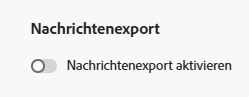

# Exportieren von Nachrichteninhalten {#message-export}

>[!CONTEXTUALHELP]
>id="ajo_admin_msg_export"
>title="Aufbewahren und Exportieren von gesendeten Inhalten"
>abstract="Wenn Sie diese Option auswählen, können Sie den Inhalt der gesendeten E-Mails oder SMS-Nachrichten mit dieser Konfiguration in einen [!DNL Experience Platform]-Datensatz schreiben. Datensätze werden 7 Kalendertage nach der Aufnahme aufbewahrt, während derer Sie sie in Ihren eigenen Speicher exportieren können."

>[!AVAILABILITY]
>
>Diese Funktion ist derzeit nur für eine Gruppe von Organisationen verfügbar (eingeschränkte Verfügbarkeit). Weitere Informationen erhalten Sie beim Adobe-Support.

Der **Nachrichtenexport** ermöglicht es Ihnen, gesendete E-Mail- und SMS-Nachrichteninhalte über [!DNL Adobe Experience Platform]-Ziele von [!DNL Journey Optimizer] an Ihren eigenen Speicher zu übertragen, wodurch Daten aus [!DNL Experience Platform] an externe Endpunkte gesendet werden können. [Weitere Informationen](https://experienceleague.adobe.com/de/docs/experience-platform/destinations/home){target="_blank"}

Mit dieser Funktion wird der Inhalt von E-Mail- und SMS-Nachrichten, die über [!DNL Journey Optimizer] gesendet werden und für den Export markiert wurden, in den [!DNL Experience Platform] **AJO-Nachrichtenexport-Datensatz** geschrieben.

Die Datensätze werden dann sieben Kalendertage lang nach der Aufnahme im **AJO** Nachrichtenexportdatensatz aufbewahrt, während derer Sie sie in ein externes System Ihrer Wahl exportieren können.
<!--
## Terminology

* **[!DNL Experience Platform] destinations** - Framework to deliver data out of Experience Platform into external endpoints. [Learn more](https://experienceleague.adobe.com/de/docs/experience-platform/destinations/home){target="_blank"}
* **AJO Message Export Dataset** - An [!DNL Experience Platform] dataset which stores the message content of email and SMS messages sent via [!DNL Journey Optimizer] which have been marked for export.
* **Retention**: Records in the AJO Message Export Dataset are retained for 3 calendar days from ingestion.-->

## Leitlinien

* Diese Funktion unterstützt nur die Kanäle E-Mail und SMS.
* Datensätze im AJO-Nachrichtenexport-Datensatz werden sieben Kalendertage nach der Aufnahme aufbewahrt.
* Die Aufstockung wird nicht für Nachrichten unterstützt, die vor dem Aktivieren des Nachrichtenexports gesendet wurden (wie unten beschrieben).

## Aktivieren des Nachrichtenexports {#enable-message-export}

Der Onboarding-Prozess für die Funktion „Nachrichtenexport“ besteht aus zwei Schritten:

1. [Einrichten des Datenflusses für den Export](#set-up-export-dataflow) in [!DNL Experience Platform];
1. [Aktivieren des Nachrichtenexports](#config-message-export) in der Kanalkonfiguration in [!DNL Journey Optimizer].

>[!WARNING]
>
>Nach der Aktivierung von Exporten und dem Nachrichtenversand werden nur neue Einträge angezeigt. Aufstockungen für Inhalte werden vor dem Einrichten des Exportvorgangs und der Aktivierung der Option „Nachricht exportieren“ nicht unterstützt.

### Einrichten des Datenflusses für den Export {#set-up-export-dataflow}

Bevor Sie Ihre Daten exportieren können, müssen Sie den Exportvorgang einrichten, indem Sie das [!DNL Experience Platform]-Ziel und den zu verwendenden Datensatz definieren. Gehen Sie wie folgt vor.

>[!NOTE]
>
>Dieses Setup muss für jede Sandbox konfiguriert werden.

1. Wählen Sie einen Experience Platform-[Zieltyp](https://experienceleague.adobe.com/de/docs/experience-platform/destinations/destination-types){target="_blank"}. Eine Liste der verfügbaren Zielplattformen, die für den Empfang von Daten bereit sind, finden Sie auf [dieser Seite](https://experienceleague.adobe.com/de/docs/experience-platform/destinations/catalog/overview){target="_blank"}.

1. Konfigurieren Sie in [!DNL Experience Platform] Ihr Ziel, indem Sie Anmeldedaten, einen Bucket/Container, ein Pfadpräfix und Sicherheitsoptionen definieren. [Weitere Informationen dazu](https://experienceleague.adobe.com/de/docs/experience-platform/destinations/ui/activate/export-datasets){target="_blank"}

1. Erstellen Sie einen Datensatz-Exportfluss mit den folgenden Daten:

   * Quelldatensatz: Wählen Sie **AJO-Nachrichtenexport-Datensatz**.
   * Dateiformat: Wählen Sie JSON oder Parquet (wählen Sie eine Option, die auf nachgelagerten Tools basiert).
   * Zeitplan: Stellen Sie sicher, dass die Ausführung innerhalb des 7-tägigen Aufbewahrungsfensters erfolgt.

### Aktivieren des Nachrichtenexports in der Kanalkonfiguration {#config-message-export}

Um den Nachrichtenexport auf Ihre Kampagnen und Journeys anzuwenden, müssen Sie die entsprechende Option auf der Kanalkonfigurationsebene aktivieren. Gehen Sie wie folgt vor.

1. Bearbeiten oder erstellen Sie in [!DNL Journey Optimizer] die gewünschte E-Mail- oder SMS-[Kanalkonfiguration](channel-surfaces.md#create-channel-surface).

1. Wählen Sie die Option **[!UICONTROL Nachrichtenexport aktivieren]** aus.

   

1. Speichern Sie Ihre Änderungen und übermitteln Sie Ihre Kanalkonfiguration.

E-Mail- und SMS-Nachrichten, die über Kampagnen oder Journeys mit dieser Kanalkonfiguration gesendet werden, werden in den **AJO-Nachrichtenexport-Datensatz** geschrieben. Die Einträge werden dann basierend auf dem von Ihnen definierten Exportdatenfluss an das ausgewählte Speicherziel exportiert.

Wenn Sie den Umschalter **[!UICONTROL Nachrichtenexport aktivieren]** deaktivieren, werden keine neuen Einträge für diese Kanalkonfiguration mehr in den Datensatz aufgenommen. Vorhandene Einträge bleiben bis zum Ablauf der Aufbewahrungsfrist erhalten.
