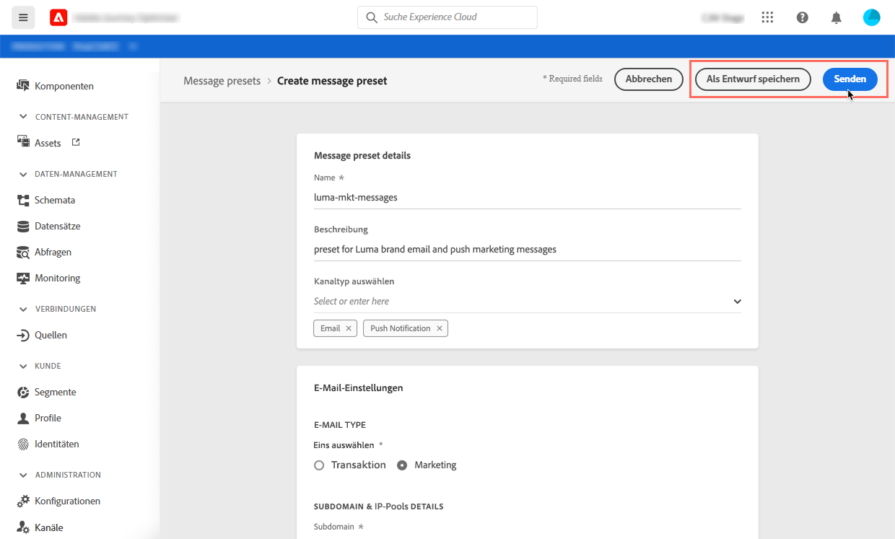
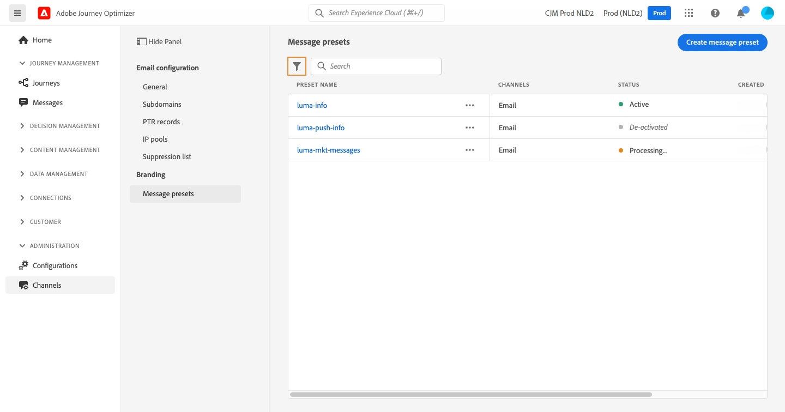
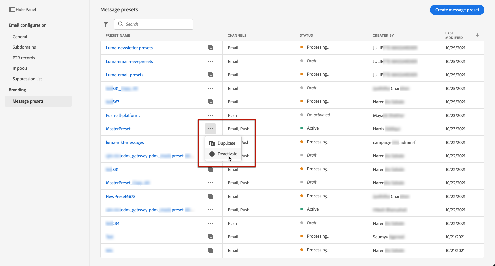
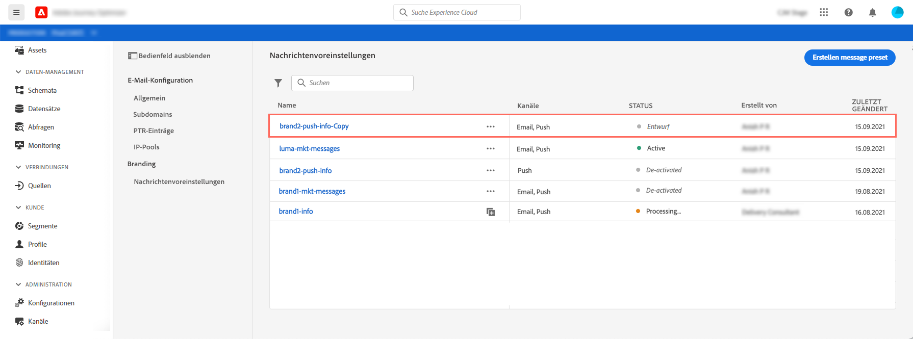

# Nachrichtenvorgaben erstellen

Mit Journey Optimizer können Sie Nachrichtenvorgaben einrichten, die alle technischen Parameter definieren, die für E-Mail- und Push-Benachrichtigungen (E-Mail-Typ, Absender-E-Mail und Name, mobile Apps usw.) erforderlich sind.

Sie können je nach den verschiedenen Marken, für die Sie kommunizieren müssen, so viele Nachrichtenvorgaben wie gewünscht einrichten.

Nachdem die Nachrichtenvorgaben konfiguriert wurden, können Sie sie beim Erstellen von Nachrichten aus der Liste **[!UICONTROL Vorgaben]** auswählen.

## Nachrichtenvorgabe {#create-message-preset} erstellen

Gehen Sie wie folgt vor, um eine Nachrichtenvorgabe zu erstellen:

1. Rufen Sie das Menü **[!UICONTROL Nachrichtenkonfiguration]** / **[!UICONTROL Nachrichtenvorgaben]** auf und klicken Sie dann auf **[!UICONTROL Nachrichtenvorgabe erstellen]**.

   

1. Geben Sie einen Namen und eine Beschreibung (optional) für die Vorgabe ein und geben Sie dann die Kanal an, die Sie konfigurieren möchten.

   

1. Konfigurieren Sie die Einstellungen für E-Mail- und Push-Benachrichtigungen:

   Geben Sie für den E-Mail-Kanal Folgendes an:

   * die Art der Kommunikation, die mit der Vorgabe gesendet wird (Transaktions- oder Marketingmeldungen),
   * Die [Subdomäne](about-subdomain-delegation.md), die zum Senden der E-Mails verwendet werden soll,
   * Der [IP-Pool](ip-pools.md), der mit der Vorgabe verknüpft werden soll,
   * Die Header-Parameter, die für Ihre E-Mails verwendet werden, die mit der Vorgabe gesendet werden.

   

   Geben Sie für den Kanal für Push-Benachrichtigungen die für Ihre Nachrichten zu verwendenden IOS- und/oder Android-Mobilanwendungen an. Weitere Informationen zum Konfigurieren Ihrer Umgebung zum Senden von Push-Benachrichtigungen finden Sie in [diesem Abschnitt](../push-configuration.md).

   

1. Nachdem alle Parameter konfiguriert wurden, klicken Sie zur Bestätigung auf **[!UICONTROL Senden]**. Sie können die Nachrichtenvorgabe auch als Entwurf speichern und die Konfiguration später fortsetzen.

   

1. Nachdem die Nachrichtenvorgabe erstellt wurde, wird sie in der Liste mit dem Status **[!UICONTROL Verarbeitung]** angezeigt.

   Während dieses Schritts werden mehrere Prüfungen durchgeführt, um sicherzustellen, dass die Konfiguration ordnungsgemäß durchgeführt wurde. Die Verarbeitungszeit beträgt etwa 48-72 Stunden und kann bis zu 7-10 Tage dauern.

   Sie können den Überprüfungsprozess verfolgen, indem Sie die Nachrichtenvorgabe aus der Liste öffnen.

       -SCREENSHOT ZWEI KONTROLLEN -
   
   !!Keine Verarbeitungsvorgabe auf der Bühne + Vorgabe kann nicht gesendet werden

   * **xxxx**:
   * **Prüfschritt**: Auslieferungstests werden vom Adobe-Auslieferungsteam durchgeführt. Dieser Schritt kann bis zu 10 Tage dauern, wenn einige Schritte während der Prüfung fehlschlagen. Die Kontrollen umfassen:

      * SPF-Validierung,
      * DKIM-Validierung,
      * MX-Datensatzvalidierung,
      * Checkliste für IP-Adressen,
      * Helo-Host-Prüfung,
      * IP-Pool-Überprüfung,
      * A/PTR-Datensatz, Prüfung der Subdomäne t/m/res.

1. Sobald die Prüfungen erfolgreich sind, werden Sie benachrichtigt (!!where?). und die Nachrichtenvorgabe erhält den Status **[!UICONTROL Aktiv]**. Es kann jetzt verwendet werden, um Nachrichten zu senden.

## Nachrichtenvorgaben verwalten und bearbeiten

Alle Nachrichtenvorgaben werden im Menü **[!UICONTROL Nachrichtenkonfiguration]** / **[!UICONTROL Nachrichtenvorgaben]** angezeigt. Es stehen Filter zur Verfügung, die Ihnen beim Durchsuchen der Liste helfen (Kanal-Typ, Benutzer, Status).

Nachrichtenvorgaben können folgende Status haben:

* **[!UICONTROL Entwurf]**: Die Nachrichtenvorgabe wurde als Entwurf gespeichert und wurde noch nicht gesendet. Öffnen Sie es, um die Konfiguration fortzusetzen.
* **[!UICONTROL Verarbeitung]**: Die Nachrichtenvorgabe wurde gesendet und durchläuft mehrere Überprüfungsschritte.
* **[!UICONTROL Aktiv]**: Die Nachrichtenvorgabe wurde überprüft und kann zum Erstellen von Nachrichten ausgewählt werden.
* **[!UICONTROL Fehlgeschlagen]**: Eine oder mehrere Prüfungen sind während der Überprüfung der Nachrichtenvorgabe fehlgeschlagen.
* **[!UICONTROL Deaktiviert]**: Die Nachrichtenvorgabe ist deaktiviert. Es kann nicht zum Erstellen von Nachrichten verwendet werden.

Um eine Nachrichtenvorgabe zu bearbeiten, müssen Sie sie zunächst deaktivieren, damit sie nicht mehr verfügbar ist, um neue Nachrichten zu erstellen (veröffentlichte Nachrichten, die diese Vorgabe verwenden, sind nicht betroffen und funktionieren weiterhin).

Anschließend müssen Sie die Vorgabe für die Nachricht Duplikat vornehmen, um eine neue Version zu erstellen, mit der neue Nachrichten erstellt werden:

1. Rufen Sie die Liste der Nachrichtenvorgaben auf und deaktivieren Sie dann die Nachrichtenvorgabe, die Sie bearbeiten möchten.

   

1. Duplikat der deaktivierten Nachrichtenvorgabe. Eine Kopie mit dem Status **[!UICONTROL Entwurf]** wird der Liste automatisch hinzugefügt.

   

1. Öffnen Sie die duplizierte Nachrichtenvorgabe, ändern Sie sie entsprechend Ihren Anforderungen und senden Sie dann Ihre Änderungen. Die Nachrichtenvorgabe durchläuft denselben Überprüfungszyklus wie während des [Erstellungsschritts](#create-message-preset).

1. Nach der Validierung erhält es den Status **[!UICONTROL Aktiv]** und kann zum Erstellen neuer Nachrichten verwendet werden.

   

<!--que fait-on ensuite avec l'ancienne version deactivated: reste là pour être utilisée par les anciens messages?). quand un deactivate preset est-il enlevé de la liste?-->
