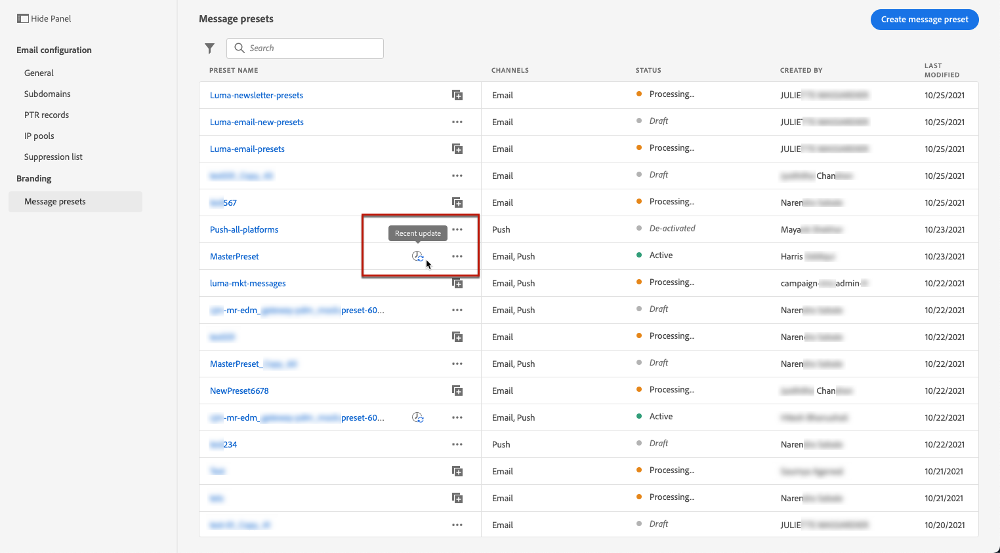
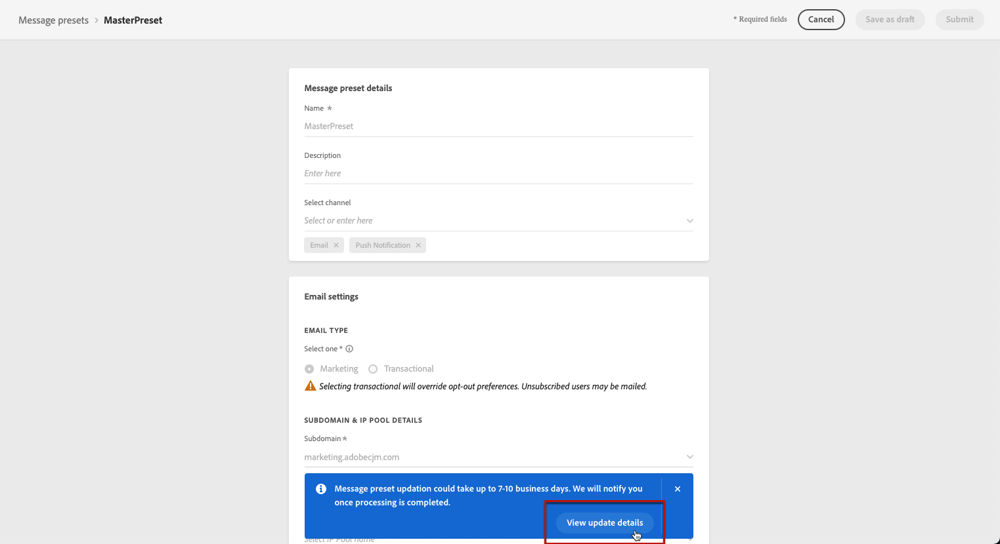

# Erstellen von Nachrichtenvoreinstellungen

Mit [!DNL Journey Optimizer] können Sie Nachrichtenvoreinstellungen einrichten, die alle technischen Parameter definieren, die für E-Mail- und Push-Benachrichtigungen erforderlich sind: E-Mail-Typ, Absender-E-Mail und Name, Mobile Apps und mehr.

>[!CAUTION]
>
> * Die Konfiguration von Nachrichtenvoreinstellungen ist auf Journey-Administratoren beschränkt. [Weitere Informationen](../administration/ootb-product-profiles.md#journey-administrator)
>
> * Sie müssen die E-Mail-Konfiguration durchführen und [Push-Konfiguration](../push-configuration.md) Schritte vor der Erstellung von Nachrichtenvorgaben.

Nachdem die Nachricht konfiguriert wurde, können Sie sie beim Erstellen von Nachrichten aus der Liste **[!UICONTROL Voreinstellungen]** auswählen.

➡️ [Erfahren Sie in diesem Video, wie Sie E-Mail-Voreinstellungen definieren und verwenden](#video-presets).

## Nachrichtenvoreinstellungen erstellen {#create-message-preset}

Gehen Sie wie folgt vor, um eine Nachrichtenvoreinstellung zu erstellen:

1. Zugriff auf **[!UICONTROL Kanäle]** > **[!UICONTROL Branding]** > **[!UICONTROL Nachrichtenvorgaben]** Menü und klicken Sie auf **[!UICONTROL Nachrichtenvorgabe erstellen]**.

   

1. Geben Sie einen Namen und eine Beschreibung (optional) für die Voreinstellung ein und wählen Sie dann die zu konfigurierenden Kanäle aus.

   

   >[!NOTE]
   >
   > Namen müssen mit einem Buchstaben (A–Z) beginnen. Ein Name darf nur alphanumerische Zeichen enthalten. Sie können auch die Zeichen Unterstrich `_`, Punkt `.` und Bindestrich `-` verwenden.

1. Konfigurieren von **E-Mail**-Einstellungen.

   

   * Wählen Sie den Nachrichtentyp aus, der mit der Voreinstellung gesendet werden soll: **Transaktion** oder **Marketing**

      >[!CAUTION]
      >
      > **Transaktions**-Nachrichten können an Profile gesendet werden, die sich von Marketing-Nachrichten abgemeldet haben. Diese Nachrichten können nur in bestimmten Kontexten gesendet werden, z. B. beim Zurücksetzen des Passworts, beim Bestellstatus oder bei Versandbenachrichtigungen.

   * Wählen Sie die Subdomain aus, die zum Senden der E-Mails verwendet werden soll. [Weitere Informationen](about-subdomain-delegation.md)
   * Wählen Sie den IP-Pool aus, der mit der Voreinstellung verknüpft werden soll. [Weitere Informationen](ip-pools.md)
   * Geben Sie die Header-Parameter für die mit der Voreinstellung gesendeten E-Mails ein.

      >[!CAUTION]
      >
      >E-Mail-Adressen müssen die aktuell ausgewählte [delegierte Subdomain](about-subdomain-delegation.md).

      <!--CAUTION: Except for the **Reply to (forward email)** field-->

      * **[!UICONTROL Name des Absenders]**: Name des Absenders, z. B. Ihres Markennamens.

      * **[!UICONTROL Absender-E-Mail]**: Die E-Mail-Adresse, die Sie für Ihre Kommunikation verwenden möchten. Wenn die zugewiesene Subdomain beispielsweise *marketing.luma.com* lautet, können Sie *contact@marketing.luma.com* verwenden.

      * **[!UICONTROL Antwort an (Name)]**: Der Name, der verwendet wird, wenn der Empfänger in seiner E-Mail-Client-Software auf den Button **Antworten** klickt.

      * **[!UICONTROL Antwort an (E-Mail)]**: Die E-Mail-Adresse, die verwendet wird, wenn der Empfänger in seiner E-Mail-Client-Software auf den Button **Antworten** klickt. <!--The emails sent to this address will be forwarded to the **[!UICONTROL Reply to (forward email)]** address provided below. -->Sie müssen eine Adresse verwenden, die in der zugewiesenen Subdomain definiert ist (z. B. *reply@marketing.luma.com*), da ansonsten die E-Mails gelöscht werden.

      * **[!UICONTROL E-Mail-Fehler]**: An dieser Adresse werden alle Fehler empfangen, die von ISPs nach wenigen Tagen der E-Mail-Zustellung erzeugt wurden (asynchrone Bounces).

      <!--**[!UICONTROL Reply to (forward email)]**: All emails received by [!DNL Journey Optimizer] for the delegated subdomain will be forwarded to this email address. You can specify any address, except an email address defined on the delegated subdomain. For example, if the delegated subdomain is *marketing.luma.com*, any address like *abc@marketing.luma.com* is prohibited.-->

      >[!NOTE]
      >
      >Ab der Version Oktober 2021 ist es nicht mehr möglich, eine Weiterleitungs-E-Mail-Adresse aus dem [!DNL Journey Optimizer] -Benutzeroberfläche. Wenn Sie möchten, dass alle E-Mails von [!DNL Journey Optimizer] für die Weiterleitung der delegierten Subdomain an eine bestimmte E-Mail-Adresse wenden Sie sich an die [Support-Team der Adobe](https://helpx.adobe.com/de/enterprise/admin-guide.html/enterprise/using/support-for-experience-cloud.ug.html){target=&quot;_blank&quot;}. <!--move to Deprecated features section when created?-->

      

      >[!NOTE]
      >
      >Namen müssen mit einem Buchstaben (A–Z) beginnen. Ein Name darf nur alphanumerische Zeichen enthalten. Sie können auch die Zeichen Unterstrich `_`, Punkt `.` und Bindestrich `-` verwenden.

   * Konfigurieren Sie die **Parameter für weitere Zustellversuche bei E-Mails**. Standardmäßig ist der [Zeitraum für weitere Zustellversuche](retries.md#retry-duration) auf 84 Stunden festgelegt. Sie können diese Einstellung jedoch an Ihre Anforderungen anpassen.

      

      Sie müssen einen ganzzahligen Wert (in Stunden oder Minuten) innerhalb des folgenden Bereichs eingeben:
      * Für den Marketing-E-Mail-Typ beträgt der Mindestzeitraum für weitere Zustellversuche 6 Stunden.
      * Für den Transaktions-E-Mail-Typ beträgt der Mindestzeitraum für weitere Zustellversuche 10 Minuten.
      * Für beide E-Mail-Typen beträgt der maximale Zeitraum für weitere Zustellversuch 84 Stunden (oder 5.040 Minuten).

1. Konfigurieren Sie die Einstellungen für **Push-Benachrichtigungen**.

   

   * Wählen Sie mindestens eine Plattform aus: **iOS** und/oder **Android**.

   * Wählen Sie für jede Plattform die zu verwendenden Mobile Apps aus.

      Weiterführende Informationen zur Konfiguration Ihrer Umgebung für den Versand von Push-Benachrichtigungen finden Sie in [diesem Abschnitt](../push-gs.md).

1. Nachdem alle Parameter konfiguriert wurden, klicken Sie zur Bestätigung auf **[!UICONTROL Senden]**. Sie können die Nachrichtenvoreinstellung auch als Entwurf speichern und ihre Konfiguration später fortsetzen.

   

1. Nachdem die Nachrichtenvoreinstellung erstellt wurde, wird sie in der Liste mit dem Status **[!UICONTROL Verarbeitung]** angezeigt.

   Während dieses Schritts werden mehrere Prüfungen durchgeführt, um zu verifizieren, dass die Konfiguration korrekt ist. Die Verarbeitungszeit ist um **48-72 Std.** und kann bis zu **7 - 10 Werktage**.

   Zu diesen Prüfungen gehören Zustellbarkeitstests, die vom Adobe-Zustellbarkeits-Team durchgeführt werden:

   * SPF-Validierung
   * DKIM-Validierung
   * MX-Eintragsvalidierung
   * Überprüfung der Blockierungsliste der IPs
   * Helo-Host-Prüfung
   * IP-Pool-Verifizierung
   * A/PTR-Eintrag, Subdomain-Verifizierung t/m/res

   >[!NOTE]
   >
   >In [diesem Abschnitt](#monitor-message-presets) erfahren Sie mehr über die möglichen Fehlerursachen, wenn die Prüfungen nicht erfolgreich sind.

1. Sobald die Prüfungen erfolgreich abgeschlossen sind, erhält die Nachrichtenvoreinstellung den Status **[!UICONTROL Aktiv]**. Sie kann nun zum Versand von Nachrichten verwendet werden.

   <!-- later on, users will be notified in Pulse -->

   

## Überwachen von Nachrichtenvoreinstellungen {#monitor-message-presets}

Alle Nachrichtenvorgaben werden im **[!UICONTROL Kanäle]** > **[!UICONTROL Nachrichtenvorgaben]** Menü. Ihnen stehen Filter zur Verfügung, mit denen Sie die Liste durchsuchen können (Kanaltyp, Benutzer, Status).

Nachrichtenvoreinstellungen können die folgenden Status aufweisen:

* **[!UICONTROL Entwurf]**: Die Nachrichtenvoreinstellung wurde als Entwurf gespeichert und noch nicht gesendet. Öffnen Sie sie, um die Konfiguration fortzusetzen.
* **[!UICONTROL Verarbeitung]**: Die Nachrichtenvoreinstellung wurde übermittelt und durchläuft mehrere Überprüfungsschritte.
* **[!UICONTROL Aktiv]**: Die Nachrichtenvoreinstellung wurde verifiziert und kann zum Erstellen von Nachrichten ausgewählt werden.
* **[!UICONTROL Fehlgeschlagen]**: Eine oder mehrere Prüfungen sind bei der Verifizierung der Nachrichtenvoreinstellung fehlgeschlagen.
* **[!UICONTROL Deaktiviert]**: Die Nachrichtenvorgabe ist deaktiviert. Sie kann nicht zum Erstellen neuer Nachrichten verwendet werden.

Im Folgenden finden Sie Details zu möglichen Fehlerursachen, falls die Erstellung einer Nachrichtenvoreinstellung fehlschlägt. 

Wenn einer dieser Fehler auftritt, wenden Sie sich an das [Adobe-Kundenunterstützung-Team](https://helpx.adobe.com/enterprise/admin-guide.html/enterprise/using/support-for-experience-cloud.ug.html){target=&quot;_blank&quot;}, um Hilfe zu erhalten.

* **SPF-Validierung fehlgeschlagen**: SPF (Sender Policy Framework) ist ein E-Mail-Authentifizierungsprotokoll, mit dem autorisierte IPs angegeben werden können, die E-Mails von einer bestimmten Subdomain senden können. Ein SPF-Validierungsfehler bedeutet, dass die IP-Adressen im SPF-Datensatz nicht mit den IP-Adressen übereinstimmen, die zum Senden von E-Mails an die E-Mail-Anbieter verwendet werden.

* **DKIM-Validierung fehlgeschlagen**: Mit DKIM (DomainKeys Identified Mail) kann der Empfänger-Server überprüfen, ob die empfangene Nachricht vom echten Absender der zugehörigen Domain gesendet wurde, und sicherstellen, dass der Inhalt der ursprünglichen Nachricht nicht auf dem Weg verändert wurde. Ein DKIM-Validierungsfehler bedeutet, dass die Empfangs-Mail-Server die Authentizität des Nachrichteninhalts und dessen Zuordnung zur Versand-Domain nicht überprüfen können.:

* **MX-Eintragsvalidierung fehlgeschlagen**: Ein MX-Eintragsvalidierungsfehler (Mail eXchange) bedeutet, dass die E-Mail-Server, die für die Annahme eingehender E-Mails für eine bestimmte Subdomain verantwortlich sind, nicht korrekt konfiguriert sind.

* **Zustellbarkeitskonfigurationen fehlgeschlagen**: Zustellbarkeitskonfigurationsfehler können aus einem der folgenden Gründe auftreten:
   * Blockierungsauflistung der zugewiesenen IPs
   * Ungültiger `helo`-Name
   * E-Mails, die von anderen IPs als den im IP-Pool der entsprechenden Voreinstellung angegebenen gesendet werden
   * E-Mails können nicht an Posteingänge wichtiger ISPs wie Gmail und Yahoo gesendet werden

## Eine Nachrichtenvorgabe bearbeiten {#edit-message-preset}

Gehen Sie wie folgt vor, um eine Nachrichtenvorgabe zu bearbeiten.

>[!NOTE]
>
>Sie können die **[!UICONTROL Einstellungen für Push-Benachrichtigungen]**. Wenn eine Nachrichtenvorgabe nur für den Kanal Push-Benachrichtigung konfiguriert ist, kann sie nicht bearbeitet werden.

1. Klicken Sie in der Liste auf den Namen einer Nachrichtenvorgabe, um sie zu öffnen.

   

1. Bearbeiten Sie die Eigenschaften nach Bedarf.

   >[!NOTE]
   >
   >Wenn eine Nachrichtenvorgabe die **[!UICONTROL Aktiv]** Status, **[!UICONTROL Name]**, **[!UICONTROL Kanal auswählen]** und **[!UICONTROL Subdomain]** -Felder sind ausgegraut und können nicht bearbeitet werden.

1. Klicken **[!UICONTROL Einsenden]** um Ihre Änderungen zu bestätigen.

   

   >[!NOTE]
   >
   >Sie können die Nachrichtenvorgabe auch als Entwurf speichern und die Aktualisierung später fortsetzen.

Sobald die Änderungen übermittelt wurden, durchläuft die Nachrichtenvorgabe einen Validierungszyklus, der dem beim [Erstellen einer Vorgabe](#create-message-preset).

Für Nachrichtenvorgaben mit **[!UICONTROL Aktiv]** -Status, können Sie die Details der Aktualisierung überprüfen. Gehen Sie dazu wie folgt vor:

* Klicken Sie auf **[!UICONTROL Letzte Aktualisierung]** neben dem Namen der aktiven Vorgabe angezeigt.

   

* Sie können während der Aktualisierung auch über eine aktive Nachrichtenvorgabe auf die Aktualisierungsdetails zugreifen.

   

Im **[!UICONTROL Letzte Aktualisierung]** -Bildschirm angezeigt werden, können Sie Informationen wie den Aktualisierungsstatus sehen,<!--the approximate remaining time before completion (if validation is in progress)--> und die Liste der angeforderten Änderungen.

### Status aktualisieren {#update-statuses}

Ein Update einer Nachrichtenvorgabe kann die folgenden Status aufweisen:

* **[!UICONTROL Verarbeitung]**: Die Aktualisierung der Nachrichtenvorgabe wurde gesendet und durchläuft derzeit mehrere Überprüfungsschritte.
* **[!UICONTROL Erfolg]**: Die aktualisierte Nachrichtenvorgabe wurde überprüft und kann zum Erstellen von Nachrichten ausgewählt werden.
* **[!UICONTROL Fehlgeschlagen]**: Eine oder mehrere Prüfungen sind bei der Überprüfung der Aktualisierung der Nachrichtenvorgabe fehlgeschlagen.

**Verarbeitung**

Es werden verschiedene Zustellbarkeitsprüfungen durchgeführt, um zu überprüfen, ob die Vorgabe ordnungsgemäß aktualisiert wurde. Die Verarbeitungszeit ist um **48-72 Std.** und kann bis zu **7 - 10 Werktage**. Weitere Informationen zu den während des Validierungszyklus durchgeführten Prüfungen finden Sie unter [diesem Abschnitt](#create-message-preset).

>[!NOTE]
>
>Sie können eine Nachrichtenvorgabe während der Aktualisierung nicht ändern. Sie können weiterhin auf den Namen klicken, aber alle Felder sind ausgegraut. Die Änderungen werden erst dann übernommen, wenn die Aktualisierung erfolgreich war.

Wenn Sie eine bereits aktive Vorgabe bearbeiten:

* Sein Status bleibt erhalten **[!UICONTROL Aktiv]** während der Validierung ausgeführt wird.

* Die **[!UICONTROL Letzte Aktualisierung]** neben dem Namen der Vorgabe in der Liste der Nachrichtenvorgaben angezeigt.

* Während des Validierungsprozesses verwenden die mit dieser Vorgabe konfigurierten Nachrichten weiterhin die ältere Version der Vorgabe.

**Erfolg**

Nach erfolgreicher Überprüfung wird die neue Version der Vorgabe automatisch in allen Nachrichten verwendet, die diese Vorgabe verwenden. Sie müssen jedoch möglicherweise warten:
* einige Minuten, bevor er von den unitären Nachrichten genutzt wird,
* bis zum nächsten Batch, damit die Vorgabe in Batch-Nachrichten wirksam wird.

<!--Changes made to a message preset with the **[!UICONTROL Active]** status will automatically be applied to all messages currently using this preset.-->

**Fehlgeschlagen**

Wenn der Validierungsprozess fehlschlägt, wird weiterhin die ältere Version der Vorgabe verwendet.

Die möglichen Aktualisierungsfehlertypen sind:
* **Autorisierungsfehler**: das Trägertoken ungültig oder nicht autorisiert ist.
* **Unzulässige Änderung**: an einem oder mehreren nicht zulässigen Feldern bearbeitet wurde.
* **Vorbedingung fehlgeschlagen**: Einige Felder können nur bestimmte Werte aufweisen, was nicht berücksichtigt wurde.

<!--Learn more on the possible failure reasons in [this section](#monitor-message-presets).-->

Wenn die Aktualisierung fehlschlägt, kann die Vorgabe erneut bearbeitet werden. Sie können auf den Namen klicken und die Einstellungen aktualisieren, die korrigiert werden müssen.

## Nachrichtenvorgabe deaktivieren {#deactivate-preset}

So erstellen Sie eine **[!UICONTROL Aktiv]** Nachrichtenvorgabe nicht verfügbar ist, um neue Nachrichten zu erstellen, können Sie sie deaktivieren. Die mit dieser Vorgabe veröffentlichten Nachrichten sind jedoch nicht betroffen und funktionieren weiterhin.

>[!NOTE]
>
>Sie können eine Nachrichtenvorgabe nicht deaktivieren, während eine Aktualisierung verarbeitet wird. Sie müssen warten, bis die Aktualisierung erfolgreich war oder fehlgeschlagen ist. Weitere Informationen finden Sie unter [Bearbeiten von Nachrichtenvorgaben](#edit-message-preset) und auf [Aktualisierungsstatus](#update-statuses).

1. Rufen Sie die Liste der Nachrichtenvorgaben auf.

1. Klicken Sie für die aktive Vorgabe Ihrer Wahl auf die **[!UICONTROL Mehr Aktionen]** Schaltfläche.

1. Auswählen **[!UICONTROL Deaktivieren]**.

   

>[!NOTE]
>
>Deaktivierte Nachrichtenvorgaben können nicht gelöscht werden, um Probleme in Journeys zu vermeiden, die diese Vorgaben zum Senden von Nachrichten verwenden.

Eine deaktivierte Nachrichtenvorgabe kann nicht direkt bearbeitet werden. Sie können sie jedoch duplizieren und die Kopie bearbeiten, um eine neue Version zu erstellen, mit der Sie neue Nachrichten erstellen. Sie können sie auch erneut aktivieren und warten, bis die Aktualisierung erfolgreich abgeschlossen wurde.

<!--1. Access the message presets list.

1. Deactivate the message preset that you want to edit.

1. Duplicate the deactivated message preset. A copy with the **[!UICONTROL Draft]** status is automatically added to the list.

    

1. Open the duplicated message preset, modify it according to your needs, then submit your changes. The message preset will go through the same validation cycle as during the [creation step](#create-message-preset).

1. Once validated, it gets the **[!UICONTROL Active]** status and is ready to be used to create new messages.-->

## Anleitungsvideo{#video-presets}

Erfahren Sie, wie Sie Nachrichtenvoreinstellungen definieren und verwenden, eine Subdomain zuweisen und einen IP-Pool erstellen.

>[!VIDEO](https://video.tv.adobe.com/v/334343?quality=12)
