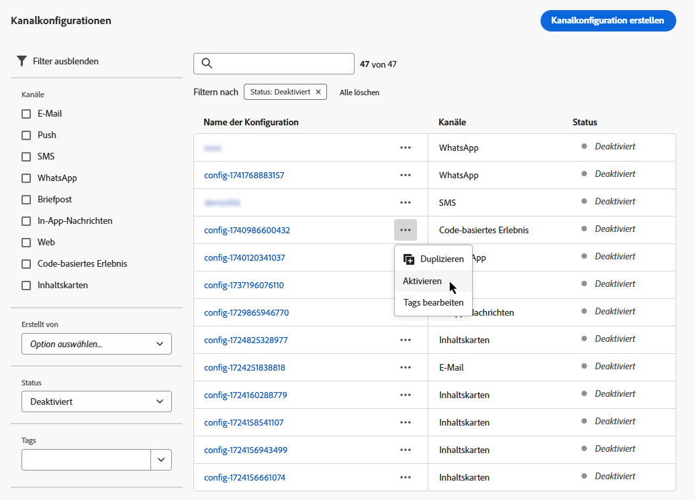

# Einrichten von Kanaloberflächen {#message-presets-creation}

Mit [!DNL Journey Optimizer]können Sie Kanaloberflächen (d. h. Nachrichtenvorgaben) einrichten, die alle für Ihre Nachrichten erforderlichen technischen Parameter definieren: E-Mail-Typ, Absender-E-Mail und Name, mobile Apps und mehr.

>[!CAUTION]
>
> * Um Kanaloberflächen zu erstellen, zu bearbeiten und zu löschen, muss die [Kanaloberfläche verwalten](../administration/high-low-permissions.md#manage-channel-surface).
>
> * Sie müssen die [E-Mail-Konfiguration](#configure-email-settings), [Push-Konfiguration](../configuration/push-configuration.md) und [SMS-Konfiguration](../configuration/sms-configuration.md) Schritte vor dem Erstellen von Kanaloberflächen.

Sobald die Kanaloberflächen konfiguriert wurden, können Sie sie beim Erstellen von Nachrichten von einer Journey auswählen.

➡️ [In diesem Video erfahren Sie, wie Sie E-Mail-Oberflächen erstellen und verwenden.](#video-presets)

## Erstellen einer Kanaloberfläche {#create-message-preset}

>[!CONTEXTUALHELP]
>id="ajo_admin_message_presets"
>title="Details und Einstellungen der Kanaloberfläche"
>abstract="Durch die Einrichtung einer Kanaloberfläche können Sie den Kanal auswählen, auf den sie angewendet wird, und alle technischen Parameter definieren, die für Ihren Versand erforderlich sind, z. B. E-Mail-Typ, zu verwendende Subdomain, Absendername, mobile Apps usw."

Gehen Sie wie folgt vor, um eine Kanaloberfläche zu erstellen:

1. Zugriff auf **[!UICONTROL Kanäle]** > **[!UICONTROL Branding]** > **[!UICONTROL Kanaloberflächen]** Menü und klicken Sie auf **[!UICONTROL Kanaloberfläche erstellen]**.

   

1. Geben Sie einen Namen und eine Beschreibung (optional) für die Oberfläche ein und wählen Sie dann die zu konfigurierenden Kanäle aus.

   

   >[!NOTE]
   >
   > Namen müssen mit einem Buchstaben (A–Z) beginnen. Ein Name darf nur alphanumerische Zeichen enthalten. Sie können auch die Zeichen Unterstrich `_`, Punkt `.` und Bindestrich `-` verwenden.

1. Wenn Sie den **[!UICONTROL E-Mail]**-Kanal ausgewählt haben, konfigurieren Sie Ihre Einstellungen wie in [diesem Abschnitt](email-settings.md) beschrieben.

   

1. Wenn Sie den Kanal **[!UICONTROL Push-Benachrichtigung]** ausgewählt haben, wählen Sie mindestens eine Plattform (**iOS** und/oder **Android**) und die Mobile Apps aus, die für jede Plattform verwendet werden sollen.

   

   >[!NOTE]
   >
   >Weiterführende Informationen zur Konfiguration Ihrer Umgebung für den Versand von Push-Benachrichtigungen finden Sie in [diesem Abschnitt](push-gs.md).

1. Wenn Sie den Kanal **[!UICONTROL SMS]** ausgewählt haben, konfigurieren Sie Ihre Einstellungen wie in [diesem Abschnitt](sms-configuration.md#message-preset-sms) beschrieben.

   

   >[!NOTE]
   >
   >Weiterführende Informationen zur Konfiguration Ihrer Umgebung für den Versand von SMS-Nachrichten finden Sie in [diesem Abschnitt](sms-configuration.md).

1. Nachdem alle Parameter konfiguriert wurden, klicken Sie zur Bestätigung auf **[!UICONTROL Senden]**. Sie können die Kanaloberfläche auch als Entwurf speichern und die Konfiguration später fortsetzen.

   

   >[!NOTE]
   >
   >Sie können nicht mit der Oberflächenerstellung fortfahren, solange sich der ausgewählte IP-Pool unter [edition](ip-pools.md#edit-ip-pool) (**[!UICONTROL Verarbeitung]** -Status) und noch nie mit der ausgewählten Subdomain verknüpft wurde. [Weitere Informationen](#subdomains-and-ip-pools)
   >
   >Speichern Sie die Oberfläche als Entwurf und warten Sie, bis der IP-Pool den **[!UICONTROL Erfolg]** -Status, um die Erstellung der Oberfläche wieder aufzunehmen.

1. Nachdem die Kanaloberfläche erstellt wurde, wird sie in der Liste mit der **[!UICONTROL Verarbeitung]** Status.

   Während dieses Schritts werden mehrere Prüfungen durchgeführt, um zu verifizieren, dass die Konfiguration korrekt ist. Die Verarbeitungszeit liegt bei **48–72 Stunden** und kann bis zu **7–10 Werktage** betragen.

   Zu diesen Prüfungen gehören Konfigurations- und technische Tests, die vom Adobe-Team durchgeführt werden:

   * SPF-Validierung
   * DKIM-Validierung
   * MX-Eintragsvalidierung
   * Überprüfung der Blockierungsliste der IPs
   * Helo-Host-Prüfung
   * IP-Pool-Verifizierung
   * A/PTR-Eintrag, Subdomain-Verifizierung t/m/res

   >[!NOTE]
   >
   >In [diesem Abschnitt](#monitor-message-presets) erfahren Sie mehr über die möglichen Fehlerursachen, wenn die Prüfungen nicht erfolgreich sind.

1. Sobald die Prüfungen erfolgreich sind, erhält die Kanaloberfläche die **[!UICONTROL Aktiv]** Status. Sie kann nun zum Versand von Nachrichten verwendet werden.

   

## Bildschirmkanaloberflächen {#monitor-message-presets}

Alle Kanaloberflächen werden im **[!UICONTROL Kanäle]** > **[!UICONTROL Kanaloberflächen]** Menü. Es stehen Filter zur Verfügung, mit denen Sie die Liste durchsuchen können (Kanal, Benutzer, Status).

Nach der Erstellung können Kanaloberflächen die folgenden Status aufweisen:

* **[!UICONTROL Entwurf]**: Die Kanaloberfläche wurde als Entwurf gespeichert und wurde noch nicht übermittelt. Öffnen Sie sie, um die Konfiguration fortzusetzen.
* **[!UICONTROL Verarbeitung]**: Die Kanaloberfläche wurde gesendet und durchläuft mehrere Überprüfungsschritte.
* **[!UICONTROL Aktiv]**: Die Kanaloberfläche wurde überprüft und kann zur Erstellung von Nachrichten ausgewählt werden.
* **[!UICONTROL Fehlgeschlagen]**: Bei der Überprüfung der Kanaloberfläche sind eine oder mehrere Prüfungen fehlgeschlagen.
* **[!UICONTROL Deaktiviert]**: Die Kanaloberfläche wird deaktiviert. Sie kann nicht zum Erstellen neuer Nachrichten verwendet werden.

Wenn die Erstellung einer Kanaloberfläche fehlschlägt, werden die Details zu den möglichen Fehlerursachen nachfolgend beschrieben.

Wenn einer dieser Fehler auftritt, wenden Sie sich an die [Adobe-Kundenunterstützung](https://helpx.adobe.com/de/enterprise/admin-guide.html/enterprise/using/support-for-experience-cloud.ug.html){target=&quot;_blank&quot;}, um Hilfe zu erhalten.

* **SPF-Validierung fehlgeschlagen**: SPF (Sender Policy Framework) ist ein E-Mail-Authentifizierungsprotokoll, mit dem autorisierte IPs angegeben werden können, die E-Mails von einer bestimmten Subdomain senden können. Ein SPF-Validierungsfehler bedeutet, dass die IP-Adressen im SPF-Datensatz nicht mit den IP-Adressen übereinstimmen, die zum Senden von E-Mails an die E-Mail-Anbieter verwendet werden.

* **DKIM-Validierung fehlgeschlagen**: Mit DKIM (DomainKeys Identified Mail) kann der Empfänger-Server überprüfen, ob die empfangene Nachricht vom echten Absender der zugehörigen Domain gesendet wurde, und sicherstellen, dass der Inhalt der ursprünglichen Nachricht nicht auf dem Weg verändert wurde. Ein DKIM-Validierungsfehler bedeutet, dass die Empfangs-Mail-Server die Authentizität des Nachrichteninhalts und dessen Zuordnung zur Versand-Domain nicht überprüfen können.:

* **MX-Eintragsvalidierung fehlgeschlagen**: Ein MX-Eintragsvalidierungsfehler (Mail eXchange) bedeutet, dass die E-Mail-Server, die für die Annahme eingehender E-Mails für eine bestimmte Subdomain verantwortlich sind, nicht korrekt konfiguriert sind.

* **Zustellbarkeitskonfigurationen fehlgeschlagen**: Zustellbarkeitskonfigurationsfehler können aus einem der folgenden Gründe auftreten:
   * Blockierungsauflistung der zugewiesenen IPs
   * Ungültiger `helo`-Name
   * E-Mails, die von anderen als den im IP-Pool der entsprechenden Oberfläche angegebenen IP-Adressen gesendet werden
   * E-Mails können nicht an Posteingänge wichtiger ISPs wie Gmail und Yahoo gesendet werden

## Kanaloberfläche bearbeiten {#edit-message-preset}

Gehen Sie wie folgt vor, um eine Kanaloberfläche zu bearbeiten.

>[!NOTE]
>
>Die **[!UICONTROL Einstellungen für Push-Benachrichtigungen]** können Sie nicht bearbeiten. Wenn eine Kanaloberfläche nur für den Kanal Push-Benachrichtigung konfiguriert ist, kann sie nicht bearbeitet werden.

1. Klicken Sie in der Liste auf einen Namen für die Kanaloberfläche, um ihn zu öffnen.

   

1. Bearbeiten Sie die Eigenschaften nach Bedarf.

   >[!NOTE]
   >
   >Wenn die Kanaloberfläche die **[!UICONTROL Aktiv]** Status, **[!UICONTROL Name]**, **[!UICONTROL Kanal auswählen]** und **[!UICONTROL Subdomain]** -Felder sind ausgegraut und können nicht bearbeitet werden.

1. Klicken Sie auf **[!UICONTROL Senden]**, um Ihre Änderungen zu bestätigen.

   

   >[!NOTE]
   >
   >Sie können die Kanaloberfläche auch als Entwurf speichern und die Aktualisierung später fortsetzen.

Sobald die Änderungen übermittelt wurden, durchläuft die Kanaloberfläche einen Validierungszyklus, der dem beim [Kanaloberfläche erstellen](#create-message-preset). Die Verarbeitungszeit nach dem Bearbeiten kann bis zu **3 Stunden** dauern.

>[!NOTE]
>
>Wenn Sie nur die Felder **[!UICONTROL Beschreibung]**, **[!UICONTROL E-Mail-Typ]** und/oder **[!UICONTROL E-Mail-Wiederholungsparameter]** bearbeiten, wird die Aktualisierung sofort wirksam.

### Details zur Aktualisierung {#update-details}

Für Kanaloberflächen mit **[!UICONTROL Aktiv]** -Status, können Sie die Details der Aktualisierung überprüfen. Gehen Sie dazu wie folgt vor:

Klicken Sie auf **[!UICONTROL Letzte Aktualisierung]** neben dem Namen der aktiven Oberfläche angezeigt.

<!--You can also access the update details from an active channel surface while update is in progress.-->

Auf dem Bildschirm **[!UICONTROL Letzte Aktualisierung]** können Sie Informationen wie den Aktualisierungsstatus und die Liste der angeforderten Änderungen sehen.

### Aktualisieren des Status {#update-statuses}

Ein Update der Kanaloberfläche kann die folgenden Status aufweisen:

* **[!UICONTROL Verarbeitung]**: Die Aktualisierung der Kanaloberfläche wurde eingereicht und durchläuft derzeit mehrere Überprüfungsschritte.
* **[!UICONTROL Erfolg]**: Die aktualisierte Kanaloberfläche wurde überprüft und kann zum Erstellen von Nachrichten ausgewählt werden.
* **[!UICONTROL Fehlgeschlagen]**: Bei der Überprüfung der Kanaloberfläche sind eine oder mehrere Prüfungen fehlgeschlagen.

Jeder Status wird nachfolgend beschrieben.

#### In Bearbeitung

Es werden mehrere Zustellbarkeitsprüfungen durchgeführt, um zu überprüfen, ob die Oberfläche ordnungsgemäß aktualisiert wurde.

>[!NOTE]
>
>Wenn Sie nur die Felder **[!UICONTROL Beschreibung]**, **[!UICONTROL E-Mail-Typ]** und/oder **[!UICONTROL E-Mail-Wiederholungsparameter]** bearbeiten, wird die Aktualisierung sofort wirksam.

Die Verarbeitungszeit kann bis **3 Stunden** dauern. Weitere Informationen zu den während des Validierungszyklus durchgeführten Prüfungen finden Sie in [diesem Abschnitt](#create-message-preset).

Wenn Sie eine bereits aktive Oberfläche bearbeiten:

* Ihr Status **[!UICONTROL Aktiv]** bleibt erhalten, während der Validierungsprozess ausgeführt wird.

* Die **[!UICONTROL Letzte Aktualisierung]** neben dem Namen der Oberfläche in der Liste der Kanaloberflächen angezeigt.

* Während des Validierungsprozesses verwenden die auf dieser Oberfläche konfigurierten Nachrichten weiterhin die ältere Version der Oberfläche.

>[!NOTE]
>
>Während der Aktualisierung kann die Kanaloberfläche nicht geändert werden. Sie können zwar weiterhin auf den Namen klicken, aber alle Felder sind ausgegraut. Die Änderungen werden erst dann übernommen, wenn die Aktualisierung erfolgreich war.

#### Erfolgreich {#success}

Nach erfolgreicher Validierung wird die neue Version der Oberfläche automatisch in allen Nachrichten verwendet, die diese Oberfläche verwenden. Sie müssen jedoch möglicherweise warten:
* einige Minuten, bevor die Voreinstellung von den einzelnen Nachrichten genutzt wird,
* bis zum nächsten Batch, damit die Oberfläche in Batch-Nachrichten wirksam ist.

#### Fehlgeschlagen {#failed}

Wenn der Validierungsprozess fehlschlägt, wird weiterhin die ältere Version der Oberfläche verwendet.

Weitere Informationen zu möglichen Fehlerursachen finden Sie in [diesem Abschnitt](#monitor-message-presets).

Wenn die Aktualisierung fehlschlägt, wird die Oberfläche wieder bearbeitbar. Sie können auf den Namen klicken und die Einstellungen aktualisieren, die korrigiert werden müssen.

## Deaktivieren der Kanaloberfläche {#deactivate-preset}

So erstellen Sie eine **[!UICONTROL Aktiv]** Kanaloberfläche nicht verfügbar, um neue Nachrichten zu erstellen, können Sie sie deaktivieren. Journey, die diese Oberfläche verwenden, sind jedoch nicht betroffen und funktionieren weiterhin.

>[!NOTE]
>
>Eine Kanaloberfläche kann während der Verarbeitung einer Aktualisierung nicht deaktiviert werden. Sie müssen warten, bis die Aktualisierung entweder erfolgreich war oder fehlgeschlagen ist. Weitere Informationen finden Sie unter [Bearbeitungskanalflächen](#edit-message-preset) und auf [Aktualisierungsstatus](#update-statuses).

1. Rufen Sie die Liste der Kanaloberflächen auf.

1. Klicken Sie für die aktive Oberfläche Ihrer Wahl auf die **[!UICONTROL Mehr Aktionen]** Schaltfläche.

1. Wählen Sie **[!UICONTROL Deaktivieren]** aus.

   

>[!NOTE]
>
>Deaktivierte Kanaloberflächen können nicht gelöscht werden, um Probleme in Journey zu vermeiden, die diese Oberflächen zum Senden von Nachrichten verwenden.

Eine deaktivierte Kanaloberfläche kann nicht direkt bearbeitet werden. Sie können sie jedoch duplizieren und die Kopie bearbeiten, um eine neue Version zu entwerfen, mit der Sie neue Nachrichten erstellen können. Sie können sie auch erneut aktivieren und warten, bis die Aktualisierung erfolgreich abgeschlossen wird, bevor Sie sie bearbeiten.

## Anleitungsvideo{#video-presets}

Erfahren Sie, wie Sie Kanaloberflächen erstellen, diese verwenden und eine Subdomain zuweisen und einen IP-Pool erstellen.

>[!VIDEO](https://video.tv.adobe.com/v/334343?quality=12)
