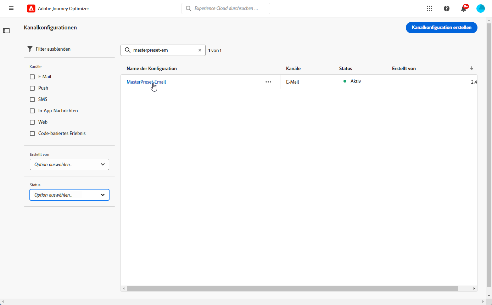
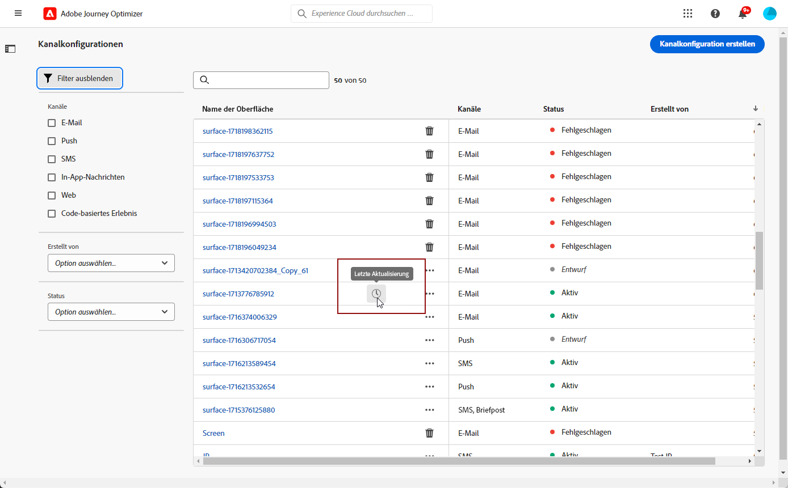
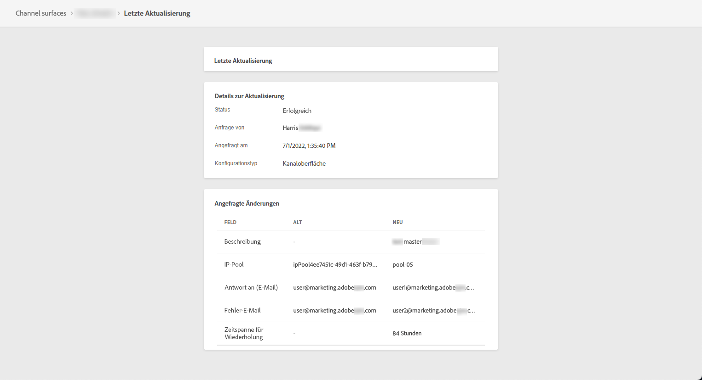

# Erstellen von Nachrichtenvoreinstellungen {#message-presets-creation}

Mit [!DNL Journey Optimizer] können Sie Nachrichtenvoreinstellungen einrichten, die alle technischen Parameter definieren, die für E-Mail- und Push-Benachrichtigungen erforderlich sind: E-Mail-Typ, Absender-E-Mail und Name, Mobile Apps und mehr.

>[!CAUTION]
>
> * Die Konfiguration von Nachrichtenvorgaben ist auf [Journey-Administratoren](../administration/ootb-product-profiles.md#journey-administrator). Um Nachrichtenvorgaben zu erstellen, zu bearbeiten und zu löschen, benötigen Sie die [Verwalten von Nachrichtenvorgaben](../administration/high-low-permissions.md#manage-message-presets).
>
> * Sie müssen [E-Mail-Konfiguration](#configure-email-settings) und [Push-Konfiguration](../configuration/push-configuration.md) Schritte vor der Erstellung von Nachrichtenvorgaben.

Nachdem die Nachrichtenvorgaben konfiguriert wurden, können Sie sie beim Erstellen von Nachrichten aus dem **[!UICONTROL Vorgaben]** Liste.

➡️ [Erfahren Sie in diesem Video, wie Sie E-Mail-Voreinstellungen definieren und verwenden](#video-presets).

## Nachrichtenvoreinstellungen erstellen {#create-message-preset}

Gehen Sie wie folgt vor, um eine Nachrichtenvoreinstellung zu erstellen:

1. Rufen Sie das Menü **[!UICONTROL Kanäle]** > **[!UICONTROL Branding]** > **[!UICONTROL Nachrichtenvoreinstellungen]** auf und klicken Sie dann auf **[!UICONTROL Nachrichtenvoreinstellung erstellen]**.

   

1. Geben Sie einen Namen und eine Beschreibung (optional) für die Voreinstellung ein und wählen Sie dann die zu konfigurierenden Kanäle aus.

   

   >[!NOTE]
   >
   > Namen müssen mit einem Buchstaben (A–Z) beginnen. Ein Name darf nur alphanumerische Zeichen enthalten. Sie können auch die Zeichen Unterstrich `_`, Punkt `.` und Bindestrich `-` verwenden.

1. Konfigurieren von **E-Mail**-Einstellungen. [Weitere Informationen](#configure-email-settings)

1. Konfigurieren Sie die Einstellungen für **Push-Benachrichtigungen**. [Weitere Informationen](#configure-push-settings)

   <!--Configure SMS settings. [Learn more](#configure-sms-settings) -->

1. Nachdem alle Parameter konfiguriert wurden, klicken Sie zur Bestätigung auf **[!UICONTROL Senden]**. Sie können die Nachrichtenvoreinstellung auch als Entwurf speichern und ihre Konfiguration später fortsetzen.

   

1. Nachdem die Nachrichtenvoreinstellung erstellt wurde, wird sie in der Liste mit dem Status **[!UICONTROL Verarbeitung]** angezeigt.

   Während dieses Schritts werden mehrere Prüfungen durchgeführt, um zu verifizieren, dass die Konfiguration korrekt ist. Die Verarbeitungszeit liegt bei **48–72 Stunden** und kann bis zu **7–10 Werktage** betragen.

   Zu diesen Prüfungen gehören Konfigurations- und technische Tests, die vom Adobe-Team durchgeführt werden:

   * SPF-Validierung
   * DKIM-Validierung
   * MX-Eintragsvalidierung
   * Überprüfung der Blockierungsliste der IPs
   * Helo-Host-Prüfung
   * IP-Pool-Verifizierung
   * A/PTR-Eintrag, Subdomain-Verifizierung t/m/res

   >[!NOTE]
   >
   >In [diesem Abschnitt](#monitor-message-presets) erfahren Sie mehr über die möglichen Fehlerursachen, wenn die Prüfungen nicht erfolgreich sind.

1. Sobald die Prüfungen erfolgreich abgeschlossen sind, erhält die Nachrichtenvoreinstellung den Status **[!UICONTROL Aktiv]**. Sie kann nun zum Versand von Nachrichten verwendet werden.

   

## Konfigurieren von E-Mail-Einstellungen {#configure-email-settings}

E-Mail-Einstellungen werden in einem speziellen Abschnitt der Nachrichtenvoreinstellungskonfiguration definiert.

Konfigurieren Sie Ihre Einstellungen wie unten beschrieben.

### E-Mail-Typ {#email-type}

>[!CONTEXTUALHELP]
>id="ajo_admin_presets_emailtype"
>title="E-Mail-Kategorie definieren"
>abstract="Wählen Sie den Nachrichtentyp aus, der bei Verwendung dieser Vorgabe gesendet werden soll: Marketing für Werbenachrichten, für die die Zustimmung des Benutzers erforderlich ist, oder Transaktionsnachrichten für nicht kommerzielle Nachrichten, die in bestimmten Kontexten auch an abgemeldete Profile gesendet werden können."

Wählen Sie im Abschnitt **E-MAIL-TYP** die Art der Nachricht, die mit der Voreinstellung gesendet werden soll: **Marketing** oder **Transaktion**.

* Wählen Sie **Marketing** für Werbenachrichten. Diese Nachrichten erfordern das Einverständnis des Benutzers.

* Wählen Sie **Transaktion** für nicht-kommerzielle Nachrichten, wie z. B. Bestellbestätigungen, Benachrichtigungen beim Zurücksetzen des Kennworts oder Versandinformationen.

Wann [Nachricht erstellen](../messages/get-started-content.md#create-new-message)müssen Sie eine gültige Nachrichtenvorgabe für die ausgewählte Kategorie und den/die Kanal(e) auswählen.

>[!CAUTION]
>
>**Transaktions**-Nachrichten können auch an Profile gesendet werden, die sich von Marketing-Nachrichten abgemeldet haben. Diese Nachrichten können nur in bestimmten Kontexten gesendet werden.

### Subdomain und IP-Pool {#subdomains-and-ip-pools}

Im Abschnitt **DETAILS ZU SUBDOMAIN UND IP-POOL** müssen Sie folgendermaßen vorgehen:

1. Wählen Sie die Subdomain aus, die zum Senden der E-Mails verwendet werden soll. [Weitere Informationen](about-subdomain-delegation.md)

1. Wählen Sie den IP-Pool aus, der mit der Voreinstellung verknüpft werden soll. [Weitere Informationen](ip-pools.md)

### List-Unsubscribe {#list-unsubscribe}

Bei [Auswählen einer Subdomain](#subdomains-and-ip-pools) aus der Liste **[!UICONTROL List-Unsubscribe aktivieren]** angezeigt.

Standardmäßig ist diese Option aktiviert.

Wenn Sie diese Option aktiviert lassen, wird automatisch ein Abmelde-Link in den E-Mail-Header eingefügt, z. B.:

Wenn Sie diese Option deaktivieren, wird im E-Mail-Header kein Abmelde-Link angezeigt.

Der Abmelde-Link besteht aus zwei Elementen:

* Ein **Abmelde-E-Mail-Adresse**, an die alle Abmeldeanfragen gesendet werden.

   In [!DNL Journey Optimizer], ist die Abmelde-E-Mail-Adresse die Standardeinstellung. **[!UICONTROL Mailto (unsubscribe)]** in der Nachrichtenvorgabe angezeigte Adresse basierend auf der [ausgewählte Subdomain](#subdomains-and-ip-pools).

   

* Die **Abmelde-URL**: die URL der Landingpage, auf die der Benutzer umgeleitet wird, sobald er sich abgemeldet hat.

   Wenn Sie eine [Ausschluss-Link mit einem Klick](../messages/consent.md#one-click-opt-out) auf eine mit dieser Vorgabe erstellte Nachricht verweist, ist die Abmelde-URL die für den Abmelde-Link mit einem Klick definierte URL.

   

   >[!NOTE]
   >
   >Wenn Sie in Ihren Nachrichteninhalt keinen Ausschluss-Link mit einem Klick hinzufügen, wird dem Benutzer keine Landingpage angezeigt.

Erfahren Sie mehr über das Hinzufügen eines Header-Links zur Abmeldung Ihrer Nachrichten in [diesem Abschnitt](../messages/consent.md#unsubscribe-header).

<!--Select the **[!UICONTROL Custom List-Unsubscribe]** option to enter your own Unsubscribe URL and/or your own Unsubscribe email address.(to add later)-->

### URL-Tracking{#url-tracking}

Um zu ermitteln, wo und warum eine Person auf Ihren Link geklickt hat, können Sie im Abschnitt **[!UICONTROL URL-TRACKING-KONFIGURATION (Web-Analyse)]** UTM-Parameter für das URL-Tracking hinzufügen.

Basierend auf den von Ihnen definierten Parametern wird am Ende der in Ihrem Nachrichteninhalt enthaltenen URL ein UTM-Code angefügt. Anschließend können Sie die Ergebnisse in einem Tool zur Web-Analyse, z. B. Google Analytics, vergleichen.

Standardmäßig sind drei UTM-Parameter verfügbar. Sie können bis zu 10 Tracking-Parameter hinzufügen. Um einen UTM-Parameter hinzuzufügen, wählen Sie die Schaltfläche **[!UICONTROL Neuen UTM-Parameter hinzufügen]**.

Um einen UTM-Parameter zu konfigurieren, können Sie die gewünschten Werte direkt in die Felder **[!UICONTROL Name]** und **[!UICONTROL Wert]** eingeben oder aus einer Liste mit vordefinierten Werten auswählen, indem Sie zu den folgenden Objekten navigieren:

* Journey-Attribute: Quell-ID, Quellname, Quellversions-ID
* Nachrichtenattribute: Aktions-ID, Aktionsname
* Offer-Decisioning-Attribute: Angebots-ID, Angebotsname

>[!CAUTION]
>
>Wählen Sie keinen Ordner aus: Navigieren Sie zum gewünschten Ordner und wählen Sie ein Profilattribut aus, das als UTM-Wert verwendet werden soll.

### Kopfzeilenparameter{#email-header}

Im **[!UICONTROL KOPFZEILENPARAMETER]** Geben Sie die Absendernamen und E-Mail-Adressen ein, die mit dem mit dieser Vorgabe gesendeten Nachrichtentyp verknüpft sind.

>[!CAUTION]
>
>Die E-Mail-Adressen müssen die aktuell ausgewählte [delegierte Subdomain](about-subdomain-delegation.md).

* **[!UICONTROL Absendername]**: Der Name des Absenders, wie z. B. der Name Ihrer Marke.

* **[!UICONTROL Absender-E-Mail]**: Die E-Mail-Adresse, die Sie für Ihre Kommunikation verwenden möchten. Wenn die zugewiesene Subdomain beispielsweise *marketing.luma.com* lautet, können Sie *contact@marketing.luma.com* verwenden.

* **[!UICONTROL Antwort an (Name)]**: Der Name, der verwendet wird, wenn der Empfänger in seiner E-Mail-Client-Software auf den Button **Antworten** klickt.

* **[!UICONTROL Antwort an (E-Mail)]**: Die E-Mail-Adresse, die verwendet wird, wenn der Empfänger in seiner E-Mail-Client-Software auf den Button **Antworten** klickt. Sie müssen eine Adresse verwenden, die in der zugewiesenen Subdomain definiert ist (z. B. *reply@marketing.luma.com*), da ansonsten die E-Mails gelöscht werden.

* **[!UICONTROL E-Mail-Fehler]**: An dieser Adresse werden alle Fehlermeldungen empfangen, die von ISPs nach mehreren Tagen der E-Mail-Zustellung erzeugt wurden (asynchrone Bounces).

>[!NOTE]
>
>Adressen müssen mit einem Buchstaben (A-Z) beginnen und dürfen nur alphanumerische Zeichen enthalten. Sie können auch die Zeichen Unterstrich `_`, Punkt `.` und Bindestrich `-` verwenden.

### E-Mail-Wiederholungsparameter {#email-retry}

>[!CONTEXTUALHELP]
>id="ajo_admin_presets_retryperiod"
>title="Anpassen des Wiederholungszeitraumes"
>abstract="Wiederholungen werden 3,5 Tage lang (84 Stunden) durchgeführt, wenn eine E-Mail-Nachricht aufgrund eines temporären Softbounce-Fehlers fehlschlägt. Sie können diesen standardmäßigen Wiederholungszeitraum an Ihre Anforderungen anpassen."
>additional-url="https://experienceleague.adobe.com/docs/journey-optimizer/using/configuration/configuration-message/email-configuration/monitor-reputation/retries.html" text="Über weitere Versuche"

Sie können die **E-Mail-Wiederholungsparameter** konfigurieren.

Standardmäßig ist der [Zeitraum für weitere Zustellversuche](retries.md#retry-duration) auf 84 Stunden festgelegt. Sie können diese Einstellung jedoch an Ihre Anforderungen anpassen.

Sie müssen einen ganzzahligen Wert (in Stunden oder Minuten) innerhalb des folgenden Bereichs eingeben:

* Für E-Mails vom Typ Marketing beträgt der Mindestzeitraum für weitere Zustellversuche 6 Stunden.
* Für E-Mails vom Typ Transaktion beträgt der Mindestzeitraum für weitere Zustellversuche 10 Minuten.
* Für beide E-Mail-Typen beträgt der maximale Zeitraum für weitere Zustellversuche 84 Stunden (d. h. 5.040 Minuten).

## Konfigurieren der Push-Einstellungen {#configure-push-settings}

Die Push-Einstellungen werden in einem speziellen Abschnitt der Nachrichtenvoreinstellungskonfiguration definiert.

Gehen Sie wie folgt vor, um die mit der Nachrichtenvoreinstellung verknüpften Push-Einstellungen zu definieren:

1. Wählen Sie mindestens eine Plattform aus: **iOS** und/oder **Android**.

1. Wählen Sie für jede Plattform die zu verwendenden Mobile Apps aus.

Weiterführende Informationen zur Konfiguration Ihrer Umgebung für den Versand von Push-Benachrichtigungen finden Sie in [diesem Abschnitt](../configuration/push-gs.md).

<!--
## Configure SMS settings {#configure-sms-settings}

1. Select the **[!UICONTROL SMS Type]** that will be sent with the preset: **[!UICONTROL Transactional]** or **[!UICONTROL Marketing]**.

    
    
1. Select the **[!UICONTROL SMS configuration]** to associate with the preset.
        
    For more on how to configure your environment to send SMS messages, refer to [this section](sms-configuration.md).

1. Enter the **[!UICONTROL Sender number]** ​you want to use for your communications.
-->

## Überwachen von Nachrichtenvoreinstellungen {#monitor-message-presets}

Alle Ihre Nachrichtenvoreinstellungen werden im Menü **[!UICONTROL Kanäle]** > **[!UICONTROL Nachrichtenvoreinstellungen]** angezeigt. Ihnen stehen Filter zur Verfügung, mit denen Sie die Liste durchsuchen können (Kanaltyp, Benutzer, Status).

Nach ihrer Erstellung können Nachrichtenvoreinstellungen die folgenden Status aufweisen:

* **[!UICONTROL Entwurf]**: Die Nachrichtenvoreinstellung wurde als Entwurf gespeichert und noch nicht gesendet. Öffnen Sie sie, um die Konfiguration fortzusetzen.
* **[!UICONTROL Verarbeitung]**: Die Nachrichtenvoreinstellung wurde übermittelt und durchläuft mehrere Überprüfungsschritte.
* **[!UICONTROL Aktiv]**: Die Nachrichtenvoreinstellung wurde verifiziert und kann zum Erstellen von Nachrichten ausgewählt werden.
* **[!UICONTROL Fehlgeschlagen]**: Eine oder mehrere Prüfungen sind bei der Verifizierung der Nachrichtenvoreinstellung fehlgeschlagen.
* **[!UICONTROL Deaktiviert]**: Die Nachrichtenvoreinstellung ist deaktiviert. Sie kann nicht zum Erstellen neuer Nachrichten verwendet werden.

Im Folgenden finden Sie Details zu möglichen Fehlerursachen, falls die Erstellung einer Nachrichtenvoreinstellung fehlschlägt. 

Wenn einer dieser Fehler auftritt, wenden Sie sich an die [Adobe-Kundenunterstützung](https://helpx.adobe.com/de/enterprise/admin-guide.html/enterprise/using/support-for-experience-cloud.ug.html){target=&quot;_blank&quot;}, um Hilfe zu erhalten.

* **SPF-Validierung fehlgeschlagen**: SPF (Sender Policy Framework) ist ein E-Mail-Authentifizierungsprotokoll, mit dem autorisierte IPs angegeben werden können, die E-Mails von einer bestimmten Subdomain senden können. Ein SPF-Validierungsfehler bedeutet, dass die IP-Adressen im SPF-Datensatz nicht mit den IP-Adressen übereinstimmen, die zum Senden von E-Mails an die E-Mail-Anbieter verwendet werden.

* **DKIM-Validierung fehlgeschlagen**: Mit DKIM (DomainKeys Identified Mail) kann der Empfänger-Server überprüfen, ob die empfangene Nachricht vom echten Absender der zugehörigen Domain gesendet wurde, und sicherstellen, dass der Inhalt der ursprünglichen Nachricht nicht auf dem Weg verändert wurde. Ein DKIM-Validierungsfehler bedeutet, dass die Empfangs-Mail-Server die Authentizität des Nachrichteninhalts und dessen Zuordnung zur Versand-Domain nicht überprüfen können.:

* **MX-Eintragsvalidierung fehlgeschlagen**: Ein MX-Eintragsvalidierungsfehler (Mail eXchange) bedeutet, dass die E-Mail-Server, die für die Annahme eingehender E-Mails für eine bestimmte Subdomain verantwortlich sind, nicht korrekt konfiguriert sind.

* **Zustellbarkeitskonfigurationen fehlgeschlagen**: Zustellbarkeitskonfigurationsfehler können aus einem der folgenden Gründe auftreten:
   * Blockierungsauflistung der zugewiesenen IPs
   * Ungültiger `helo`-Name
   * E-Mails, die von anderen IPs als den im IP-Pool der entsprechenden Voreinstellung angegebenen gesendet werden
   * E-Mails können nicht an Posteingänge wichtiger ISPs wie Gmail und Yahoo gesendet werden

## Bearbeiten einer Nachrichtenvoreinstellung {#edit-message-preset}

Gehen Sie wie folgt vor, um eine Nachrichtenvoreinstellung zu bearbeiten.

>[!NOTE]
>
>Die **[!UICONTROL Einstellungen für Push-Benachrichtigungen]** können Sie nicht bearbeiten. Wenn eine Nachrichtenvoreinstellung nur für den Kanal Push-Benachrichtigung konfiguriert ist, kann sie nicht bearbeitet werden.

1. Klicken Sie in der Liste auf den Namen einer Nachrichtenvoreinstellung, um sie zu öffnen.

   

1. Bearbeiten Sie die Eigenschaften nach Bedarf.

   >[!NOTE]
   >
   >Wenn eine Nachrichtenvoreinstellung den Status **[!UICONTROL Aktiv]** hat, sind die Felder **[!UICONTROL Name]**, **[!UICONTROL Kanal auswählen]** und **[!UICONTROL Subdomain]** grau dargestellt und können nicht bearbeitet werden.

1. Klicken Sie auf **[!UICONTROL Senden]**, um Ihre Änderungen zu bestätigen.

   

   >[!NOTE]
   >
   >Sie können die Nachrichtenvoreinstellung auch als Entwurf speichern und die Aktualisierung zu einem späteren Zeitpunkt wieder aufnehmen.

Sobald die Änderungen übermittelt wurden, durchläuft die Nachrichtenvoreinstellung einen ähnlichen Validierungszyklus wie beim [Erstellen einer Voreinstellung](#create-message-preset).

>[!NOTE]
>
>Wenn Sie nur die Felder **[!UICONTROL Beschreibung]**, **[!UICONTROL E-Mail-Typ]** und/oder **[!UICONTROL E-Mail-Wiederholungsparameter]** bearbeiten, wird die Aktualisierung sofort wirksam.

Für Nachrichtenvoreinstellungen mit dem Status **[!UICONTROL Aktiv]** können Sie die Details der Aktualisierung überprüfen. Gehen Sie dazu wie folgt vor:

* Klicken Sie auf das Symbol **[!UICONTROL Letzte Aktualisierung]**, das neben dem Namen der aktiven Voreinstellung angezeigt wird.

   

* Sie können auch während der Aktualisierung über eine aktive Nachrichtenvoreinstellung auf die Aktualisierungsdetails zugreifen.

   

Auf dem Bildschirm **[!UICONTROL Letzte Aktualisierung]** können Sie Informationen wie den Aktualisierungsstatus und die Liste der angeforderten Änderungen sehen.

### Aktualisieren des Status {#update-statuses}

Eine Aktualisierung einer Nachrichtenvoreinstellung kann die folgenden Status aufweisen:

* **[!UICONTROL Verarbeitung]**: Die Aktualisierung der Nachrichtenvoreinstellung wurde übermittelt und durchläuft aktuell mehrere Überprüfungsschritte.
* **[!UICONTROL Erfolg]**: Die Nachrichtenvoreinstellung wurde verifiziert und kann zum Erstellen von Nachrichten ausgewählt werden.
* **[!UICONTROL Fehlgeschlagen]**: Eine oder mehrere Prüfungen sind bei der Verifizierung der Nachrichtenvoreinstellung fehlgeschlagen.

Jeder Status wird nachfolgend beschrieben.

### In Bearbeitung

Es werden verschiedene Zustellbarkeitsprüfungen durchgeführt, um sicherzustellen, dass die Voreinstellung ordnungsgemäß aktualisiert wurde.

>[!NOTE]
>
>Wenn Sie nur die Felder **[!UICONTROL Beschreibung]**, **[!UICONTROL E-Mail-Typ]** und/oder **[!UICONTROL E-Mail-Wiederholungsparameter]** bearbeiten, wird die Aktualisierung sofort wirksam.

Die Verarbeitungszeit liegt bei **48–72 Stunden** und kann bis zu **7–10 Werktage** betragen. Weitere Informationen zu den während des Validierungszyklus durchgeführten Prüfungen finden Sie in [diesem Abschnitt](#create-message-preset).

Wenn Sie eine bereits aktive Voreinstellung bearbeiten:

* Ihr Status **[!UICONTROL Aktiv]** bleibt erhalten, während der Validierungsprozess ausgeführt wird.

* Das Symbol **[!UICONTROL Letzte Aktualisierung]** wird neben dem Voreinstellungsnamen in der Liste der Nachrichtenvoreinstellungen angezeigt.

* Während des Validierungsprozesses verwenden die mit dieser Voreinstellung konfigurierten Nachrichten weiterhin die ältere Version der Voreinstellung.

>[!NOTE]
>
>Sie können eine Nachrichtenvoreinstellung während der Aktualisierung nicht ändern. Sie können zwar weiterhin auf den Namen klicken, aber alle Felder sind ausgegraut. Die Änderungen werden erst dann übernommen, wenn die Aktualisierung erfolgreich war.

### Erfolgreich {#success}

Nach erfolgreicher Überprüfung wird die neue Version der Voreinstellung automatisch in allen Nachrichten verwendet, die diese Voreinstellung verwenden. Sie müssen jedoch möglicherweise warten:
* einige Minuten, bevor die Voreinstellung von den einzelnen Nachrichten genutzt wird,
* bis zum nächsten Batch, damit die Voreinstellung in Batch-Nachrichten wirksam wird.

### Fehlgeschlagen {#failed}

Wenn der Validierungsprozess fehlschlägt, wird weiterhin die ältere Version der Voreinstellung verwendet.

Weitere Informationen zu möglichen Fehlerursachen finden Sie in [diesem Abschnitt](#monitor-message-presets).

Wenn die Aktualisierung fehlschlägt, kann die Voreinstellung erneut bearbeitet werden. Sie können auf den Namen klicken und die Einstellungen aktualisieren, die korrigiert werden müssen.

## Deaktivieren von Nachrichtenvoreinstellungen {#deactivate-preset}

Wenn Sie möchten, dass eine **[!UICONTROL aktive]** Nachrichtenvoreinstellung nicht verfügbar ist, um neue Nachrichten zu erstellen, können Sie sie deaktivieren. Die mit dieser Voreinstellung schon veröffentlichten Nachrichten sind jedoch davon nicht betroffen und funktionieren weiterhin.

>[!NOTE]
>
>Sie können eine Nachrichtenvoreinstellung nicht deaktivieren, während eine Aktualisierung im Gange ist. Sie müssen warten, bis die Aktualisierung entweder erfolgreich war oder fehlgeschlagen ist. Weitere Informationen finden Sie unter [Bearbeiten von Nachrichtenvoreinstellungen](#edit-message-preset) und [Aktualisierungsstatus](#update-statuses).

1. Rufen Sie die Liste der Nachrichtenvoreinstellungen auf.

1. Klicken Sie für die aktive Voreinstellung Ihrer Wahl auf die Schaltfläche **[!UICONTROL Weitere Aktionen]**.

1. Wählen Sie **[!UICONTROL Deaktivieren]** aus.

   

>[!NOTE]
>
>Deaktivierte Nachrichtenvoreinstellungen können nicht gelöscht werden, um Probleme in Journeys zu vermeiden, die diese Voreinstellungen zum Senden von Nachrichten verwenden.

Eine deaktivierte Nachrichtenvoreinstellung kann nicht direkt bearbeitet werden. Sie können sie jedoch duplizieren und die Kopie bearbeiten, um eine neue Version zu entwerfen, mit der Sie neue Nachrichten erstellen können. Sie können sie auch erneut aktivieren und warten, bis die Aktualisierung erfolgreich abgeschlossen wird, bevor Sie sie bearbeiten.

## Anleitungsvideo{#video-presets}

Erfahren Sie, wie Sie Nachrichtenvoreinstellungen definieren und verwenden, eine Subdomain zuweisen und einen IP-Pool erstellen.

>[!VIDEO](https://video.tv.adobe.com/v/334343?quality=12)
