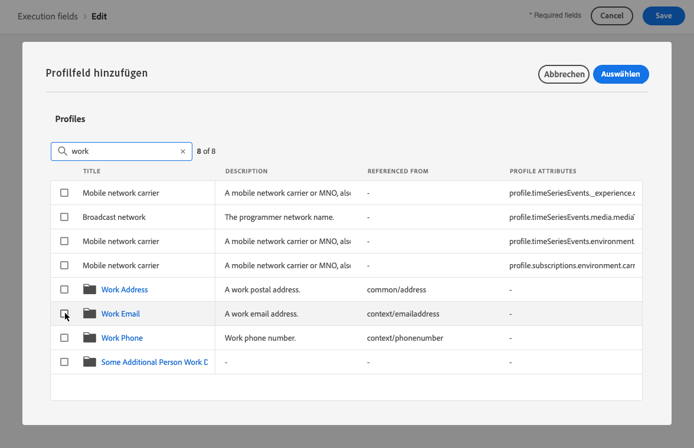
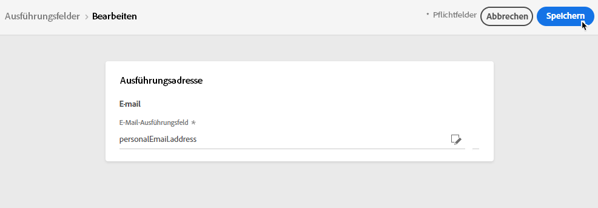

# Primäradressen ändern {#change-primary-email}

>[!CONTEXTUALHELP]
>id="ajo_admin_execution_address"
>title="Definieren der zu verwendenden Adresse"
>abstract="Wenn mehrere Adressen in der Datenbank verfügbar sind (persönlich, professionell usw.), können Sie wählen, welche Adresse für den Versand priorisiert werden soll."

Wenn Sie ein Profil als Ziel auswählen, stehen in der Datenbank möglicherweise mehrere E-Mail-Adressen zur Verfügung (private, berufliche E-Mail-Adresse usw.).

Mit [!DNL Journey Optimizer] können Sie über den Profil-Service bestimmen, welche E-Mail-Adresse verwendet werden soll, und Prioritäten setzen, wenn mehrere Adressen verfügbar sind. Gehen Sie dazu wie folgt vor.

1. Öffnen Sie das Menü **[!UICONTROL Kanäle]** > **[!UICONTROL Allgemein]** > **[!UICONTROL Ausführungsfelder]**.

   

1. Daraufhin wird ein Bildschirm mit einem Feld angezeigt, das standardmäßig zum Festlegen der E-Mail-Adressen der Profile verwendet wird. Klicken Sie auf **[!UICONTROL Bearbeiten]**, um die Einstellung zu ändern.

   

1. Klicken Sie auf das aktuelle Feld oder auf das Bearbeitungssymbol, um ein neues Feld auszuwählen.

   

1. Die Liste der verfügbaren XDM-Felder vom Typ „E-Mail“ wird angezeigt. Wählen Sie das zu verwendende Feld aus.

   

1. Klicken Sie auf **[!UICONTROL Speichern]**, um Ihre Auswahl zu speichern.

   

   Das Ausführungsfeld wird aktualisiert und jetzt als primäre Adresse verwendet.

<!--1. You can also select an additional field to use as secondary email address. This allows you to determine which field to use if the primary field is empty for a profile. -->
