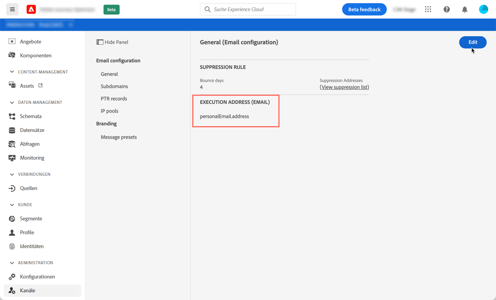
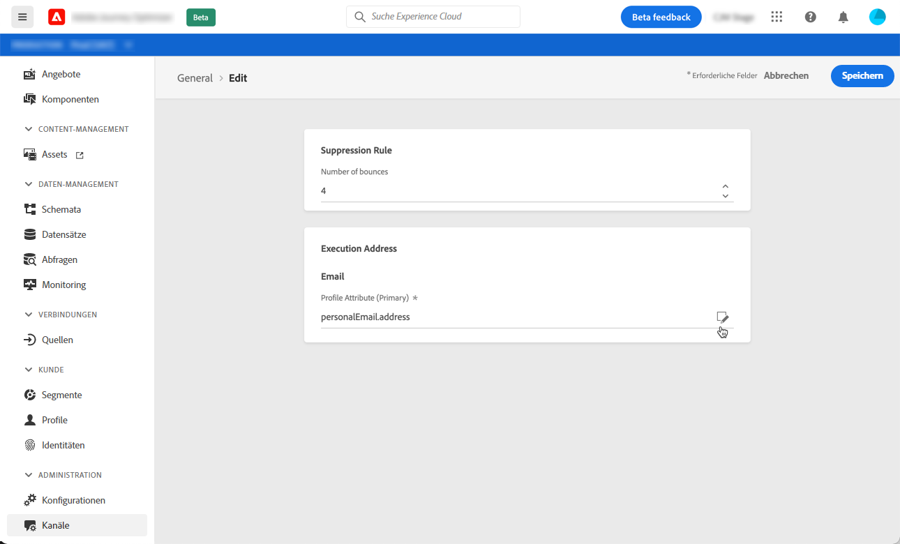
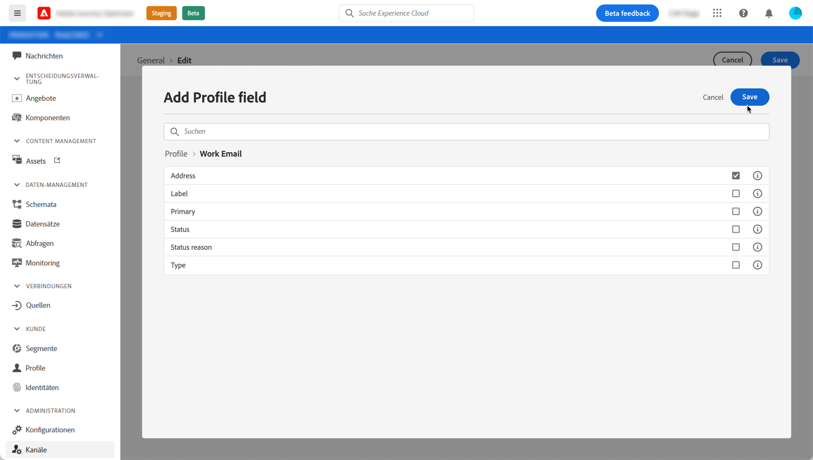

# Primäre E-Mail-Adressen ändern {#change-primary-email}

Wenn Sie ein Profil als Ziel auswählen, stehen in der Datenbank möglicherweise mehrere E-Mail-Adressen zur Verfügung (private, berufliche E-Mail-Adresse usw.).

Mit Journey Optimizer können Sie über den Profil-Service bestimmen, welche E-Mail-Adresse verwendet werden soll, und Prioritäten setzen, wenn mehrere Adressen verfügbar sind. Gehen Sie dazu wie folgt vor:

1. Rufen Sie das Menü **[!UICONTROL Kanäle]** `>` **[!UICONTROL Allgemein]** auf.
1. Daraufhin wird ein Bildschirm mit einem Feld angezeigt, das standardmäßig zum Festlegen der E-Mail-Adressen der Profile verwendet wird. Klicken Sie auf **[!UICONTROL Bearbeiten]**, um die Einstellung zu ändern.

   

1. Klicken Sie auf die Schaltfläche „Ändern“, um das neue Feld auszuwählen, das als primäre E-Mail-Adresse verwendet werden soll.

   

1. Die Liste der verfügbaren XDM-Felder vom Typ E-Mail wird angezeigt. Wählen Sie das zu verwendende Feld aus und klicken Sie dann auf **[!UICONTROL Speichern]**.

   

<!--1. You can also select an additional field to use as secondary email address. This allows you to determine which field to use if the primary field is empty for a profile. >> will be done later on-->
