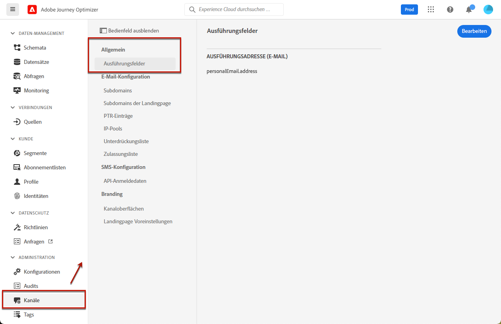
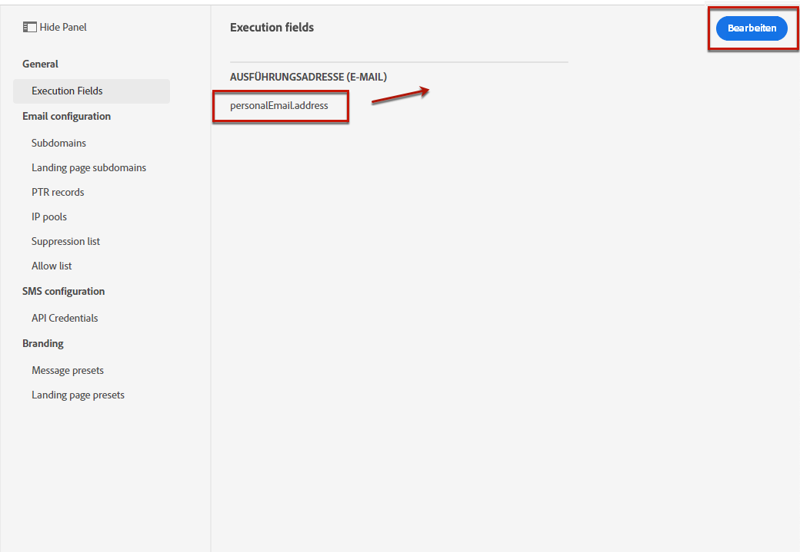
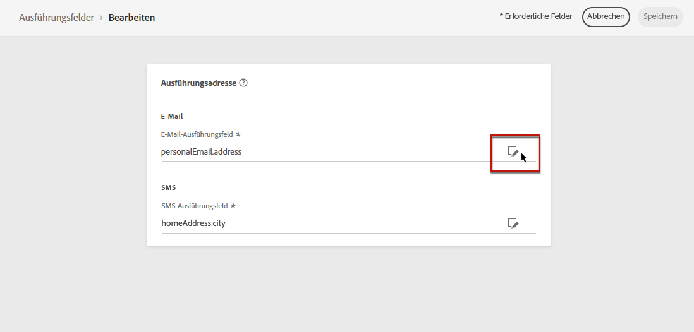
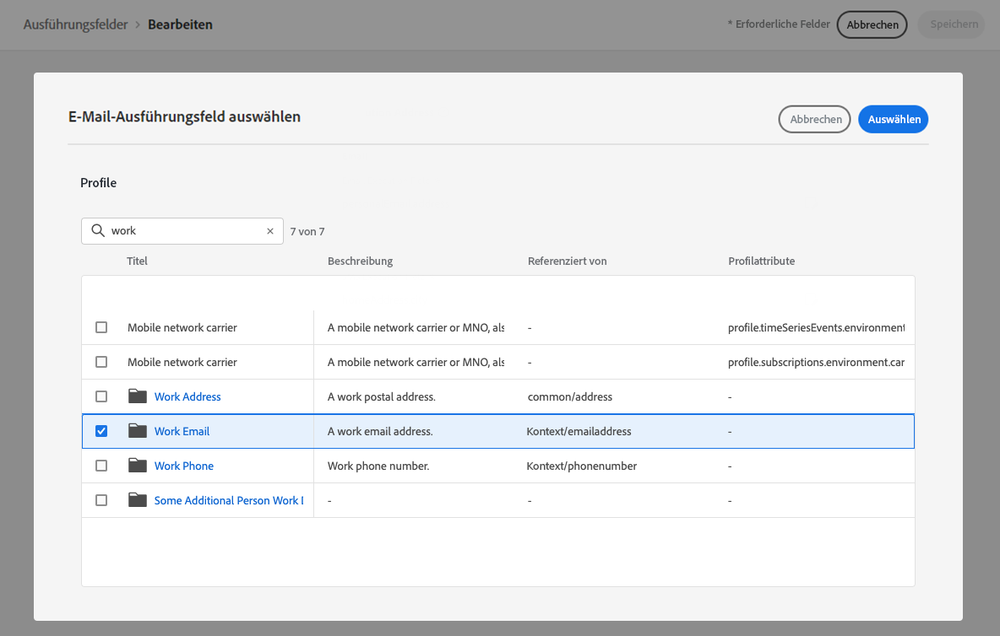
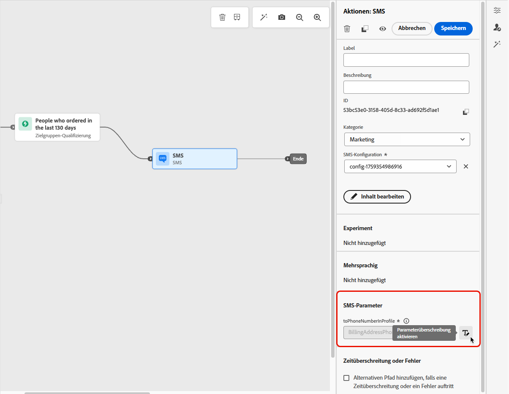

# Ausführungsadressen ändern {#change-primary-email}

>[!CONTEXTUALHELP]
>id="ajo_admin_execution_address"
>title="Definieren der zu verwendenden Adresse"
>abstract="Wenn mehrere E-Mail-Adressen oder Telefonnummern in der Datenbank vorhanden sind (privat, beruflich usw.), kann ausgewählt werden, welche Adresse/Nummer für den Versand Vorrang haben soll."

>[!CONTEXTUALHELP]
>id="ajo_admin_execution_address_header"
>title="Definieren der zu verwendenden Adresse"
>abstract="Bearbeiten der E-Mail-Adressen oder Telefonnummern der Profile, um zu bestimmen, welche vorrangig für den Versand verwendet werden sollen."

Wenn ein Profil als Ziel ausgewählt wird, stehen in der Datenbank möglicherweise mehrere E-Mail-Adressen oder Telefonnummern zur Verfügung (berufliche E-Mail-Adresse, persönliche Telefonnummer usw.).

In diesem Fall [!DNL Journey Optimizer] uses **[!UICONTROL Ausführungsfelder]** , um zu bestimmen, welche E-Mail-Adresse oder Telefonnummer vorrangig vom Profildienst verwendet werden soll.

Um die standardmäßig verwendeten Felder zu überprüfen, rufen Sie die **[!UICONTROL Administration]** > **[!UICONTROL Kanäle]** > **[!UICONTROL Allgemein]** > **[!UICONTROL Ausführungsfelder]** Menü.

Die aktuellen Werte werden für alle Sendungen auf Sandbox-Ebene verwendet. Sie können diese Felder bei Bedarf aktualisieren.

In den meisten Fällen ändern Sie ein Ausführungsfeld global und definieren einen Wert, der für alle E-Mail- oder SMS-Nachrichten verwendet werden soll. <!--[Learn how](#admin-settings)-->

<!--In some specific use cases only, you can override the value set globally and define a different value at the journey level. [Learn more](#journey-parameters)-->

## Aktualisierung der Administrationseinstellungen {#admin-settings}

Gehen Sie wie folgt vor, um die Ausführungsfelder global auf Sandbox-Ebene zu ändern.

1. Öffnen Sie das Menü **[!UICONTROL Kanäle]** > **[!UICONTROL Allgemein]** > **[!UICONTROL Ausführungsfelder]**.

1. Klicken **[!UICONTROL Bearbeiten]** , um die Standardwerte zu ändern.

   

1. Auf das aktuelle Feld oder auf das Bearbeitungssymbol klicken, um ein neues Feld auszuwählen.

   

1. Die Liste der verfügbaren XDM-Felder vom Typ „E-Mail“ wird angezeigt. Wählen Sie das zu verwendende Feld aus.

   

1. Klicken Sie auf **[!UICONTROL Speichern]**, um Ihre Auswahl zu speichern.

Das Ausführungsfeld wird aktualisiert und jetzt als primäre Adresse verwendet.

<!--1. You can also select an additional field to use as secondary email address. This allows you to determine which field to use if the primary field is empty for a profile. -->

## Wert in Journey-Parametern überschreiben {#journey-parameters}

Nur für bestimmte Anwendungsfälle können Sie das global eingestellte Ausführungsfeld überschreiben und auf Journey-Ebene einen anderen Wert definieren, insbesondere für den E-Mail-Kanal.

Beim Hinzufügen von **[!UICONTROL Email]** einer Aktion [Journey](../email/create-email.md#create-email-journey-campaign), wird die primäre E-Mail-Adresse unter den erweiterten Journey-Parametern angezeigt.

In bestimmten Kontexten können Sie diesen Wert mithilfe der Variablen **[!UICONTROL Parameterüberschreibungen aktivieren]** rechts neben dem **[!UICONTROL Adresse]** -Feld.

>[!CAUTION]
>
>Das Überschreiben von E-Mail-Adressen sollte nur für bestimmte Anwendungsfälle verwendet werden. Meistens müssen Sie die E-Mail-Adresse nicht ändern, da der Wert, der als die primäre Adresse in den **[!UICONTROL Ausführungsfeldern]** definiert ist, derjenige ist, der verwendet werden sollte.

Das Außerkraftsetzen dieses Werts kann beispielsweise für Folgendes nützlich sein:

* Testen einer E-Mail-Adresse. Sie können Ihre eigene E-Mail-Adresse hinzufügen: Nachdem Sie die Journey veröffentlicht haben, wird die E-Mail an Sie gesendet.
* Senden Sie eine E-Mail an die Abonnenten einer Liste. Weitere Informationen finden Sie in [diesem Anwendungsbeispiel](../building-journeys/message-to-subscribers-uc.md).
