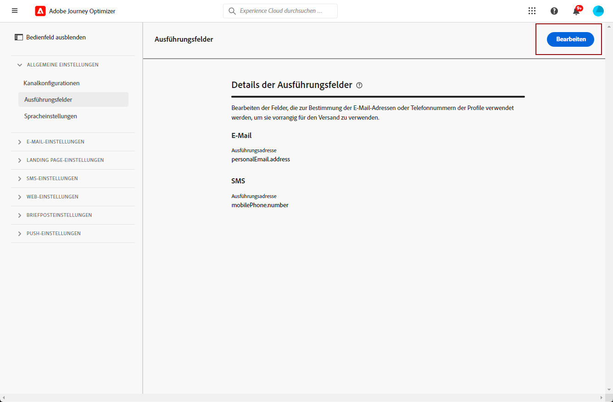

# Primäre E-Mail-Adressen ändern {#change-primary-email}

Wenn Sie ein Profil als Ziel auswählen, stehen in der Datenbank möglicherweise mehrere E-Mail-Adressen zur Verfügung (private, berufliche E-Mail-Adresse usw.).

Mit [!DNL Journey Optimizer]können Sie festlegen, welche E-Mail-Adresse vom Profildienst verwendet werden soll und Prioritäten setzen, wenn mehrere Adressen verfügbar sind. Gehen Sie dazu wie folgt vor.

1. Zugriff auf  **[!UICONTROL Kanäle]** > **[!UICONTROL Allgemein]** > **[!UICONTROL Ausführungsfelder]** Menü.

   

1. Auf diesem Bildschirm wird das derzeit standardmäßig zur Bestimmung der E-Mail-Adressen der Profile verwendete Feld angezeigt. Klicken Sie auf **[!UICONTROL Bearbeiten]**, um die Einstellung zu ändern.

   

1. Klicken Sie auf das aktuelle Feld oder auf das Bearbeitungssymbol, um ein neues Feld auszuwählen.

   

1. Die Liste der verfügbaren XDM-Felder vom Typ E-Mail wird angezeigt. Wählen Sie das zu verwendende Feld aus.

   

1. Klicken **[!UICONTROL Speichern]** um Ihre Wahl zu bestätigen.

   

   Das Ausführungsfeld wird aktualisiert und jetzt als primäre Adresse verwendet.

<!--1. You can also select an additional field to use as secondary email address. This allows you to determine which field to use if the primary field is empty for a profile. -->
