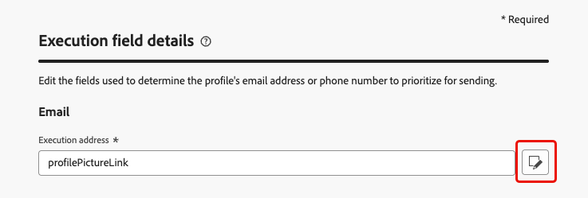

# Verwalten der Standard-Ausführungsfelder {#change-primary-email}

>[!CONTEXTUALHELP]
>id="ajo_admin_execution_address"
>title="Definieren der zu verwendenden Adresse"
>abstract="Wenn mehrere E-Mail-Adressen oder Telefonnummern in der Datenbank vorhanden sind (privat, beruflich usw.), kann ausgewählt werden, welche Adresse/Nummer für den Versand Vorrang haben soll."

>[!CONTEXTUALHELP]
>id="ajo_admin_execution_address_header"
>title="Definieren der zu verwendenden Adresse"
>abstract="Bearbeiten der Felder, die zur Bestimmung der E-Mail-Adressen oder Telefonnummern der Profile verwendet werden, um sie vorrangig für den Versand zu verwenden."

Wenn ein Profil als Ziel ausgewählt wird, stehen in der Datenbank möglicherweise mehrere E-Mail-Adressen oder Telefonnummern zur Verfügung (berufliche E-Mail-Adresse, persönliche Telefonnummer usw.).

In diesem Fall nutzt [!DNL Journey Optimizer] **[!UICONTROL Ausführungsfelder]**, um zu bestimmen, welche E-Mail-Adresse oder Telefonnummer vom Profildienst vorrangig verwendet werden soll.

Um die standardmäßig verwendeten Felder zu überprüfen, rufen Sie das Menü **[!UICONTROL Administration]** > **[!UICONTROL Kanäle]** > **[!UICONTROL Allgemeine Einstellungen]** > **[!UICONTROL Ausführungsfelder]** auf.

{width=90%}

>[!NOTE]
>
>Ausführungsfelder stehen für den E-Mail-, SMS- und WhatsApp-Kanal zur Verfügung.

Die aktuellen Werte werden für alle Sendungen auf Sandbox-Ebene verwendet. Sie können diese Felder bei Bedarf aktualisieren.

In den meisten Fällen ändern Sie ein Ausführungsfeld global und definieren einen Wert, der für alle E-Mail-, SMS- oder WhatsApp-Nachrichten verwendet werden soll. 

## Aktualisierung der Administrationseinstellungen {#admin-settings}

Gehen Sie wie folgt vor, um die Ausführungsfelder global auf Sandbox-Ebene zu ändern.

1. Öffnen Sie das Menü **[!UICONTROL Kanäle]** > **[!UICONTROL Allgemeine Einstellungen]** > **[!UICONTROL Ausführungsfelder]**.

1. Klicken Sie auf **[!UICONTROL Bearbeiten]**, um die Standardwerte zu ändern.

   {width=70%}

1. Auf das aktuelle Feld oder auf das Bearbeitungssymbol klicken, um ein neues Feld auszuwählen.

   {width=70%}

1. Die Liste der verfügbaren XDM-Felder vom Typ „E-Mail“ wird angezeigt. Wählen Sie das zu verwendende Feld aus.

   {width=90%}

1. Klicken Sie auf **[!UICONTROL Speichern]**, um Ihre Auswahl zu speichern.

Das Ausführungsfeld wird aktualisiert und jetzt als primäre Adresse verwendet.

<!--1. You can also select an additional field to use as secondary email address. This allows you to determine which field to use if the primary field is empty for a profile. -->

## Überschreiben des Standard-Ausführungsfelds in den Journey-Parametern {#override-execution-address-journey}

>[!CONTEXTUALHELP]
>id="ajo_journey_execution_address"
>title="Definieren eines benutzerdefinierten Werts"
>abstract="In bestimmten Fällen können Sie den Standardwert des Ausführungsfelds überschreiben. Verwenden Sie das Symbol **Parameterüberschreibung aktivieren** rechts neben diesem Feld, um eine benutzerdefinierte E-Mail-Adresse oder Telefonnummer zu definieren, die für den Versand priorisiert werden soll."

Für bestimmte Anwendungsfälle können Sie das global festgelegte Ausführungsfeld überschreiben und einen anderen Wert auf Journey-Ebene definieren.

Diesen Wert zu überschreiben, kann zum Beispiel für folgende Zwecke nützlich sein:

* Testen des Versands. Sie können eine eigene E-Mail-Adresse oder Telefonnummer hinzufügen. Nach Veröffentlichung der Journey wird die E-Mail-, SMS- oder WhatsApp-Nachricht an Sie gesendet.
* Senden einer Nachricht an Abonnierende auf einer Liste. Weitere Informationen finden Sie in [diesem Anwendungsfall](../building-journeys/message-to-subscribers-uc.md).

Beim Hinzufügen einer **[!UICONTROL E-Mail]**- oder **[!UICONTROL SMS]**- oder **[!UICONTROL WhatsApp]**-Aktion zu einer [Journey](../email/create-email.md#create-email) wird die primäre E-Mail-Adresse oder Telefonnummer unter den erweiterten Journey-Parametern angezeigt.

Verwenden Sie das Symbol **[!UICONTROL Parameterüberschreibung aktivieren]** rechts neben dem Feld zum Überschreiben des Werts.

{width=85%}

>[!CAUTION]
>
>E-Mail-Adressen oder Telefonnummern sollten nur für bestimmte Anwendungsfälle überschrieben werden. Meistens müssen Sie sie nicht ändern, da der in den **[!UICONTROL Ausführungsfeldern]** auf Sandbox-Ebene als primäre Adresse definierte Wert auch derjenige ist, der verwendet werden sollte. [Weitere Informationen](#change-primary-email)

## Überschreiben des Standardausführungsfelds in der Kanalkonfiguration {#override-execution-address-channel-config}

>[!CONTEXTUALHELP]
>id="ajo_email_config_execution_address"
>title="Überschreiben der zu verwendenden Standard-Ausführungsadresse"
>abstract="Wenn mehrere E-Mail-Adressen oder Telefonnummern in der Datenbank vorhanden sind (privat, professionell usw.), kann ausgewählt werden, welche für den Versand Vorrang haben soll. Die primäre Adresse wird auf Sandbox-Ebene definiert, aber hier können Sie die Standardeinstellung für diese bestimmte Kanalkonfiguration überschreiben."

Sie können die Standard-Ausführungsadresse für eine bestimmte E-Mail-, SMS- oder WhatsApp-[Kanalkonfiguration](channel-surfaces.md) überschreiben.

Navigieren Sie dazu zum Abschnitt **[!UICONTROL Ausführungsdimension]** und bearbeiten Sie das Feld unter **[!UICONTROL Ausführungsadresse]**.

>[!NOTE]
>
>Das **[!UICONTROL WhatsApp-Ausführungsfeld]** für den [WhatsApp-Kanal](../whatsapp/whatsapp-configuration.md#whatsapp-configuration) befindet sich im Abschnitt **[!UICONTROL WhatsApp-Einstellungen]**.

{width=85%}

Wählen Sie dann ein Element aus der Liste der verfügbaren E-Mail-XDM-Felder aus.

Das Ausführungsfeld wird aktualisiert und dann als primäre Adresse für die Kampagnen oder Journeys verwendet, die diese Kanalkonfiguration verwenden. Dies überschreibt die [allgemeine Einstellung](#admin-settings) auf Sandbox-Ebene.

<!--[Learn more on the execution address in the email configuration ](../email/email-settings.md#execution-address)-->
