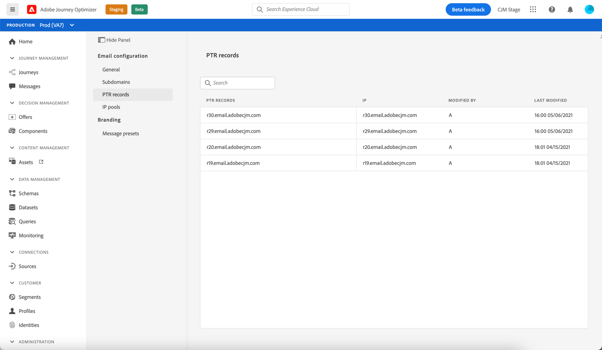
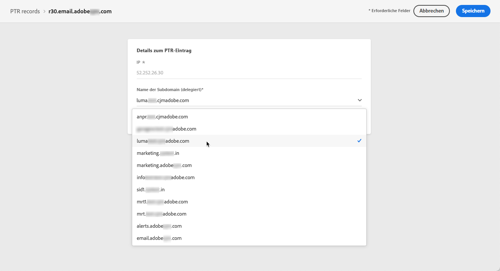
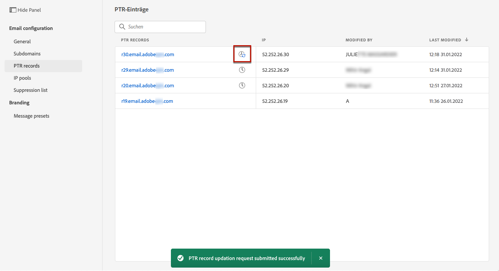
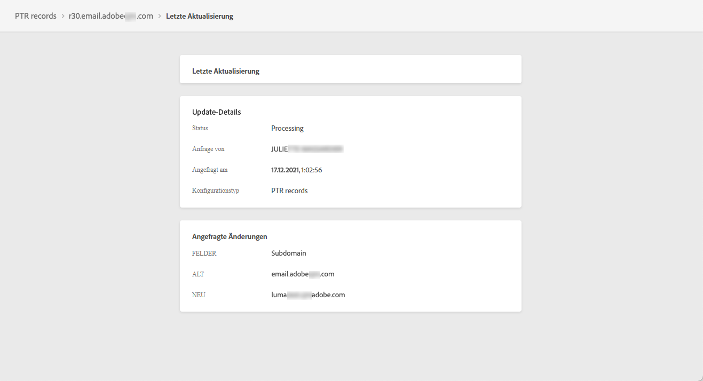

# PTR-Einträge

## Informationen zu PTR-Einträgen

Ein PTR (Pointer Record, „Zeigereintrag“) ist ein Typ von DNS (Domain Name System)-Eintrag, der den mit einer IP-Adresse verknüpften Domain-Namen bereitstellt.

Mit PTR-Einträgen können Empfänger-E-Mail-Server die Authentizität der Sender-E-Mail-Server überprüfen, indem sie feststellen, ob ihre IP-Adressen mit den Namen übereinstimmen, mit denen sich die Server verbinden.

## Zugriff auf PTR-Einträge Ihrer Subdomains

Nachdem eine Subdomain in Adobe Journey Optimizer zugewiesen wurde, wird automatisch ein PTR-Datensatz erstellt und mit dieser Subdomain verknüpft. Der Zugriff darauf erfolgt über das **[!UICONTROL Kanäle]** > **[!UICONTROL E-Mail-Konfiguration]** > **[!UICONTROL PTR-Datensätze]** Menü.

In der Liste werden die für jede zugewiesene Subdomain generierten PTR-Einträge anhand der unten stehenden Syntax angezeigt:

* „r“ für Eintrag (record),
* „xx“ für die beiden letzten Zahlen der IP-Adresse,
* Name der Subdomain.

Sie können einen PTR-Eintrag aus der Liste öffnen, um den zugehörigen Subdomain-Namen und die IP-Adresse anzuzeigen.

## PTR-Datensatz bearbeiten {#edit-ptr-record}

Sie können einen PTR-Datensatz ändern, um die mit einer IP-Adresse verknüpfte Subdomain zu bearbeiten.

1. Klicken Sie in der Liste auf einen PTR-Datensatznamen, um ihn zu öffnen.

   

1. Bearbeiten Sie die Subdomain nach Bedarf.

   

   >[!NOTE]
   >
   >Sie können die **[!UICONTROL IP]** und **[!UICONTROL PTR-Eintrag]** -Felder.

1. Klicken **[!UICONTROL SAve]** um Ihre Änderungen zu bestätigen.

Ein **[!UICONTROL Aktualisieren]** neben dem Namen des PTR-Datensatzes in der Liste angezeigt.

Um die Details der PTR-Datensatz-Aktualisierung zu überprüfen, klicken Sie auf das **[!UICONTROL Aktualisieren]** oder **[!UICONTROL Letzte Aktualisierungen]** Symbol.

Sie können Informationen wie den Aktualisierungsstatus und die angeforderten Änderungen sehen.

## Status aktualisieren

Ein PTR-Datensatz-Update kann die folgenden Status haben:

* **[!UICONTROL Verarbeitung]**: Das PTR-Datensatz-Update wurde eingereicht und durchläuft einen Verifizierungsprozess.
* **[!UICONTROL Erfolg]**: Der aktualisierte PTR-Datensatz wurde überprüft und die neue Subdomain wird nun mit der IP-Adresse verknüpft.
* **[!UICONTROL Fehlgeschlagen]**: Eine oder mehrere Prüfungen sind bei der Überprüfung der PTR-Datensatz-Aktualisierung fehlgeschlagen.

### Verarbeitung

Es werden verschiedene Zustellbarkeitsprüfungen durchgeführt, um zu überprüfen, ob die neue Subdomain, die mit der IP-Adresse verknüpft werden soll, gültig ist. <!--The processing time is around **48h-72h**, and can take up to **7-10 days**. Learn more on the checks performed during the validation cycle in [this section](#create-message-preset).-->

>[!NOTE]
>
>Sie können einen PTR-Datensatz während der Aktualisierung nicht ändern. Sie können weiterhin auf den Namen klicken, aber die Variable **[!UICONTROL Subdomain]** Feld ist ausgegraut. Die Änderungen werden erst dann übernommen, wenn die Aktualisierung erfolgreich war.

Während des Validierungsprozesses wird die alte Subdomain weiterhin mit der IP-Adresse verknüpft.

### Erfolg

Sobald der Validierungsprozess erfolgreich war, wird die neue Subdomain automatisch mit der IP-Adresse verknüpft.

### Fehlgeschlagen

Wenn der Validierungsprozess fehlschlägt, wird der ältere PTR-Datensatz angezeigt. Die gültige Subdomain, die zuvor mit der IP-Adresse verknüpft war, bleibt unverändert.

Die möglichen Aktualisierungsfehlertypen sind:
* Fehlschlagen der Erstellung eines neuen Weiterleitungs-DNS für den PTR-Datensatz
* Fehler beim Aktualisieren des Datensatzes
* Nichtintegrieren der Affinitäten

Wenn die Aktualisierung fehlschlägt, kann der PTR-Datensatz erneut bearbeitet werden. Sie können auf den Namen klicken und die Subdomain erneut aktualisieren.
