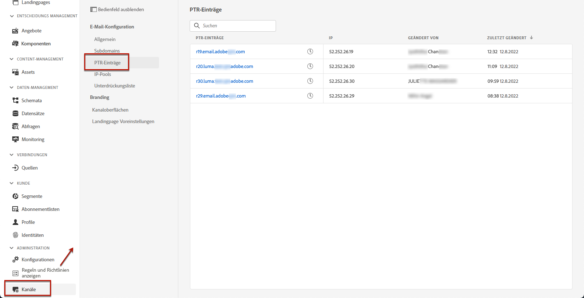
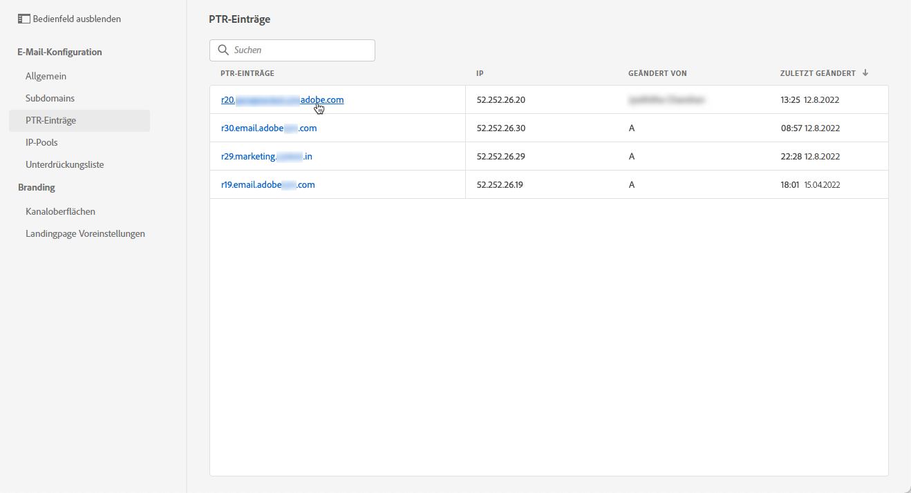
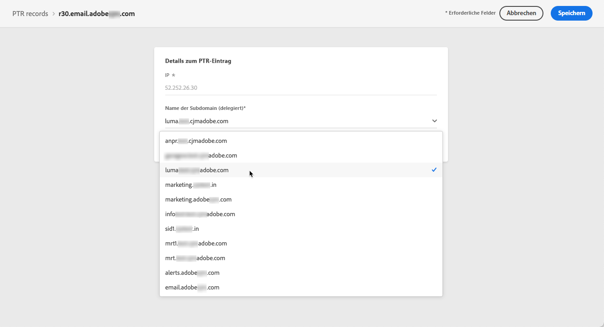
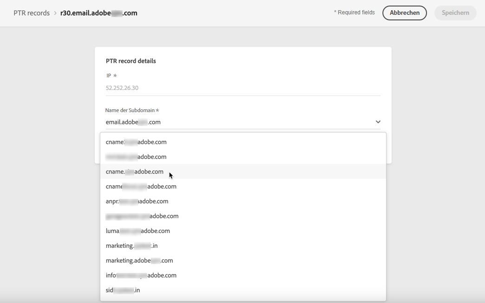
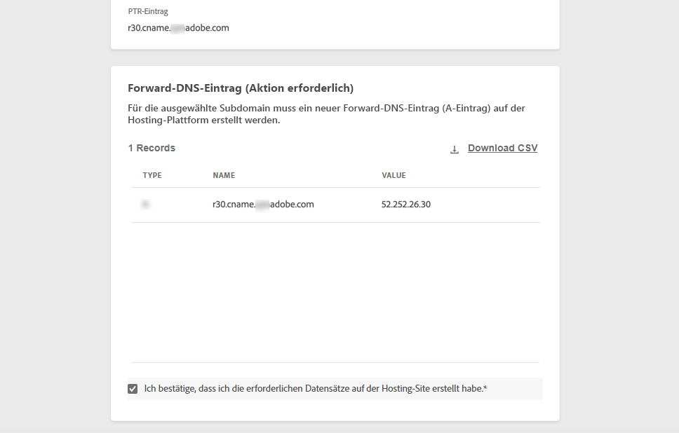
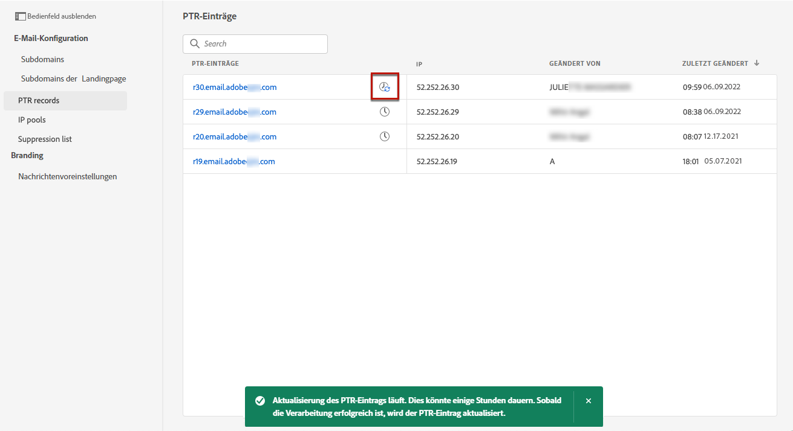
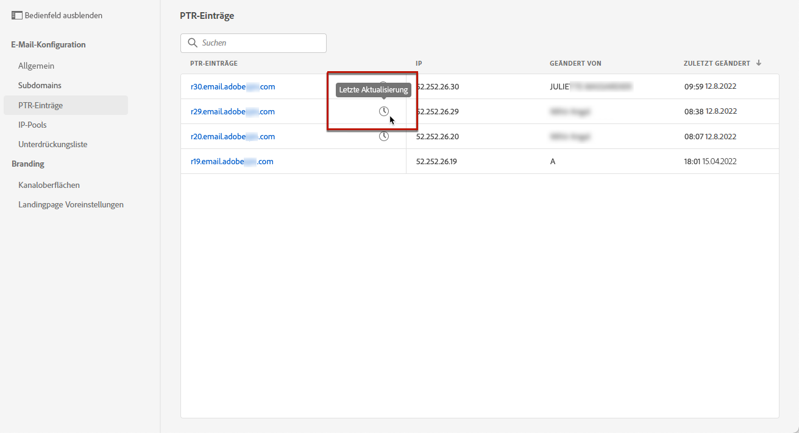
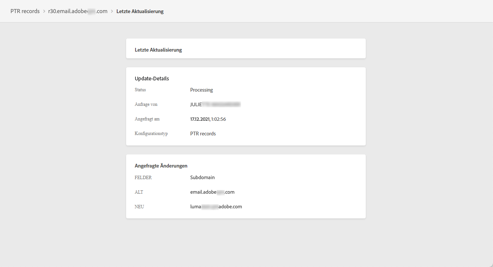

# Erstellen und Bearbeiten von PTR-Einträgen {#ptr-records}

>[!CONTEXTUALHELP]
>id="ajo_admin_ptr_record"
>title="PTR-Einträge der Subdomains"
>abstract="Ein Pointer Record (PTR) ist eine Art von DNS-Eintrag, der den mit einer IP-Adresse verknüpften Domain-Namen bereitstellt. Mit diesem können die E-Mail-Empfangs-Server die IP-Adressen der Absender überprüfen. Bearbeiten Sie einen PTR-Eintrag nur nach gründlicher Abwägung und Rücksprache mit Ihrem Zustellbarkeitsexperten."

>[!CONTEXTUALHELP]
>id="ajo_admin_ptr_record_header"
>title="PTR-Einträge der Subdomains"
>abstract="Nachdem die erste Subdomain in Journey Optimizer an Adobe delegiert wurde, werden PTR-Einträge automatisch erstellt."

## Über PTR-Einträge {#about-ptr-records}

Ein Pointer Record (PTR) ist ein Typ von DNS-Eintrag (Domain Name System), der den mit einer IP-Adresse verknüpften Domain-Namen bereitstellt.

Mit PTR-Einträgen können E-Mail-Empfangs-Server die Authentizität der E-Mail-Versand-Server überprüfen, indem sie feststellen, ob ihre IP-Adressen mit den Namen übereinstimmen, mit denen sich die Server verbinden.

## Zugreifen auf die PTR-Einträge Ihrer Subdomains {#access-ptr-records}

Nachdem Sie [ erste Subdomain ](delegate-subdomain.md) Adobe in [!DNL Journey Optimizer] delegiert haben, werden automatisch PTR-Einträge für Ihre IPs erstellt. Sie können darauf über das Menü **[!UICONTROL Administration]** > **[!UICONTROL Kanäle]** > **[!UICONTROL E-Mail-Einstellungen]** > **[!UICONTROL PTR-Einträge]** zugreifen.

In der Liste werden die PTR-Einträge angezeigt, die mithilfe der unten stehenden Syntax generiert wurden:

* „R“ für Eintrag,
* „xx“ für die beiden letzten Zahlen der IP-Adresse,
* Name der Subdomain.

Sie können einen PTR-Eintrag aus der Liste öffnen, um den zugehörigen Subdomain-Namen und die IP-Adresse anzuzeigen.

## Bearbeiten eines PTR-Eintrags {#edit-ptr-record}

In [!DNL Journey Optimizer] können PTR-Einträge nicht manuell erstellt werden. Stattdessen werden nach dem [ (Delegieren](delegate-subdomain.md) Ihrer ersten Subdomain an Adobe automatisch PTR-Einträge für Ihre IPs erstellt.

Jede Ihrer IPs erhält einen einzelnen PTR-Eintrag. Alle PTR-Einträge haben das folgende Format: „rxx.subdomain“, wobei „subdomain“ die erste Subdomain ist, die Sie in [!DNL Journey Optimizer] delegiert haben.

Wenn Sie zusätzliche Subdomains erstellen, müssen Sie einen oder mehrere der PTR-Einträge ändern und ihnen diese neuen Subdomains zuweisen. Gehen Sie dazu wie folgt vor.

>[!CAUTION]
>
>PTR-Einträge sind in allen Umgebungen vorhanden. Daher wirkt sich jede Änderung an einem PTR-Eintrag auch auf die Produktions-Sandboxes aus.
>
>Gehen Sie beim Bearbeiten von PTR-Einträgen mit besonderer Sorgfalt vor. Wenden Sie sich im Zweifel an einen Zustellbarkeitsexperten.

### Vollständig delegierte Subdomains {#fully-delegated-subdomains}

Gehen Sie wie folgt vor, um einen PTR[Eintrag mit einer Subdomain zu bearbeiten](delegate-subdomain.md#set-up-subdomain) die vollständig an Adobe delegiert ist.

1. Klicken Sie in der Liste auf den Namen eines PTR-Eintrags, um ihn zu öffnen.

   

1. Wählen Sie in [ Liste eine Subdomain aus](delegate-subdomain.md#set-up-subdomain) die vollständig an Adobe delegiert wurde.

   

1. Klicken Sie **[!UICONTROL Speichern]**, um Ihre Änderungen zu bestätigen.

>[!NOTE]
>
>Sie können die Felder **[!UICONTROL IP]** und **[!UICONTROL PTR-Eintrag]** nicht ändern.

### Delegierte Subdomains mit der CNAME-Methode {#edit-ptr-subdomains-cname}

Gehen Sie wie folgt vor, um einen PTR-Eintrag mit einer Subdomain zu bearbeiten, die mithilfe der [CNAME-Methode](delegate-subdomain.md#cname-subdomain-setup) an Adobe delegiert ist.

1. Klicken Sie in der Liste auf den Namen eines PTR-Eintrags, um ihn zu öffnen.

   

1. Wählen Sie in der Liste eine Subdomain aus, die mithilfe [CNAME-Methode](delegate-subdomain.md#cname-subdomain-setup) an Adobe delegiert wurde.

   

1. Sie müssen einen neuen Forward-DNS-Eintrag auf Ihrer Hosting-Plattform erstellen. Kopieren Sie dazu den von Adobe generierten Eintrag. Aktivieren Sie abschließend das Kontrollkästchen „Ich bestätige…“.

   

   >[!NOTE]
   >
   >Wenn Sie die Nachricht „Bitte erstellen Sie zuerst das Weiterleitungs-DNS und versuchen Sie es dann erneut“ erhalten, führen Sie die folgenden Schritte aus:
   >   * Überprüfen Sie beim DNS-Anbieter, ob der Forward-DNS-Eintrag erfolgreich erstellt wurde.
   >   * Einträge im DNS werden möglicherweise nicht sofort synchronisiert. Warten Sie einige Minuten und versuchen Sie es erneut.

1. Klicken Sie **[!UICONTROL Speichern]**, um Ihre Änderungen zu bestätigen. Beachten Sie, **[!UICONTROL die Felder]** IP) und **[!UICONTROL PTR-Eintrag]** nicht geändert werden können.

## Überprüfen der Details zur Aktualisierung des PTR-Eintrags {#check-ptr-record-update}

Nachdem Sie die Bearbeitung des PTR-Eintrags bestätigt haben **[!UICONTROL wird das Symbol]** Verarbeitung“ neben dem Namen des PTR-Eintrags in der Liste angezeigt.

>[!NOTE]
>
>Die [Aktualisierungsverarbeitung](#processing) kann bis zu 3 Stunden dauern.

Um die Details der PTR-Eintragsaktualisierung zu überprüfen, klicken Sie auf das Symbol daneben. Weitere Informationen zu den Status, die den verschiedenen Symbolen zugeordnet sind, finden [ in (diesem Abschnitt](#ptr-record-update-statuses).

Sie können Informationen wie den Aktualisierungsstatus und die angeforderten Änderungen sehen.

## Aktualisierungsstatus von PTR-Einträgen {#ptr-record-update-statuses}

Eine Aktualisierung eines PTR-Eintrags kann die folgenden Status aufweisen:

*  **[!UICONTROL Verarbeitung]**: Die Aktualisierung des PTR-Eintrags wurde eingereicht und durchläuft einen Verifizierungsprozess.
*  **[!UICONTROL Erfolg]**: Der aktualisierte PTR-Eintrag wurde überprüft und die neue Subdomain ist nun mit der IP-Adresse verknüpft.
*  **[!UICONTROL Fehlgeschlagen]**: Eine oder mehrere Prüfungen sind bei der Verifizierung der Aktualisierung des PTR-Eintrags fehlgeschlagen.

### Verarbeitung läuft {#processing}

Es werden verschiedene Zustellbarkeitsprüfungen durchgeführt, um zu überprüfen, ob die neue Subdomain, die mit der IP-Adresse verknüpft werden soll, gültig ist. Dies kann bis zu 3 Stunden dauern.

>[!NOTE]
>
>Ein PTR-Eintrag kann während der Aktualisierung nicht geändert werden. Sie können weiterhin auf den Namen klicken, aber **[!UICONTROL Feld]** Subdomain“ ist ausgegraut. Die Änderungen werden erst übernommen, wenn die Aktualisierung erfolgreich war.

Während des Validierungsprozesses ist die alte Subdomain weiterhin mit der IP-Adresse verknüpft.

### Erfolg {#success}

Nach erfolgreicher Überprüfung wird die neue Subdomain automatisch mit der IP-Adresse verknüpft.

### Fehlgeschlagen {#failes}

Wenn der Validierungsprozess fehlschlägt, wird der ältere PTR-Eintrag angezeigt. Die gültige Subdomain, die zuvor mit der IP-Adresse verknüpft war, bleibt unverändert.

Folgende Arten von Aktualisierungsfehlern sind möglich:

* Erstellen eines neuen Weiterleitungs-DNS für den PTR-Eintrag schlägt fehl
* Datensatz konnte nicht aktualisiert werden
* Erneute Integration der Affinitäten schlägt fehl

Wenn die Aktualisierung fehlschlägt, kann der PTR-Eintrag erneut bearbeitet werden. Sie können auf den Namen klicken und die Subdomain erneut aktualisieren.
