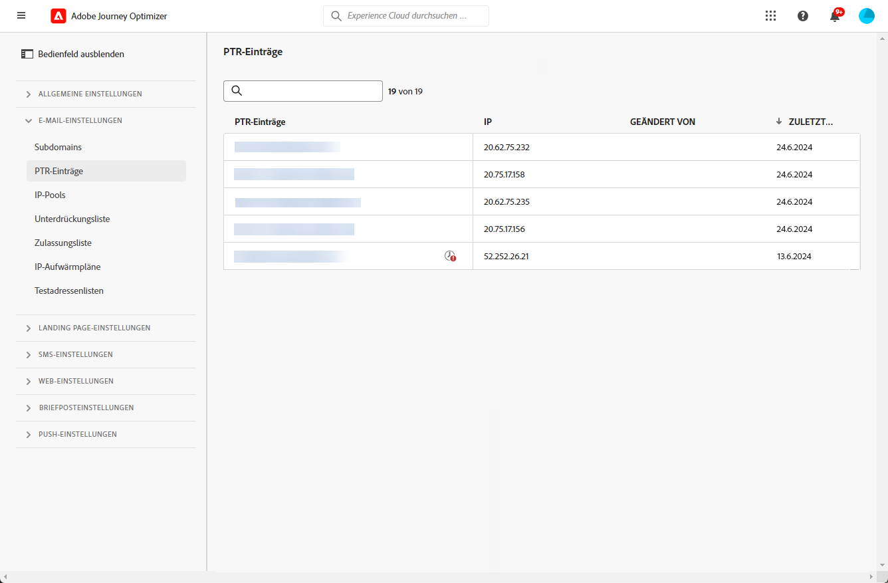
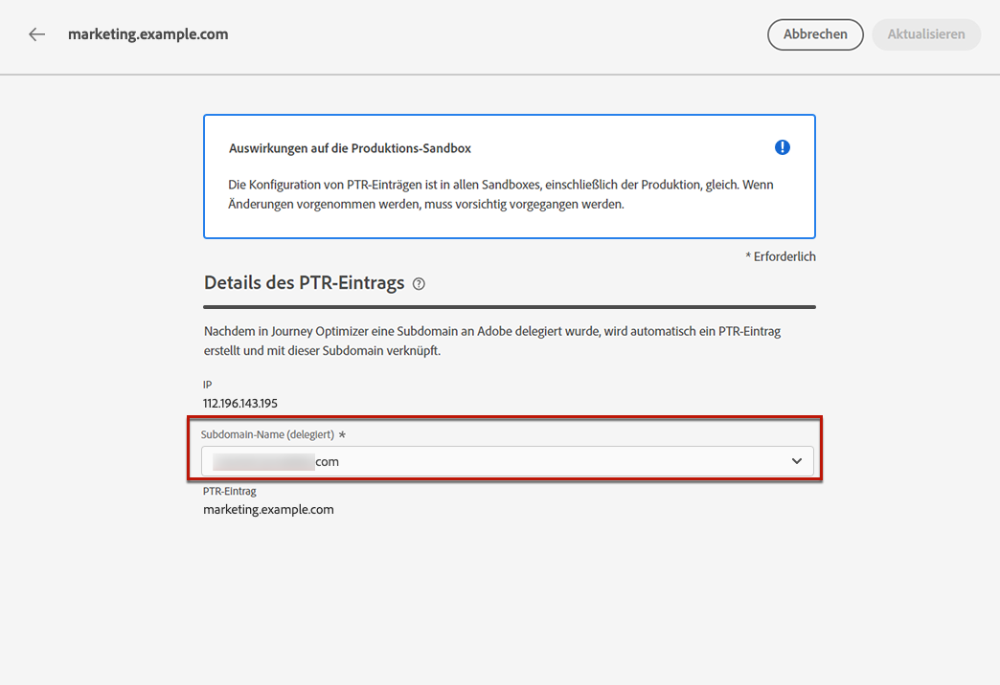
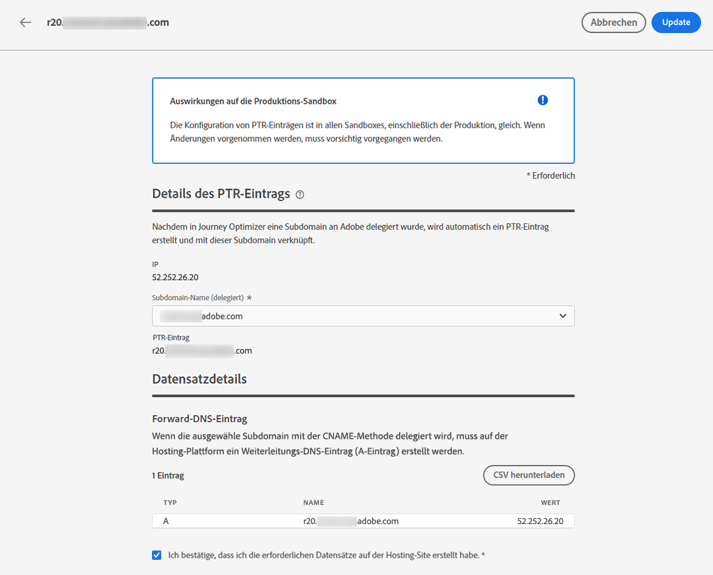
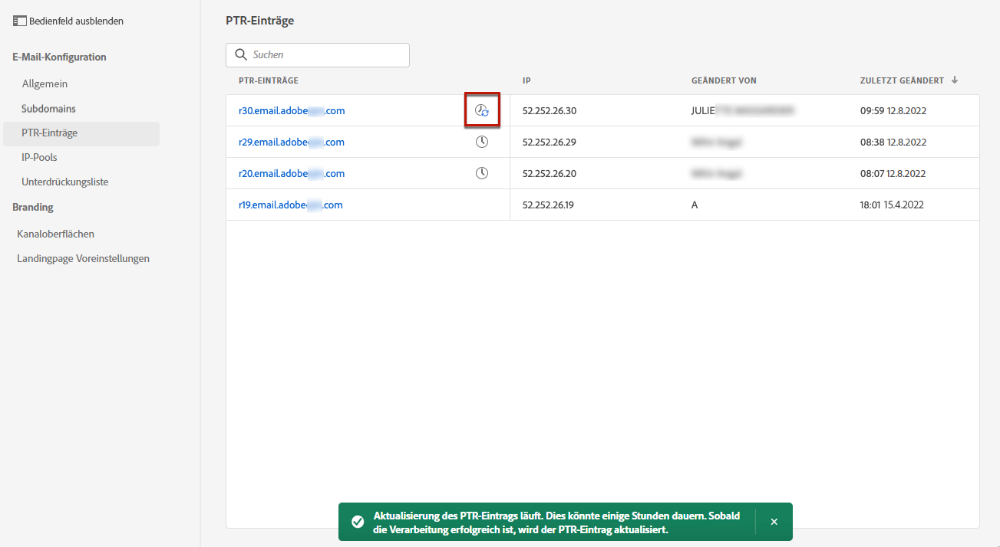
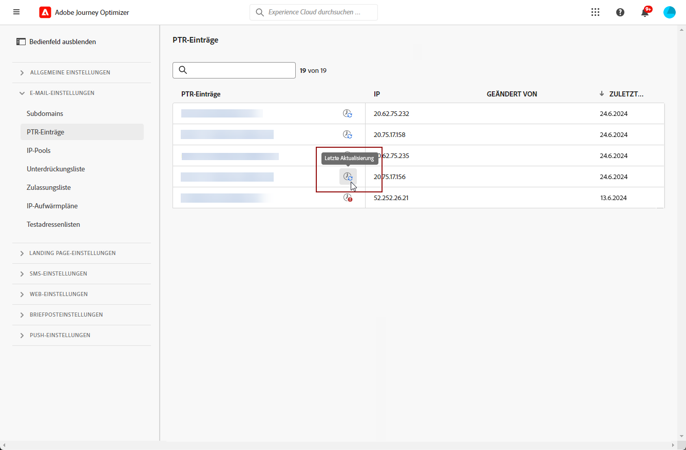

# PTR-Datensätze {#ptr-records}

>[!CONTEXTUALHELP]
>id="ajo_admin_ptr_record"
>title="PTR-Datensätze der Subdomains"
>abstract="Ein Zeigerdatensatz (PTR) ist ein DNS-Record-Typ, der den mit einer IP-Adresse verknüpften Domänennamen bereitstellt, der den E-Mail-Servern beim Überprüfen der IP-Adressen der Absender hilft. Bearbeiten Sie einen PTR-Datensatz nur nach Rücksicht auf Ihre Zustellbarkeit und besprechen Sie ihn mit Ihrem Zustellbarkeitsexperten."

>[!CONTEXTUALHELP]
>id="ajo_admin_ptr_record_header"
>title="PTR-Datensätze der Subdomains"
>abstract="Nachdem eine Subdomain in Journey Optimizer an Adobe delegiert wurde, wird automatisch ein PTR-Datensatz erstellt und mit dieser Subdomain verknüpft."

## Über PTR-Datensätze {#about-ptr-records}

Ein Zeigerdatensatz (PTR) ist ein Typ von DNS-Eintrag (Domain Name System), der den mit einer IP-Adresse verknüpften Domänennamen bereitstellt.

Mit PTR-Datensätzen können Empfänger-E-Mail-Server die Authentizität der E-Mail-Server überprüfen, indem sie feststellen, ob ihre IP-Adressen den Namen entsprechen, mit denen die Server verbunden sind.

## Zugreifen auf PTR-Datensätze Ihrer Subdomains {#access-ptr-records}

Einmal [eine Subdomain zugewiesen wird](delegate-subdomain.md) In Adobe Journey Optimizer wird automatisch ein PTR-Eintrag erstellt und mit dieser Subdomain verknüpft. Der Zugriff darauf erfolgt über das **[!UICONTROL Administration]** > **[!UICONTROL Channels]** > **[!UICONTROL Email configuration]** > **[!UICONTROL PTR records]** Menü.

In der Liste werden die für jede zugewiesene Subdomain generierten PTR-Datensätze anhand der unten stehenden Syntax angezeigt:

* &quot;r&quot;für Datensatz,
* &quot;xx&quot; für die beiden letzten Zahlen der IP-Adresse,
* Name der Subdomäne.

Sie können einen PTR-Datensatz aus der Liste öffnen, um den zugehörigen Subdomain-Namen und die IP-Adresse anzuzeigen.

## PTR-Datensatz bearbeiten {#edit-ptr-record}

Sie können einen PTR-Datensatz ändern, um die mit einer IP-Adresse verknüpfte Subdomain zu bearbeiten.

>[!CAUTION]
>
>PTR-Datensätze sind in allen Umgebungen vorhanden. Daher wirkt sich jede Änderung an einem PTR-Datensatz auch auf die Produktions-Sandboxes aus.
>
>Gehen Sie bei der Bearbeitung von PTR-Datensätzen mit größter Sorgfalt vor. Im Zweifelsfall kontaktieren Sie einen Zustellbarkeitsexperten.

### Vollständig zugewiesene Subdomains {#fully-delegated-subdomains}

So bearbeiten Sie einen PTR-Datensatz mit einer Subdomain, die [vollständig delegiert](delegate-subdomain.md#full-subdomain-delegation) Gehen Sie wie folgt vor, um Adobe hinzuzufügen.

1. Klicken Sie in der Liste auf einen PTR-Datensatznamen, um ihn zu öffnen.

   

1. Subdomain auswählen [vollständig delegiert](delegate-subdomain.md#full-subdomain-delegation) Adobe aus der Liste.

   

1. Klicken **[!UICONTROL Save]** um Ihre Änderungen zu bestätigen.

>[!NOTE]
>
>Sie können die **[!UICONTROL IP]** und **[!UICONTROL PTR record]** -Felder.

### Delegierte Subdomains mit der CNAME-Methode {#edit-ptr-subdomains-cname}

So bearbeiten Sie einen PTR-Datensatz mit einer Subdomain, die Adobe mithilfe der [CNAME-Methode](delegate-subdomain.md#cname-subdomain-delegation)führen Sie die folgenden Schritte aus.

1. Klicken Sie in der Liste auf einen PTR-Datensatznamen, um ihn zu öffnen.

   

1. Wählen Sie eine Adobe zugewiesene Subdomain mithilfe der [CNAME-Methode](delegate-subdomain.md#cname-subdomain-delegation) aus der Liste.

   

1. Sie müssen einen neuen Forward-DNS-Datensatz auf Ihrer Hosting-Plattform erstellen. Kopieren Sie dazu den von Adobe generierten Datensatz. Aktivieren Sie abschließend das Kontrollkästchen &quot;Ich bestätige..&quot;.

   

   >[!NOTE]
   >
   >Wenn Sie diese Nachricht erhalten: &quot;Bitte erstellen Sie das Weiterleitungs-DNS zuerst und versuchen Sie es dann erneut&quot;, führen Sie die folgenden Schritte aus:
   >   * Überprüfen Sie den DNS-Provider, ob der Weiterleitungs-DNS-Eintrag erfolgreich erstellt wurde.
   >   * Datensätze im DNS werden möglicherweise nicht sofort synchronisiert. Warten Sie einige Minuten und versuchen Sie es erneut.

1. Klicken **[!UICONTROL Save]** um Ihre Änderungen zu bestätigen.

>[!NOTE]
>
>Sie können die **[!UICONTROL IP]** und **[!UICONTROL PTR record]** -Felder.

## Überprüfen Sie die Details zum PTR-Datensatz-Update. {#check-ptr-record-update}

Nachdem Sie die Bearbeitung des PTR-Datensatzes bestätigt haben, wird die **[!UICONTROL Processing]** neben dem Namen des PTR-Datensatzes in der Liste angezeigt.

>[!NOTE]
>
>Die [Update-Verarbeitung](#processing) kann bis zu 3 Stunden dauern.

Um die Details der PTR-Datensatz-Aktualisierung zu überprüfen, klicken Sie auf das Symbol daneben. Erfahren Sie mehr über die Status, die den verschiedenen Symbolen zugeordnet sind in [diesem Abschnitt](#ptr-record-update-statuses).

Sie können Informationen wie den Aktualisierungsstatus und die angeforderten Änderungen sehen.

## Aktualisierungsstatus von PTR-Datensätzen {#ptr-record-update-statuses}

Ein PTR-Datensatz-Update kann die folgenden Status haben:

*  **[!UICONTROL Processing]**: Das PTR-Datensatz-Update wurde eingereicht und durchläuft einen Verifizierungsprozess.
*  **[!UICONTROL Success]**: Der aktualisierte PTR-Datensatz wurde überprüft und die neue Subdomain wird nun mit der IP-Adresse verknüpft.
*  **[!UICONTROL Failed]**: Eine oder mehrere Prüfungen sind bei der Überprüfung der PTR-Datensatz-Aktualisierung fehlgeschlagen.

### Verarbeitung {#processing}

Es werden verschiedene Zustellbarkeitsprüfungen durchgeführt, um zu überprüfen, ob die neue Subdomain, die mit der IP-Adresse verknüpft werden soll, gültig ist. Dies kann bis zu drei Stunden dauern.

>[!NOTE]
>
>Sie können einen PTR-Datensatz während der Aktualisierung nicht ändern. Sie können weiterhin auf den Namen klicken, aber die Variable **[!UICONTROL Subdomain]** Feld ist ausgegraut. Die Änderungen werden erst dann übernommen, wenn die Aktualisierung erfolgreich war.

Während des Validierungsprozesses wird die alte Subdomain weiterhin mit der IP-Adresse verknüpft.

### Erfolg {#success}

Sobald der Validierungsprozess erfolgreich war, wird die neue Subdomain automatisch mit der IP-Adresse verknüpft.

### Fehlgeschlagen {#failes}

Wenn der Validierungsprozess fehlschlägt, wird der ältere PTR-Datensatz angezeigt. Die gültige Subdomain, die zuvor mit der IP-Adresse verknüpft war, bleibt unverändert.

Die möglichen Aktualisierungsfehlertypen sind:
* Fehlschlagen der Erstellung eines neuen Weiterleitungs-DNS für den PTR-Datensatz
* Fehler beim Aktualisieren des Datensatzes
* Nichtintegrieren der Affinitäten

Wenn die Aktualisierung fehlschlägt, kann der PTR-Datensatz erneut bearbeitet werden. Sie können auf den Namen klicken und die Subdomain erneut aktualisieren.
