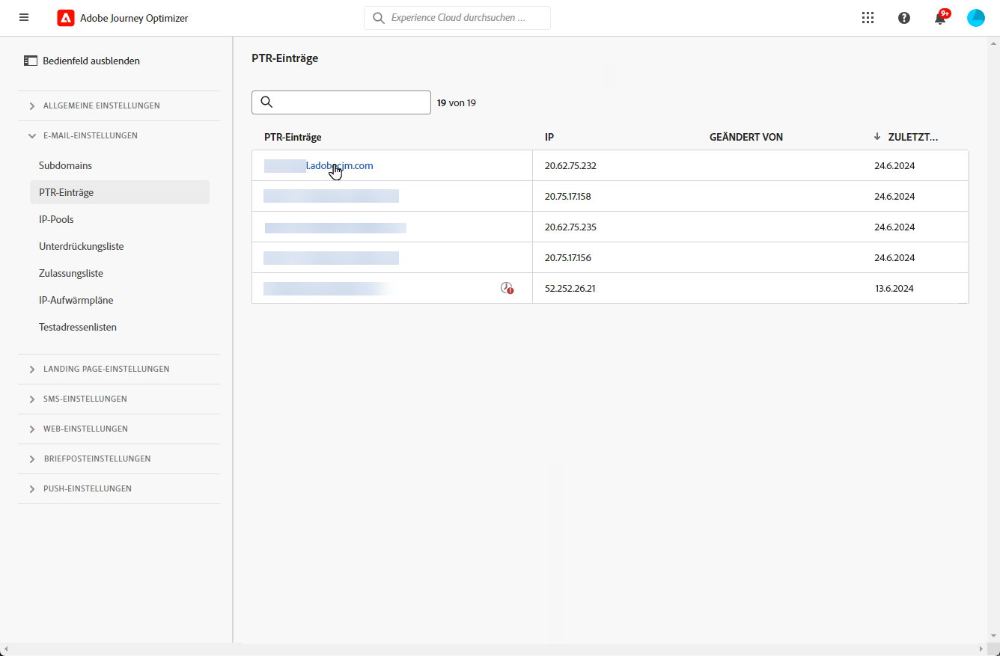

# PTR-Einträge {#ptr-records}

>[!CONTEXTUALHELP]
>id="ajo_admin_ptr_record"
>title="PTR-Einträge der Subdomains"
>abstract="Ein Pointer Record (PTR) ist eine Art von DNS-Eintrag, der den mit einer IP-Adresse verknüpften Domain-Namen bereitstellt. Mit diesem können die E-Mail-Empfangs-Server die IP-Adressen der Absender überprüfen. Bearbeiten Sie einen PTR-Eintrag nur nach reiflicher Überlegung und Rücksprache mit Ihrem Zustellbarkeitsexperten."

>[!CONTEXTUALHELP]
>id="ajo_admin_ptr_record_header"
>title="PTR-Einträge der Subdomains"
>abstract="Nachdem die erste Subdomain in Journey Optimizer an Adobe delegiert wurde, werden PTR-Datensätze automatisch erstellt."

## Informationen zu PTR-Einträgen {#about-ptr-records}

Ein PTR (Pointer Record, „Zeigereintrag“) ist ein Typ von DNS (Domain Name System)-Eintrag, der den mit einer IP-Adresse verknüpften Domain-Namen bereitstellt.

Mit PTR-Einträgen können E-Mail-Empfangs-Server die Authentizität der E-Mail-Sende-Server überprüfen, indem sie feststellen, ob ihre IP-Adressen mit den Namen übereinstimmen, mit denen sich die Server verbinden.

## Zugriff auf PTR-Einträge Ihrer Subdomains {#access-ptr-records}

Einmal [delegate](delegate-subdomain.md) Ihre erste Subdomäne zum Adobe [!DNL Journey Optimizer], werden PTR-Datensätze automatisch für Ihre IPs erstellt. Sie können über die **[!UICONTROL Administration]** > **[!UICONTROL Kanäle]** > **[!UICONTROL E-Mail-Konfiguration]** > **[!UICONTROL PTR-Datensätze]** Menü.

In der Liste werden die für jede zugewiesene Subdomain generierten PTR-Einträge anhand der unten stehenden Syntax angezeigt:

* „r“ für Eintrag (record),
* „xx“ für die beiden letzten Zahlen der IP-Adresse,
* Name der Subdomain.

Sie können einen PTR-Eintrag aus der Liste öffnen, um den zugehörigen Subdomain-Namen und die IP-Adresse anzuzeigen.

## Bearbeiten eines PTR-Eintrags {#edit-ptr-record}

Sie können einen PTR-Eintrag ändern, um die mit einer IP-Adresse verknüpfte Subdomain zu bearbeiten.

>[!CAUTION]
>
>PTR-Einträge sind in allen Umgebungen vorhanden. Daher wirkt sich jede Änderung an einem PTR-Eintrag auch auf die Produktions-Sandboxes aus.
>
>Gehen Sie bei der Bearbeitung von PTR-Einträgen mit größter Sorgfalt vor. Wenden Sie sich im Zweifel an einen Zustellbarkeitsexperten.

### Vollständig delegierte Subdomains {#fully-delegated-subdomains}

Um einen PTR-Eintrag mit einer Subdomain zu bearbeiten, die [vollständig an Adobe delegiert](delegate-subdomain.md#full-subdomain-delegation) ist, führen Sie die folgenden Schritte aus.

1. Klicken Sie in der Liste auf den Namen eines PTR-Eintrags, um diesen zu öffnen.

   

1. Wählen Sie aus der Liste eine Subdomain aus, die [vollständig an Adobe delegiert](delegate-subdomain.md#full-subdomain-delegation) ist.

   

1. Klicken Sie auf **[!UICONTROL Speichern]**, um Ihre Änderungen zu speichern.

>[!NOTE]
>
>Sie können die Felder **[!UICONTROL IP]** und **[!UICONTROL PTR-Eintrag]** nicht ändern.

### Delegierte Subdomains mit der CNAME-Methode {#edit-ptr-subdomains-cname}

Führen Sie die folgenden Schritte aus, um einen PTR-Eintrag mit einer Subdomain zu bearbeiten, die mithilfe der [CNAME-Methode](delegate-subdomain.md#cname-subdomain-delegation) an Adobe delegiert ist.

1. Klicken Sie in der Liste auf den Namen eines PTR-Eintrags, um diesen zu öffnen.

   

1. Wählen Sie in der Liste eine Subdomain aus, die mithilfe der [CNAME-Methode](delegate-subdomain.md#cname-subdomain-delegation) an Adobe delegiert wurde.

   

1. Sie müssen einen neuen Forward-DNS-Eintrag auf Ihrer Hosting-Plattform erstellen. Kopieren Sie dazu den von Adobe generierten Eintrag. Aktivieren Sie abschließend das Kontrollkästchen „Ich bestätige...“.

   

   >[!NOTE]
   >
   >Falls Sie die Nachricht „Bitte erstellen Sie zunächst ein Forward-DNS und versuchen Sie es dann erneut“ erhalten, führen Sie die folgenden Schritte aus:
   >   * Überprüfen Sie beim DNS-Provider, ob der Forward-DNS-Eintrag erfolgreich erstellt wurde.
   >   * Einträge im DNS werden möglicherweise nicht sofort synchronisiert. Warten Sie einige Minuten und versuchen Sie es erneut.

1. Klicken Sie auf **[!UICONTROL Speichern]**, um Ihre Änderungen zu speichern.

>[!NOTE]
>
>Sie können die Felder **[!UICONTROL IP]** und **[!UICONTROL PTR-Eintrag]** nicht ändern.

## Prüfen der Aktualisierungsdetails der PTR-Einträge {#check-ptr-record-update}

Nachdem Sie die Bearbeitung des PTR-Eintrags bestätigt haben, wird das Symbol **[!UICONTROL Verarbeitung läuft]** neben dem Namen des PTR-Eintrags in der Liste angezeigt.

>[!NOTE]
>
>Die [Verarbeitung der Aktualisierung](#processing) kann bis zu drei Stunden dauern.

Um die Details der PTR-Eintrag-Aktualisierung zu überprüfen, klicken Sie auf das Symbol daneben. In [diesem Abschnitt](#ptr-record-update-statuses) erfahren Sie mehr über die Status, die den verschiedenen Symbolen zugeordnet sind.

Sie können Informationen wie den Aktualisierungsstatus und die gewünschten Änderungen sehen.

## Aktualisierungsstatus von PTR-Einträgen {#ptr-record-update-statuses}

Die Aktualisierung eines PTR-Eintrags kann die folgenden Status haben:

*  **[!UICONTROL In Bearbeitung]**: Die Aktualisierung des PTR-Eintrags wurde eingereicht und durchläuft einen Verifizierungsprozess.
*  **[!UICONTROL Erfolgreich]**: Der aktualisierte PTR-Eintrag wurde überprüft und die neue Subdomain ist nun mit der IP-Adresse verknüpft.
*  **[!UICONTROL Fehlgeschlagen]**: Bei der Verifizierung der Aktualisierung des PTR-Eintrags sind eine oder mehrere Prüfungen fehlgeschlagen.

### Verarbeitung läuft {#processing}

Es werden verschiedene Zustellbarkeitsprüfungen durchgeführt, um zu überprüfen, ob die neue Subdomain, die mit der IP-Adresse verknüpft werden soll, gültig ist. Dies kann bis zu drei Stunden dauern.

>[!NOTE]
>
>Sie können einen PTR-Eintrag nicht ändern, während die Aktualisierung in Bearbeitung ist. Sie können weiterhin auf den Namen klicken, aber das Feld **[!UICONTROL Subdomain]** ist ausgegraut. Die Änderungen werden erst dann übernommen, wenn die Aktualisierung erfolgreich war.

Während des Validierungsprozesses ist die alte Subdomain nach wie vor mit der IP-Adresse verknüpft.

### Erfolgreich {#success}

Wenn der Validierungsprozess erfolgreich war, wird die neue Subdomain automatisch mit der IP-Adresse verknüpft.

### Fehlgeschlagen {#failes}

Wenn der Validierungsprozess fehlschlägt, wird der ältere PTR-Eintrag angezeigt. Die gültige Subdomain, die zuvor mit der IP-Adresse verknüpft war, bleibt unverändert.

Folgende Arten von Fehlern sind bei der Aktualisierung möglich:
* Erstellung eines neuen Weiterleitungs-DNS für den PTR-Eintrag schlägt fehl
* Aktualisieren des Eintrags schlägt fehl
* Erneute Integration der Affinitäten schlägt fehl

Wenn die Aktualisierung fehlschlägt, kann der PTR-Eintrag wieder bearbeitet werden. Sie können auf den Namen klicken und die Subdomain erneut aktualisieren.
