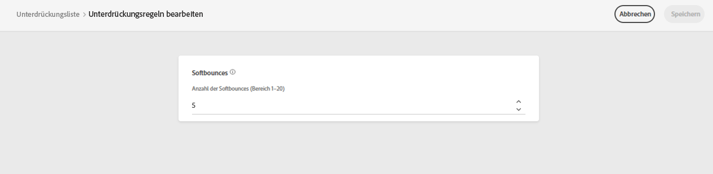

# Weitere Zustellversuche {#retries}

Wenn eine E-Mail-Nachricht aufgrund eines temporären **Softbounce** -Fehler, werden mehrere weitere Zustellversuche unternommen. Jeder Fehler erhöht einen Fehlerzähler. Wenn dieser Zähler den Grenzwert erreicht, wird die Adresse der Unterdrückungsliste hinzugefügt.

>[!NOTE]
>
>Weitere Informationen zu den Fehlertypen finden Sie im Abschnitt [Typen von fehlgeschlagenen Sendungen](../reports/suppression-list.md#delivery-failures) Abschnitt.

In der Standardkonfiguration ist der Schwellenwert auf 5 Fehler festgelegt.

* Für denselben Versand ist der fünfte aufgetretene Fehler innerhalb der [Wiederholungszeitraum](#retry-duration), wird die Adresse unterdrückt.

* Bei unterschiedlichen Sendungen und zwei Fehlern im Abstand von mindestens 24 Stunden wird der Fehlerzähler bei jedem Fehler inkrementiert und die Adresse beim fünften Versuch ebenfalls unterdrückt.

Wenn ein Versand nach einem erneuten Versuch erfolgreich war, wird der Fehlerzähler der Adresse neu initialisiert.

## Wiederholungsschwellenausgabe {#edit-retry-threshold}

>[!CONTEXTUALHELP]
>id="ajo_admin_suppression_list_bounces"
>title="Wiederholungsschwellenwert aktualisieren"
>abstract="Wenn der Standardwert Ihren Anforderungen nicht entspricht, können Sie die zulässige Anzahl aufeinander folgender Softbounces ändern. Wenn der Wiederholungszähler den Fehlerschwellenwert für eine bestimmte E-Mail-Adresse erreicht, wird diese Adresse der Unterdrückungsliste hinzugefügt."
>additional-url="https://experienceleague.adobe.com/docs/journey-optimizer/using/reporting/deliverability/suppression-list.html" text="Erläuterung der Unterdrückungsliste"

Falls der Standardwert 5 Ihren Anforderungen nicht entspricht, können Sie den Fehlerschwellenwert wie unten beschrieben ändern.

1. Navigieren Sie zu **[!UICONTROL Channels]** > **[!UICONTROL Email configuration]** > **[!UICONTROL Suppression list]**.

1. Wählen Sie die **[!UICONTROL Edit suppression rules]** Schaltfläche.

   

1. Bearbeiten Sie die zulässige Anzahl aufeinander folgender Softbounces entsprechend Ihren Anforderungen.

   

   Sie müssen einen ganzzahligen Wert zwischen 1 und 20 eingeben, d. h. die Mindestanzahl weiterer Versuche ist 1 und die maximale Zahl ist 20.

   >[!CAUTION]
   >
   >Ein Wert von mehr als 10 kann Probleme mit der Reputation der Zustellbarkeit sowie IP-Drosselung oder Blockierung durch ISPs verursachen. [Weitere Informationen zur Zustellbarkeit](../reports/deliverability.md)

## Zeitraum für Wiederholung {#retry-duration}

Die **Wiederholungszeitraum** ist der Zeitraum, in dem alle E-Mail-Nachrichten des Versands, bei denen ein temporärer Fehler oder ein Softbounce aufgetreten ist, wiederholt werden.

Standardmäßig werden erneute Versuche für **3,5 Tage** (oder **84 Stunden**) ab dem Zeitpunkt, zu dem die Nachricht der E-Mail-Warteschlange hinzugefügt wurde.

Um jedoch sicherzustellen, dass Wiederholungsversuche nicht mehr durchgeführt werden, wenn sie nicht mehr benötigt werden, können Sie diese Einstellung bei der Erstellung oder Bearbeitung einer [Kanaloberfläche](channel-surfaces.md) (d. h. Nachrichtenvorgabe), die auf den E-Mail-Kanal angewendet wird.

Beispielsweise können Sie die Wiederholungsfrist für eine Transaktions-E-Mail, die sich auf das Zurücksetzen des Kennworts bezieht und einen nur für einen Tag gültigen Link enthält, auf 24 Stunden festlegen. In ähnlicher Weise können Sie für einen Verkauf um Mitternacht eine Wiederholungszeit von 6 Stunden festlegen.

>[!NOTE]
>
>Der Wiederholungszeitraum darf 84 Stunden nicht überschreiten. Die Wiederholungsdauer beträgt mindestens 6 Stunden für Marketing-E-Mails und 10 Minuten für Transaktions-E-Mails.

Erfahren Sie, wie Sie die E-Mail-Wiederholungsparameter beim Erstellen einer Kanaloberfläche in [diesem Abschnitt](channel-surfaces.md#create-channel-surface).

