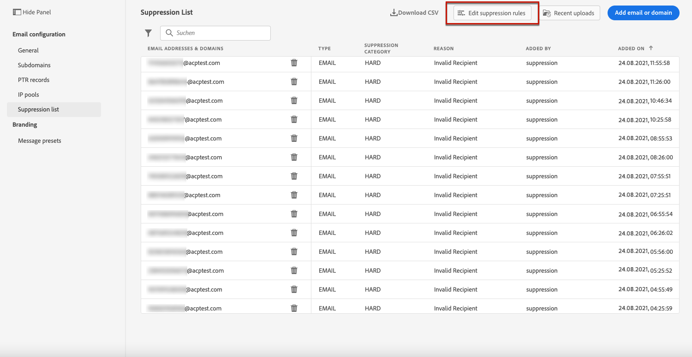
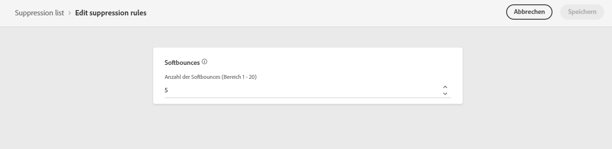

# Weitere Zustellversuche {#retries}

Wenn eine E-Mail-Nachricht aufgrund eines temporären **Softbounce**-Fehlers fehlschlägt, werden mehrere Zustellversuche unternommen. Jeder Fehler erhöht einen Fehlerzähler. Wenn dieser Zähler den Schwellenwert erreicht, wird die Adresse der Unterdrückungsliste hinzugefügt.

>[!NOTE]
>
>Weitere Informationen zu Fehlertypen finden Sie im Abschnitt [Typen für fehlgeschlagene Sendungen](../suppression-list.md#delivery-failures) .

In der Standardkonfiguration ist der Schwellenwert auf 5 Fehler festgelegt.

* Für denselben Versand wird beim fünften aufgetretenen Fehler innerhalb des [Wiederholungszeitraums](#retry-duration) die Adresse unterdrückt.

* Bei unterschiedlichen Sendungen und zwei Fehlern im Abstand von mindestens 24 Stunden wird der Fehlerzähler bei jedem Fehler inkrementiert und die Adresse beim fünften Versuch ebenfalls unterdrückt.

Wenn ein Versand nach einem erneuten Zustellversuch erfolgreich war, wird der Fehlerzähler der E-Mail-Adresse auf null zurückgesetzt.

Falls der Standardwert 5 Ihren Anforderungen nicht entspricht, können Sie den Fehlerschwellenwert wie unten beschrieben ändern.

1. Gehen Sie zu **[!UICONTROL Kanäle]** > **[!UICONTROL E-Mail-Konfiguration]** > **[!UICONTROL Unterdrückungsliste]**.

1. Wählen Sie die Schaltfläche **[!UICONTROL Unterdrückungsregeln bearbeiten]** aus.

   

1. Bearbeiten Sie die zulässige Anzahl aufeinander folgender Softbounces entsprechend Ihren Anforderungen.

   

   Sie müssen einen ganzzahligen Wert zwischen 1 und 20 eingeben, d. h. die Mindestanzahl weiterer Versuche ist 1 und die maximale Zahl ist 20.

   >[!CAUTION]
   >
   >Ein Wert von mehr als 10 kann Probleme mit der Reputation der Zustellbarkeit sowie IP-Drosselung oder auf die Blockierungsliste setz durch ISPs verursachen. [Weitere Informationen zur Zustellbarkeit](../deliverability.md)

<!---->

<!--The minimum delay between retries and the maximum number of retries to be performed are based on how well an IP is performing, both historically and currently, at a given domain.-->

## Zeitraum für Wiederholung {#retry-duration}

Der **Zeitraum für den erneuten Versuch** ist der Zeitraum, in dem alle E-Mail-Nachrichten des Versands, bei denen ein temporärer Fehler oder ein Softbounce aufgetreten ist, wiederholt werden.

Standardmäßig werden für **3,5 Tage** (oder **84 Stunden**) ab dem Zeitpunkt, zu dem die Nachricht zur E-Mail-Warteschlange hinzugefügt wurde, weitere Zustellversuche unternommen.

Um jedoch sicherzustellen, dass Wiederholungsversuche nicht mehr durchgeführt werden, wenn sie nicht mehr benötigt werden, können Sie diese Einstellung Ihren Anforderungen entsprechend ändern, wenn Sie eine [Nachrichtenvorgabe](message-presets.md) erstellen oder bearbeiten, die auf den E-Mail-Kanal angewendet wird.

Beispielsweise können Sie die Wiederholungsfrist für eine Transaktions-E-Mail, die sich auf das Zurücksetzen des Kennworts bezieht und einen nur für einen Tag gültigen Link enthält, auf 24 Stunden festlegen. In ähnlicher Weise können Sie für einen Verkauf um Mitternacht eine Wiederholungszeit von 6 Stunden festlegen.

>[!NOTE]
>
>Der Wiederholungszeitraum darf 84 Stunden nicht überschreiten. Die Wiederholungsdauer beträgt mindestens 6 Stunden für Marketing-E-Mails und 10 Minuten für Transaktions-E-Mails.

Erfahren Sie, wie Sie die E-Mail-Wiederholungsparameter beim Erstellen einer Nachrichtenvorgabe in [diesem Abschnitt](message-presets.md#create-message-preset) anpassen.

<!--After 3.5 days, any message in the retry queue will be removed from the queue and sent back as a bounce.-->

<!--Once a message has been in the retry queue for a maximum of 3.5 days and has failed to deliver, it will time out and its status will be updated to Failed??-->