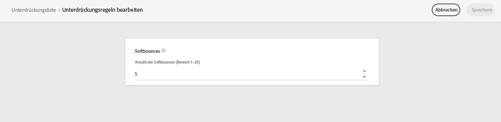

# Weitere Zustellversuche {#retries}

Wenn eine Nachricht aufgrund eines temporären Fehlers des Typs **Softbounce** für eine bestimmte Adresse fehlschlägt, werden weitere Zustellversuche unternommen. Jeder Fehler erhöht einen Fehlerzähler. Wenn dieser Zähler den Schwellenwert erreicht, wird die E-Mail-Adresse der Unterdrückungsliste hinzugefügt.

>[!NOTE]
>
>Weitere Informationen zu Fehlertypen finden Sie im Abschnitt [Typen von fehlgeschlagenen ](../reports/suppression-list.md#delivery-failures)).

In der Standardkonfiguration ist der Schwellenwert auf 5 Fehler festgelegt.

* Beim fünften Fehler bei demselben Versand innerhalb des [Wiederholungszeitraums](#retry-duration) wird die Adresse unterdrückt.

* Wenn es unterschiedliche Sendungen gibt und zwei Fehler im Abstand von mindestens 24 Stunden auftreten, wird der Fehlerzähler bei jedem Fehler erhöht und die Adresse wird ebenfalls beim fünften Versuch unterdrückt. Fehler sind für jede Adresse kumulativ.

Wenn ein Versand nach einem erneuten Versuch erfolgreich war, wird der Fehlerzähler der Adresse neu initialisiert.

Beispiel:

* Sie senden am Montag eine E-Mail mit einem Zeitraum von 24 Stunden für weitere Zustellversuche. Die `emma.jones@mail.com` kann nicht zugestellt werden. Die E-Mail wird bis zu dreimal wiederholt und stoppt den erneuten Versuch, sobald der 24-stündige Wiederholungszeitraum erreicht ist.

* Sie senden am Mittwoch eine weitere E-Mail. Die `emma.jones@mail.com`, die bereits eine Zählung mit drei Fehlern aufweist, wird ebenfalls angesprochen und kann erneut nicht bereitgestellt werden - zweimal. Zwei weitere Fehler werden berücksichtigt.

Sofern zwischen diesen beiden E-Mails kein anderer Versand versucht wurde und erfolgreich war, wird die `emma.jones@mail.com` angesichts der kumulativen Auswirkung von 3 + 2 Fehlern zur Unterdrückungsliste hinzugefügt.

## Schwellenwertbearbeitung erneut versuchen {#edit-retry-threshold}

>[!CONTEXTUALHELP]
>id="ajo_admin_suppression_list_bounces"
>title="Aktualisieren des Schwellenwerts für weitere Zustellversuche"
>abstract="Wenn der Standardwert Ihren Anforderungen nicht entspricht, können Sie die zulässige Anzahl aufeinander folgender Softbounces ändern. Wenn der Zähler für weitere Zustellversuche den Fehlerschwellenwert für eine bestimmte E-Mail-Adresse erreicht, wird diese Adresse der Unterdrückungsliste hinzugefügt."
<!--
>additional-url="https://experienceleague.adobe.com/docs/journey-optimizer/using/reporting/deliverability/suppression-list.html" text="Understand the suppresion list"
-->

Falls der Standardwert 5 Ihren Anforderungen nicht entspricht, können Sie den Fehlerschwellenwert wie folgt ändern.

1. Navigieren Sie **[!UICONTROL Kanäle]** > **[!UICONTROL E-Mail-Einstellungen]** > **[!UICONTROL Unterdrückungsliste]**.

1. Klicken Sie auf **[!UICONTROL Schaltfläche „Unterdrückungsregeln bearbeiten]**.

   

1. Bearbeiten Sie die zulässige Anzahl aufeinander folgender Softbounces entsprechend Ihren Anforderungen.

   

   Sie müssen einen ganzzahligen Wert zwischen 1 und 20 eingeben, d. h. die Mindestanzahl weiterer Versuche ist 1 und die maximale Anzahl ist 20.

   >[!CAUTION]
   >
   >Jeder Wert über 10 kann Zustellbarkeitsprobleme hinsichtlich der Reputation sowie IP-Drosselung oder -Blockierungsauflistung durch ISPs verursachen. [Erfahren Sie mehr über die Zustellbarkeit](../reports/deliverability.md)

## Zeitraum für weitere Zustellversuche {#retry-duration}

Der **Zeitraum für weitere Zustellversuche** ist der Zeitraum, in dem alle E-Mail-Nachrichten des Versands, bei denen ein temporärer Fehler oder ein Softbounce aufgetreten ist, erneut gesendet werden.

Standardmäßig werden weitere Zustellversuche **** 3,5 Tage (oder **84 Stunden**) ab dem Zeitpunkt durchgeführt, zu dem die Nachricht zur E-Mail-Warteschlange hinzugefügt wurde.

Um jedoch sicherzustellen, dass Zustellversuche nur so lange durchgeführt werden, wie sie benötigt werden, können Sie diese Einstellung Ihren Anforderungen entsprechend ändern, wenn Sie eine [Kanalkonfiguration“ erstellen oder bearbeiten, ](channel-surfaces.md) auf den E-Mail-Kanal angewendet wird.

Beispielsweise können Sie den Zeitraum für weitere Zustellversuche für eine Transaktions-E-Mail, die sich auf das Zurücksetzen des Kennworts bezieht und einen nur für einen Tag gültigen Link enthält, auf 24 Stunden festlegen. Ebenso können Sie für einen Midnight Sale einen Wiederholungszeitraum von 6 Stunden definieren.

>[!NOTE]
>
>Der Zeitraum für weitere Zustellversuche darf 84 Stunden nicht überschreiten. Der Mindestzeitraum für weitere Zustellversuche beträgt 6 Stunden für Marketing-E-Mails und 10 Minuten für Transaktions-E-Mails.

Erfahren Sie in (diesem Abschnitt), wie Sie die Parameter für weitere Zustellversuche für E[Mails anpassen, während Sie eine Kanalkonfiguration ](../email/email-settings.md#email-retry).

