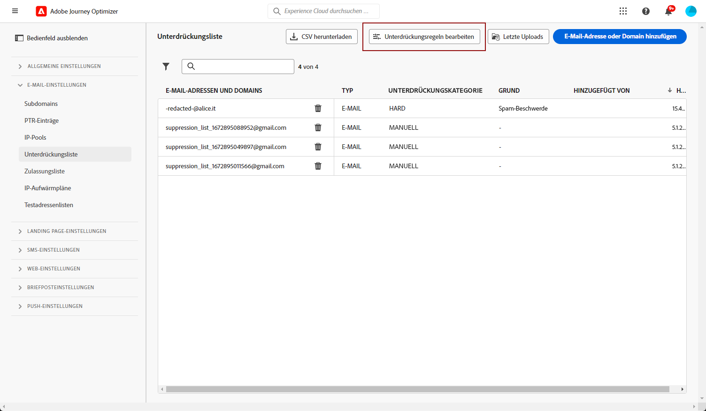
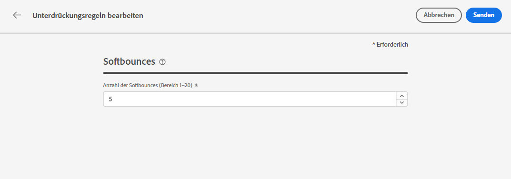

# Weitere Zustellversuche {#retries}

Wenn eine Nachricht aufgrund eines temporären Fehlers des Typs **Softbounce** fehlschlägt, werden weitere Zustellversuche unternommen. Jeder Fehler erhöht einen Fehlerzähler. Wenn dieser Zähler den Schwellenwert erreicht, wird die Adresse der Unterdrückungsliste hinzugefügt.

>[!NOTE]
>
>Weitere Informationen zu Fehlertypen finden Sie im Abschnitt [Typen von fehlgeschlagenen Sendungen](../reports/suppression-list.md#delivery-failures)

In der Standardkonfiguration ist der Schwellenwert auf fünf Fehler festgelegt.

* Beim fünften Fehler bei demselben Versand innerhalb des [Wiederholungszeitraums](#retry-duration) wird die Adresse unterdrückt.

* Wenn es unterschiedliche Sendungen gibt und zwei Fehler im Abstand von mindestens 24 Stunden auftreten, wird der Fehlerzähler bei jedem Fehler erhöht und die E-Mail-Adresse wird ebenfalls beim fünften Versuch unterdrückt.

Wenn ein Versand nach einem erneuten Zustellversuch erfolgreich ist, wird der Fehlerzähler der E-Mail-Adresse auf null zurückgesetzt.

## Bearbeitung des Schwellenwerts für Wiederholungsversuche {#edit-retry-threshold}

>[!CONTEXTUALHELP]
>id="ajo_admin_suppression_list_bounces"
>title="Aktualisieren des Schwellenwerts für Wiederholungsversuche"
>abstract="Wenn der Standardwert nicht den Anforderungen entspricht, kann die zulässige Anzahl aufeinander folgender Softbounces geändert werden. Wenn die Wiederholungsanzahl den Fehlerschwellenwert für eine bestimmte E-Mail-Adresse erreicht, wird diese Adresse der Unterdrückungsliste hinzugefügt."
>additional-url="https://experienceleague.adobe.com/docs/journey-optimizer/using/reporting/deliverability/suppression-list.html?lang=de" text="Weitere Infos zur Unterdrückungsliste"

Falls der Standardwert 5 Ihren Anforderungen nicht entspricht, können Sie den Fehlerschwellenwert wie unten beschrieben ändern.

1. Gehen Sie zu **[!UICONTROL Kanäle]** > **[!UICONTROL E-Mail-Konfiguration]** > **[!UICONTROL Unterdrückungsliste]**.

1. Klicken Sie auf den Button **[!UICONTROL Unterdrückungsregeln bearbeiten]**.

   

1. Bearbeiten Sie die zulässige Anzahl aufeinanderfolgender Softbounces entsprechend Ihren Anforderungen.

   

   Sie müssen einen ganzzahligen Wert zwischen 1 und 20 eingeben, d. h. die Mindestanzahl weiterer Zustellversuche ist 1 und die maximale Anzahl ist 20.

   >[!CAUTION]
   >
   >Ein Wert von mehr als 10 kann Zustellbarkeitsprobleme hinsichtlich der Reputation sowie eine IP-Drosselung oder eine Blockierungsauflistung durch ISPs verursachen. [Weitere Information zur Zustellbarkeit](../reports/deliverability.md)

## Zeitraum für weitere Zustellversuche {#retry-duration}

Der **Zeitraum für weitere Zustellversuche** ist der Zeitraum, in dem alle E-Mail-Nachrichten des Versands, bei denen ein temporärer Fehler oder ein Softbounce aufgetreten ist, erneut gesendet werden.

Standardmäßig werden weitere Zustellversuche **3,5 Tage** (oder **84 Stunden**) lang ab dem Zeitpunkt durchgeführt, zu dem die Nachricht zur E-Mail-Warteschlange hinzugefügt wurde.

Um jedoch sicherzustellen, dass Zustellversuche nur so lange durchgeführt werden, wie sie benötigt werden, können Sie diese Einstellung Ihren Anforderungen entsprechend ändern, wenn Sie eine [Kanaloberfläche](channel-surfaces.md) (d. h. Nachrichtenvoreinstellung) einrichten oder bearbeiten, die auf den E-Mail-Kanal angewendet wird.

Beispielsweise können Sie den Zeitraum für weitere Zustellversuche einer Transaktions-E-Mail, die sich auf das Zurücksetzen eines Passworts bezieht und einen nur für einen Tag gültigen Link enthält, auf 24 Stunden festlegen. Analog dazu könnten Sie für einen Midnight Sale den Zeitraum für weitere Zustellversuche auf 6 Stunden festlegen.

>[!NOTE]
>
>Der Zeitraum für weitere Zustellversuche darf 84 Stunden nicht überschreiten. Der Mindestzeitraum für weitere Zustellversuche beträgt 6 Stunden für Marketing-E-Mails und 10 Minuten für Transaktions-E-Mails.

In [diesem Abschnitt](channel-surfaces.md#create-channel-surface) erfahren Sie, wie Sie die Parameter für weitere Zustellversuche für E-Mails anpassen, während Sie eine Kanaloberfläche definieren.

