# Arbeiten mit Regelsätzen {#rule-sets}

>[!CONTEXTUALHELP]
>id="ajo_business_rules_rule_sets"
>title="Regelsätze"
>abstract="Verwenden Sie Regelsätze, um die Frequenzbegrenzung auf verschiedene Arten von Marketing-Kommunikationen anzuwenden. Sie können beispielsweise eine Regel festlegen, um die Anzahl der **Werbemitteilungen** zu begrenzen, die an Ihre Kundinnen und Kunden gesendet werden, und eine weitere Regel festlegen, um die Anzahl der **Newsletter** zu begrenzen, die an sie gesendet werden."

>[!AVAILABILITY]
>
>Die Regelsätze sind derzeit nur als Beta-Version für ausgewählte Benutzende verfügbar. Wenden Sie sich an den Adobe-Support, um in die Beta-Version aufgenommen zu werden.

## Erste Schritte mit Regelsätzen {#gs}

### Was sind Regelsätze? {#what}

Neben den globalen Geschäftsregeln, die die Anzahl der Nachrichten, die Benutzer über einen oder mehrere Kanäle erhalten, einschränken, können Sie mithilfe von Regelsätzen **mehrere Regeln in Regelsätze gruppieren** und sie auf die Kampagnen Ihrer Wahl anwenden. Dies bietet eine verbesserte Granularität, mit der gesteuert wird, wie oft Benutzende je nach Kommunikationsart eine Nachricht erhalten.

Sie können zum Beispiel eine Regel festlegen, um die Anzahl der **Werbemitteilungen** zu begrenzen, die an Ihre Kundinnen und Kunden gesendet werden, und eine andere Regel, um die Anzahl der **Newsletter** zu begrenzen, die an sie gesendet werden. Je nach Kampagnentyp, den Sie erstellen, können Sie dann entweder den Regelsatz für die Werbekommunikation oder den für den Newsletter anwenden.

➡️ [Entdecken Sie diese Funktion im Video](#video)

### Globale und benutzerdefinierte Regelsätze {#global-custom}

Wenn Sie zum ersten Mal über das Menü **[!UICONTROL Administration]** > **[!UICONTROL Verfahrensregeln (Beta)]** auf Regelsätze zugreifen, wird ein Standardregelsatz vorab erstellt und aktiviert: der **globale Standardregelsatz**.

Dieser Regelsatz enthält globale Regeln, die Sie anwenden können, um zu steuern, wie oft Benutzende Nachrichten über einen oder mehrere Kanäle erhalten. Dies ähnelt der Funktionsweise der aktuellen Verfahrensregeln. Alle in diesem Regelsatz definierten Regeln gelten für alle ausgewählten Kanäle, unabhängig davon, ob Nachrichten von einer Journey oder einer Kampagne gesendet werden. [Erfahren Sie, wie man mit Verfahrensregeln arbeitet](frequency-rules.md)

Zusätzlich zu diesem „Globalen Standardregelsatz“ können Sie **benutzerdefinierte Regelsätze** erstellen, die Sie auf jede Kampagne anwenden können, um die Anzahl der innerhalb dieser Kampagne gesendeten Nachrichten zu beschränken. [Erfahren Sie, wie Sie benutzerdefinierte Regelsätze erstellen](#create)

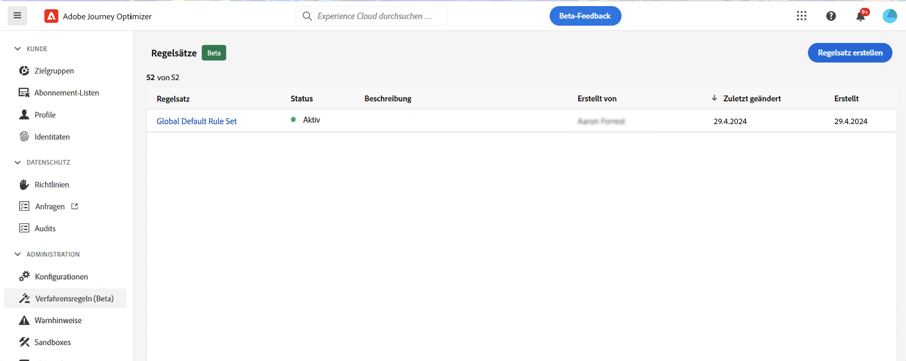

>[!IMPORTANT]
>
>Derzeit können benutzerdefinierte Regelsätze nur auf **Kampagnen** angewendet werden. Nur die im Regelsatz „Globaler Standardregelsatz“ definierten Regeln gelten für die Kommunikation in Journeys und Kampagnen.

### Begrenzungsregeln für Kanal und Journey {#domain}

Beim Erstellen eines Regelsatzes müssen Sie angeben, ob die Regeln im Regelsatz Begrenzungsregeln erzwingen, die für Kommunikationskanäle oder Journey spezifisch sind.  Wählen Sie dazu bei der Erstellung einen Kanal oder eine Journey-Domäne für den Regelsatz aus. [Erfahren Sie, wie Sie einen Regelsatz erstellen](#create)

* **Kanal**-Domäne: Wenden Sie Begrenzungsregeln für Kommunikationskanäle an. Senden Sie beispielsweise nicht mehr als eine E-Mail- oder SMS-Nachricht pro Tag.
* Domäne **Journey**: Wenden Sie Einstiegs- und gleichzeitige Begrenzungsregeln auf eine Journey an. Geben Sie beispielsweise nicht mehrere Profile gleichzeitig auf einer Journey ein.

## Erstellen Ihres ersten benutzerdefinierten Regelsatzes {#create-rule-set}

### Erstellen Sie den Regelsatz und wählen Sie seine Domäne aus {#create}

Gehen Sie wie folgt vor, um einen Regelsatz zu erstellen:

>[!NOTE]
>
>Sie können bis zu 3 benutzerdefinierte Regelsätze erstellen.

1. Rufen Sie die Liste **[!UICONTROL Regelsätze]** auf und klicken Sie dann auf **[!UICONTROL Regelsatz erstellen]**.

   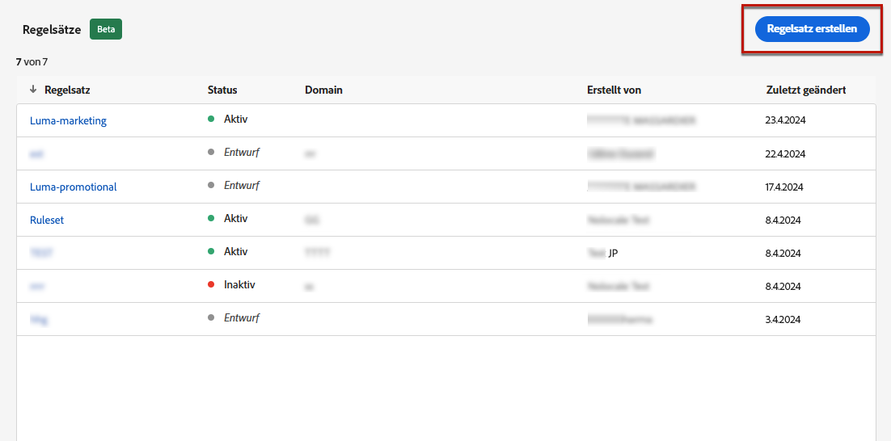

1. Definieren Sie einen eindeutigen Namen für den Regelsatz und fügen Sie eine Beschreibung hinzu.

1. Wählen Sie die Domäne des Regelsatzes aus. Über die Domäne können Sie festlegen, ob der Regelsatz Begrenzungsregeln enthält, die für Kommunikationskanäle oder Journey spezifisch sind:

   * **Kanal**: Wenden Sie Begrenzungsregeln für Kommunikationskanäle an. Senden Sie beispielsweise nicht mehr als eine E-Mail- oder SMS-Nachricht pro Tag.
   * **Journey**: Wenden Sie Einstiegs- und gleichzeitige Begrenzungsregeln auf eine Journey an. Geben Sie beispielsweise nicht mehrere Profile gleichzeitig auf einer Journey ein.

   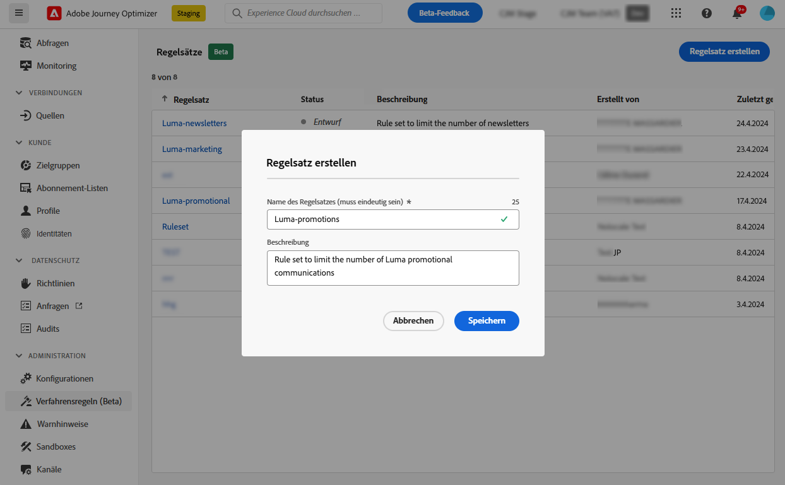

1. Klicken Sie auf **[!UICONTROL Speichern]**.

1. Sie können nun [die Regeln festlegen](#create-new-rule), die Sie zu diesem Regelsatz hinzufügen möchten.

### Hinzufügen von Regeln zum Regelsatz {#create-new-rule}

>[!CONTEXTUALHELP]
>id="ajo_rule_sets_category"
>title="Wählen Sie die Kategorie der Nachrichtenregel aus"
>abstract="Bei Aktivierung und Anwendung auf eine Nachricht werden alle Häufigkeitsregeln, die der ausgewählten Kategorie entsprechen, automatisch auf diese Nachricht angewendet. Derzeit ist nur die Kategorie „Marketing“ verfügbar."

>[!CONTEXTUALHELP]
>id="ajo_rule_sets_capping"
>title="Festlegen der Begrenzung für Ihre Regel"
>abstract="Geben Sie an, wie viele Nachrichten innerhalb des ausgewählten Zeitrahmens maximal an ein Kundenprofil gesendet werden sollen. Die Frequenzbegrenzung basiert auf dem ausgewählten Kalenderzeitraum und wird am Anfang des entsprechenden Zeitrahmens zurückgesetzt. "

>[!CONTEXTUALHELP]
>id="ajo_rule_sets_channel"
>title="Definieren der Kanäle, für die die Regel gilt"
>abstract="Wählen Sie mindestens einen Kanal aus. Die Begrenzung gilt als Gesamtanzahl für alle Kanäle."

>[!CONTEXTUALHELP]
>id="ajo_rule_sets_duration"
>title="Wählen Sie die Kategorie der Nachrichtenregel aus"
>abstract="Bei Aktivierung und Anwendung auf eine Nachricht werden alle Häufigkeitsregeln, die der ausgewählten Kategorie entsprechen, automatisch auf diese Nachricht angewendet. Derzeit ist nur die Kategorie „Marketing“ verfügbar."

Um einem Regelsatz eine Regel hinzuzufügen, greifen Sie auf den Regelsatz zu und klicken Sie auf **[!UICONTROL Regel hinzufügen]** .

Die für die Regel verfügbaren Parameter hängen von der bei ihrer Erstellung ausgewählten Regelsatzdomäne ab.

+ + + Konfigurieren der Kanalbegrenzungsregeln (**Kanal**-Domäne)

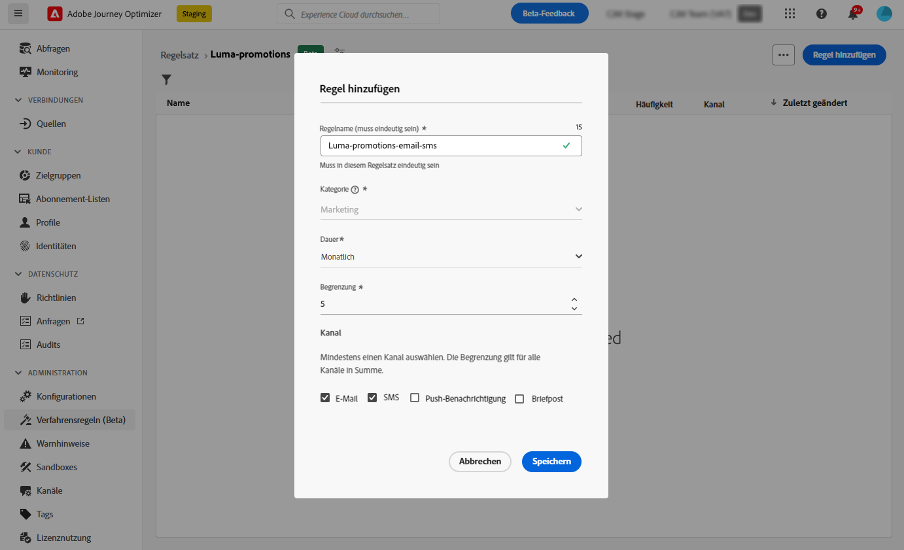

1. Definieren Sie einen eindeutigen Namen für die Regel.

1. Das Feld **Kategorie** gibt die Kategorie der Nachricht an, für die die Regel gilt. Im Moment ist dieses Feld schreibgeschützt, da nur die Kategorie **[!UICONTROL Marketing]** verfügbar ist.

1. Legen Sie über die Dropdown-Liste **[!UICONTROL Dauer]** fest, ob die Begrenzung monatlich, wöchentlich oder täglich angewendet werden soll. Die Häufigkeitsbegrenzung basiert auf dem ausgewählten Kalenderzeitraum. Sie wird am Anfang des entsprechenden Zeitrahmens zurückgesetzt.

   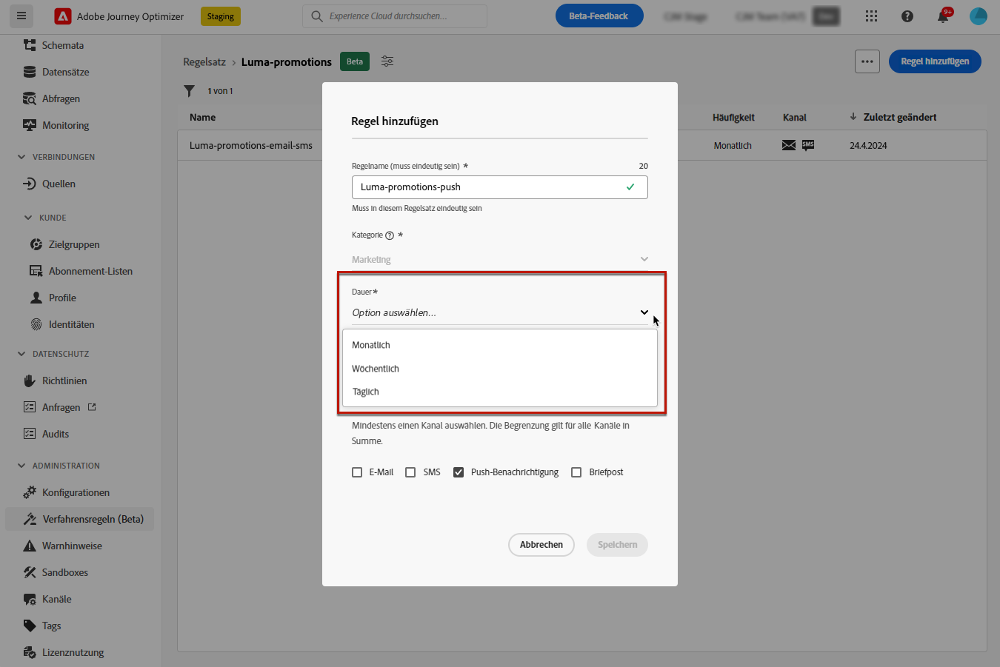

   Der Zähler läuft für jeden Zeitraum wie folgt ab:

   * **[!UICONTROL Monatlich]**: Die Häufigkeitsbegrenzung ist bis zum letzten Tag des Monats um 23:59:59 UTC gültig. Beispielsweise beträgt die monatliche Gültigkeit für den 31.01.23:59:59 UTC.

   * **[!UICONTROL Wöchentlich]**: Die Häufigkeitsbegrenzung gilt bis Samstag 23:59:59 UTC der betreffenden Woche, da die Kalenderwoche am Sonntag beginnt. Das Ablaufdatum ist unabhängig von der Regelerstellung. Wenn die Regel beispielsweise am Donnerstag erstellt wird, gilt diese Regel bis Samstag um 23 Uhr:59:59.

   * **[!UICONTROL Täglich]**: Die tägliche Frequenzbegrenzung ist für den Tag bis 23:59:59 UTC gültig und wird zu Beginn des nächsten Tages auf 0 zurückgesetzt.

     >[!CAUTION]
     >
     >Um die Genauigkeit der Regeln für die tägliche Frequenzbegrenzung zu gewährleisten, ist die Verwendung der [Streaming-Segmentierung](https://experienceleague.adobe.com/docs/experience-platform/segmentation/ui/streaming-segmentation.html?lang=de){target="_blank"} obligatorisch. Weitere Informationen über Methoden zur Zielgruppenauswertung finden Sie in [diesem Abschnitt](../audience/about-audiences.md#evaluation-method-in-journey-optimizer).

   Bitte beachten Sie, dass der Zählerwert des Profils nach Auslieferung der Mitteilung aktualisiert wird. Seien Sie sich dessen bewusst, wenn Sie große Mengen an Mitteilungen versenden, da der Durchsatz dazu führen kann, dass die Empfängerinnen und Empfänger die E-Mail erst Minuten oder sogar Stunden nach dem Beginn der Kommunikation erhalten (wenn Sie beispielsweise Millionen von Nachrichten gleichzeitig versenden).

   Dies ist wichtig, wenn eine Person zwei Mitteilungen kurz nacheinander erhält. Wir empfehlen, die Mitteilungen nach Möglichkeit im Abstand von mindestens zwei Stunden zu versenden, damit die Empfängerinnen und Empfänger genügend Zeit haben, die Mitteilung zu erhalten, und der Zählerwert entsprechend aktualisiert werden kann.

1. Legen Sie die Begrenzung für Ihre Regel fest, d. h. die maximale Anzahl der Nachrichten, die pro Monat, Woche oder Tag – entsprechend Ihrer Auswahl oben – an ein individuelles Benutzerprofil gesendet werden können.

1. Wählen Sie den Kanal, den Sie für diese Regel verwenden möchten: **[!UICONTROL E-Mail]**, **[!UICONTROL SMS]**, **[!UICONTROL Push-Benachrichtigung]** oder **[!UICONTROL Briefpost]**.

   >[!NOTE]
   >
   >Sie müssen mindestens einen Kanal auswählen, um die Regel erstellen zu können.

1. Wählen Sie mehrere Kanäle aus, wenn Sie für alle ausgewählten Kanäle gemeinsam eine Begrenzung festlegen möchten.

   Legen Sie beispielsweise die Begrenzung auf 5 fest und wählen Sie dann den E-Mail- und SMS-Kanal aus. Wenn ein Profil im ausgewählten Zeitraum bereits drei Marketing-E-Mails und 2 SMS erhalten hat, wird dieses Profil vom nächsten Versand einer Marketing-E-Mail oder SMS ausgeschlossen.

+++

++ + Journey-Begrenzungsregeln konfigurieren (**Journey** -Domäne)

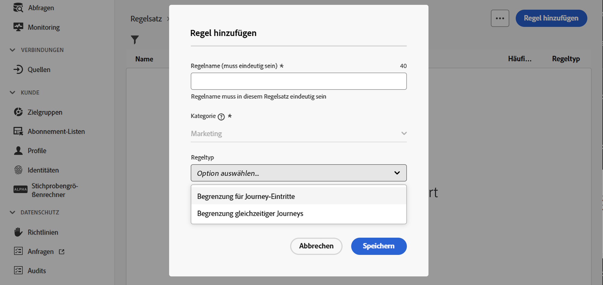

1. Geben Sie einen eindeutigen Namen für die Regel an.

1. Geben Sie in der Dropdownliste **[!UICONTROL Regeltyp]** den Begrenzungstyp für die Regel an.

   * **[!UICONTROL Journey Entry Cap]**: Beschränkt die Anzahl der Einträge in die Journey über einen bestimmten Zeitraum für ein Profil.
   * **[!UICONTROL Journey Concurrency Cap]**: Beschränkt, wie viele Journey ein Profil gleichzeitig eingeschrieben werden kann.

1. Detaillierte Informationen zum Konfigurieren von Journey-Begrenzungsregeln finden Sie im Abschnitt [Journey-Begrenzung und -Schlichtung](../test-approve/journey-capping.md) .

+++

1. Klicken Sie auf **[!UICONTROL Speichern]**, um die Erstellung der Regel zu bestätigen. Ihre Nachricht wird dem Regelsatz mit dem Status **[!UICONTROL Entwurf]** hinzugefügt.

   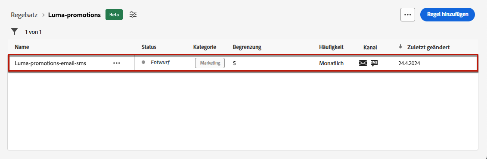

1. Wiederholen Sie die obigen Schritte, um dem Regelsatz so viele Regeln wie nötig hinzuzufügen.

Nun müssen Sie jede Regel aktivieren, bevor sie auf eine Nachricht angewendet werden kann. [Weitere Informationen](#activate-rule)

### Aktivieren der Regeln und des Regelsatzes {#activate-rule}

Wenn eine Regel erstellt wird, verfügt sie über den Status **[!UICONTROL Entwurf]** und wirkt sich noch auf keine Nachricht aus. Um sie zu aktivieren, klicken Sie auf die Schaltfläche **[!UICONTROL Weitere Aktionen]** neben der Regel und wählen Sie **[!UICONTROL Aktivieren]**.

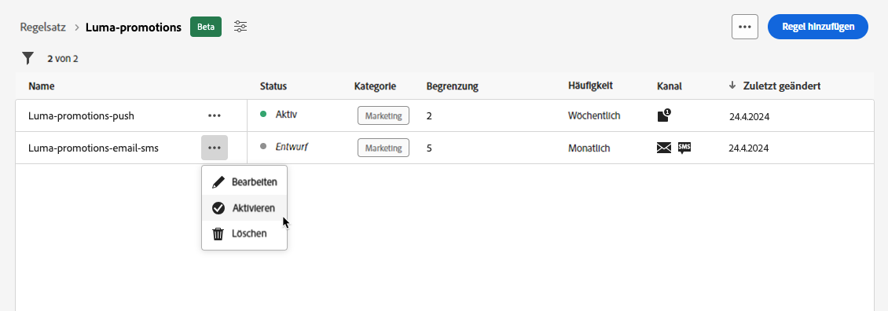

Außerdem müssen Sie den Regelsatz aktivieren, damit Sie in Kampagnen/Journeys darauf zugreifen und ihn auf Ihre Nachrichten anwenden können.

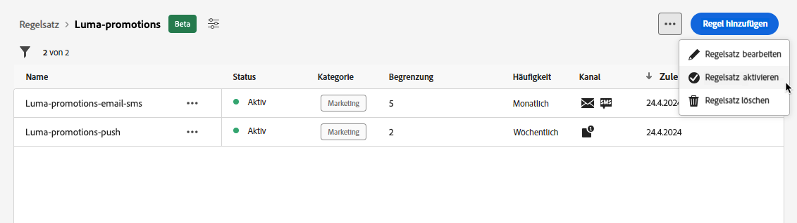

>[!NOTE]
>
>Es kann bis zu 10 Minuten dauern, bis eine Regel oder ein Regelsatz vollständig aktiviert ist. Sie müssen keine Nachrichten ändern oder Journeys erneut veröffentlichen, damit eine Regel wirksam wird.

<!--Currently, once a rule set is activated, no more rules can be added to that rule set.-->

Um eine Regel oder einen Regelsatz zu deaktivieren, klicken Sie auf die Schaltfläche **[!UICONTROL Weitere Aktionen]** neben dem gewünschten Element und wählen Sie **[!UICONTROL Deaktivieren]**.

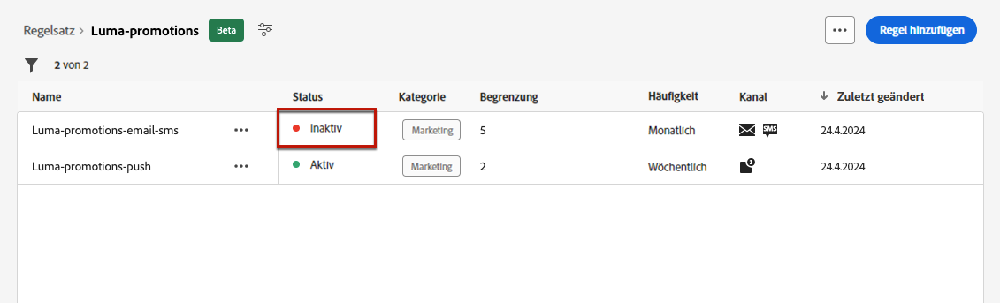

Der Status ändert sich in **[!UICONTROL Inaktiv]** und die Regel wird nicht mehr auf zukünftige Nachrichtenausführungen angewendet. Alle aktuell ausgeführten Nachrichten sind davon nicht betroffen.

>[!NOTE]
>
>Das Deaktivieren eines Regelsatzes wirkt sich weder auf die Zählung für einzelne Profile aus, noch wird die Zählung zurückgesetzt.

## Zugriff auf und Verwaltung von Regelsätzen {#access-rule-sets}

Alle erstellten Regelsätze werden im Menü **[!UICONTROL Administration]** > **[!UICONTROL Verfahrensregeln (Beta)]** angezeigt. Sie werden nach dem Datum der letzten Änderung sortiert.

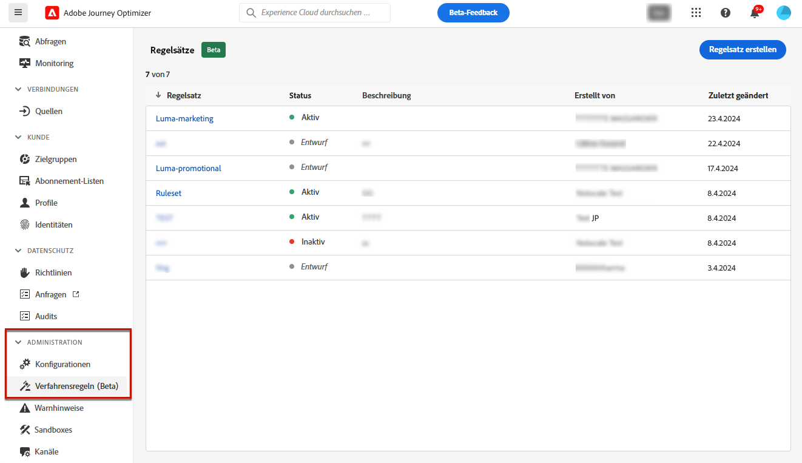

Klicken Sie auf den Namen eines Regelsatzes, um dessen Inhalt anzuzeigen und zu bearbeiten. Alle Regeln, die in diesem Regelsatz enthalten sind, werden aufgelistet. Über das Kontextmenü oben rechts können Sie Folgendes tun:

* Bearbeiten des Namens und der Beschreibung des Regelsatzes
* Aktivieren des Regelsatzes – [mehr erfahren](#activate-rule)
* Löschen des Regelsatzes

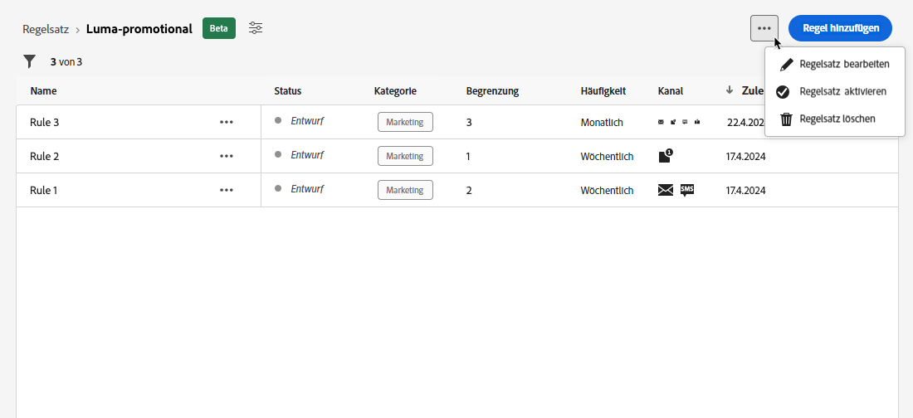

Für jede Regel im Regelsatz können Sie über die Schaltfläche **[!UICONTROL Weitere Aktionen]** folgende Aktionen durchführen:

* Bearbeiten der Regel
* Aktivieren der Regel – [mehr erfahren](#activate-rule)
* Löschen der Regel

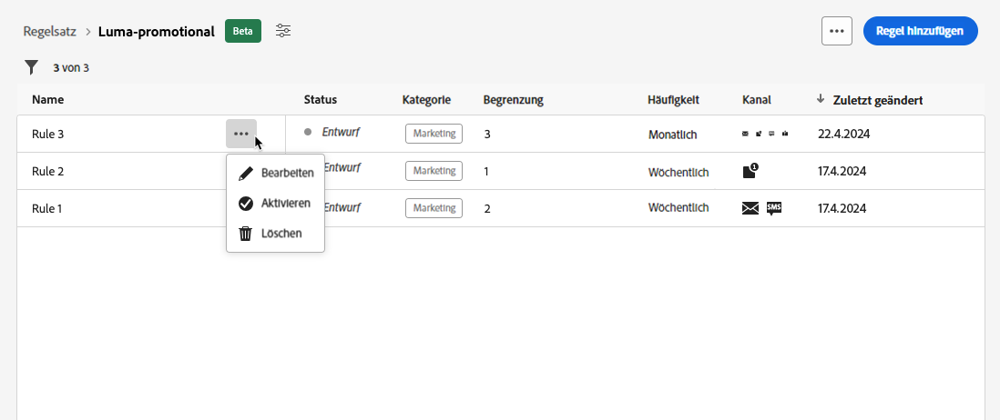

<!--### Permissions{#permissions-frequency-rules}

To access, create, edit or delete message frequency rules, you must have the **[!UICONTROL Manage frequency rules]** permission. 

Users with the **[!UICONTROL View frequency rules]** permission are able to view rules, but not to modify or delete them.

Learn more about permissions in [this section](../administration/high-low-permissions.md).-->

## Regelsätze auf Nachrichten oder Journey anwenden {#apply-frequency-rule}

Sie können einen Regelsatz je nach der bei der Erstellung des Regelsatzes ausgewählten Domain auf eine Nachricht oder eine Journey anwenden. Erweitern Sie die folgenden Abschnitte, um weitere Informationen zu erhalten.

+++ Anwenden eines Regelsatzes auf eine Nachricht

1. Wenn Sie eine [Kampagne](../campaigns/create-campaign.md) erstellen, wählen Sie einen der Kanäle, die Sie für Ihren Regelsatz festgelegt haben, und bearbeiten Sie den Inhalt Ihrer Nachricht.

1. Klicken Sie im Bildschirm für die Bearbeitung von Inhalten auf die Schaltfläche **[!UICONTROL Verfahrensregel hinzufügen]**.

1. Wählen Sie den [Regelsatz, den Sie festgelegt haben](#create-rule-set).

   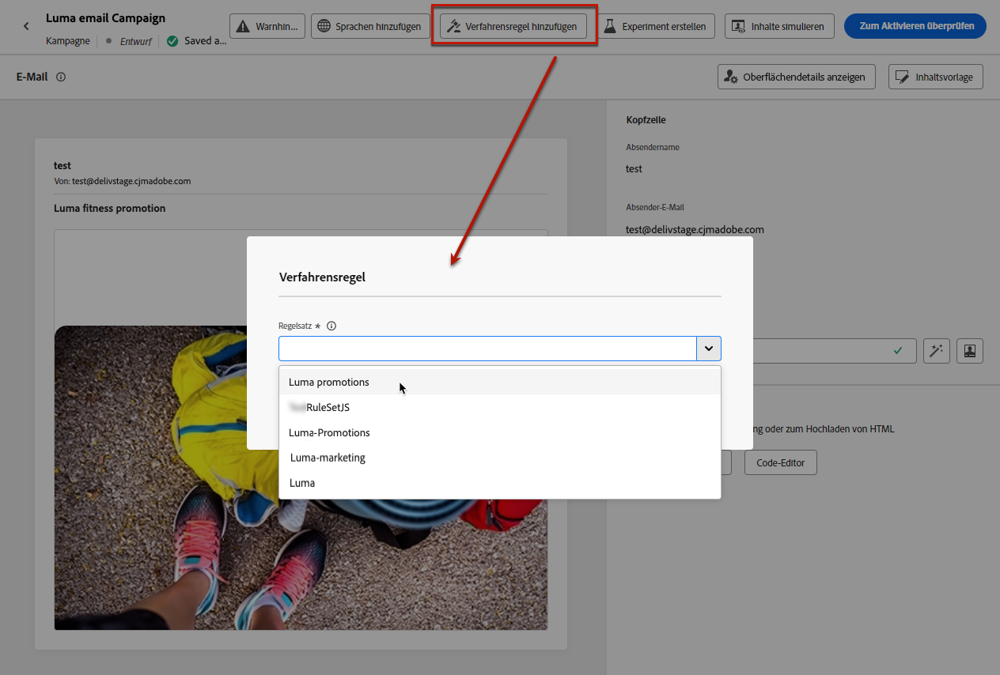

   >[!NOTE]
   >
   >In der Liste werden nur [aktivierte](#activate-rule) Regelsätze angezeigt.

   <!--Messages where the category selected is **[!UICONTROL Transactional]** will not be evaluated against business rules.-->

1. Bevor Sie Ihre Kampagne aktivieren, stellen Sie sicher, dass Sie die Ausführung mindestens 10 Minuten im Voraus planen.

   Dies ermöglicht ausreichend Zeit, um die Zählerwerte im Profil für die ausgewählte Verfahrensregel zu füllen. Wenn Sie die Kampagne sofort aktivieren, werden die Zählerwerte des Regelsatzes nicht in den Profilen der Empfangenden angezeigt und die Nachricht wird nicht in Bezug auf die Frequenzbegrenzungsregeln für die benutzerdefinierten Regelsätze gezählt.

   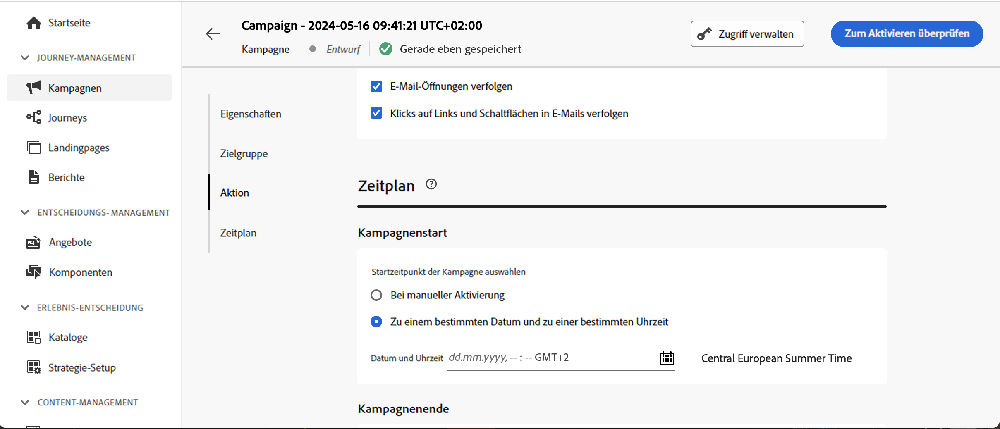

1. Sie können die Anzahl der vom Versand ausgeschlossenen Profile im Bericht [Customer Journey Analytics](../reports/report-gs-cja.md) und im Bericht [Live Report](../reports/live-report.md) anzeigen, in dem die Häufigkeitsregeln als möglicher Grund für vom Versand ausgeschlossene Benutzer aufgeführt werden.

>[!NOTE]
>
>Für denselben Kanal können mehrere Regeln angewendet werden, aber sobald die untere Begrenzung erreicht ist, wird das Profil von den nächsten Sendungen ausgeschlossen.

<!--
## Example: combine several rules {#frequency-rule-example}

You can combine several message frequency rules, such as described in the example below.

1. [Create a rule](#create-new-rule) called *Overall Marketing Capping*:

   * Select all channels.
   * Set capping to 12 monthly.

   

1. To further restrict the number of marketing-based push notifications that a user is sent, create a second rule called *Push Marketing Cap*:

   * Select Push channel.
   * Set capping to 4 monthly.

   

1. Save and [activate](#activate-rule) the rule.

1. [Create a message](../building-journeys/journeys-message.md) for every channel you want to communicate through and select the **[!UICONTROL Marketing]** category for each message. [Learn how to apply a frequency rule](#apply-frequency-rule)

   

In this scenario, an individual profile:
* can receive up to 12 marketing messages per month;
* but will be excluded from marketing push notifications after they have received 4 push notifications.-->

Beim Testen von Häufigkeitsregeln kann es hilfreich sein, mit einem neu erstellten [Testprofil](../audience/creating-test-profiles.md) zu beginnen, da es nach Erreichen der Frequenzbegrenzung eines Profils bis zur nächsten Periode nicht mehr möglich ist, den Zähler zurückzusetzen. Wenn Sie eine Regel deaktivieren, können Profile, für die die Begrenzung gilt, zwar Nachrichten empfangen, es werden aber keine Zählerschritte entfernt oder gelöscht.

+++

+++ Anwenden eines Regelsatzes auf eine Journey

Um eine Begrenzungsregel auf eine Journey anzuwenden, greifen Sie auf die Journey zu und öffnen Sie die zugehörigen Eigenschaften. Wählen Sie in der Dropdown-Liste **[!UICONTROL Begrenzungsregeln]** den relevanten Regelsatz aus.

>[!IMPORTANT]
>
>Wenn eine Journey sofort aktiviert wird, kann es bis zu 15 Minuten dauern, bis das System mit der Unterdrückung von Kunden beginnt. Sie können Ihre Journey so planen, dass sie mindestens 15 Minuten in die Zukunft beginnt, um dies zu verhindern.

+++

## Anleitungsvideo {#video}

>[!VIDEO](https://video.tv.adobe.com/v/3435531?quality=12)
