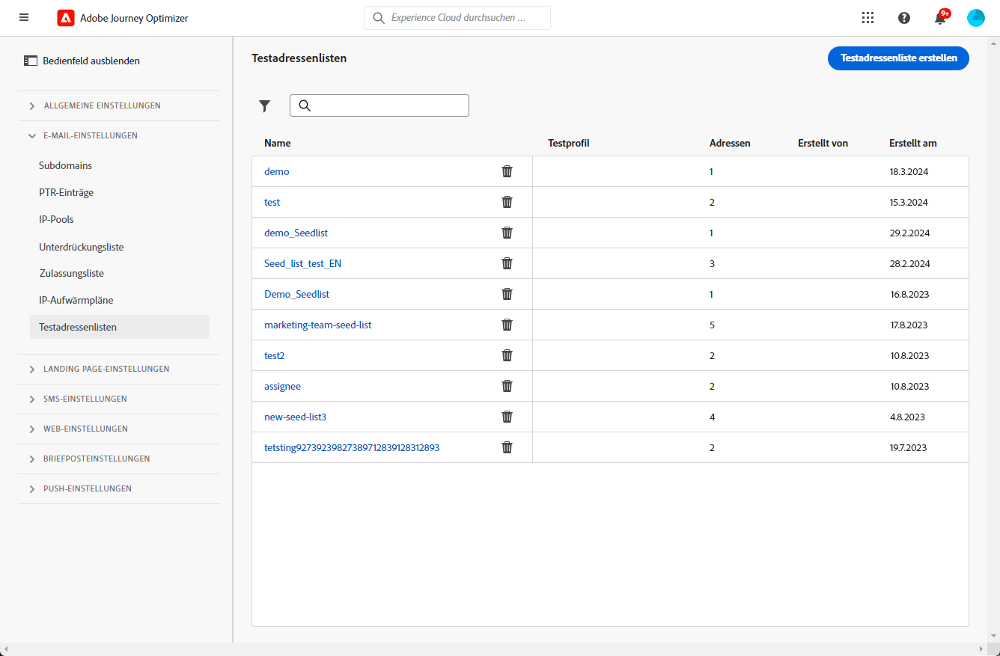
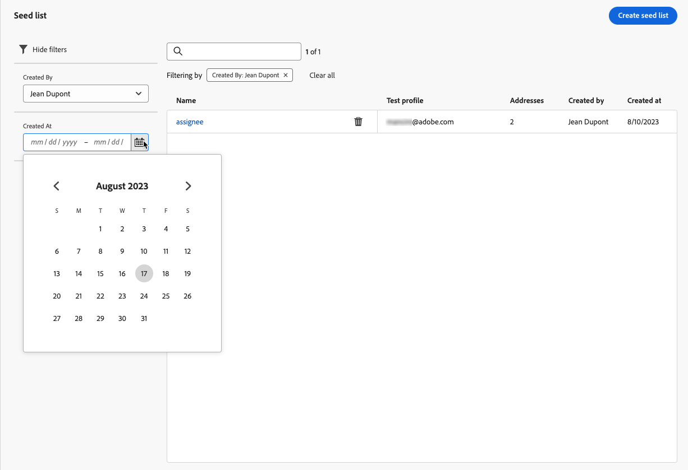
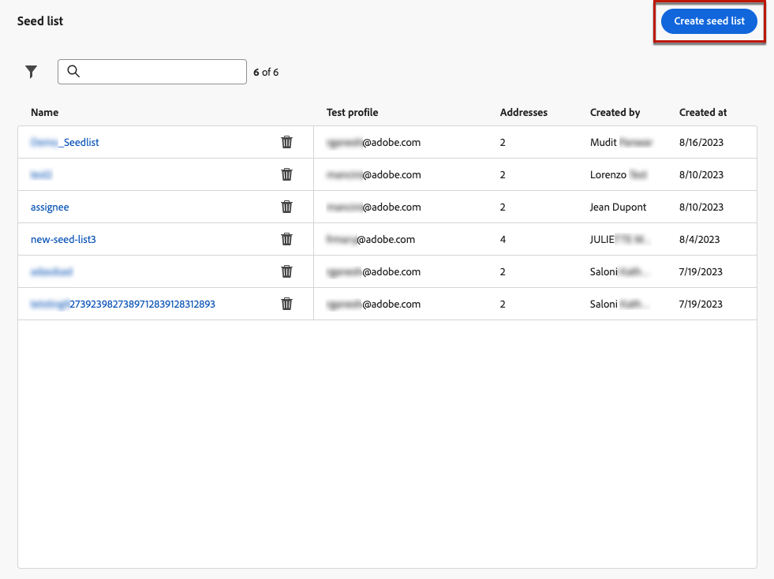
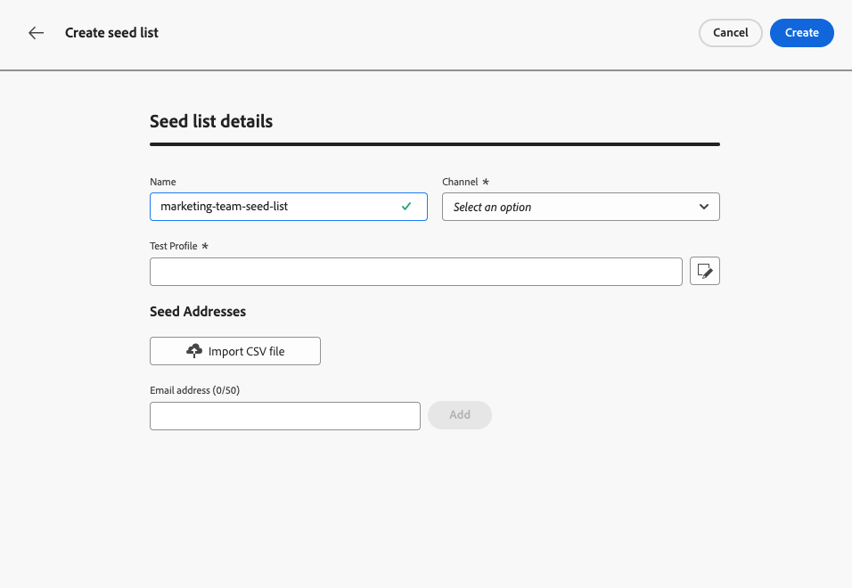
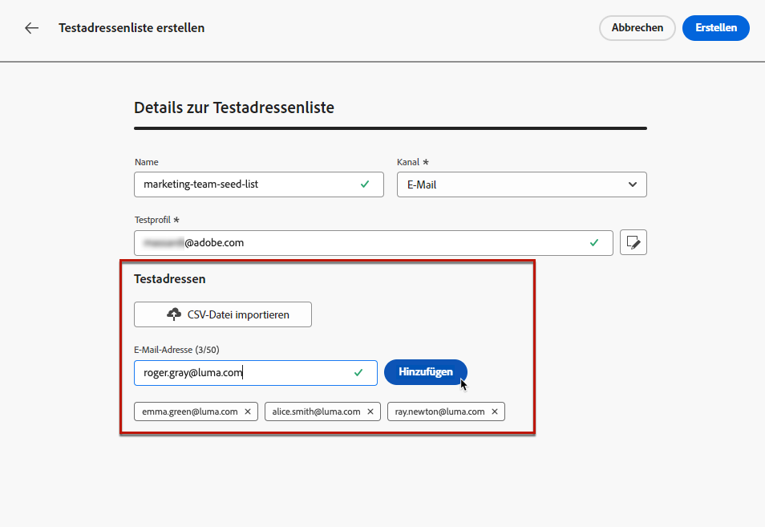
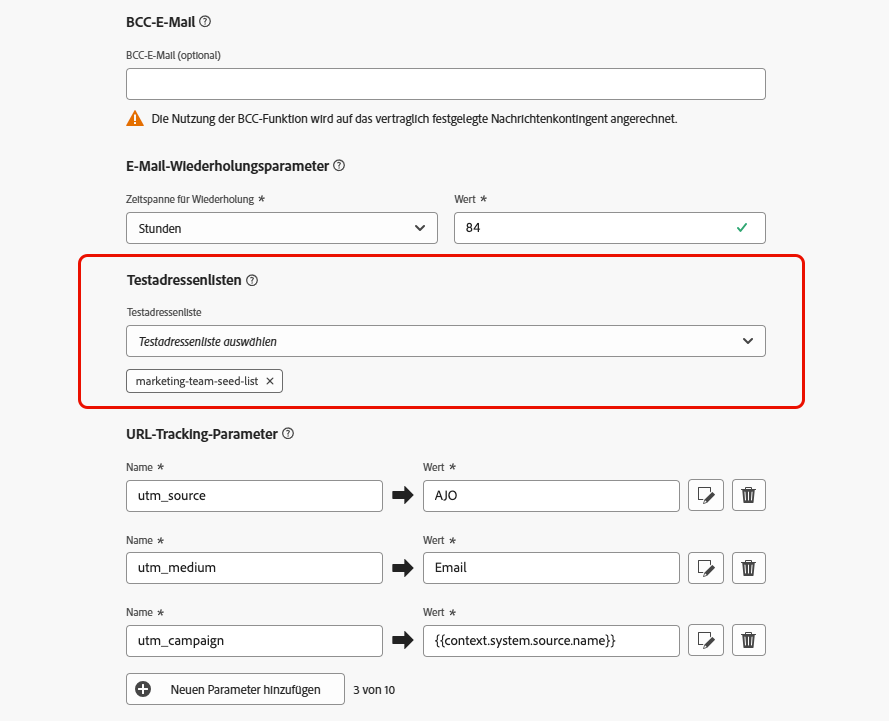
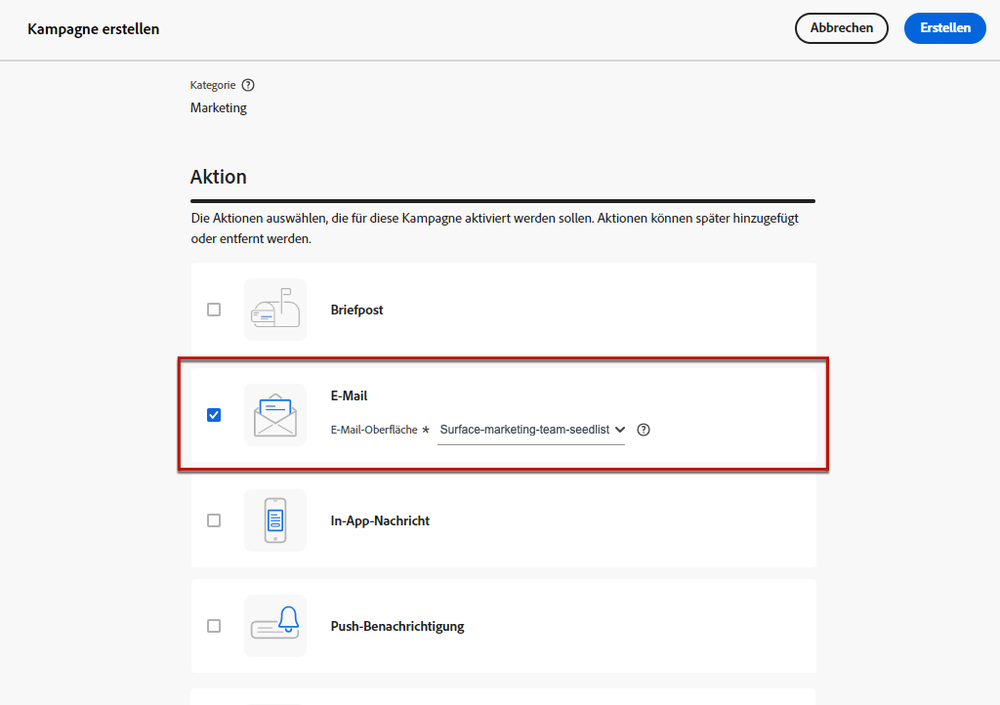

# Testadressenlisten verwenden {#seed-lists}

Mit Testadressenlisten in [!DNL Journey Optimizer] können Sie automatisch bestimmte Testadressen in Ihre Sendungen einbeziehen.

>[!CAUTION]
>
>Diese Funktion gilt derzeit nur für den E-Mail-Kanal.

Testadressen ermöglichen die Auswahl von Empfängern, die nicht den definierten Zielgruppenkriterien entsprechen. Auf diese Weise können Empfänger, die außerhalb des Versandbereichs liegen, den Versand wie jeder andere Zielgruppenempfänger erhalten.

Testadressen sind weder echte Profile noch Testprofile, da sie keine Profildetails enthalten. Sie sind nur Empfänger, die zu internen Stakeholdern gehören, die im System gespeichert sind. Wenn sie in einer bestimmten Kampagne oder Journey ausgewählt werden, werden sie zur Ausführungszeit des Versands eingeschlossen, d. h. sie erhalten zu Zuverlässigkeitszwecken eine Kopie des Versands.

* Testadressen ermöglichen es Ihnen, die gesendeten E-Mail-Kopien zu überwachen, um sicherzustellen, dass alle Anzeigeformate, Bilder und Links korrekt sind, und den Überblick über die tatsächlich an Ihre Empfänger gesendeten Nachrichten zu behalten, indem sie zum gleichen Zeitpunkt und zu denselben Bedingungen wie Ihre Kunden versendet werden.

  Beispiel:

  +++ Wenn Sie Marketing-Manager sind:

  Sie möchten, dass alle Ihre Team-Mitglieder Kopien der gesendeten Nachrichten gleichzeitig mit Ihren Kunden erhalten. Auf diese Weise kann Ihr Team sicherstellen, dass Nachrichten mit dem erwarteten Layout, aktiven URLs, korrektem Text und Bildern gesendet werden - und das alles wie geplant vor der Ausführung.

  +++

  +++ Wenn Sie Produkteigentümer sind:

  Sie müssen den Überblick über die tatsächlichen Nachrichten behalten, die an Kunden gesendet werden. Ihr Team und Ihre Führungskräfte sind möglicherweise an einigen Kampagnen interessiert und müssen auf Ad-hoc-Basis hinzugefügt werden, um Kopien der Nachricht zum Zeitpunkt des Versands zu erhalten.

  +++

* Ein weiterer Grund für die Verwendung von Testadressenlisten ist der Schutz Ihrer Mailinglisten. Wenn Sie Testadressen in Ihre Mailing-Liste einfügen, können Sie feststellen, ob sie von einem Drittanbieter verwendet wird, da die darin enthaltenen Testadressen die Sendungen erhalten, die an Ihre Mailing-Liste gesendet werden.

>[!NOTE]
>
>Es werden Varianten unterstützt, einschließlich mehrsprachiger und experimenteller Varianten. Jede Testadresse erhält eine einzige Kopie jeder Variante derselben Nachricht, z. B. verschiedene Versionen aus einem [Inhaltsexperiment](../content-management/get-started-experiment.md). Beachten Sie, dass für bedingte Inhalte keine separaten Seed-E-Mails gesendet werden.

## Zugriff auf die Testadressenlisten {#access-seed-lists}

Um auf die bereits erstellten Testadressenlisten zuzugreifen, gehen Sie zu **[!UICONTROL Administration]** > **[!UICONTROL Kanäle]** > **[!UICONTROL E-Mail-]** und wählen Sie **[!UICONTROL Testadressenliste]**.

<!--
>[!CAUTION]
>
>Permissions to view, export and manage the seed lists are restricted to [Journey Administrators](../administration/ootb-product-profiles.md#journey-administrator). Learn more about managing [!DNL Journey Optimizer] users' access rights in [this section](../administration/permissions-overview.md).
-->

>[!CAUTION]
>
>Um Testadressenlisten anzeigen, bearbeiten und verwalten zu können, benötigen Sie die Berechtigung **[!UICONTROL Liste verwalten]**.

Sie können Seed-Listen nach Namen durchsuchen und/oder nach dem Benutzer filtern, der die Liste erstellt hat, oder nach dem Erstellungsdatum. Nach der Auswahl können Sie den oben in der Liste angezeigten Filter löschen.

Mit der Schaltfläche **[!UICONTROL Löschen]** können Sie einen Eintrag dauerhaft entfernen.

>[!CAUTION]
>
>Es ist nicht möglich, eine Seed-Liste zu löschen, die in einer aktiven [Kampagne) ](../campaigns/review-activate-campaign.md) [Journey](../building-journeys/publish-journey.md) verwendet wird. Sie müssen die Kampagne/Journey deaktivieren oder sie so bearbeiten, dass sie eine andere Konfiguration verwendet, bei der die Testadressenliste nicht ausgewählt ist. [Weitere Informationen zur Verwendung einer Liste von Testadressen](#use-seed-list)

Sie können auf den Namen einer Testadressenliste klicken, um sie zu bearbeiten. <!--Use the **[!UICONTROL Edit]** button to edit a seed list.-->

## Erstellen einer Liste von Testadressen {#create-seed-list}

>[!CONTEXTUALHELP]
>id="ajo_seed_list_details"
>title="Definieren einer Liste von Testadressen"
>abstract="Verwenden Sie zur Bestätigung eine Testadressenliste, um Ihrer Versand-Audience automatisch bestimmte interne Adressen hinzuzufügen. Mit Testadressenlisten können Sie die gesendeten Nachrichtenkopien überwachen, um sicherzustellen, dass alle Anzeigeelemente korrekt sind, und um Ihre Mailingliste zu schützen. Diese Funktion gilt derzeit nur für den E-Mail-Kanal."
>additional-url="https://experienceleague.adobe.com/docs/journey-optimizer/using/configuration/seed-lists.html#use-seed-list" text="Was sind Testadressenlisten?"

>[!CONTEXTUALHELP]
>id="ajo_seed_addresses"
>title="Testadressenliste ausfüllen"
>abstract="Wählen Sie die Adressen aus, die zum Zeitpunkt der Versandausführung enthalten sein sollen, und erhalten Sie eine exakte Kopie Ihrer Nachricht. Sie können entweder eine CSV-Datei importieren oder E-Mail-Adressen manuell eingeben."

Gehen Sie wie folgt vor, um eine Liste von Testadressen zu erstellen.

1. Rufen Sie das Menü **[!UICONTROL Administration]** > **[!UICONTROL Kanäle]** > **[!UICONTROL E-Mail-Einstellungen]** > **[!UICONTROL Testadressenliste]** auf.

1. Klicken Sie auf **[!UICONTROL Schaltfläche Testadressenliste]**.

   <!---->

1. Füllen Sie die Details aus. Fügen Sie zunächst einen Namen hinzu.

   

   >[!NOTE]
   >
   >Namen müssen mit einem Buchstaben (A-Z) beginnen und dürfen nur alphanumerische Zeichen oder Sonderzeichen ( _, ., -) enthalten.

1. Kanal auswählen. Derzeit ist nur der E-Mail-Kanal verfügbar.

1. Testprofil auswählen. Da Testadressen keine Profildetails enthalten, wird dieses Testprofil nur verwendet, um die Personalisierungsdaten in der Nachricht anzuzeigen, die an die Testadressen gesendet wird.

   >[!NOTE]
   >
   >Es kann jeweils nur ein Testprofil ausgewählt werden.

1. Fügen Sie die Testadressen hinzu, an die Sie Ihre Sendungen senden möchten. Sie können entweder eine CSV-Datei importieren oder E-Mail-Adressen manuell eingeben.

   

   >[!NOTE]
   >
   >Sie können beide Optionen kombinieren, aber die Gesamtzahl der Adressen in einer Testadressenliste darf 300 nicht überschreiten.

1. Klicken Sie **[!UICONTROL Erstellen]** zur Bestätigung. Die neu erstellte Seed-Liste wird im Bildschirm [Seed-Liste“ ](#access-seed-lists).

## Verwenden einer Testadressenliste in einer Kampagne oder auf einer Journey {#use-seed-list}

Nachdem Sie Ihre Testadressenliste erstellt haben, können Sie sie in jeder Kampagne oder auf jeder Journey verwenden, um die entsprechenden Testadressen in Ihre Sendungen aufzunehmen. Gehen Sie dazu wie folgt vor.

>[!CAUTION]
>
>Nachrichten, die an Testadressen gesendet werden, sind nicht in Journey- oder Kampagnenberichten enthalten.

1. Erstellen Sie eine Konfiguration und wählen Sie den Kanal **[!UICONTROL E-Mail]** aus. [Weitere Informationen](../email/email-settings.md)

1. Wählen Sie im [ Abschnitt die Testadressenliste Ihrer Wahl ](../email/email-settings.md#seed-list).

   >[!NOTE]
   >
   >Es kann jeweils nur eine Testadressenliste ausgewählt werden.

   

1. Übermitteln Sie die Konfiguration.

1. Erstellen Sie [Kampagne](../campaigns/create-campaign.md) oder eine [Journey](../building-journeys/journey-gs.md).

1. Wählen Sie die Aktion **[!UICONTROL E]** und wählen Sie [Konfiguration](channel-surfaces.md) einschließlich der für Sie relevanten Testadressenliste aus.

   

1. Aktivieren Sie Ihre [Kampagne](../campaigns/review-activate-campaign.md) oder veröffentlichen Sie Ihre [Journey](../building-journeys/publish-journey.md).

Jedes Mal, wenn eine E-Mail-Nachricht über diese Kampagne oder diesen Journey an Ihre Kunden gesendet wird, erhalten die E-Mail-Adressen auf der ausgewählten Testadressenliste die Nachricht ebenfalls unter denselben Bedingungen, zur gleichen Zeit und mit demselben Inhalt wie die Zielgruppenempfängerinnen und -empfänger.

>[!NOTE]
>
>[Testmodus](../building-journeys/testing-the-journey.md) Journey senden keine E-Mails an die Testadressenliste. Um Ihren E-Mail-Inhalt zu überprüfen, verwenden Sie die Funktion [Vorschau und Test](../content-management/preview-test.md), bevor Sie Ihre Nachricht senden.
>
>Bei wiederkehrenden Journey wird der E-Mail-Versand bei jeder Journey-Ausführung an die Testadressen gesendet, sofern mindestens ein Profil den E-Mail-Knoten erreicht.
