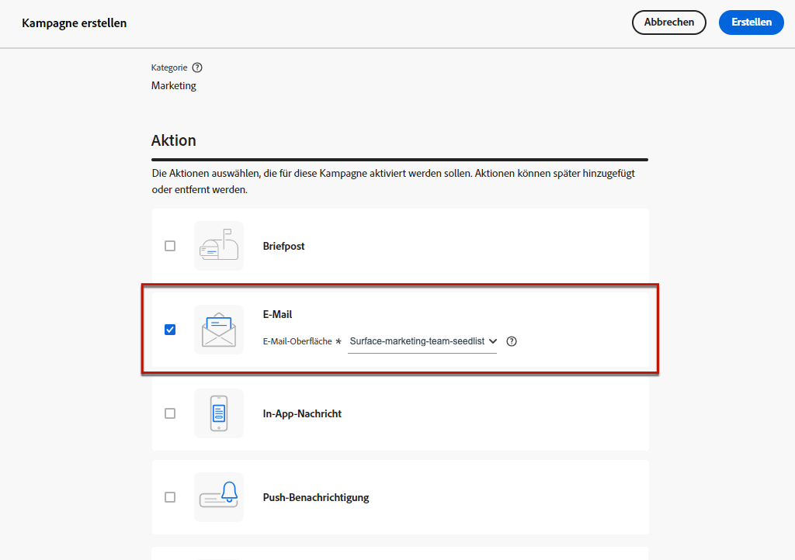

# Verwenden von Testadressenlisten {#seed-lists}

Testadressenlisten in [!DNL Journey Optimizer] ermöglichen es Ihnen, automatisch bestimmte Testadressen in Ihre Sendungen einzubeziehen.

>[!CAUTION]
>
>Diese Funktion ist derzeit nur für den E-Mail-Kanal verfügbar.
>
>Varianten werden derzeit nicht unterstützt. Wie jedes Profil aus der Zielgruppe erhalten die Testadressen eine Kopie jeder Nachricht, jedoch nicht alle Varianten derselben Nachricht (z. B. die unterschiedlichen Behandlungen einer [Inhaltsexperiment](../campaigns/get-started-experiment.md)).

Testadressen ermöglichen den Versand an Empfängerinnen und Empfänger, die nicht den definierten Zielgruppenkriterien entsprechen. Auf diese Weise können Empfängerinnen und Empfänger, die außerhalb des Versandumfangs liegen, die Nachricht so erhalten, wie es jede andere Person innerhalb der Zielgruppe würde.

Testadressen sind weder echte Profile noch Testprofile, da sie keine Profildetails enthalten. Es handelt sich lediglich um Empfängerinnen und Empfänger, die zu internen, im System gespeicherten Stakeholdern gehören. Wenn sie in einer bestimmten Kampagne oder Journey ausgewählt werden, werden sie zum Ausführungszeitpunkt des Versands einbezogen, d. h. sie erhalten für Sicherheitszwecke eine Kopie des Versands.

* Durch den Empfang von Sendungen zur gleichen Zeit und unter den gleichen Bedingungen wie Ihre Kundinnen und Kunden können Sie mit Testadressenlisten die gesendeten E-Mail-Kopien überwachen, um sicherzustellen, dass alle Anzeigeformate, Bilder und Links korrekt sind, und gleichzeitig die tatsächlichen Nachrichten verfolgen, die an Ihre Empfängerinnen und Empfänger gesendet werden.

  Beispiel:

+++ Wenn Sie Marketing-Fachkraft sind:

  Sie möchten, dass alle Team-Mitglieder Kopien der gesendeten Nachrichten zur gleichen Zeit wie Ihre Kundinnen und Kunden erhalten. Auf diese Weise kann Ihr Team sicherstellen, dass Nachrichten mit dem erwarteten Layout, aktiven URLs, korrektem Text und Bildern gesendet werden – genau wie es vor der Ausführung geplant war.

+++

+++ Wenn Sie für ein Produkt verantwortlich sind:

  Sie müssen die tatsächlichen Nachrichten verfolgen, die an Kundinnen und Kunden gesendet werden. Ihr Team und Ihre Führungskräfte könnten sich für einige Kampagnen interessieren und müssen auf Ad-hoc-Basis hinzugefügt werden, damit sie zum Zeitpunkt des Versands Kopien von Nachrichten erhalten können.

+++

* Ein weiterer Grund für die Verwendung von Testadressenlisten ist der Schutz Ihrer Mailing-Liste. Wenn Sie Testadressen in Ihre Mailing-Liste einfügen, können Sie feststellen, ob letztere von einem Drittanbieter verwendet wird. Die Testadressen, die darin enthalten sind, erhalten nämlich die Sendungen, die an Ihre Mailing-Liste gesendet werden.

## Zugreifen auf Testadressenlisten {#access-seed-lists}

Um auf die bereits erstellten Testadressenlisten zuzugreifen, gehen Sie zu **[!UICONTROL Administration]** > **[!UICONTROL Kanäle]** > **[!UICONTROL E-Mail-Konfiguration]** und wählen Sie **[!UICONTROL Testadressenliste]** aus.

<!--
>[!CAUTION]
>
>Permissions to view, export and manage the seed lists are restricted to [Journey Administrators](../administration/ootb-product-profiles.md#journey-administrator). Learn more on managing [!DNL Journey Optimizer] users' access rights in [this section](../administration/permissions-overview.md).-->

>[!CAUTION]
>
>Um Seed-Listen anzeigen, bearbeiten und verwalten zu können, muss die **[!UICONTROL Auswahlliste verwalten]** -Berechtigung.

Sie können Testadressenlisten nach Namen durchsuchen und/oder nach der Person, die die Liste erstellt hat, oder dem Erstellungsdatum filtern. Nach der Auswahl können Sie den oben in der Liste angezeigten Filter löschen.

Verwenden Sie die Schaltfläche **[!UICONTROL Löschen]**, um einen Eintrag dauerhaft zu entfernen.

>[!CAUTION]
>
>Es ist nicht möglich, eine Testadressenliste zu löschen, die in einer aktiven [Kampagne](../campaigns/review-activate-campaign.md) oder [Journey](../building-journeys/publishing-the-journey.md) verwendet wird. Sie müssen die Kampagne/Journey erst deaktivieren oder sie bearbeiten, um eine andere Oberfläche zu verwenden, für die die Testadressenliste nicht ausgewählt wurde. [Mehr erfahren über die Verwendung einer Testadressenliste](#use-seed-list)

Sie können auf den Namen einer Testadressenliste klicken, um sie zu bearbeiten. <!--Use the **[!UICONTROL Edit]** button to edit a seed list.-->

## Erstellen einer Testadressenliste {#create-seed-list}

>[!CONTEXTUALHELP]
>id="ajo_seed_list_details"
>title="Definieren einer Testadressenliste"
>abstract="Verwenden Sie eine Testadressenliste, um für Sicherheitszwecke automatisch bestimmte interne Adressen zu Ihrer Versandzielgruppe hinzuzufügen. Mit Testadressenlisten können Sie die gesendeten Nachrichtenkopien überwachen, um sicherzustellen, dass alle Anzeigeelemente korrekt sind, und Ihre Mailing-Liste zu schützen. Diese Funktion ist derzeit nur für den E-Mail-Kanal verfügbar."
>additional-url="https://experienceleague.adobe.com/docs/journey-optimizer/using/configuration/seed-lists.html?lang=de#use-seed-list" text="Was sind Testadressenlisten?"

>[!CONTEXTUALHELP]
>id="ajo_seed_addresses"
>title="Ausfüllen der Testadressenliste"
>abstract="Wählen Sie die Adressen aus, die zum Zeitpunkt der Versandausführung enthalten sein sollen und eine exakte Kopie Ihrer Nachricht erhalten sollen. Sie können entweder eine CSV-Datei importieren oder manuell E-Mail-Adressen eingeben."

Gehen Sie wie folgt vor, um eine Testadressenliste zu erstellen.

1. Öffnen Sie das Menü **[!UICONTROL Administration]** > **[!UICONTROL Kanäle]** > **[!UICONTROL E-Mail-Konfiguration]** > **[!UICONTROL Testadressenliste]**.

1. Wählen Sie die Schaltfläche **[!UICONTROL Testadressenliste erstellen]** aus.

   

1. Füllen Sie die Details aus. Fügen Sie zunächst einen Namen hinzu.

   

   >[!NOTE]
   >
   >Der Name muss mit einem Buchstaben (A–Z) beginnen und darf nur alphanumerische Zeichen oder Sonderzeichen ( _, ., - ) enthalten.

1. Wählen Sie den Kanal aus. Derzeit ist nur der E-Mail-Kanal verfügbar.

1. Wählen Sie ein Testprofil aus. Da Testadressen keine Profildetails enthalten, werden mit diesem Testprofil nur die Personalisierungsdaten in der Nachricht angezeigt, die an die Testadressen gesendet wird.

   >[!NOTE]
   >
   >Es kann jeweils nur ein Testprofil ausgewählt werden.

1. Fügen Sie die Testadressen hinzu, an die Sie Ihre Sendungen senden möchten. Sie können entweder eine CSV-Datei importieren oder manuell E-Mail-Adressen eingeben.

   

   >[!NOTE]
   >
   >Sie können beide Optionen kombinieren, die Gesamtzahl der Adressen in einer Testadressenliste darf jedoch 50 nicht überschreiten.

1. Klicken Sie auf **[!UICONTROL Erstellen]**, um zu bestätigen. Die neu erstellte Testadressenliste wird im [Testadressenlisten-Bildschirm](#access-seed-lists) angezeigt.

## Verwenden von Testadressen in Kampagnen oder Journeys {#use-seed-list}

Nachdem Sie Ihre Testadressenliste erstellt haben, können Sie sie in jeder Kampagne oder Journey verwenden, um die entsprechenden Testadressen in Ihre Sendungen aufzunehmen. Gehen Sie dazu wie folgt vor.

>[!CAUTION]
>
>Nachrichten, die an Testadressen gesendet werden, sind nicht in Berichten enthalten.

1. Erstellen Sie eine Oberfläche und wählen Sie dann den Kanal **[!UICONTROL E-Mail]** aus. [Weitere Informationen](../email/email-settings.md)

1. Wählen Sie die Testadressenliste Ihrer Wahl im [entsprechenden Abschnitt](../email/email-settings.md#seed-list).

   >[!NOTE]
   >
   >Es kann jeweils nur eine Testadressenliste ausgewählt werden.

   

1. Senden Sie die Oberfläche ab.

1. Erstellen Sie eine [Kampagne](../campaigns/create-campaign.md) oder [Journey](../building-journeys/journey-gs.md).

1. Wählen Sie die Aktion **[!UICONTROL E-Mail]** und dann die [Oberfläche](channel-surfaces.md) aus, einschließlich der für Sie relevanten Testadressenliste.

   

1. Aktivieren Sie Ihre [Kampagne](../campaigns/review-activate-campaign.md) oder veröffentlichen Sie Ihre [Journey](../building-journeys/publishing-the-journey.md).

Jedes Mal, wenn eine E-Mail-Nachricht im Rahmen dieser Kampagne oder Journey an Ihre Kundinnen und Kunden gesendet wird, erhalten die E-Mail-Adressen auf der ausgewählten Testadressenliste diese unter den gleichen Bedingungen, zur gleichen Zeit und mit demselben Inhalt wie die angesprochenen Empfängerinnen und Empfänger.

>[!NOTE]
>
>Bei Journeys wird der E-Mail-Versand an die Testadressen nur bei der ersten Ausführung der Journey durchgeführt.

