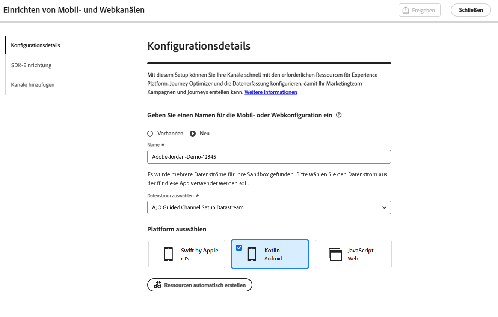
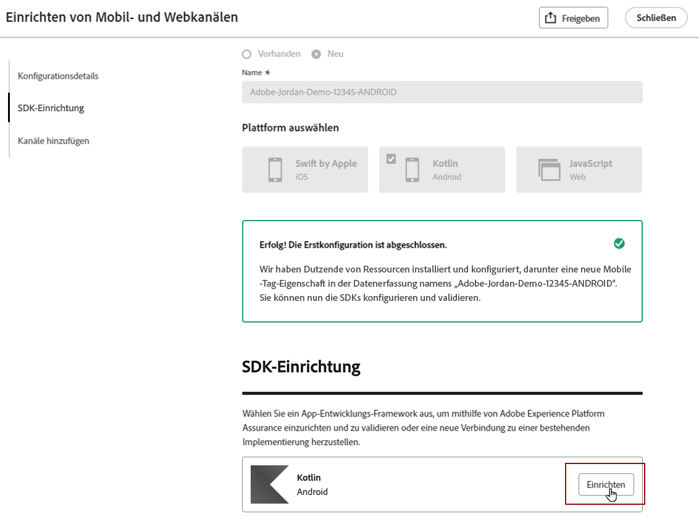
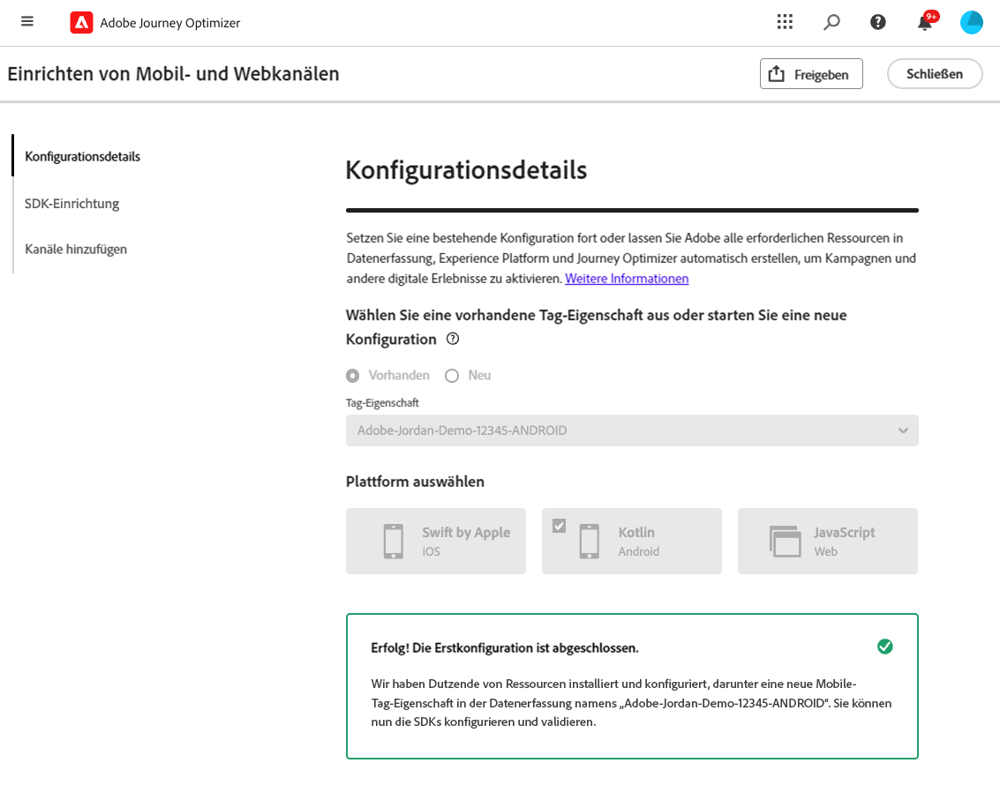

# Einrichten der mobilen Android-Konfiguration {#set-mobile-android}

>[!IMPORTANT]
>
>Um Kompatibilität und optimale Leistung zu gewährleisten, stellen Sie sicher, dass Sie die folgenden SDK-Versionen verwenden:
>
> * Core 3.1.0 oder höher
> * Messaging 3.1.0 oder höher

Durch dieses Android-Setup wird die schnelle Konfiguration von Marketing-Kanälen optimiert, sodass alle erforderlichen Ressourcen in den Experience Platform-, Journey Optimizer- und Datenerfassungs-Apps leicht zugänglich sind. Dadurch kann Ihr Marketing-Team sofort mit der Erstellung von Kampagnen und Journey beginnen.

## Erstellen eines neuen Android-Setups {#new-setup-android}

>[!CONTEXTUALHELP]
>id="ajo_mobile_web_setup_android_initialization_code"
>title="Hinzufügen von Initialisierungs-Code"
>abstract="TBC"

>[!CONTEXTUALHELP]
>id="ajo_mobile_web_setup_android_dependencies_add"
>title="Hinzufügen von Abhängigkeiten"
>abstract="Sie müssen die folgenden Bibliotheken zu Ihrem Projekt hinzufügen, indem Sie die Gradle-Datei der App verwenden: Core, Assurance, Edge, Edge Identity und Messaging."

>[!CONTEXTUALHELP]
>id="ajo_mobile_web_setup_android_dependencies_import"
>title="Importieren von Abhängigkeiten"
>abstract="Importieren Sie in der Anwendungsklasse Ihrer App die folgenden Pakete: Mobile Core, Assurance, Edge, Edge Identity und Messaging."
>additional-url="https://experienceleague.adobe.com/en/docs/platform-learn/implement-mobile-sdk/app-implementation/install-sdks#import-extensions" text="Siehe Datenerfassungsdokumentation"

<!--
>[!CONTEXTUALHELP]
>id="ajo_mobile_web_setup_push_token_android"
>title="Retrieve the device token"
>abstract="TBC"

>[!CONTEXTUALHELP]
>id="ajo_mobile_web_setup_push_android_studio"
>title="Launch the application from Android Studio"
>abstract="TBC"
-->

1. Klicken Sie auf der Journey Optimizer-Homepage auf **[!UICONTROL Starten]** auf der Karte **[!UICONTROL Mobil- und Webkanäle einrichten]** .

   

1. Erstellen Sie eine **[!UICONTROL Neue]** -Konfiguration.

   Wenn Sie bereits über vorhandene Konfigurationen verfügen, können Sie eine auswählen oder eine neue Konfiguration erstellen.

   

1. Geben Sie einen **[!UICONTROL Namen]** für Ihre neue Konfiguration ein und wählen Sie Ihren **[!UICONTROL Datastraam]** aus oder erstellen Sie ihn. Dieser **[!UICONTROL Name]** wird für jede automatisch erstellte Ressource verwendet.

1. Wenn Ihr Unternehmen über mehrere Datenspeicher verfügt, wählen Sie bitte einen aus den vorhandenen Optionen aus. Wenn Sie keinen Datastream haben, wird einer automatisch erstellt.

1. Wählen Sie die Android-Plattform aus, die Sie einrichten möchten, und klicken Sie auf **[!UICONTROL Ressourcen automatisch erstellen]**.

   

1. Um den Einrichtungsprozess zu optimieren, werden die erforderlichen Ressourcen automatisch erstellt, um Ihnen die ersten Schritte zu erleichtern. Dazu gehören die Erstellung einer neuen **[!UICONTROL Mobile Tag-Eigenschaft]** und die Installation von Erweiterungen.

   Nachfolgend finden Sie eine umfassende Liste aller automatisch generierten Ressourcen:

+++ Erstellte Ressourcen

   <table>
    <thead>
    <tr>
    <th><strong>Lösung</strong></th>
    <th><strong>Automatisch erstellte Ressourcen</strong></th>
    </tr>
    </thead>
    <tbody>
    <tr>
    <td>
    
Journey Optimizer

    </td>
    <td>
    <ul>
    <li>Kanalkonfiguration</li>
    <li>Push-Anmeldedaten (nur Push-Nachrichten für Mobilgeräte)</li>
    </ul>
    </td>
    </tr>
    <tr>
    <td>
    
Tags

    </td>
    <td>
    <ul>
    <li>Mobile Tag-Eigenschaft</li>
    <li>Regeln</li>
    <li>Datenelemente</li>
    <li>Bibliothek</li>
    <li>Umgebungen (Staging, Produktion, Entwicklung)</li>
    </ul>
    </td>
    </tr>
    <tr>
    <td>
    
Tag-Erweiterungen

    </td>
    <td>
    <ul>
    <li>Adobe Experience Platform Edge Network</li>
    <li>Adobe Journey Optimizer</li>
    <li>AEP-Sicherheit</li>
    <li>Einverständnis (mit aktivierten standardmäßigen Zustimmungsrichtlinien)</li>
    <li>Identität (mit Standard-ECID, mit standardmäßigen Stitching-Regeln)</li>
    <li>Core für Mobilgeräte</li>
    </ul>
    </td>
    </tr>
    <tr>
    <td>
    
Assurance

    </td>
    <td>
    
Assurance-Sitzung

    </td>
    </tr>
    <tr>
    <td>
    
Datenströme

    </td>
    <td>
    
Datenspeicher mit Diensten

    </td>
    </tr>
    <tr>
    <td>
    
Experience Platform

    </td>
    <td>
    <ul>
    <li>Datensatz</li>
    <li>Schema</li>
    </ul>
    </td>
    </tr>
    </tbody>
    </table>

+++

1. Klicken Sie nach der Generierung der Ressourcen auf **[!UICONTROL Einrichten]** , um mit der Konfiguration Ihres SDK zu beginnen.

   

1. Zunächst müssen Sie Abhängigkeiten hinzufügen und importieren, wie in der Benutzeroberfläche beschrieben. [Weitere Informationen](https://experienceleague.adobe.com/en/docs/platform-learn/implement-mobile-sdk/app-implementation/install-sdks).

1. Kopieren Sie den folgenden Code in die onCreate() -Methode der Anwendung.

1. Um Ihr SDK direkt in Ihrer Mobile App zu validieren, öffnen Sie einfach Ihre Mobile App und gewähren Sie den Zugriff auf [Adobe Assurance](https://experienceleague.adobe.com/en/docs/experience-platform/assurance/home). Assurance ist ein leistungsstarkes Tool, mit dem Sie Ihre Implementierung gründlich testen und validieren können, um sicherzustellen, dass alles ordnungsgemäß funktioniert.

   Sobald die Verbindung hergestellt ist, wird Ihr Gerät automatisch erkannt und im Dropdown-Menü **[!UICONTROL Verfügbares Gerät]** aufgeführt, sodass Sie Ihre Einrichtung nahtlos überwachen und Fehler beheben können.

   

1. Klicken Sie auf **[!UICONTROL Verbinden]**.

1. Sie können jetzt die Kanäle [In-App](#inapp-channel) und/oder [Push](#push-channel) konfigurieren.

1. Geben Sie nach Abschluss der Konfiguration die automatisch generierte **[!UICONTROL Kanalkonfiguration]** für die Teammitglieder frei, die für die Erstellung von Journey und Kampagnen verantwortlich sind.

   Auf die **[!UICONTROL Kanalkonfiguration]** sollte in der Kampagnen- oder Journey-Benutzeroberfläche verwiesen werden, sodass eine nahtlose Verbindung zwischen Ihrer Einrichtung und der Ausführung von zielgerichteten Journey und Kampagnen für Ihre Audience hergestellt werden kann.

   

## Vorhandene Konfiguration ändern {#reconnect}

Nachdem Sie Ihre Konfiguration erstellt haben, können Sie sie jederzeit einfach erneut aufrufen, um zusätzliche Kanäle hinzuzufügen oder weitere Anpassungen an Ihre Anforderungen vorzunehmen

1. Klicken Sie auf der Journey Optimizer-Homepage auf **[!UICONTROL Starten]** auf der Karte **[!UICONTROL Mobil- und Webkanäle einrichten]** .

   

1. Wählen Sie **[!UICONTROL Vorhandenes]** und wählen Sie Ihre vorhandene **[!UICONTROL Tag-Eigenschaft]** aus der Dropdown-Liste aus.

   

1. Beim Zugriff auf Ihre bestehende Konfiguration müssen Sie eine erneute Verbindung mit Adobe Assurance herstellen. Klicken Sie im SDK-Setup-Menü auf **[!UICONTROL Neu verbinden]**.

1. Wählen Sie Ihr Gerät aus der Dropdownliste **[!UICONTROL Verfügbare Geräte]** aus und klicken Sie auf **[!UICONTROL Verbinden]**.

1. Jetzt können Sie Ihre Konfiguration nach Bedarf aktualisieren.

## In-App-Kanal einrichten {#inapp-channel}

>[!CONTEXTUALHELP]
>id="ajo_mobile_web_setup_inapp_tag_property"
>title="Auswählen einer Tag-Eigenschaft"
>abstract="TBC"

Für den In-App-Kanal ist keine zusätzliche Einrichtung erforderlich. Um sicherzustellen, dass Ihre Konfiguration korrekt ist, können Sie mühelos mit der Funktion &quot;Assurance&quot;eine Testnachricht senden. Dadurch erhalten Sie sofort Feedback zur Bereitschaft des Systems, In-App-Nachrichten effektiv zu übermitteln.

Klicken Sie dazu einfach auf **[!UICONTROL In-App-Nachricht anzeigen]**.

Um den Einrichtungsprozess zu optimieren, werden die erforderlichen Ressourcen automatisch erstellt, um Ihnen die ersten Schritte zu erleichtern. Dazu gehört die Erstellung einer Kanalkonfiguration.

Sie können jetzt In-App-Nachrichten mit der zuvor konfigurierten **[!UICONTROL Kanalkonfiguration]** senden. [Erfahren Sie, wie Sie In-App-Nachrichten erstellen](../in-app/create-in-app.md)

## Push-Kanal einrichten {#push-channel}

>[!CONTEXTUALHELP]
>id="ajo_mobile_web_setup_push_token"
>title="Abrufen des Geräte-Tokens"
>abstract="Um sicherzustellen, dass das Push-Token des Geräts ordnungsgemäß mit Ihrem Adobe Experience Platform-Profil synchronisiert wird, müssen Sie den folgenden Code in Ihre Anwendung integrieren. Diese Integration ist für die Aufrechterhaltung aktueller Kommunikationskapazitäten und die Sicherstellung eines nahtlosen Benutzererlebnisses unerlässlich."

>[!CONTEXTUALHELP]
>id="ajo_mobile_web_setup_push_xcode"
>title="Starten der Anwendung aus Xcode"
>abstract="TBC"

>[!CONTEXTUALHELP]
>id="ajo_mobile_web_push_certificate_fcm"
>title="Bereitstellen eines Push-Zertifikats"
>abstract="Ziehen Sie die .json-Datei mit dem privaten Schlüssel per Drag-and-Drop in den Arbeitsbereich. Diese Datei enthält Authentifizierungsinformationen, die für die sichere Integration und Kommunikation zwischen Ihrer Anwendung und dem Server erforderlich sind."

1. Nachdem Ihr Mobile SDK konfiguriert wurde, klicken Sie auf der Karte Push-Benachrichtigung auf **[!UICONTROL Hinzufügen]** .

1. Rufen Sie das Geräte-Token ab, indem Sie den bereitgestellten Code in die Callback-Funktion `FireBaseMessaging.getInstance.getToken ()` in die Benutzeroberfläche einfügen.

1. Registrieren Sie den Messaging-Dienst, indem Sie den bereitgestellten Code in der Benutzeroberfläche zu Ihrer `AndroidManifest.xml` -Datei hinzufügen.

1. Ziehen Sie die .json-Datei mit dem privaten Schlüssel per Drag-and-Drop in den Arbeitsbereich.

1. Um sicherzustellen, dass Ihre Konfiguration korrekt ist, können Sie mühelos mit der Funktion &quot;Assurance&quot;eine Testnachricht senden. Dadurch erhalten Sie sofort Rückmeldungen über die Systembereitschaft, Push-Benachrichtigungen effektiv zu versenden.

   Klicken Sie dazu einfach auf **[!UICONTROL Push-Nachricht senden]**.

Um den Einrichtungsprozess zu optimieren, werden die erforderlichen Ressourcen automatisch erstellt, um Ihnen die ersten Schritte zu erleichtern. Dazu gehört die Erstellung einer **[!UICONTROL Kanalkonfiguration]** und einer **[!UICONTROL Push-Berechtigung]**.

Sie können jetzt Push-Benachrichtigungen mit der zuvor konfigurierten **[!UICONTROL Kanalkonfiguration]** senden. [Erfahren Sie, wie Sie Push-Benachrichtigungen erstellen](../push/create-push.md)
