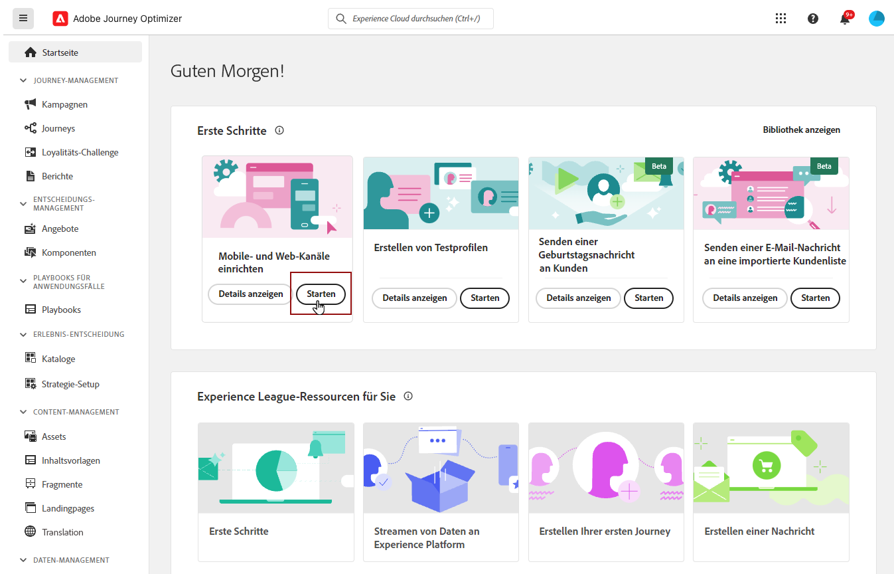

# Einrichten der mobilen iOS-Konfiguration {#set-mobile-ios}

>[!IMPORTANT]
>
>Um Kompatibilität und optimale Leistung zu gewährleisten, stellen Sie sicher, dass Sie die folgenden SDK-Versionen verwenden:
>
> * Core SDK: 5.2.0 oder höher
> * Messaging SDK: 5.1.1 oder höher

Dieses iOS-Setup vereinfacht die schnelle Konfiguration von Marketing-Kanälen, sodass alle wichtigen Ressourcen in den Experience Platform-, Journey Optimizer- und Datenerfassungs-Apps verfügbar sind. Dadurch kann Ihr Marketing-Team schnell mit der Erstellung von Kampagnen und Journey beginnen.

## Erstellen eines neuen iOS-Setups {#new-setup-ios}

1. Klicken Sie auf der Journey Optimizer-Homepage auf **[!UICONTROL Starten]** auf der Karte **[!UICONTROL Mobil- und Webkanäle einrichten]** .

   

1. Erstellen Sie eine **[!UICONTROL Neue]** -Konfiguration.

   Wenn Sie bereits über vorhandene Konfigurationen verfügen, können Sie eine auswählen oder eine neue Konfiguration erstellen.

   

1. Geben Sie einen **[!UICONTROL Namen]** für Ihre neue Konfiguration ein und wählen Sie Ihren **[!UICONTROL Datastraam]** aus oder erstellen Sie ihn. Dieser **[!UICONTROL Name]** wird für jede automatisch erstellte Ressource verwendet.

1. Wenn Ihr Unternehmen über mehrere Datenspeicher verfügt, wählen Sie bitte einen aus den vorhandenen Optionen aus. Wenn Sie keinen Datastream haben, wird einer automatisch erstellt.

1. Wählen Sie die iOS-Plattform aus und klicken Sie auf **[!UICONTROL Ressourcen automatisch erstellen]**.

   

1. Um den Einrichtungsprozess zu optimieren, werden die erforderlichen Ressourcen automatisch erstellt, um Ihnen die ersten Schritte zu erleichtern. Dazu gehören die Erstellung einer neuen **[!UICONTROL Mobile Tag-Eigenschaft]** und die Installation von Erweiterungen.

   Nachfolgend finden Sie eine umfassende Liste aller automatisch generierten Ressourcen:

+++ Erstellte Ressourcen

   <table>
    <thead>
    <tr>
    <th><strong>Lösung</strong></th>
    <th><strong>Automatisch erstellte Ressourcen</strong></th>
    </tr>
    </thead>
    <tbody>
    <tr>
    <td>
    <p>Journey Optimizer</p>
    </td>
    <td>
    <ul>
    <li>Kanalkonfiguration</li>
    <li>Push-Anmeldedaten (nur Push-Nachrichten für Mobilgeräte)</li>
    </ul>
    </td>
    </tr>
    <tr>
    <td>
    <p>Tags</p>
    </td>
    <td>
    <ul>
    <li>Mobile Tag-Eigenschaft</li>
    <li>Regeln</li>
    <li>Datenelemente</li>
    <li>Bibliothek</li>
    <li>Umgebungen (Staging, Produktion, Entwicklung)</li>
    </ul>
    </td>
    </tr>
    <tr>
    <td>
    <p>Tag-Erweiterungen</p>
    </td>
    <td>
    <ul>
    <li>Adobe Experience Platform Edge Network</li>
    <li>Adobe Journey Optimizer</li>
    <li>AEP-Sicherheit</li>
    <li>Einverständnis (mit aktivierten standardmäßigen Zustimmungsrichtlinien)</li>
    <li>Identität (mit Standard-ECID, mit standardmäßigen Stitching-Regeln)</li>
    <li>Core für Mobilgeräte</li>
    </ul>
    </td>
    </tr>
    <tr>
    <td>
    <p>Assurance</p>
    </td>
    <td>
    <p>Assurance-Sitzung</p>
    </td>
    </tr>
    <tr>
    <td>
    <p>Datenströme</p>
    </td>
    <td>
    <p>Datenspeicher mit Diensten</p>
    </td>
    </tr>
    <tr>
    <td>
    <p>Experience Platform</p>
    </td>
    <td>
    <ul>
    <li>Datensatz</li>
    <li>Schema</li>
    </ul>
    </td>
    </tr>
    </tbody>
    </table>

+++

1. Klicken Sie nach der Generierung der Ressourcen auf **[!UICONTROL Einrichten]** , um mit der Konfiguration Ihres SDK zu beginnen.

   

1. Zunächst müssen Sie Abhängigkeiten hinzufügen und importieren, wie in der Benutzeroberfläche beschrieben. [Weitere Informationen](https://experienceleague.adobe.com/en/docs/platform-learn/implement-mobile-sdk/app-implementation/install-sdks).

1. Fügen Sie den Initialisierungscode in die `onCreate()` -Methode Ihrer Anwendung ein. Mit diesem Test-Code können Sie eine Verbindung zu Assurance herstellen und Ihre App-Einrichtung validieren, bevor Sie zur Produktion wechseln.

   {zoomable="yes"}

1. Um Ihr SDK direkt in Ihrer Mobile App zu validieren, öffnen Sie einfach Ihre Mobile App und gewähren Sie den Zugriff auf [Adobe Assurance](https://experienceleague.adobe.com/en/docs/experience-platform/assurance/home). Assurance ist ein leistungsstarkes Tool, mit dem Sie Ihre Implementierung gründlich testen und validieren können, um sicherzustellen, dass alles ordnungsgemäß funktioniert.

   Sobald die Verbindung hergestellt ist, wird Ihr Gerät automatisch erkannt und im Dropdown-Menü **[!UICONTROL Verfügbares Gerät]** aufgeführt, sodass Sie Ihre Einrichtung nahtlos überwachen und Fehler beheben können.

   {zoomable="yes"}

1. Klicken Sie auf **[!UICONTROL Verbinden]**.

   {zoomable="yes"}

1. Sie können jetzt die Kanäle [In-App](#inapp-channel) und/oder [Push](#push-channel) konfigurieren.

1. Geben Sie nach Abschluss der Konfiguration die automatisch generierte **[!UICONTROL Kanalkonfiguration]** für die Teammitglieder frei, die für die Erstellung von Journey und Kampagnen verantwortlich sind.

   Auf die **[!UICONTROL Kanalkonfiguration]** sollte in der Kampagnen- oder Journey-Benutzeroberfläche verwiesen werden, sodass eine nahtlose Verbindung zwischen Ihrer Einrichtung und der Ausführung von zielgerichteten Journey und Kampagnen für Ihre Audience hergestellt werden kann.

   {zoomable="yes"}

## Vorhandene Konfiguration ändern {#reconnect}

Nachdem Sie Ihre Konfiguration erstellt haben, können Sie sie jederzeit einfach erneut aufrufen, um zusätzliche Kanäle hinzuzufügen oder weitere Anpassungen an Ihre Anforderungen vorzunehmen

1. Klicken Sie auf der Journey Optimizer-Homepage auf **[!UICONTROL Starten]** auf der Karte **[!UICONTROL Mobil- und Webkanäle einrichten]** .

   

1. Wählen Sie **[!UICONTROL Vorhandenes]** und wählen Sie Ihre vorhandene **[!UICONTROL Tag-Eigenschaft]** aus der Dropdown-Liste aus.

   

1. Beim Zugriff auf Ihre bestehende Konfiguration müssen Sie eine erneute Verbindung mit Adobe Assurance herstellen. Klicken Sie im SDK-Setup-Menü auf **[!UICONTROL Neu verbinden]**.

   

1. Wählen Sie Ihr Gerät aus der Dropdownliste **[!UICONTROL Verfügbare Geräte]** aus und klicken Sie auf **[!UICONTROL Verbinden]**.

   {zoomable="yes"}

1. Jetzt können Sie Ihre Konfiguration nach Bedarf aktualisieren.

## In-App-Kanal einrichten {#inapp-channel}

Für den In-App-Kanal ist keine zusätzliche Einrichtung erforderlich. Um sicherzustellen, dass Ihre Konfiguration korrekt ist, können Sie mühelos mit der Funktion &quot;Assurance&quot;eine Testnachricht senden. Dadurch erhalten Sie sofort Feedback zur Bereitschaft des Systems, In-App-Nachrichten effektiv zu übermitteln.

Klicken Sie dazu einfach auf **[!UICONTROL In-App-Nachricht anzeigen]**.

{zoomable="yes"}

Um den Einrichtungsprozess zu optimieren, werden die erforderlichen Ressourcen automatisch erstellt, um Ihnen die ersten Schritte zu erleichtern. Dazu gehört die Erstellung einer Kanalkonfiguration.

Sie können jetzt In-App-Nachrichten mit der zuvor konfigurierten **[!UICONTROL Kanalkonfiguration]** senden. [Erfahren Sie, wie Sie In-App-Nachrichten erstellen](../in-app/create-in-app.md)

## Push-Kanal einrichten {#push-channel}

>[!CONTEXTUALHELP]
>id="ajo_mobile_web_setup_push_certificate"
>title="Bereitstellen eines Push-Zertifikats"
>abstract="Die .p8-Schlüsseldatei enthält einen privaten Schlüssel, mit dem Ihre App bei den Servern von Apple für sichere Push-Benachrichtigungen authentifiziert wird. Sie können diesen Schlüssel über die Seite &quot;Zertifikate&quot;, &quot;Kennungen&quot;und &quot;Profile&quot;in Ihrem Entwicklerkonto erwerben."

>[!CONTEXTUALHELP]
>id="ajo_mobile_web_setup_push_key_id"
>title="Schlüssel-ID"
>abstract="Die Schlüssel-ID, eine 10-stellige Zeichenfolge, die bei der Erstellung des p8-Authentifizierungsschlüssels zugewiesen wurde, befindet sich auf der Registerkarte **Schlüssel** auf der Seite &quot;Zertifikate&quot;, &quot;Kennungen&quot;und &quot;Profile&quot;in Ihrem Entwicklerkonto."

>[!CONTEXTUALHELP]
>id="ajo_mobile_web_setup_push_team_id"
>title="Team-ID"
>abstract="Die Team-ID, ein string -Wert, der zur Identifizierung Ihres Teams verwendet wird, befindet sich auf der Registerkarte **Mitgliedschaft** in Ihrem Entwicklerkonto."

1. Nachdem Ihr Mobile SDK konfiguriert wurde, klicken Sie auf der Karte Push-Benachrichtigung auf **[!UICONTROL Hinzufügen]** .

1. Fügen Sie zunächst innerhalb der `didRegisterForRemoteNotificationsWithDeviceToken` -Methode Ihres `AppDelegate` den folgenden Code hinzu, um das Push-Token des Geräts mit Ihrem Adobe Experience Platform-Profil zu synchronisieren.

   ```
   MobileCore.setPushIdentifier(deviceToken)
   ```

1. Ziehen Sie die p8-Datei mit dem Apple-Authentifizierungsschlüssel für Push-Benachrichtigungen per Drag-and-Drop in den Arbeitsbereich. Dieser Schlüssel kann über die Seite Zertifikate, Kennungen und Profile abgerufen werden.

1. Geben Sie die folgenden Informationen an:

   * Schlüssel-ID: eine 10-stellige Zeichenfolge, die bei der Erstellung des p8-Authentifizierungsschlüssels zugewiesen wurde. Sie finden sie auf der Registerkarte Schlüssel auf der Seite Zertifikate, Kennungen und Profile .

   * Team-ID: ein string -Wert, der auf der Registerkarte Mitgliedschaft zu finden ist.

   {zoomable="yes"}

1. Um sicherzustellen, dass Ihre Konfiguration korrekt ist, können Sie mühelos mit der Funktion &quot;Assurance&quot;eine Testnachricht senden. Dadurch erhalten Sie sofort Rückmeldungen über die Systembereitschaft, Push-Benachrichtigungen effektiv zu versenden.

   Klicken Sie dazu einfach auf **[!UICONTROL Push-Nachricht senden]**.

   {zoomable="yes"}

Um den Einrichtungsprozess zu optimieren, werden die erforderlichen Ressourcen automatisch erstellt, um Ihnen die ersten Schritte zu erleichtern. Dazu gehört die Erstellung einer **[!UICONTROL Kanalkonfiguration]** und einer **[!UICONTROL Push-Berechtigung]**.

Sie können jetzt Push-Benachrichtigungen mit der zuvor konfigurierten **[!UICONTROL Kanalkonfiguration]** senden. [Erfahren Sie, wie Sie Push-Benachrichtigungen erstellen](../push/create-push.md)
