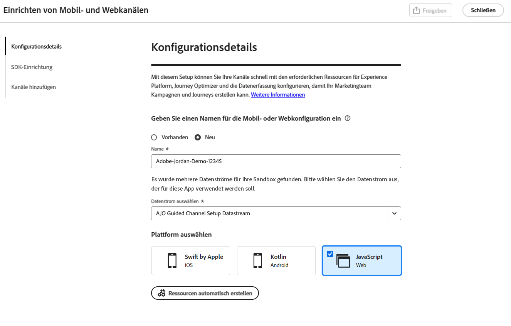
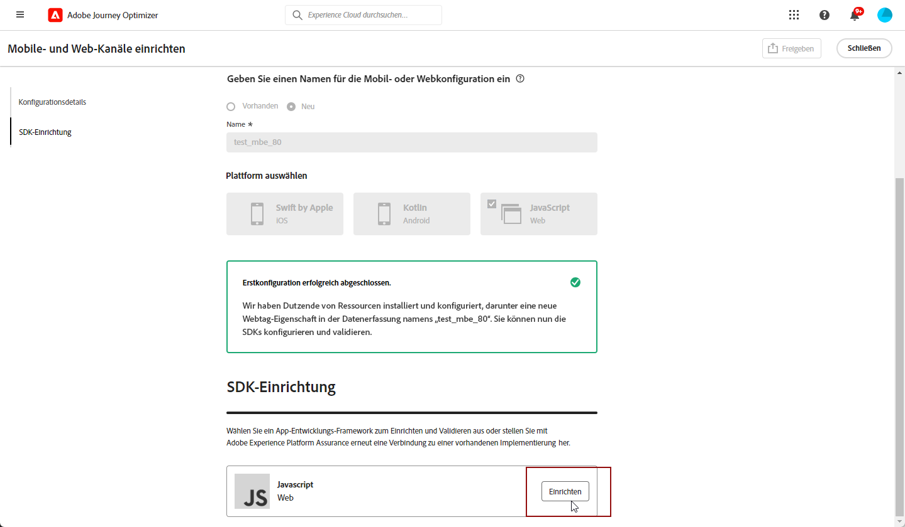
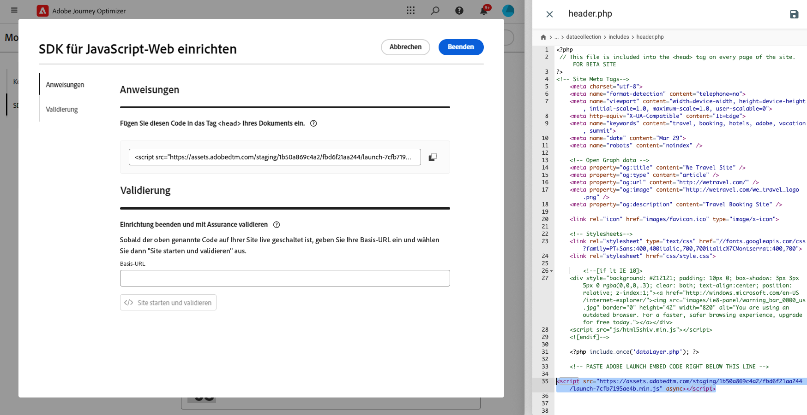
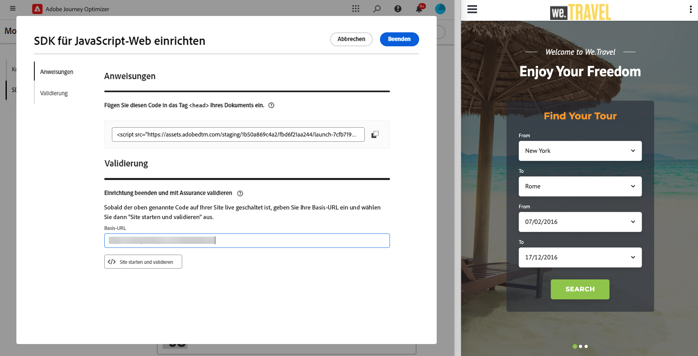
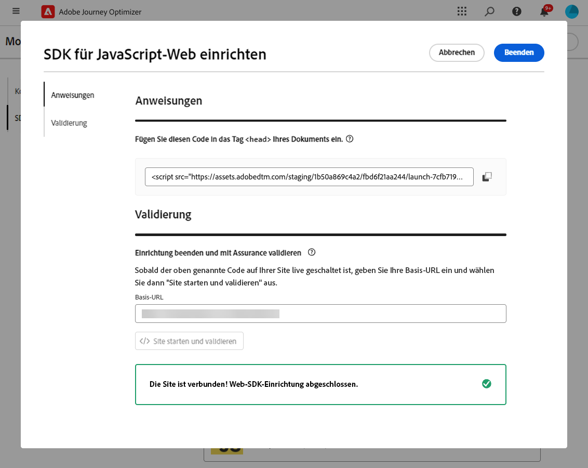
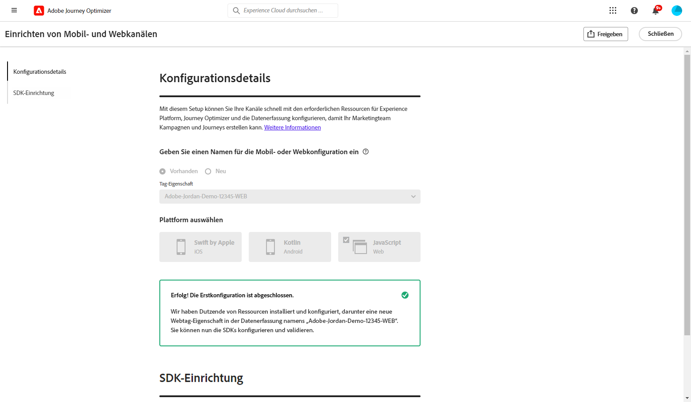

# Webkonfiguration einrichten {#set-mobile-web}

>[!CONTEXTUALHELP]
>id="ajo_mobile_web_setup_javascript_code"
>title="JavaScript-Code"
>abstract="Das head -Tag enthält wichtige Metadaten und Ressourcen, die vor dem Hauptinhalt Ihrer Webseite geladen werden. Durch die Platzierung von Code in diesem Abschnitt wird sichergestellt, dass er frühzeitig initialisiert und ausgeführt wird, sodass Ihre Webseite effizient geladen und funktioniert. Durch Hinzufügen von Code zum Kopfabschnitt können Sie die Struktur, die Leistung und das gesamte Benutzererlebnis Ihrer Site verbessern."

Diese Einrichtung erleichtert die schnelle Konfiguration von Marketing-Kanälen, sodass alle erforderlichen Ressourcen in Experience Platform, Journey Optimizer und der Datenerfassung sofort verfügbar sind. Dadurch kann Ihr Marketing-Team sofort mit der Erstellung von Kampagnen und Journeys beginnen.

## Neue Webeinrichtung erstellen {#new-setup}

1. Klicken Sie auf der Journey Optimizer-Homepage auf **[!UICONTROL Starten]** auf der Karte **[!UICONTROL Mobil- und Webkanäle einrichten]** .

   

1. Erstellen Sie eine **[!UICONTROL Neue]** -Konfiguration.

   Wenn Sie bereits über vorhandene Konfigurationen verfügen, können Sie eine auswählen oder eine neue Konfiguration erstellen.

   

1. Geben Sie einen **[!UICONTROL Namen]** für Ihre neue Konfiguration ein und wählen Sie Ihren **[!UICONTROL Datastraam]** aus oder erstellen Sie ihn. Dieser **[!UICONTROL Name]** wird für jede automatisch erstellte Ressource verwendet.

1. Wenn Ihr Unternehmen über mehrere Datenspeicher verfügt, wählen Sie bitte einen aus den vorhandenen Optionen aus. Wenn Sie keinen Datastream haben, wird einer automatisch erstellt.

1. Wählen Sie die Webplattform aus und klicken Sie auf **[!UICONTROL Ressourcen automatisch erstellen]**.

   

1. Um den Einrichtungsprozess zu optimieren, werden die erforderlichen Ressourcen automatisch erstellt, um Ihnen die ersten Schritte zu erleichtern.

   Nachfolgend finden Sie eine umfassende Liste aller automatisch generierten Ressourcen:

+++ Erstellte Ressourcen

   <table>
    <thead>
    <tr>
    <th><strong>Lösung</strong></th>
    <th><strong>Automatisch erstellte Ressourcen</strong></th>
    </tr>
    </thead>
    <tbody>
    <tr>
    </tr>
    <tr>
    <td>
    
Tags

    </td>
    <td>
    <ul>
    <li>Mobile Tag-Eigenschaft</li>
    <li>Regeln</li>
    <li>Datenelemente</li>
    <li>Bibliothek</li>
    <li>Umgebungen (Staging, Produktion, Entwicklung)</li>
    </ul>
    </td>
    </tr>
    <tr>
    <td>
    
Tag-Erweiterungen

    </td>
    <td>
    <ul>
    <li>Adobe Experience Platform Edge Network</li>
    <li>Adobe Journey Optimizer</li>
    <li>AEP-Sicherheit</li>
    <li>Einverständnis (mit aktivierten standardmäßigen Zustimmungsrichtlinien)</li>
    <li>Identität (mit Standard-ECID, mit standardmäßigen Stitching-Regeln)</li>
    <li>Core für Mobilgeräte</li>
    </ul>
    </td>
    </tr>
    <tr>
    <td>
    
Assurance

    </td>
    <td>
    
Assurance-Sitzung

    </td>
    </tr>
    <tr>
    <td>
    
Datenströme

    </td>
    <td>
    
Datenspeicher mit Diensten

    </td>
    </tr>
    <tr>
    <td>
    
Experience Platform

    </td>
    <td>
    <ul>
    <li>Datensatz</li>
    <li>Schema</li>
    </ul>
    </td>
    </tr>
    </tbody>
    </table>

+++

1. Klicken Sie nach der Generierung der Ressourcen auf **[!UICONTROL Einrichten]** , um mit der Konfiguration Ihres SDK zu beginnen.

   

1. Fügen Sie den auf dem Bildschirm angezeigten Code in das Tag `<head>` Ihres Dokuments ein.

   {zoomable="yes"}

1. Um Ihr SDK direkt in Ihrer Mobile App zu validieren, fügen Sie einfach Ihre Basis-URL ein.

   {zoomable="yes"}

1. Wählen Sie **[!UICONTROL Site starten und validieren]** aus, um Ihre Site zu verbinden.

   {zoomable="yes"}

1. Geben Sie nach Abschluss der Konfiguration die automatisch generierte **[!UICONTROL mobile Webeigenschaft]** für die Teammitglieder frei, die für die Erstellung von Journey und Kampagnen verantwortlich sind.

   Die **[!UICONTROL mobile Webeigenschaft]** sollte in der Kampagnen- oder Journey-Benutzeroberfläche referenziert werden, sodass eine nahtlose Verbindung zwischen Ihrer Einrichtung und der Ausführung von zielgerichteten Journey und Kampagnen für Ihre Zielgruppe hergestellt werden kann.

   

Sie können jetzt Webseiten mit der zuvor konfigurierten **[!UICONTROL mobilen Webeigenschaft]** erstellen. [Erfahren Sie, wie Sie eine Webseite erstellen](../web/create-web.md)

## Vorhandene Konfiguration ändern {#reconnect}

Nachdem Sie Ihre Konfiguration erstellt haben, können Sie sie jederzeit einfach erneut aufrufen, um zusätzliche Kanäle hinzuzufügen oder weitere Anpassungen an Ihre Anforderungen vorzunehmen

1. Klicken Sie auf der Journey Optimizer-Homepage auf **[!UICONTROL Starten]** auf der Karte **[!UICONTROL Mobil- und Webkanäle einrichten]** .

   

1. Wählen Sie **[!UICONTROL Vorhandenes]** und wählen Sie Ihre vorhandene **[!UICONTROL Tag-Eigenschaft]** aus der Dropdown-Liste aus.

   

1. Jetzt können Sie Ihre Konfiguration nach Bedarf aktualisieren.
