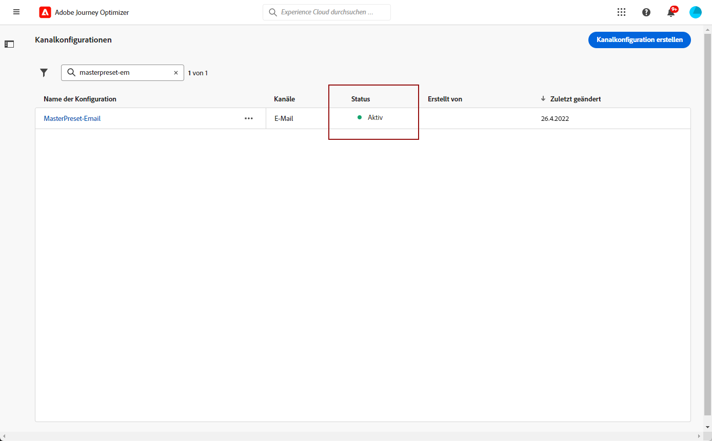

# Konfigurieren des SMS-Kanals {#sms-configuration}

[!DNL Journey Optimizer] ermöglicht es Ihnen, Journeys zu erstellen und Nachrichten an eine ausgewählte Audience zu senden.

Konfigurieren Sie vor dem SMS-Versand Ihre Instanz. Sie müssen [Provider-Einstellungen integrieren](#create-api) mit Journey Optimizer und [SMS-Vorgabe erstellen](#message-preset-sms). Diese Schritte müssen von einem [Adobe Journey Optimizer-Systemadministrator](../start/path/administrator.md).

>[!AVAILABILITY]
>
>Der SMS-Kanal ist derzeit nur für eine Reihe von Organisationen verfügbar (eingeschränkte Verfügbarkeit). Weitere Informationen erhalten Sie von Ihrem Kundenbetreuer für Adobe.

## Erstellen neuer API-Anmeldeinformationen {#create-api}

Gehen Sie wie folgt vor, um Ihren SMS-Anbieter in Journey Optimizer zu konfigurieren:

1. Gehen Sie in das Menü **[!UICONTROL Administration]** > **[!UICONTROL Kanäle]** > **[!UICONTROL API-Anmeldeinformationen]** und klicken Sie auf **[!UICONTROL API-Anmeldeinformationen erstellen]**.

   

1. Wählen Sie Ihre **[!UICONTROL SMS-Anbieter]**:

   * [!DNL Sinch]. Suchen Sie nach **[!UICONTROL Dienst-ID]** und **[!UICONTROL API-Token]**, greifen Sie über Ihr Einzelkonto auf das Menü SMS > APIs zu.
   * [!DNL Twilio]. Suchen Sie nach **[!UICONTROL Dienst-ID]** und **[!UICONTROL API-Token]**, greifen Sie auf den Bereich Kontoinformationen der Konsole-Dashboard -Seite zu.

1. Geben Sie einen **[!UICONTROL Namen]** für Ihre API-Anmeldeinformationen ein.

1. Geben Sie Ihre **[!UICONTROL Service-ID]** und Ihr **[!UICONTROL API-Token]** ein.

   

1. Wenn Sie die Konfiguration Ihrer API-Anmeldeinformationen abgeschlossen haben, klicken Sie auf **[!UICONTROL Senden]**.

Nachdem Sie Ihre API-Anmeldeinformationen erstellt und konfiguriert haben, müssen Sie jetzt eine Nachrichtenvoreinstellung für SMS-Nachrichten erstellen.

## Erstellen einer Nachrichtenvoreinstellung für SMS-Nachrichten {#message-preset-sms}

Nachdem Ihr SMS-Kanal konfiguriert wurde, müssen Sie eine Nachrichtenvoreinstellung erstellen, um über **[!DNL Journey Optimizer]** SMS-Nachrichten senden zu können.

Gehen Sie wie folgt vor, um eine Nachrichtenvoreinstellung zu erstellen:

1. Rufen Sie das Menü **[!UICONTROL Kanäle]** > **[!UICONTROL Branding]** > **[!UICONTROL Nachrichtenvoreinstellungen]** auf und klicken Sie dann auf **[!UICONTROL Nachrichtenvoreinstellung erstellen]**.

   

1. Geben Sie einen Namen und eine Beschreibung (optional) für die Voreinstellung ein und wählen Sie dann den SMS-Kanal aus.

   

   >[!NOTE]
   >
   > Namen müssen mit einem Buchstaben (A–Z) beginnen. Ein Name darf nur alphanumerische Zeichen enthalten. Sie können auch die Zeichen Unterstrich `_`, Punkt `.` und Bindestrich `-` verwenden.

1. Konfigurieren Sie die **SMS**-Einstellungen.

   

   * Wählen Sie den **[!UICONTROL SMS-Typ]** aus, der mit der Voreinstellung gesendet werden soll: **[!UICONTROL Transaktionsnachricht]** oder **[!UICONTROL Marketing]**.

   * Wählen Sie die **[!UICONTROL SMS-Konfiguration]** aus, um sie mit der Voreinstellung zu verknüpfen.

      Weiterführende Informationen zur Konfiguration Ihrer Umgebung für den Versand von SMS-Nachrichten finden Sie in [diesem Abschnitt](sms-configuration.md).

   * Geben Sie die **[!UICONTROL Absendernummer]** ein, die Sie für Ihre Sendungen verwenden möchten.

   * Wählen Sie Ihre **[!UICONTROL SMS-Ausführungsfeld]** zur Auswahl der **[!UICONTROL Profilattribut]** mit den Telefonnummern der Profile verknüpft sind.

1. Nachdem alle Parameter konfiguriert wurden, klicken Sie zur Bestätigung auf **[!UICONTROL Senden]**. Sie können die Nachrichtenvoreinstellung auch als Entwurf speichern und ihre Konfiguration später fortsetzen.

   

1. Nachdem die Nachrichtenvoreinstellung erstellt wurde, wird sie in der Liste mit dem Status **[!UICONTROL Verarbeitung]** angezeigt.

   >[!NOTE]
   >
   >In [diesem Abschnitt](#monitor-message-presets) erfahren Sie mehr über die möglichen Fehlerursachen, wenn die Prüfungen nicht erfolgreich sind.

1. Sobald die Prüfungen erfolgreich abgeschlossen sind, erhält die Nachrichtenvoreinstellung den Status **[!UICONTROL Aktiv]**. Sie kann nun zum Versand von Nachrichten verwendet werden.

   

Sie können jetzt mit Journey Optimizer SMS-Nachrichten senden.

**Verwandte Themen**

* [Erstellen einer SMS-Nachricht](../messages/create-sms.md)
* [Hinzufügen einer Nachricht zu einer Journey](../building-journeys/journeys-message.md)
