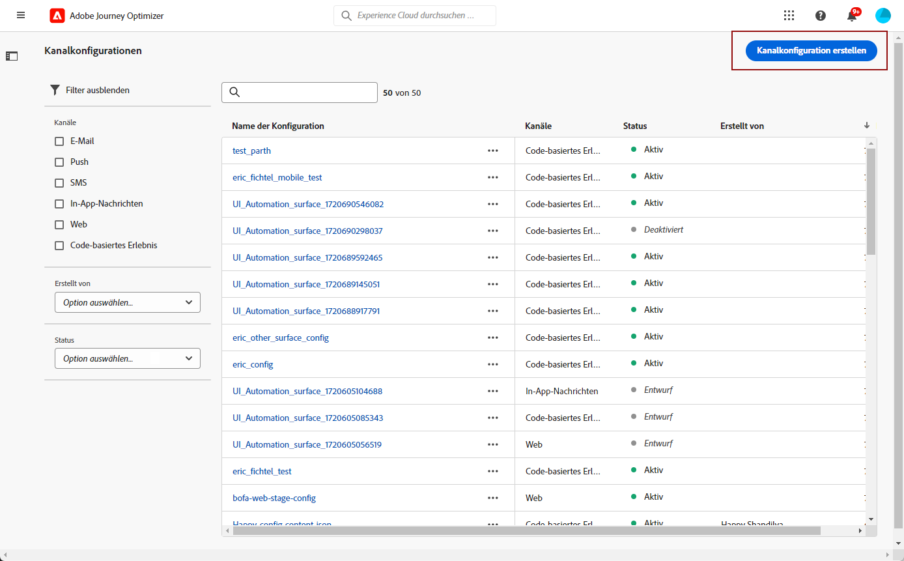

# Konfigurieren des SMS-Kanals {#sms-configuration}

[!DNL Journey Optimizer] ermöglicht es Ihnen, Journeys zu erstellen und Nachrichten an eine ausgewählte Audience zu senden.

Konfigurieren Sie vor dem SMS-Versand Ihre Instanz. Sie müssen [Provider-Einstellungen integrieren](#create-api) mit Journey Optimizer und [SMS-Oberfläche erstellen](#message-preset-sms) (d. h. SMS-Vorgabe). Diese Schritte müssen von einem [Adobe Journey Optimizer-Systemadministrator](../start/path/administrator.md).

>[!AVAILABILITY]
>
>Der SMS-Kanal ist derzeit nur für eine Reihe von ausgewählten Organisationen verfügbar (eingeschränkte Verfügbarkeit). Weitere Informationen erhalten Sie bei Ihrem Adobe-Support-Mitarbeiter.

## Erstellen neuer API-Anmeldeinformationen {#create-api}

Gehen Sie wie folgt vor, um Ihren SMS-Anbieter in Journey Optimizer zu konfigurieren:

1. Gehen Sie in das Menü **[!UICONTROL Administration]** > **[!UICONTROL Kanäle]** > **[!UICONTROL API-Anmeldeinformationen]** und klicken Sie auf **[!UICONTROL API-Anmeldeinformationen erstellen]**.

   

1. Wählen Sie Ihre **[!UICONTROL SMS-Anbieter]**:

   * [!DNL Sinch]. Suchen Sie nach **[!UICONTROL Dienst-ID]** und **[!UICONTROL API-Token]**, greifen Sie über Ihr Einzelkonto auf das Menü SMS > APIs zu.
   * [!DNL Twilio]. Suchen Sie nach **[!UICONTROL Dienst-ID]** und **[!UICONTROL API-Token]**, greifen Sie auf den Bereich Kontoinformationen der Konsole-Dashboard -Seite zu.

1. Geben Sie einen **[!UICONTROL Namen]** für Ihre API-Anmeldeinformationen ein.

1. Geben Sie Ihre **[!UICONTROL Service-ID]** und Ihr **[!UICONTROL API-Token]** ein.

   

1. Wenn Sie die Konfiguration Ihrer API-Anmeldeinformationen abgeschlossen haben, klicken Sie auf **[!UICONTROL Senden]**.

Nachdem Sie Ihre API-Anmeldedaten erstellt und konfiguriert haben, müssen Sie jetzt eine Kanaloberfläche (d. h. eine Nachrichtenvorgabe) für SMS-Nachrichten erstellen.

## Erstellen einer Kanaloberfläche für SMS-Nachrichten {#message-preset-sms}

Nachdem Ihr SMS-Kanal konfiguriert wurde, müssen Sie eine Kanaloberfläche erstellen, über die Sie SMS-Nachrichten senden können. **[!DNL Journey Optimizer]**.

Gehen Sie wie folgt vor, um eine Kanaloberfläche zu erstellen:

1. Zugriff auf **[!UICONTROL Kanäle]** > **[!UICONTROL Branding]** > **[!UICONTROL Kanaloberflächen]** Menü und klicken Sie auf **[!UICONTROL Kanaloberfläche erstellen]**.

   

1. Geben Sie einen Namen und eine Beschreibung (optional) für die Oberfläche ein und wählen Sie dann den SMS-Kanal aus.

   

   >[!NOTE]
   >
   > Namen müssen mit einem Buchstaben (A–Z) beginnen. Ein Name darf nur alphanumerische Zeichen enthalten. Sie können auch die Zeichen Unterstrich `_`, Punkt `.` und Bindestrich `-` verwenden.

1. Konfigurieren Sie die **SMS**-Einstellungen.

   

   * Wählen Sie die **[!UICONTROL SMS-Typ]** wird mit der Oberfläche gesendet: **[!UICONTROL Transactional]** oder **[!UICONTROL Marketing]**.

   * Wählen Sie die **[!UICONTROL SMS-Konfiguration]** mit der Oberfläche zu verknüpfen.

      Weiterführende Informationen zur Konfiguration Ihrer Umgebung für den Versand von SMS-Nachrichten finden Sie in [diesem Abschnitt](#create-api).

   * Geben Sie die **[!UICONTROL Absendernummer]** ein, die Sie für Ihre Sendungen verwenden möchten.

   * Wählen Sie Ihre **[!UICONTROL SMS-Ausführungsfeld]** zur Auswahl der **[!UICONTROL Profilattribut]** mit den Telefonnummern der Profile verknüpft sind.

1. Nachdem alle Parameter konfiguriert wurden, klicken Sie zur Bestätigung auf **[!UICONTROL Senden]**. Sie können die Kanaloberfläche auch als Entwurf speichern und die Konfiguration später fortsetzen.

   

1. Nachdem die Kanaloberfläche erstellt wurde, wird sie in der Liste mit der **[!UICONTROL Verarbeitung]** Status.

   >[!NOTE]
   >
   >In [diesem Abschnitt](#monitor-channel-surfaces) erfahren Sie mehr über die möglichen Fehlerursachen, wenn die Prüfungen nicht erfolgreich sind.

1. Sobald die Prüfungen erfolgreich sind, erhält die Kanaloberfläche die **[!UICONTROL Aktiv]** Status. Sie kann nun zum Versand von Nachrichten verwendet werden.

   

Sie können jetzt mit Journey Optimizer SMS-Nachrichten senden.

**Verwandte Themen**

* [Erstellen einer SMS-Nachricht](../messages/create-sms.md)
* [Hinzufügen einer Nachricht zu einer Journey](../building-journeys/journeys-message.md)
