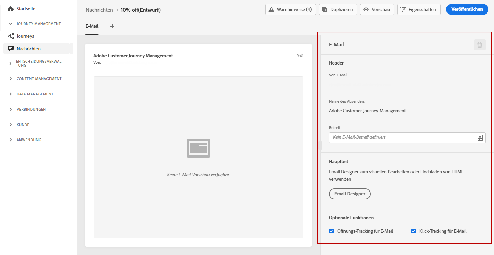

# Konfigurieren einer E-Mail {#configure-email}

E-Mails werden beim Erstellen einer Nachricht auf der Registerkarte **[!UICONTROL E-Mail]** konfiguriert (siehe [Nachricht erstellen](create-message.md)).

>[!NOTE]
>
>Die Felder **[!UICONTROL Von E-Mail]** und **[!UICONTROL Von Name]** sind schreibgeschützt und werden durch die **[!UICONTROL Voreinstellung]** bestimmt, die beim [Erstellen der Nachricht](create-message.md) ausgewählt wurde.

Die Schritte zum Konfigurieren einer E-Mail sind:

1. Geben Sie den **[!UICONTROL E-Mail-Betreff]** an. Klicken Sie dazu auf die Schaltfläche auf der rechten Seite, um den Ausdruckseditor zu öffnen und den E-Mail-Betreff zu erstellen. In [diesem Abschnitt](personalization/personalization-aeras.md) erfahren Sie, wie Sie eine Personalisierung hinzufügen.

1. Klicken Sie auf die Schaltfläche **[!UICONTROL Email Designer]**, um Ihre E-Mail zu entwerfen. Erfahren Sie in [diesem Abschnitt](design-emails.md), wie Sie E-Mails entwerfen).

1. Wenn Sie das Verhalten Ihrer Empfänger über Öffnungen und/oder Klicks auf Links verfolgen möchten, stellen Sie sicher, dass die Optionen **[!UICONTROL Öffnungs-Tracking für E-Mails]** und **[!UICONTROL Klick-Tracking für E-Mails]** aktiviert sind. Weitere Informationen zu Tracking finden Sie in [diesem Abschnitt](message-tracking.md).
